# 智能合同利用第 3 部分—以捕获以太(客户)为特色

> 原文：<https://medium.com/coinmonks/smart-contract-exploits-part-3-featuring-capture-the-ether-accounts-c86d7e9a1400?source=collection_archive---------3----------------------->

现在我们已经到了第 3 部分！帐户和杂项挑战最初都写在第 3 部分中；然而，看起来确实很长，我正在处理的文档超过了 20 页，因此将有第 4 部分作为杂项挑战部分。帐户部分集中在围绕以太坊地址的挑战和椭圆曲线加密的区块链使用。

对于错过第一部分的人:[https://medium . com/@ enigmatic 1256/smart-contract-exploits-part-1-featured-capture-the-ether-lotteries-8a 061 ad 491 b](/@Enigmatic1256/smart-contract-exploits-part-1-featuring-capture-the-ether-lotteries-8a061ad491b?source=your_stories_page---------------------------)

而第二部分在这里找到:[https://medium . com/@ enigmatic 1256/smart-contract-exploits-part-2-featured-capture-the-ether-math-31a 289 da 0427](/@Enigmatic1256/smart-contract-exploits-part-2-featuring-capture-the-ether-math-31a289da0427)

可以找到这些挑战的网站:[https://capturetheether.com/challenges/](https://capturetheether.com/challenges/)
这些挑战的作者是非常聪明的 smarx，抓住他的推特账号@smarx。

和以前一样，这篇文章需要一些关于 Solidity 及其相关开发工具的知识。

事不宜迟——前方有巨大的剧透！

# 13.模糊同一性

源代码如下。

在这里，我们需要通过传递`*isSmarx()*`和`*isBadCode()*`条件将`*isComplete*`设置为真。`*isSmarx()*`调用一个接口，该接口要求调用地址在函数`*name()*`的上下文中以某种方式返回值“smarx ”,因此需要一个智能合约来调用身份验证函数。`*isBadCode()*`另一方面，获取调用地址并检查该地址是否包含字节“badc0de”。

我们需要做两件事:创建一个由返回“smarx”的函数`*name()*`组成的智能契约，并确保契约将“badc0de”作为其地址十六进制的一部分。

第一个很简单——准备一个实现了函数`*name()*`的契约。不要忘记还实现对模糊标识符利用契约的函数`*authenticate()*`的调用，因为契约需要是 msg.sender。

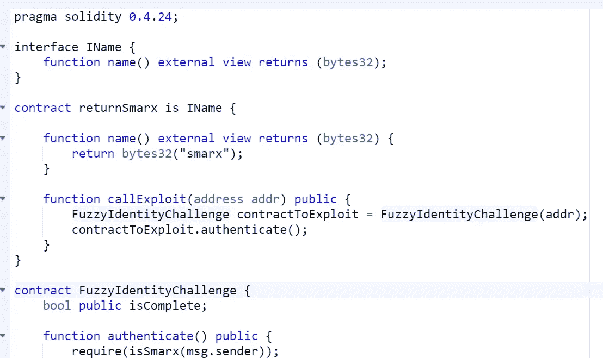

Implementing our exploit contract.

第二个需要一点蛮力和以太坊如何生成合同地址的知识。正如前面在第 2 部分中提到的，契约地址是在以太坊中确定性地生成的，使用 RLP 编码中发送方地址和随机数的 keccak256 结果的最右边 160 位。我们可以很快地编写一段 Solidity 代码来完成这项工作，使用 Nethereum 和 Ganache 进行部署，以随机生成一组地址，并测试几个 nonce 来查看哪个地址+ nonce 满足我们的要求。不要忘记保存地址的私钥，并跟踪随机数！

这段可靠性代码基本上使用 RLP 编码的地址和随机数运行 keccak256:

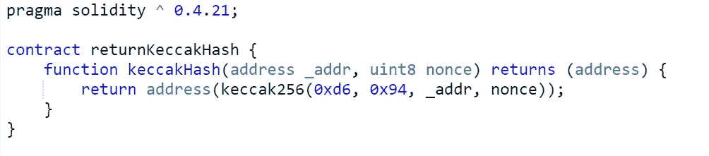

Generating contract address using Solidity.

部署契约的 VB.NET 代码开始生成随机地址和递增 nonce，将它们传递给契约并检查返回的结果:

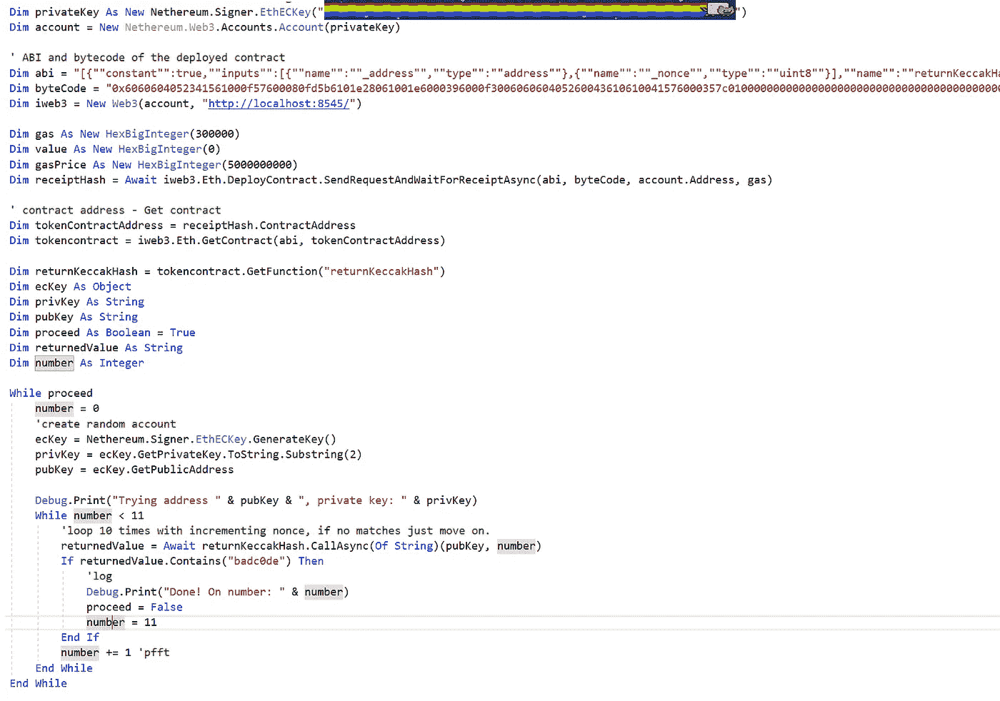

The code — increments nonce 10 times then moves to another address, repeating the same.

跑一段…没错，就是蛮力。可能需要一段时间。以每秒 25 个合同地址的速度花了我几个小时:

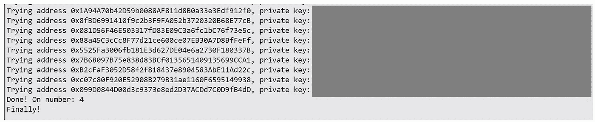

And we found our address!

现在我们已经准备好了一切，使用我们知道最终将创建一个十六进制“badc0de”的契约地址的帐户的私钥，我们将使用一些 ETH 加载帐户地址，在 Ropsten testnet 上递增帐户的 nonce，直到它最终达到我们想要的 nonce，然后我们将在那里部署我们首先准备好的契约。

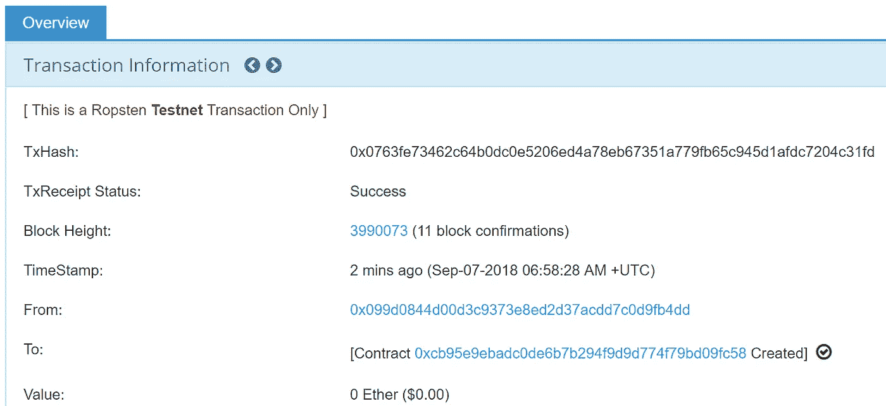

Notice the “badc0de”?

从那里，使用我们的利用合同，我们在模糊标识符挑战合同上调用`*authenticate()*`，满足所有条件并完成这个挑战。

# 14.公开密钥

源代码如下。

这不是一个聪明的合同利用，而是测试一个人对区块链如何工作的理解，以及如何在区块链上签署交易。当事务被签名时，生成签名的事务，产生两个 ECDSA 签名输出(r，s)和恢复 id (v)。所有这些都可以用来恢复一个地址的公钥，如果有一个事务是从我们想要恢复的地址发送的。

幸运的是，ethereumjs-tx 库使我们可以轻松地做到这一点，而不必担心底层的复杂性。我们只需要获得原始的事务 hex，这也可以很容易地从 Etherscan 中获得，因此我们不需要尝试从头开始重建事务。

检查地址 0x92b 28647 ae1f 3264661 f 72 FB 2 EB 9625 a 89d 88 a 31，我们确实看到之前发送了一个事务:

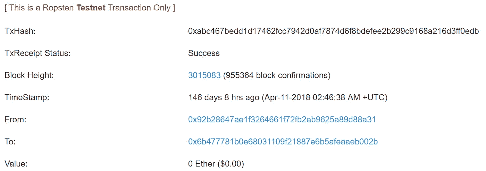

A previous sent transaction from 0x92b28647ae1f3264661f72fb2eb9625a89d88a31

转到交易信息部分的右上角，单击工具和实用程序，然后单击“获取原始交易十六进制”。然后我们看到了:

0 xf 87080843 b 9 ACA 0083015 f 90946 b 4777781 b 0 e 68031109 f 21887 E6 b 5 afeaaeb 002 b 808 c 5468616 E6 b 732 c 206d 616 e 2129 a 0a 5522718 c 0 f 95 DDE 27 f 0827 f 55 de 836342 ced 594d 20458523 DD 71 a 5333

剩下的事情很简单，使用 ethereumjs-tx 的`*getSenderPublicKey*`函数，我们可以很容易地检索公钥:

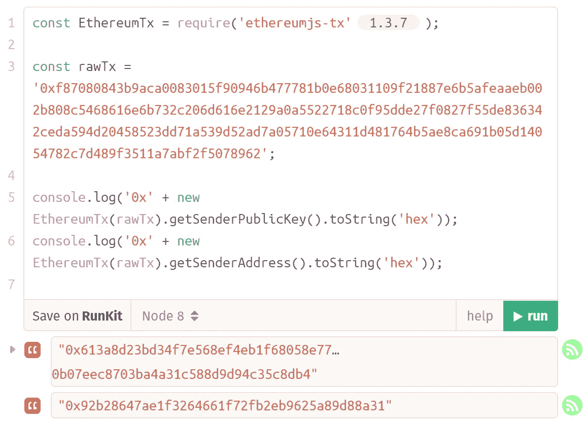

Using ethereumjs-tx library to obtain the public key.

使用公钥作为 authenticate 函数的输入参数，我们就完成了！

还是我们？这个挑战是 750 分，我想我应该多写一点。如果以太网扫描暂时关闭，我们迫切需要原始事务 hex 怎么办？:P

其中一种方法是使用与 Ropsten 同步的 Geth，它公开了一个我们可以调用的方法— eth.getRawTransaction —将事务哈希作为输入参数，我们可以获得原始事务 hex:

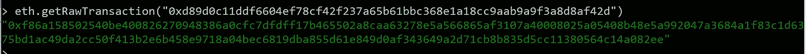

An example done through Geth console, not the actual hash — I don’t usually sync Ropsten.

但是如果我们不想同步 Geth，当然，另一种方法是获取事务细节:

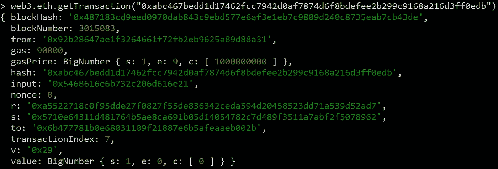

Using eth.getTransaction.

重建原始事务，并以十六进制序列化输出:

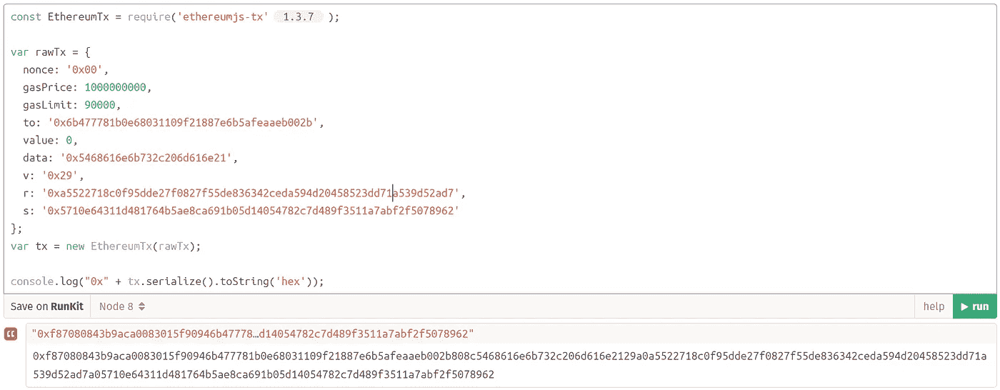

Or if you’re real hard to please, you could concatenate the transaction data together yourself. :)

从那里开始，同样的事情发生了——获取原始的事务十六进制字符串并通过`*getSenderPublicKey()*`传递它，我们将获得相同的公钥。

# 账户接管

源代码如下。

喜欢这个。同样，这个挑战并不完全是智能合同利用挑战，我可以想象一些人会发现这个挑战比五十年挑战更难，尽管提供的分数少了 500 分。在契约中可以看到的一切确实都很好，地址及其对应的私钥都是正确生成的，因此我们需要进一步扩大我们的范围，在其他地方搜索线索。

我们转向从发送的交易中寻找线索:【https://ropsten.etherscan.io/txs? a = 0x6b 477781 b 0 e 68031109 f 21887 e6b 5 afeaaeb 002 b&p = 2

同样，从表面上看，没有任何问题。但是，如果我们开始深入研究事务是如何构建的:

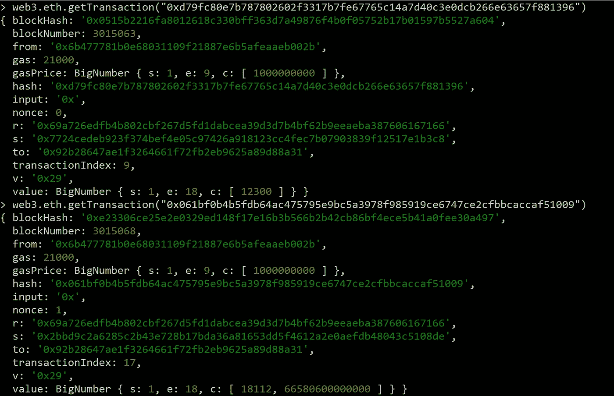

Getting the transaction details with eth.getTransaction

等等。为什么值*r*(ECD sa 签名输出)在这里被重用时应该是唯一的？这将是我们的利用向量，事实上早在 2013 年([https://bitcointalk.to/index.php?topic=271486.0](https://bitcointalk.to/index.php?topic=271486.0))在区块链空间就被注意到了。基本上，*r*-值将使用随机随机数 *k* 生成；然而，使用 Android 加密库的移动钱包最终会重用 k 值，进而在不同的交易中生成相同的 r 值。这允许从签名输出中导出地址的私钥，从而导致资金被盗。

一个小细节——重复使用 nonce *k* 让索尼在 2010 年陷入困境:【https://www.bbc.co.uk/news/technology-12116051】T2。RFC6979 后来在 2013 年引入，以允许确定性地生成随机数 *k* (因此有助于测试和具有潜在不可靠 PRNG 的环境)。

反正题外话先不说了，让我们试着弄清楚如何获取我们的地址 0x6b 477781 b 0 e 68031109 f 21887 e 6b 5 afeaaeb 002 b 的私钥。

我们有以下值:

对于 txid 1:0x 061 BF 0 B4 b 5 fdb 64 AC 475795 e 9 BC 5a 3978 f 985919 ce 6747 ce 2 CFB bcaccaf 51009
S1 = 0 x2 bbd 9 C2 a 6285 C2 b43 e 728 b 17 BDA 36 a 81653 D5 f 4612 a 2 E0 AEF db 48043 c 5108 de
Z1 = 0 x4 F6 a 8370 a 435 a 27724 BBB

对于 txid 2:0 xd 79 fc 80 e 7 b 787802602 f 3317 b 7 Fe 67765 c 14 a 7d 40 c 3 e 0 dcb 266 e 63657 f 881396
S2 = 0x 7724 cedeb 923 f 374 be F4 e 05 c 97426 a 918123 C4 FEC 7 b 07903839 f 12517 E1 B3 c 8
z2 = 0x 350 F3 ee 8007d 8

常用 *r* 值:0x 69 a 726 EDF B4 b 802 CBF 267 D5 FD 1 dabcea 39d 3d 7 B4 BF 62 b 9 eeaeba 387606167166

有一种方法可以导出私钥，其中 nonce *k* 与上面的值一起重用，使用此处上传的 Python 脚本:

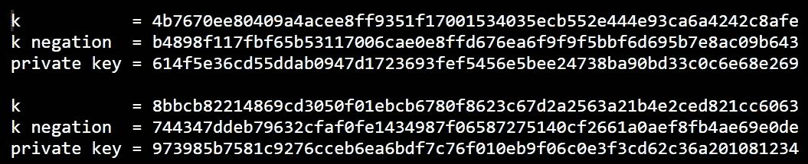

Script output.

测试私钥，我们会发现其中一个允许我们访问地址 0x6b 477781 b 0 e 68031109 f 21887 e6b 5 afeaaeb 002 b。从那里，我们使用前述地址的私钥调用函数 *authenticate()* ，将 *isComplete* 设置为 true，并完成质询。

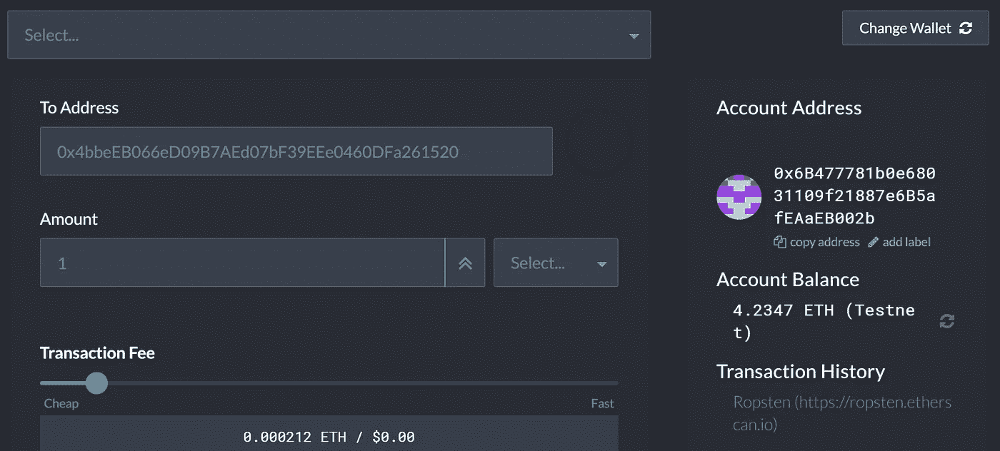

Confirming the private key to the address using MyCrypto’s desktop app

但既然这是 1500 分，那我多写一点才是对的。也许对 Python 脚本是如何实现的有一点了解。StackExchange 上有一个非常好的主题也涉及到了这一点:[https://bit coin . stack exchange . com/questions/37760/converting-ruby-script-into-python-recovering-private-key-when-someone-uses-th/37762 # 37762](https://bitcoin.stackexchange.com/questions/37760/converting-ruby-script-into-python-recovering-private-key-when-someone-uses-th/37762#37762)

使用以下等式计算 ECDSA 特征信号 *s* :

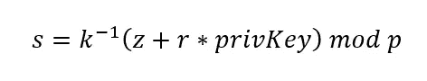

其中 *k* 为 nonce， *z* 为消息摘要， *r* 为 ECSDA 签名， *privKey* 为私钥， *p* 为 secp256k1 曲线的质数阶(为 0x fffffffffffffffffffffffffffffffffffffffffffebaaedce 6 af 48 a 03 bbfd 25 E8 CD 0364141)。

从这里我们可以推导出对于 *s1* 和 *s2* :

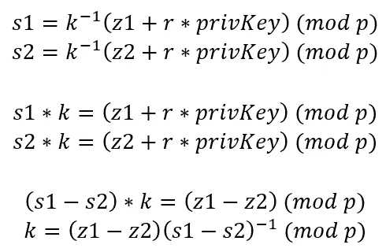

请记住，这里的所有运算都是对素数 *p* 取模，因此 *(s1-s2)^(-1)* 是素数 *p* 的模乘逆运算，我们可以使用费马小定理的实现来计算，因为在这种情况下 *p* 是素数，或者使用扩展的欧几里德算法。

一旦我们有了 *k* ，我们就可以尝试找到 *privKey* :

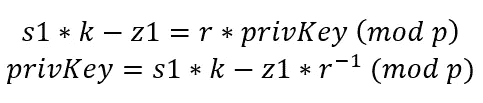

并且私钥 privKey 在从 *s2* 和 *z2* 导出时也应该相同。

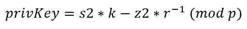

针对 *s1-s2* 的情况进行计算是不够的(尽管对于这个挑战，我们很幸运没有翻转的签名)，因为我们还可以使用翻转的 *s* 签名 *-s (mod p)* ，这仍然是有效的签名输出。因此，我们将先发制人地评估多个 *k* 候选者(每一对都存在一个对自身的否定)，因此我们可以看到:

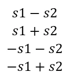

其中 *-s1-s2* 和 *-s1+s2* 我们可以使用 *-k (mod p)* 来推导。

现在我们有了所有这些，我们可以在代码中实现它们，插入我们拥有的值，看看会出现什么。下面的一切都将在 Python 中实现，因为我很懒，所以让我们用费马的模乘逆(def inverse_mod)小定理:

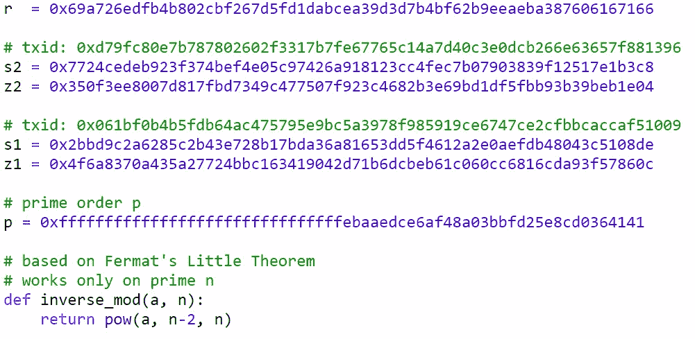

Defining the r, s and z values, and the modulo inverse

寻找 *k* :

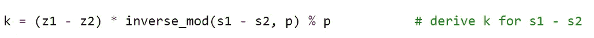

Getting our k.

为 *k* 和 *-k (mod p)* 导出私钥。

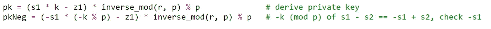

Getting our private key.

打印所有 *k* 候选项并确保私钥匹配:

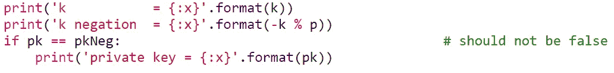

Printing our private key.

我们还将对 *s1+s2* 做同样的事情，替换用于计算 *k* 候选者的 *s1-s2* ，并以类似的方式导出私钥。因此，整个代码块将是:

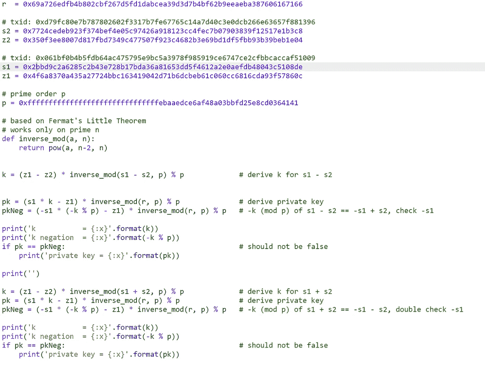

Full Python code implementation.

运行脚本，测试哪个私钥是地址 0x6b 477781 b 0e 68031109 f 21887 e6b 5 afeaaeb 002 b 的私钥，现在我们可以解决这个问题了。

对于这一部分，我将直接链接到第 4 部分，在那里我们将完成最后两个捕获以太挑战并结束:[https://medium . com/@ enigmatic 1256/smart-contract-exploits-part-3-featured-Capture-the-Ether-miscellaneous-d 11 ba E6 CB 01 b](/@Enigmatic1256/smart-contract-exploits-part-3-featuring-capture-the-ether-miscellaneous-d11bae6cb01b)

> [直接在您的收件箱中获得最佳软件交易](https://coincodecap.com/?utm_source=coinmonks)

