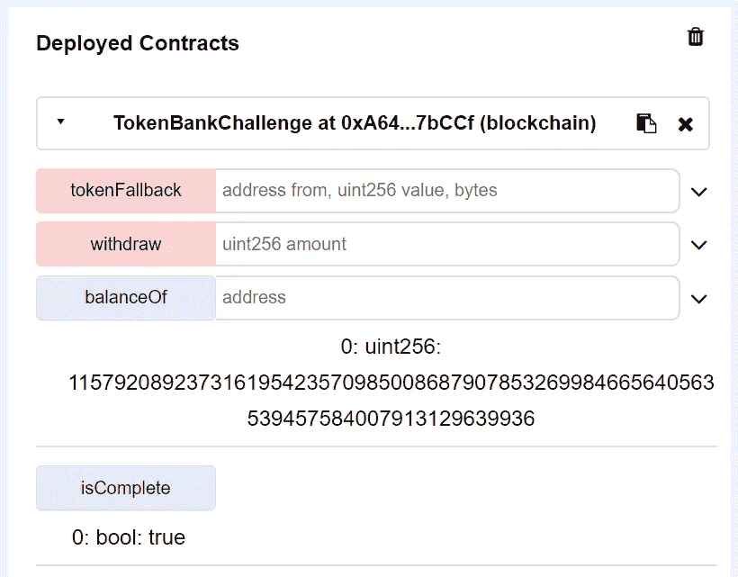

# 智能合约利用第 4 部分—以捕获以太为特色(杂项)

> 原文：<https://medium.com/coinmonks/smart-contract-exploits-part-4-featuring-capture-the-ether-miscellaneous-232df82a559f?source=collection_archive---------4----------------------->

第四部分也是最后一部分——杂项下的两个挑战，这些挑战似乎在其他部分找不到归宿。让我们马上进入它。

对于错过第一部分的人:[https://medium . com/@ enigmatic 1256/smart-contract-exploits-part-1-featured-capture-the-ether-lotteries-8a 061 ad 491 b](/@Enigmatic1256/smart-contract-exploits-part-1-featuring-capture-the-ether-lotteries-8a061ad491b?source=your_stories_page---------------------------)

而第二部分在这里找到:[https://medium . com/@ enigmatic 1256/smart-contract-exploits-part-2-featured-capture-the-ether-math-31a 289 da 0427](/@Enigmatic1256/smart-contract-exploits-part-2-featuring-capture-the-ether-math-31a289da0427)

而第三部分在这里找到:[https://medium . com/@ enigmatic 1256/smart-contract-exploits-part-3-featured-capture-the-ether-accounts-c 86d 7 e 9 a 1400](/@Enigmatic1256/smart-contract-exploits-part-3-featuring-capture-the-ether-accounts-c86d7e9a1400)

可以找到这些挑战的网站:[https://capturetheether.com/challenges/](https://capturetheether.com/challenges/)
这些挑战的作者是非常聪明的 smarx，抓住他的推特账号@smarx。

和以前一样，这篇文章需要一些关于 Solidity 及其相关开发工具的知识。

事不宜迟——前方有巨大的剧透！

# 16.承担所有权

源代码如下。

这个问题相当于免费的 300 分；然而，其含义可能是严重的，这被用作在野外的实际利用。

看看契约本身，我们可以假设函数`*AssumeOwmershipChallenge()*`是契约的构造函数。然而，由于拼写错误，这变成了一个普通的可调用函数，允许我们将所有者设置为我们的调用地址并赢得挑战。

How it looks like when deployed on Remix.

从 Solidity v0.4.22 开始，我们现在可以用`*constructor(arg1, arg2…)*`定义我们的构造函数，这允许构造函数脱颖而出，也避免了这种性质的利用。

因此，要赢得这个挑战，我们只需要将代码复制到 Remix 中，指向部署的契约地址，调用函数`*AssumeOwmershipChallenge()*`，然后调用`*authenticate()*`。

# 17.代币银行

源代码如下。

代码太多了。基本上，这个想法是，这个合同作为一个“银行”，跟踪我们的银行余额，并发布反映持有令牌数量的余额，其中 500，000 将由我们持有，另外 500，000 将由部署捕获以太挑战的代理合同持有。1000000 个 ERC223 令牌在作为令牌库部署时全部由挑战合同持有，正如创建 ERC223 合同时注意到的那样，它将总供应量分配给`*msg.sender*`。我们能够根据银行余额提取分配给我们的令牌数，该漏洞要求我们从银行提取所有 1，000，000 个 ERC223 令牌。

通过查看合同，我们可以看到一个撤销功能，大概是我们会以某种方式利用的一个功能，并且似乎我们可以，假设余额仅在`*token.transfer*`行之后扣除，并且有一个我们可以使用的`*tokenFallback*`接口。我们可以使用漏洞利用契约来模拟我们的漏洞利用，其中`*tokenFallback*`接口将触发我们的漏洞利用契约上的相同功能，该功能执行第二次撤销，所有这些都不会因为发生`*require(balanceOf[msg.sender] >= amount)*`余额检查而减少余额。事实上，这与 2016 年导致道关闭的重返攻击性质相似。

现在我们已经有了入侵入口，我们需要做的是弄清楚如何进行完整的设置和序列来执行重新进入攻击，这需要一个银行余额作为先决条件。

为了在我们的开发合同上获得一些银行余额，我们可以执行下面的序列:

1.  从代币银行提取我们的 500，000 ERC223 代币。
2.  创建并部署实现 tokenFallback()函数的漏洞利用合同，该函数在第一次调用时不做任何事情，因此我们可以将当前拥有的令牌转移到该漏洞利用合同。
3.  从利用合同中，将令牌转移回令牌库。这触发了令牌银行的 tokenFallback()函数，为我们的漏洞利用合同提供了 500，000 银行余额。

现在我们可以执行实际的利用:

1.  我们的漏洞利用合同调用 500，000 个令牌的 retract()，这调用了我们的漏洞利用合同的 tokenFallback()函数。
2.  我们的漏洞利用契约的 tokenFallback()再次调用 500，000 个令牌的 contract()。并且在第三次重新进入时不做任何事情。
3.  由于只有在令牌转移之后才扣除银行余额，因此重新进入将成功执行。(余额将溢出，但现在挑战已经完成)

拼凑代码:

Our exploit contract.

我们将手动设置步骤 1 和 2，这可以很容易地通过混音完成。步骤 3 可以通过`*transferToTokenBank()*`功能完成。完成设置后，我们只需要调用`*execute()*`来运行漏洞攻击。

运行步骤:

Step 1, withdrawing tokens.

Step 2, transferring all 500,000 ERC223 tokens to our exploit contract.

Step 3, execute transferToTokenBank() so our exploit contract gets loaded with a balance.

Our exploit contract now has some bank balance to execute to re-entrance attack.

一旦我们用令牌库挑战契约地址初始化 CodeToCall 对象，我们就准备好实施我们的利用。

Execute exploit — Note how `*Transfer()*` was ran twice.

你可能会怀疑这一点，因为由于我们扣除了比我们实际拥有的更多的余额，我们的余额将会溢出。此时，isComplete 将被设置为 true，从而完成这个挑战。

We are done!

# 结论

这是这个多部分系列的第四部分，也是最后一部分。公共区块链处理实值，在设计和构建直接访问实值的软件时应该格外小心。虽然这些漏洞中的一些可以在语言层上避免，例如具有健壮的边界检查和设置递归调用的限制，但我个人发现这些漏洞中的许多并不完全是由于可靠性本身，而且基于区块链的构建往往需要不同的直觉，因此需要不同的方法。

因此，继续入侵，打破东西，并审查智能合同如何对不同的实现做出反应。我们可以努力为每个人开发更安全可靠的智能合同。

> [在您的收件箱中直接获得最佳软件交易](https://coincodecap.com/?utm_source=coinmonks)

