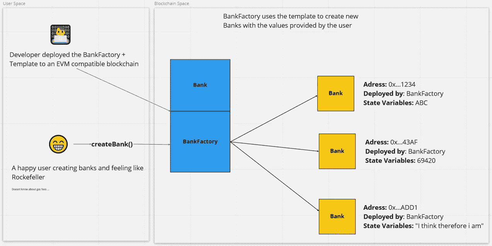
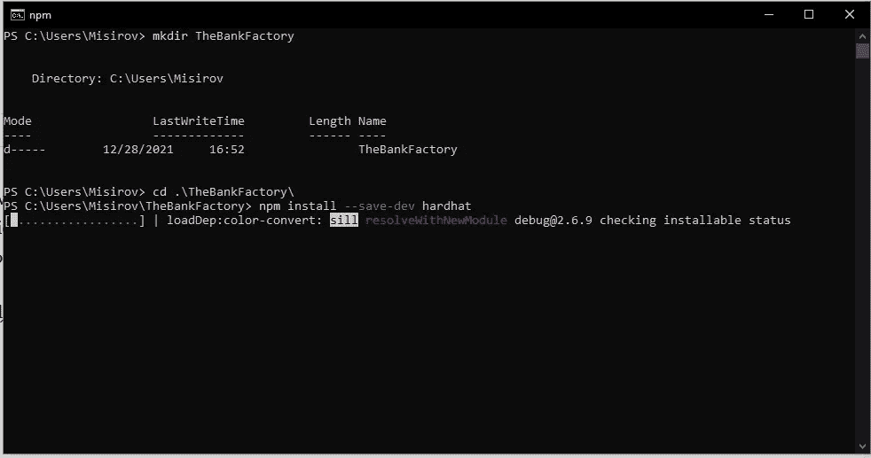
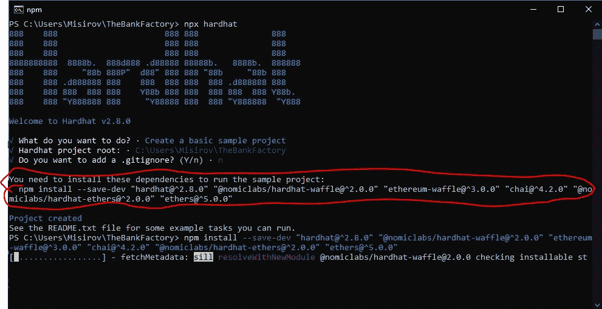
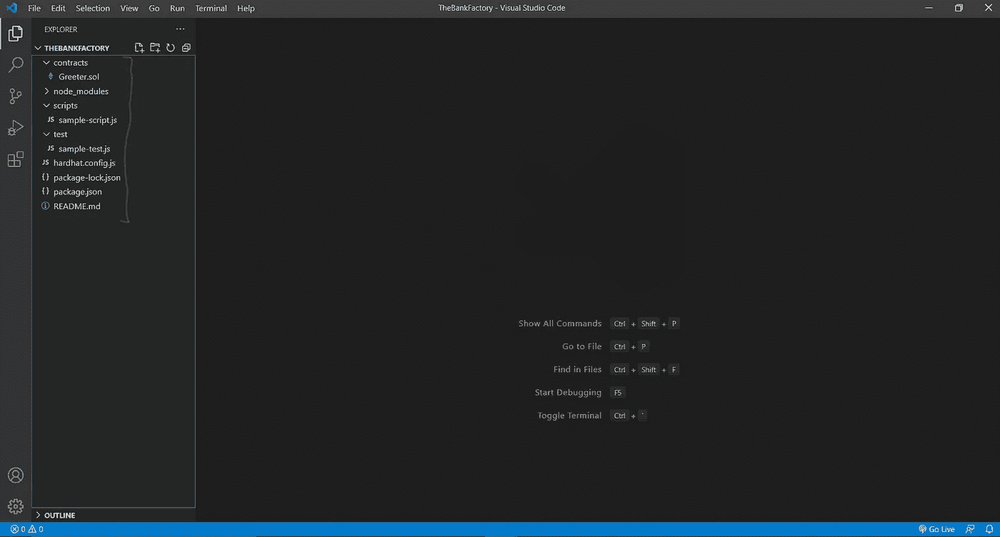
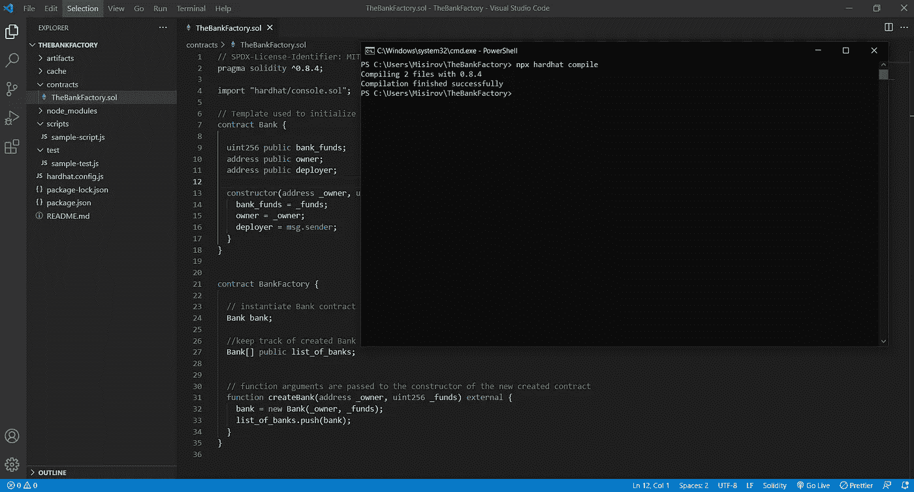
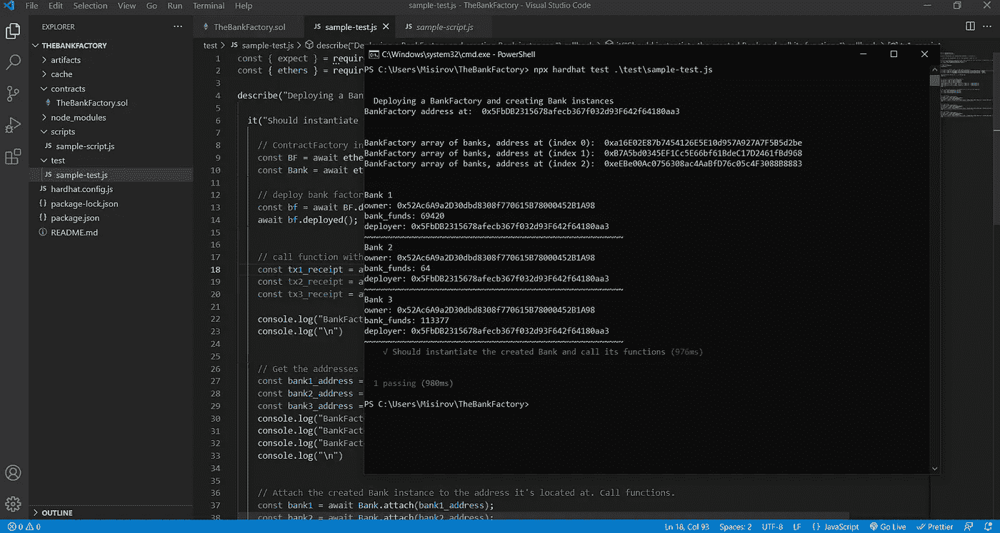

# 智能合同工厂:如何创建合同，如何创建另一个合同

> 原文：<https://medium.com/coinmonks/smart-contract-factories-how-to-create-a-contract-to-create-another-contract-248a120f331a?source=collection_archive---------1----------------------->

> *TLDR；solidity 中的* `*new*` *关键字允许使用模板创建和部署新的合同实例。“SomethingSomethingFactory”是用于创建“SomethingSomething”契约的命名约定和模式。*

本文的目的是通过一个简单的契约工厂的过程，同时理解它是如何工作的，并想象潜在的用例。让我们开始吧。

契约工厂是一种基于模板创建契约的设计模式。用户可以向字段中引入值，这些值用作输入来初始化新部署的契约的状态变量。这为什么有用？根据您的使用情况，您可以做一些很酷的事情，例如:

*   允许用户创建流动性池: [Uniswap](https://docs.uniswap.org/protocol/V2/reference/smart-contracts/factory)
*   利用每个地址的阿迪达斯 2 NFT 造币厂限额:[交易](https://etherscan.io/tx/0x6a3d8584a6272a1d73ff297592b401fe10d3a90fd385efff55f68f32f29ecf61)
*   制作界面，帮助用户创建自己的令牌: [ThirdWeb](https://thirdweb.com/portal)
*   [其他如:业务流程管理](https://www.researchgate.net/publication/303996559_Untrusted_Business_Process_Monitoring_and_Execution_Using_Blockchain)和[医疗保健](https://arxiv.org/abs/1706.03700)

对于这个例子，我将使用一个银行合同(模板)和我今天早上写的 BankFactory 合同(工厂)。目的是一次性部署工厂，并创建尽可能多的银行合同，而无需我们自己部署每个合同。

Simple diagram

**1 —第一家银行(模板):**

构造函数初始化由 BankFactory 传递给的状态变量。这里我们传递银行拥有的资金量，谁是银行的所有者，谁创建了银行契约。

**2 —第二银行工厂(工厂):**

这里我们实例化了银行契约`Bank bank`，创建了一个银行类型列表`Bank[] public list_of_banks`来跟踪新创建的契约，最后是神奇的函数`createBank()`，它将银行的构造函数参数作为参数。

这是创建新合同的代码行:

`bank = new Bank(_owner, _funds)`

`list_of_banks`数组中索引 0 处的值成为所创建契约的地址！

太棒了。这就是全部了。现在，当工厂被部署后，用所需的值作为参数调用`createBank(..,..)`函数将导致一个新的`Bank`契约保存这些值！

想看看用 HardHat 怎么做吗？当然，我们开始吧，反正烤箱里的披萨还没做好。

# 用安全帽测试

1 —创建一个新目录并安装 hardhat:

2 —创建新项目并安装依赖项:

3-用您选择的文本编辑器打开文件夹。我喜欢 Visual Studio 代码:

4-创建一个新的实体文件，并将代码复制到其中:

5 —编制合同:

6 —测试一下！。注意测试脚本。复制粘贴代码到它，让我们运行它！

瞧啊。希望你和我一样开心！我得走了，披萨好了。

**兴趣链接:**

[https://docs . unis WAP . org/protocol/V2/reference/smart-contracts/factory](https://docs.uniswap.org/protocol/V2/reference/smart-contracts/factory)

[https://research . CSIRO . au/block chain patterns/general-patterns/contract-structural-patterns/factory-contract/](https://research.csiro.au/blockchainpatterns/general-patterns/contract-structural-patterns/factory-contract/)

[https://arxiv.org/abs/1706.03700](https://arxiv.org/abs/1706.03700)

[https://www . research gate . net/publication/303996559 _ Untrusted _ Business _ Process _ Monitoring _ and _ Execution _ Using _ block chain](https://www.researchgate.net/publication/303996559_Untrusted_Business_Process_Monitoring_and_Execution_Using_Blockchain)

[https://docs . open zeppelin . com/learn/developing-smart-contracts](https://docs.openzeppelin.com/learn/deploying-and-interacting#interacting-from-the-console)