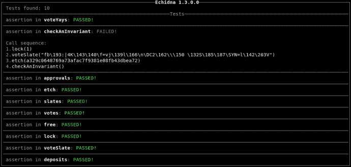

# 智能合同模糊化

> 原文：<https://medium.com/coinmonks/smart-contract-fuzzing-d9b88e0b0a05?source=collection_archive---------0----------------------->

## 如何找到针鼹的边缘案例


Oh, hi!

编写智能合同不适合胆小的人。

最近，我参与了[产出协议](http://app.yield.is)的上线。对于没听说过的，它是以太坊的一个固定利率借贷平台。它还实现了一些数学公式，这些公式处于智能合约的边缘。

[让步协议](http://app.yield.is)也是一个“部署并忘记”的平台。一旦我们上市，我们没有办法阻止用户与我们的软件互动，也没有办法修复核心合同中的任何错误。

> 我们可以像火箭一样上升，然后爆炸。

然而，我们没有。令人惊讶的是，我们遇到的错误数量很少，而且没有一个出现在核心智能合约中。

其中的一个原因是我们使用了模糊器来发现使用单元测试或集成测试无法发现的边缘情况。使用 fuzzer 还不是一件常见的事情，许多人要求我写这篇文章，并帮助他们模糊他们的合同。所以我们在这里。

**什么是起毛？**

通过[模糊化](https://en.wikipedia.org/wiki/Fuzzing)，我理解了测试大量数字或随机场景，找出产生意想不到结果的值。

A reasonable approach to fuzzing.

例如，在 Yield 中，我们计算分数指数，这是一种迭代计算，在以太坊上运行可能非常昂贵，因为每个操作都要花钱。

为了给我们的用户省钱，我们破解了[指数计算算法，过了一会儿](https://github.com/yieldprotocol/fyDai/blob/259aab24751159bf1ff00646fd8c470e84e81561/contracts/pool/YieldMath.sol#L274)就不再计算小数了。不利的一面是，我们的智能合约现在的交易价格会偏离数学理想的随机数量。

但是偏离有多远呢？我们能设置它使价格保持在理想价格的一美元以内吗？

唯一知道的方法是用大量随机场景测试智能合约。[跟踪位](https://www.trailofbits.com/)告诉我们在代码审计期间使用 fuzzer，这就是我们如何到达这里的。

**如何模糊化**

首先你必须[安装针鼹鼠](https://github.com/crytic/echidna)。在网站的选项中，我设法下载了 Ubuntu 的预编译二进制文件。为此，你需要安装[加密编译](https://github.com/crytic/crytic-compile)和[滑动](https://github.com/crytic/slither)。我记得我花了几次尝试才把它做好，这在今天是一个罕见的事件，所有东西都在 npm 包中。

> Fuzzing 不容易，工具粗糙，数学很难，但是值得。

如果需要帮助，就加入[帝国黑客 Slack](https://empireslacking.herokuapp.com/) 频道。

针鼹 github 有很多文档和几个教程，我完全无法理解。拯救我的是古斯塔沃·格列科的一个运行中的例子，从那以后我一直在调整和重用它。也许有一天我会了解到更多的细节。

简而言之，你需要一个`config.yaml`文件，这是我的:

```
seqLen: 50
testLimit: 20000
prefix: “crytic_”
deployer: “0x41414141”
sender: [“0x42424242”, “0x43434343”]
cryticArgs: [“ — compile-force-framework”, “Buidler”]
coverage: true
checkAsserts: true
```

你对这些东西做什么的猜测和我一样好。RTFM。我没有。

然后你用你想要测试的不变量编写一个可靠性契约，这个测试来自 [DecimalMath.sol](https://github.com/yieldprotocol/fyDai/blob/master/contracts/helpers/DecimalMath.sol) 的`muld`函数。

```
// SPDX-License-Identifier: GPL-3.0-or-later
pragma solidity ^0.6.10;import "../helpers/DecimalMath.sol"; /// [@dev](http://twitter.com/dev) Implements simple fixed point math mul and div operations for 27 decimals.
contract DecimalMathInvariant is DecimalMath {function muld_(uint256 x, uint256 y)
    public pure returns (uint256)
  {
    uint z = muld(x, y);

    assert((x * y) / UNIT == z); // Assert math
    assert (divd(z, y) <= x); // We are rounding down
    // Assert revert on overflow
    if(y > UNIT) assert(z >= x); // x could be zero
    if(y < UNIT) assert(z <= x); // y could be zero
  }
}
```

我们将使用 echidna 调用本契约中的[decimalmathinvantar . muld _](https://github.com/yieldprotocol/fyDai/blob/259aab24751159bf1ff00646fd8c470e84e81561/contracts/invariants/DecimalMathInvariant.sol#L11)函数 20，000 次。鼹鼠知道它必须运行这个功能，因为它是`public`。该函数有两个参数(x 和 y ),所以针鼹每次运行时都会使用随机值。

当针鼹运行时，它认为因`require`而恢复是成功的，但因`assert`而恢复是失败的。

在上面的契约中，我检查了定点乘法的四个属性:

1.  x * y == z，替换逗号。
2.  DecimalMath.muld 向下舍入(通过断言 z / y < = x，替换逗号)。
3.  如果 y 大于 1，z 大于 x(如果有溢出，这就不成立)。
4.  如果 y 小于 1，z 也小于 x(如果有下溢，这就不成立)。

You might want to write that invariant down

编码不变量迫使你思考如何通过寻找总是保持为真的属性来测试一些东西，而不是重复原始智能契约中的代码。寻找不变量通常是困难的，你应该从商业专家那里得到帮助。

检查[完整的契约](https://github.com/yieldprotocol/fyDai/blob/master/contracts/invariants/DecimalMathInvariant.sol)以查看我正在测试的所有不变量。鼹鼠将负责合同中的所有公共职能。

现在，您可以开始测试了:

```
$ echidna-test . — contract DecimalMathInvariant — config contracts/invariants/config.yaml
```

这两个参数是契约的[名称，在这里我们对不变量进行了编码(不是我们正在测试的目标契约，也不是路径)。第二个参数是到。之前的 yaml 文件](https://github.com/yieldprotocol/fyDai/blob/259aab24751159bf1ff00646fd8c470e84e81561/contracts/invariants/DecimalMathInvariant.sol#L7)。

鼹鼠将花一些时间分析合同并做好准备，最终你会看到:


Glorious


Even better

你可能会注意到里面有些奇怪的东西。我们弄模糊的这个`UNIT`是什么？

**打开和关闭不变量**

现在，在 [yaml](https://github.com/yieldprotocol/fyDai/blob/master/contracts/invariants/config.yaml) 文件中肯定有这样做的方法，但是我使用函数的可见性来打开和关闭不变量。

鼹鼠将对你合同中的每一个功能进行模糊处理。这可能不是你想要的。有时，您可能只想测试一个引起麻烦的函数，而不是契约中的 10 倍，其中 9 倍通过了测试。或者有时您可能有一些不想模糊的助手函数。

在这种情况下，你可以声明函数`internal`，针鼹会忽略它。声明你所有的状态变量`internal`，否则它们会变得毫无意义的模糊。

Too much fuzzing

在[这个文件](https://github.com/yieldprotocol/fyDai/blob/259aab24751159bf1ff00646fd8c470e84e81561/contracts/invariants/WhitepaperInvariant.sol#L124)中，我有一个助手函数来帮助我计算 Yield 白皮书中的不变量。我将在其他任何地方使用该函数，我不想单独测试它，因为我没有办法在脱离上下文的情况下确认它是否有效。

在[同一个文件](https://github.com/yieldprotocol/fyDai/blob/259aab24751159bf1ff00646fd8c470e84e81561/contracts/invariants/WhitepaperInvariant.sol#L110)中，我甚至有一个不变测试函数，它被注释掉了。这是开发过程中留下的，应该被清理掉，多尴尬。

在顶部[你会看到有一堆常量，都是内部的。如果它们是公共的，针鼹会考虑它们的功能并模糊它们，就像发生在`UNIT`的情况一样，它继承自父契约，碰巧是`public`，所以它被模糊了。](https://github.com/yieldprotocol/fyDai/blob/259aab24751159bf1ff00646fd8c470e84e81561/contracts/invariants/WhitepaperInvariant.sol#L10)

这些是我写的第一个模糊契约，这很幸运，因为作为库或无状态契约，它们很容易模糊。在我开始研究 fuzzing [有状态契约](https://github.com/usmfum/USM/tree/master/contracts/fuzzing)后不久，那告诉我我做的每件事都是错的。

**模糊有状态契约**

我很快就需要模糊保持状态的契约，而不仅仅是数学库。经过思考和探索，我意识到针鼹进行的测试并不是孤立进行的。

鼹鼠随机运行合同中的函数，直到出现故障。我认为 [seqLen](https://github.com/yieldprotocol/fyDai/blob/259aab24751159bf1ff00646fd8c470e84e81561/contracts/invariants/config.yaml#L1) 参数在[中。yaml](https://github.com/yieldprotocol/fyDai/blob/master/contracts/invariants/config.yaml) 文件必须定义一个序列中有多少个函数调用。

在一个序列中，状态被维护。与其让不变契约继承要测试的契约，不如将它们链接在一起，就像本例中的 [WETH10](https://github.com/WETH10/WETH10/blob/main/contracts/fuzzing/WETH10Fuzzing.sol) 一样。

```
contract WETH10Fuzzing {
  WETH10 internal weth;
  address internal holder; /// [@dev](http://twitter.com/dev) Instantiate the WETH10 contract, and a holder address
  /// that will return weth when asked to.
  constructor () {
    weth = new WETH10();
    holder = address(new MockHolder(address(weth), address(this)));
  }
```

以前我是孤立地测试每个功能，但现在我保留了状态。鼹鼠将在 WETH10 中执行函数，寻找失败的断言。我的不变量测试函数现在看起来像这样:

```
/// [@dev](http://twitter.com/dev) Test that supply and balance hold on deposit.
function deposit(uint ethAmount) public {
  uint supply = weth.totalSupply();
  uint balance = weth.balanceOf(address(this));
  weth.deposit{value: ethAmount}();

  assert(weth.totalSupply() == add(supply, ethAmount));
  assert(weth.balanceOf(address(this)) == add(balance, ethAmount));
  assert(address(weth).balance == weth.totalSupply());
}/// [@dev](http://twitter.com/dev) Test that supply and balance hold on withdraw.
function withdraw(uint ethAmount) public {
  uint supply = weth.totalSupply();
  uint balance = weth.balanceOf(address(this));
  weth.withdraw(ethAmount);

  assert(weth.totalSupply() == sub(supply, ethAmount));
  assert(weth.balanceOf(address(this)) == sub(balance, ethAmount));
  assert(address(weth).balance == weth.totalSupply());
}
```

有了这个，我正在测试无论我们之前处于什么状态，供应和平衡都会随着`deposit`和`withdraw`的变化而变化。您可以使用它来构建更复杂的多合同设置。

**调试模糊器**

当所有的测试都通过了，那真是太好了。除非第一次发生这种情况，因为那样你就会怀疑并认为你写错了测试代码。所以首先你需要让你的测试失败。



We broke it! Yay!

当测试失败时，鼹鼠会找到使断言失败的函数调用组合。然后，它会找出导致失败的最短序列，通常是一两次调用。鼹鼠会告诉你它执行的函数调用，就是这样。

您不会得到日志、关于哪个特定断言失败的信息或者状态变量的内容。知道某件事失败的原因并不容易。

您将需要在 truffle 控制台中运行该序列，或者在常规测试文件中运行[,这有时更方便，这样您就可以在特定情况下使用智能合约，并开始调查断言失败的原因。](https://github.com/yieldprotocol/fyDai/blob/master/test/invariants/602_whitepaper_invariant.ts)

如果针鼹告诉我，我的“买入戴，反向交易”不变量因某些参数而失败，我会将它们粘贴到测试文件中，作为 fuzzing 契约的伴侣。然后，我可以获得所有相关变量的转储，并在传统设置中开始调试。

**结论**

Fuzzing 不容易，工具粗糙，数学很难，但是值得。

Fuzzing 让我对我的智能合同有了前所未有的信心。现在，仅仅依靠单元测试和在测试网络中摸索似乎是鲁莽的。

大概就是这样。我就知道这么多。这不是很多，但对我来说，到目前为止效果很好。非常感谢你走到这一步，祝你好运！

## 另外，阅读

*   最好的[密码交易机器人](/coinmonks/crypto-trading-bot-c2ffce8acb2a)
*   [加密复制交易平台](/coinmonks/top-10-crypto-copy-trading-platforms-for-beginners-d0c37c7d698c)
*   最好的[加密税务软件](/coinmonks/best-crypto-tax-tool-for-my-money-72d4b430816b)
*   [最佳加密交易平台](/coinmonks/the-best-crypto-trading-platforms-in-2020-the-definitive-guide-updated-c72f8b874555)
*   最佳[加密贷款平台](/coinmonks/top-5-crypto-lending-platforms-in-2020-that-you-need-to-know-a1b675cec3fa)
*   [最佳区块链分析工具](https://bitquery.io/blog/best-blockchain-analysis-tools-and-software)
*   [加密套利](/coinmonks/crypto-arbitrage-guide-how-to-make-money-as-a-beginner-62bfe5c868f6)指南:新手如何赚钱
*   最佳[加密制图工具](/coinmonks/what-are-the-best-charting-platforms-for-cryptocurrency-trading-85aade584d80)
*   [莱杰 vs 特雷佐](/coinmonks/ledger-vs-trezor-best-hardware-wallet-to-secure-cryptocurrency-22c7a3fd391e)
*   了解比特币的[最佳书籍有哪些？](/coinmonks/what-are-the-best-books-to-learn-bitcoin-409aeb9aff4b)
*   [3 商业评论](/coinmonks/3commas-review-an-excellent-crypto-trading-bot-2020-1313a58bec92)
*   [AAX 交易所评论](/coinmonks/aax-exchange-review-2021-67c5ea09330c) |推荐代码、交易费用、利弊
*   [Deribit 审查](/coinmonks/deribit-review-options-fees-apis-and-testnet-2ca16c4bbdb2) |选项、费用、API 和 Testnet
*   [FTX 密码交易所评论](/coinmonks/ftx-crypto-exchange-review-53664ac1198f)
*   [n 零审核](/coinmonks/ngrave-zero-review-c465cf8307fc)
*   [Bybit 交换审查](/coinmonks/bybit-exchange-review-dbd570019b71)
*   [3Commas vs Cryptohopper](/coinmonks/cryptohopper-vs-3commas-vs-shrimpy-a2c16095b8fe)
*   最好的比特币[硬件钱包](/coinmonks/the-best-cryptocurrency-hardware-wallets-of-2020-e28b1c124069?source=friends_link&sk=324dd9ff8556ab578d71e7ad7658ad7c)
*   最佳 [monero 钱包](https://blog.coincodecap.com/best-monero-wallets)
*   [莱杰纳米 s vs x](https://blog.coincodecap.com/ledger-nano-s-vs-x)
*   [bits gap vs 3 commas vs quad ency](https://blog.coincodecap.com/bitsgap-3commas-quadency)
*   [莱杰纳米 S vs 特雷佐 one vs 特雷佐 T vs 莱杰纳米 X](https://blog.coincodecap.com/ledger-nano-s-vs-trezor-one-ledger-nano-x-trezor-t)
*   [block fi vs Celsius](/coinmonks/blockfi-vs-celsius-vs-hodlnaut-8a1cc8c26630)vs Hodlnaut
*   Bitsgap 评论——一个轻松赚钱的加密交易机器人
*   为专业人士设计的加密交易机器人
*   [PrimeXBT 审查](/coinmonks/primexbt-review-88e0815be858) |杠杆交易、费用和交易
*   [埃利帕尔泰坦评论](/coinmonks/ellipal-titan-review-85e9071dd029)
*   [赛克斯·斯通评论](https://blog.coincodecap.com/secux-stone-hardware-wallet-review)
*   [区块链评论](/coinmonks/blockfi-review-53096053c097) |从您的密码中赚取高达 8.6%的利息