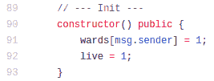

# 智能合同编排模式

> 原文：<https://medium.com/coinmonks/smart-contract-orchestration-patterns-b9043b7c27c4?source=collection_archive---------2----------------------->

## 如何让您的智能合约安全合作

Ready to deploy

除了最简单的以太坊应用程序之外，其他所有应用程序都由几个智能合约组成。这是因为在任何已部署的合同中有一个 24KB 的硬限制，并且因为随着智能合同的复杂性增加，您的理智将会消失。

一旦你把你的代码分解成可管理的契约，你肯定会发现一个契约有一个只能被另一个契约调用的功能。

例如，在[uni WAP v2](https://github.com/Uniswap/uniswap-v2-core/tree/master/contracts)中，只有合同工厂应该初始化 uni WAP 对。

The simplest possible orchestration, they say so.

Uniswap 团队通过一个简单的检查解决了他们的问题，但无论我在哪里看到的，我都发现了更多为每个项目从头开始编写编排解决方案的例子。

在理解这个问题和开发模式的过程中，我们更好地理解了如何从几个智能契约中构建应用程序，这使得 [Yield](http://yield.is) 更加健壮和安全。

在本文中，我将通过著名项目中的例子深入探讨智能合同编排。当你读完它的时候，你将能够看到你自己项目的编排需求，并决定哪一个现有的方法适合你。

我制作了这个[范例库](https://github.com/albertocuestacanada/Orchestrated)来让你在准备好的时候开始使用。

让我们开始吧。

# **背景**

我已经提出，你需要将你的项目分解成一系列智能合同，因为有两个限制，一个是技术限制，一个是心理限制。

2016 年 11 月实施技术限制。当时[乱真龙硬叉](https://blog.ethereum.org/2016/11/18/hard-fork-no-4-spurious-dragon/)在以太坊主网实现，包括 [EIP-170](https://github.com/ethereum/EIPs/blob/master/EIPS/eip-170.md) 。此更改将部署的智能合约的大小限制为最大 24576 字节。

## **被龙咬了**

如果没有这种限制，攻击者可以部署智能合约，在部署期间进行无限量的计算。它不会影响存储在区块链中的任何数据，但可能被用作以太坊节点上的一种拒绝服务攻击。

当时，区块气限制不允许这种规模的智能合同，因此变更[被视为非违约](https://github.com/ethereum/EIPs/issues/170):

> 解决方案是对可以保存到区块链的对象的大小设置一个硬上限，并通过将上限设置为略高于当前气体限制的可行值来无中断地做到这一点(使用 470 万气体可以创建约 23200 字节的病态最坏情况契约，正常创建的契约最高可达约 18 kb)

那是在 DeFi 爆炸之前。为了获得[收益](http://yield.is)，我们编写了 2000 行智能合约代码，部署后总计将接近 100 KB。我们的审计人员甚至不认为我们的项目非常复杂。

然而，我们仍然不得不将我们的解决方案分解成多个合同。

## **复杂性和面向对象编程**

将一个区块链应用程序分解成几个智能合约的第二个原因与技术限制无关，而是与人的限制有关。

在给定的时间内，我们只能在大脑中保留那么多信息。如果我们能够解决以有限方式相互作用的小问题，我们会比解决一个所有事物都相互作用的大问题做得更好。

可以公平地说，面向对象编程允许软件达到更高的复杂程度。通过定义代表一些概念的“对象”,并将变量和函数定义为对象的属性，开发人员可以更好地想象他们正在解决的问题。

Solidity 使用面向对象编程，但是是在契约级。您可以将契约视为一个对象，包含其变量和函数。在您的脑海中，一个复杂的区块链应用程序更容易被描绘成一个契约的集合，每个契约代表一个实体。

例如，在 MakerDAO 中，每种加密货币都有单独的合同，另一个合同用于记录债务，单独的合同代表债务金库和外部世界之间的网关，等等。试图在一个契约中编码所有这些可能是不可能的。如果可能的话，真的很难。

将大问题分解成以有限方式相互作用的小问题真的很有帮助。

**实现**

在下一节中，我们将看看 Uniswap、MakerDAO 和 [Yield](http://yield.is) 的编排实现。会很有趣的。

**简单的——uni swap 和 Ownable.sol**

我喜欢 Uniswap v2，因为它非常简单。他们设法用 410 行智能合约代码建立了一个非常成功的分散式交易所。他们只有两种类型的已部署契约:一个工厂和无限数量的结对交换契约。

由于他们的工厂合同的设计方式，新的配对交易合同的部署是一个两步的过程。首先部署契约，然后用它将交易的两个令牌对其进行初始化。

我不知道他们保护自己免受的漏洞，但他们需要确保只有创建配对交易合同的工厂才会初始化该合同。为了解决这个问题，他们重新实现了`Ownable`模式。

他们成功了，如果你的情况和他们一样简单，你也会成功。如果您知道您的合同只需要给另外一个合同特权访问，那么您可以使用`Ownable.sol`。甚至不需要使用 Uniswap 这样的工厂。你可以让一个用户部署两个合同(`Boss`和`Minion`，其中`Minion`继承了`Ownable.sol`，然后执行`minion.transferOwnership(address(boss))`。

**完整的一—产量**

对于 [Yield](http://yield.is) ，我们未能成功编写出像 Uniswap v2 这样简单的解决方案。我们的核心是五个契约，特权访问关系不是一对一的。一些合同具有受限的功能，我们需要将这些功能提供给核心组中的几个合同。

所以我们只是扩展了`Ownable.sol`以拥有两个访问层，其中一个有多个成员:

合同所有者可以将任何地址添加到特权列表中(`orchestration`)。继承契约可以包括`onlyOrchestrated`修饰符，它将限制对注册地址的访问。

作为额外的安全检查，每个地址都与一个[函数签名](https://www.4byte.directory/)一起注册，缩小了对`Orchestrated`契约中单个函数的访问。查看[范例库](https://github.com/albertocuestacanada/Orchestrated)以了解详细信息。

没有撤销访问的功能，因为我们会在部署期间`orchestrate`签订合同，然后`owner`会通过调用所有合同上的`transferOwnership(address(0))`来放弃它自己的特权访问。

我们自己的平台令牌`yDai`将从`Orchestrated`继承而来，并将`mint`限制在部署期间建立的特定合同:

这种模式相对容易实现和调试，并允许我们实现只应由我们控制的契约使用的功能。

**混淆视听——马克尔道**

MakerDAO 因使用无意义的术语而臭名昭著，这使得它非常难以理解。在我解决了 [Yield](http://yield.is) 的编排之后，我才意识到它们使用了几乎完全相同的实现。

1.  合同部署者是`wards`的原始成员。
2.  `wards`可以把`rely`加在其他人身上(`usr`)，使他们也成为`wards`。
3.  可以限制功能(`auth`)，以便只有`wards`可以执行。

例如，MakerDAO 的`Vat.sol`合同中的`fold`函数用于更新利率累加器，并且只能由它们集合中的另一个合同调用(`Jug.sol`合同，`drip`函数)。如果您查看该函数，您会看到`auth`修饰符，这是它们用于编排的地方:

在某种程度上，`auth`和其他编排实现是`private`和`internal`功能概念的扩展，仅用于契约之间的访问控制。

MakerDAO 实现与我们自己提出的实现非常相似。

1.  合同部署者是`wards`的创始成员。在[产量](http://yield.is)应该是`owner`。
2.  `wards`可以把`rely`加在其他人(`usr`)身上，使他们也成为`wards`。在[产出](http://yield.is)中，只有`owner`可以指定其他地址为特权地址。
3.  可以限制功能(`auth`)，以便只有`wards`可以执行它们。在 [Yield](http://yield.is) 中我们说`onlyOrchestrated`地址可以调用被标记的函数。我们进一步限制对单个函数的访问。

除了在 [Yield](http://yield.is) 中我们使用了两个访问层(`owner`和`authorized`)和单个功能限制之外，实现是相同的。契约编排是一种常见的模式，可以实现一次并经常重用。

为了让审计员和用户更开心，我们还开发了一个脚本，这个脚本[搜索了区块链事件](/coinmonks/smart-contracts-are-not-databases-5bb5926223be)并为我们的合同描绘了一幅所有权和编排的图画。该脚本将在上线时从我们的网站上提供，并证明除了在部署时设置的合同之外，没有人拥有或将永远不会拥有访问它们的特权。

毕竟，这是合同编排的全部要点。

**结论**

智能合约的编排是一个在大多数项目中重复出现的问题，大多数项目都是从零开始实现的。通常，实施的解决方案彼此几乎完全相同。

虽然出现了一个我们都可以用来安全有效地实现编排的标准，但是请使用本文中的示例来理解并实现一个满足您需求的解决方案。如果合适的话，使用[范例库](https://github.com/albertocuestacanada/Orchestrated)中的代码。

最后，感谢您阅读本文，如果您有任何问题或反馈，请随时联系我。

感谢[艾伦·尼默格](https://twitter.com/niemerg)、[丹·罗宾逊](https://twitter.com/danrobinson)和[圣乔治·孔斯坦托普洛斯](https://twitter.com/gakonst)在编写[收益率](http://yield.is)智能合约时的出色反馈。

## 另外，阅读

*   最好的[密码交易机器人](/coinmonks/crypto-trading-bot-c2ffce8acb2a)
*   [密码本交易平台](/coinmonks/top-10-crypto-copy-trading-platforms-for-beginners-d0c37c7d698c)
*   最好的[加密税务软件](/coinmonks/best-crypto-tax-tool-for-my-money-72d4b430816b)
*   [最佳加密交易平台](/coinmonks/the-best-crypto-trading-platforms-in-2020-the-definitive-guide-updated-c72f8b874555)
*   最佳[加密贷款平台](/coinmonks/top-5-crypto-lending-platforms-in-2020-that-you-need-to-know-a1b675cec3fa)
*   [最佳区块链分析工具](https://bitquery.io/blog/best-blockchain-analysis-tools-and-software)
*   [加密套利](/coinmonks/crypto-arbitrage-guide-how-to-make-money-as-a-beginner-62bfe5c868f6)指南:新手如何赚钱
*   最佳[加密制图工具](/coinmonks/what-are-the-best-charting-platforms-for-cryptocurrency-trading-85aade584d80)
*   [莱杰 vs 特雷佐](/coinmonks/ledger-vs-trezor-best-hardware-wallet-to-secure-cryptocurrency-22c7a3fd391e)
*   了解比特币最好的[书籍有哪些？](/coinmonks/what-are-the-best-books-to-learn-bitcoin-409aeb9aff4b)
*   [3 商业评论](/coinmonks/3commas-review-an-excellent-crypto-trading-bot-2020-1313a58bec92)
*   [AAX 交易所评论](/coinmonks/aax-exchange-review-2021-67c5ea09330c) |推荐代码、交易费用、利弊
*   [Deribit 审查](/coinmonks/deribit-review-options-fees-apis-and-testnet-2ca16c4bbdb2) |选项、费用、API 和 Testnet
*   [FTX 密码交易所评论](/coinmonks/ftx-crypto-exchange-review-53664ac1198f)
*   [n 零审核](/coinmonks/ngrave-zero-review-c465cf8307fc)
*   [Bybit 交换审查](/coinmonks/bybit-exchange-review-dbd570019b71)
*   [3Commas vs Cryptohopper](/coinmonks/cryptohopper-vs-3commas-vs-shrimpy-a2c16095b8fe)
*   最好的比特币[硬件钱包](/coinmonks/the-best-cryptocurrency-hardware-wallets-of-2020-e28b1c124069?source=friends_link&sk=324dd9ff8556ab578d71e7ad7658ad7c)
*   最佳 [monero 钱包](https://blog.coincodecap.com/best-monero-wallets)
*   [莱杰 nano s vs x](https://blog.coincodecap.com/ledger-nano-s-vs-x)
*   [bits gap vs 3 commas vs quad ency](https://blog.coincodecap.com/bitsgap-3commas-quadency)
*   [莱杰纳米 S vs 特雷佐 1 vs 特雷佐 T vs 莱杰纳米 X](https://blog.coincodecap.com/ledger-nano-s-vs-trezor-one-ledger-nano-x-trezor-t)
*   [block fi vs Celsius](/coinmonks/blockfi-vs-celsius-vs-hodlnaut-8a1cc8c26630)vs Hodlnaut
*   Bitsgap 评论——一个轻松赚钱的加密交易机器人
*   为专业人士设计的加密交易机器人
*   [PrimeXBT 审查](/coinmonks/primexbt-review-88e0815be858) |杠杆交易、费用和交易
*   [埃利帕尔泰坦评论](/coinmonks/ellipal-titan-review-85e9071dd029)
*   [SecuX Stone 评论](https://blog.coincodecap.com/secux-stone-hardware-wallet-review)
*   [BlockFi 评论](/coinmonks/blockfi-review-53096053c097) |从您的密码中赚取高达 8.6%的利息