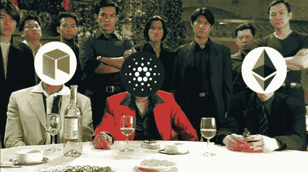
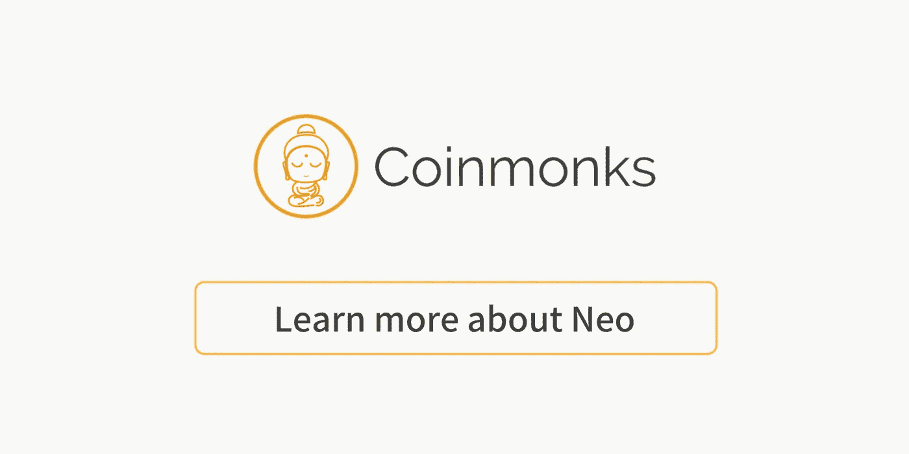

# 智能合约平台比较(程序员解释)

> 原文：<https://medium.com/coinmonks/smart-contract-platform-comparison-programmer-explain-bdc7c303c721?source=collection_archive---------0----------------------->

## NEO、ETH 或 ADA



[source](https://hackernoon.com/cardano-ethereum-and-neo-killer-or-overhyped-and-overpriced-8fcd5f8abcdf)

**智能合同为什么重要？**

> 比特币已经证明，拥有一个分散的数据库是可能的，并且可以在全球范围内得到保护。然而，比特币面临的问题很少。
> 
> 区块链 1.0(概念验证)
> 
> `No turing complete programming language`在比特币上构建东西非常困难，原因是没有内置`*for loop*`功能，这样开发者就无法在比特币上构建一个功能齐全的平台。

**智能合同平台的**`**Consensus**`**`**transactions per second**`**`**eco system**`**`**project development**`**。********

## ****`**Consensus**`****

> ****以太币****
> 
> ****股权证明([卡斯珀](https://blockonomi.com/ethereum-casper/))，计划于(2018 年 10 月)发布。****
> 
> ****新的****
> 
> ****利害关系证明([委托拜占庭容错](https://steemit.com/neo/@basiccrypto/neo-s-consensus-protocol-how-delegated-byzantine-fault-tolerance-works))****
> 
> ****自动数据采集（Automaticdataacquisitions）****
> 
> ****利害关系证明([大毒蛇](https://www.cardanohub.org/en/ouroboros/))，正在开发中(科学证明安全)****

## ****链上每秒的事务数****

```
**╔═══════════╦═══════════╦═══════════╗
║    ETH    ║    NEO    ║    ADA    ║
╠═══════════╬═══════════╬═══════════╣
║  Current  ║  Current  ║  Current  ║
║   *(20)*    ║  *(1,000)*  ║    (7)    ║
║  Future   ║  Future   ║  Future   ║
║ (*100,000)* ║ *(100,000)* ║  (5,000)  ║
╚═══════════╩═══════════╩═══════════╝**
```

******项目开发/生态系统******

> ****ETH 和 NEO****
> 
> ****多个钱包、DApps、去中心化交换、支付、商业服务等等。****
> 
> ****自动数据采集（Automaticdataacquisitions）****
> 
> ****白皮书阶段，尚未完全实施****

# ****为了成功****

> ****以太币****
> 
> ****这个生态系统非常大，许多商业都建立在它的上面。ETH 开发者正致力于用`backward compatibility`改进 ETH 协议。这意味着，开发者将更难扩展。****
> 
> ****新的****
> 
> ****NEO 的基础比 BTC/ETH 好，因为知道它们的局限性。它的成功将是让开发者和企业在其 NEO 平台上构建东西。****
> 
> ****自动数据采集（Automaticdataacquisitions）****
> 
> ****因为 ADA 仍然处于白皮书阶段，还没有完全实现。我们还需要观察它的发展。****

> ****[直接在您的收件箱中获得最佳软件交易](https://coincodecap.com/?utm_source=coinmonks)****

****[](https://coincodecap.com/?utm_source=coinmonks)********[](https://medium.com/coinmonks/neo/home)

**Click here to read more stories on Neo******