# 智能合同解读:Acryptos 的 Venus 协议策略

> 原文：<https://medium.com/coinmonks/smart-contract-read-acryptos-venus-protocol-strategy-2ac9c90fad0a?source=collection_archive---------1----------------------->

## 对杠杆收益率策略的探讨

[金星协议](https://venus.io/)，是币安智能链(BSC)上的[化合物](https://compound.finance/) + [马克尔道](https://makerdao.com/en/)克隆。该协议在推出后不到两个月的时间里获得了价值约 3 亿英镑的总锁定价值(TvL)。使 Venus 成为 BSC 网络中最大的分散财务项目。

Acryptos 项目是第一个在金星周围建造拱顶的项目。执行简单的杠杆收益农业策略，通过借入和供应相同的资产来实现 3.67 倍的杠杆。

关于该策略的详细描述可在此处找到:[金星协议上的先进高产农业策略](https://acryptos.medium.com/advanced-yield-farming-strategies-on-venus-protocol-46a4044573fc)。

正如我们以前的合同阅读，我们将尝试在这里做同样的事情。我们将尝试以简单的方式解释代码，希望非技术观众可以更好地理解他们正在交互的战略契约。

# 函数()遍历

AcryptoS 策略由以下功能提供支持

**deposit()** 基于典型的 Acryptos 蛋糕策略和杠杆再平衡调用。这是调用这个公共可访问函数的相对标准和安全的方式。

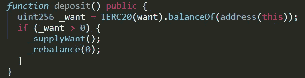

deposit()

**deposit()** 调用的一些相关内部函数:

**_supplyWant()** 基于 acryptos 的 pancakeswap 策略 **_stakeCake()**

**_claimXvs()** 是一个金星协议特定的调用，其中 Xvs 被‘认领’。该函数根据需要调用，并记录在 Venus 文档中。

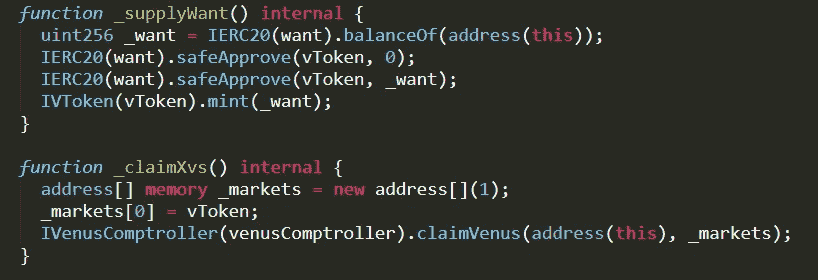

**_rebalance()** 是一个全面的杠杆调节功能。

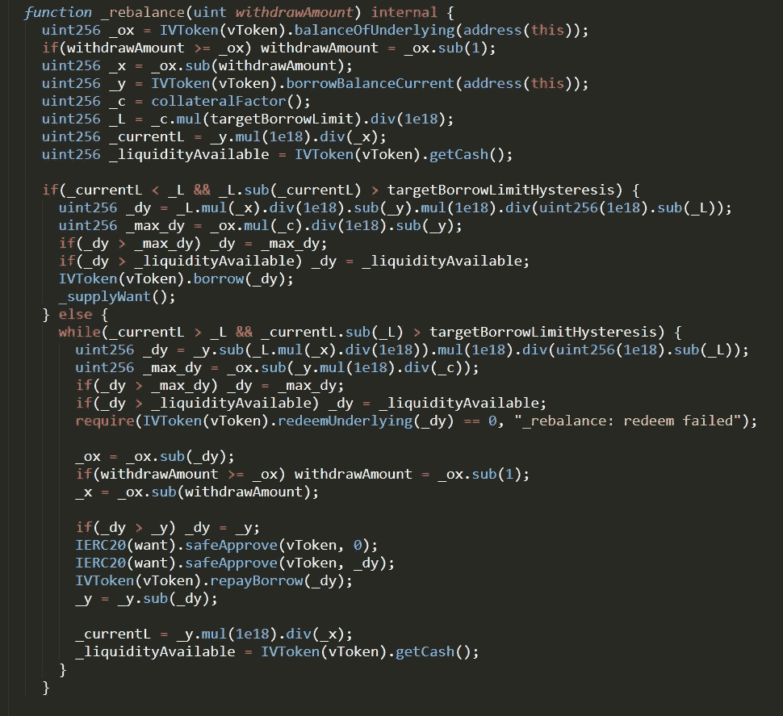

取款功能:

这些指的是一些取款功能。让我们仔细看看一些需要注意的要点。

*   只有控制器(保险库)可以调用这些外部函数，将令牌撤回到保险库。
*   费用的各种规定都编码在内，这些都符合加密公司的全交换策略。
*   该函数以相对安全的方式调用，并模仿其他策略中的典型撤回函数。

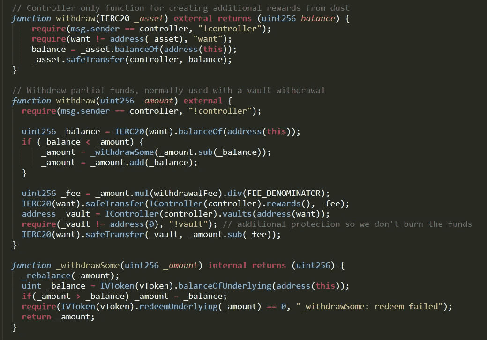

**取款()**功能:

*   通常用于在紧急情况下改变策略或退出底层协议。
*   战略家和治理者可以调用 **withdrawAll()** ，将资金重新放入金库。

我们认为有必要在紧急情况下(例如，底层 Venus 协议中的问题)触发对金库的资金提取。

相比之下，现有的 pancakeswap 的 Acryptos 策略只允许由治理来执行这个操作。鉴于这里的底层协议是不同的，并且具有可升级的性质，战略家直接执行这一点的能力是必要的。

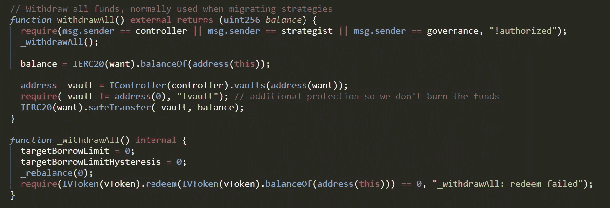

**_ convertrewardstovant()。**此功能是一个典型的交换功能，利用 pancakeswap 将 XVS 交换到保险库的资产

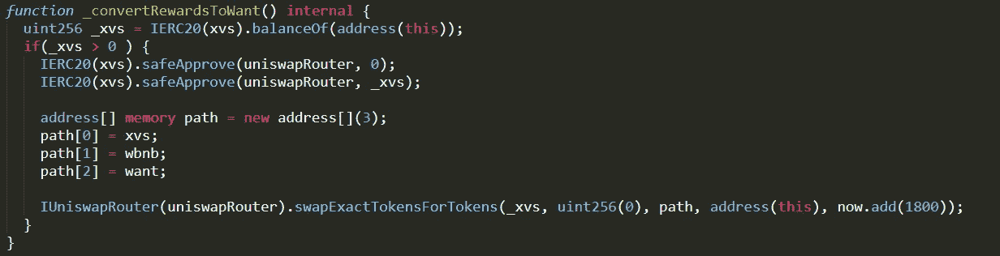

一些只读函数，这些大多是信息，是常见的调用。

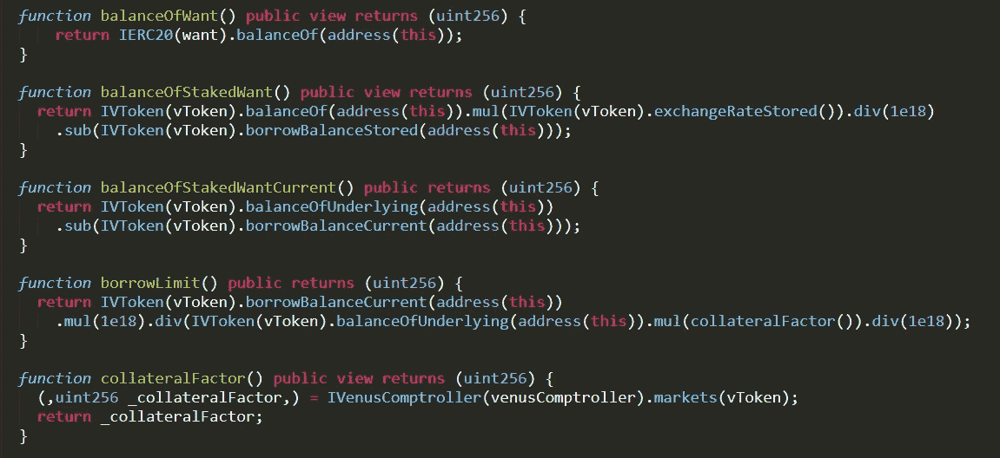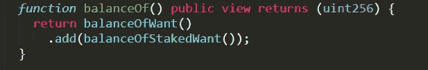

**harvest()** —典型函数，主要基于 acryptos 的 pancakeswap 策略的 **harvest()** 和 **_payfees()** 的组合。 **_rebalance()** 在收获期间调用，以稳定杠杆。

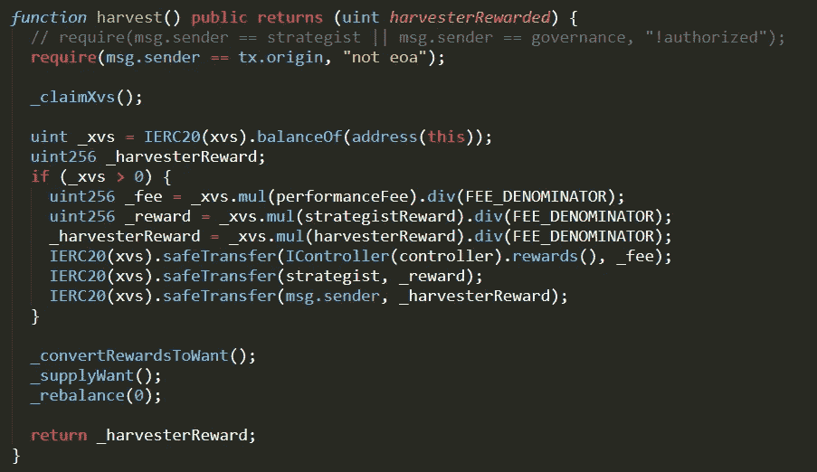

各种合同变更功能通过时间锁(治理)和公共功能运行。

策略师将能够直接设定借款限额。这样做是为了保持杠杆平衡。

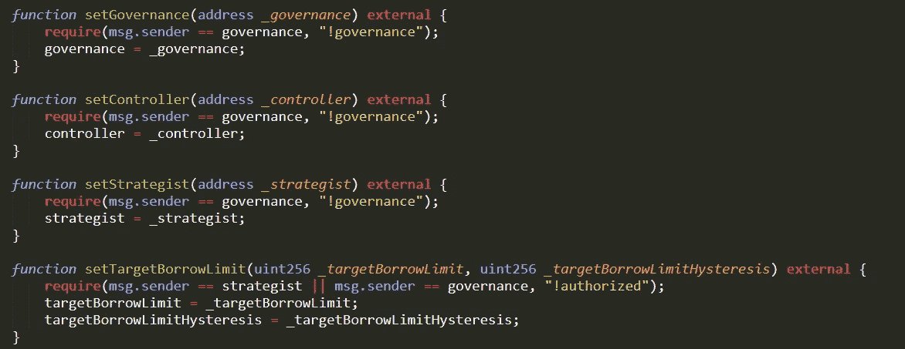

**executeTransaction()** ，合同中包含的函数调用，用于在 Venus Protocol proxy 合同发生变化的情况下将资金从基础资产中保释出来，但不保证它们会如何变化。

通过一个时间锁，治理可以通过这个功能通过另一个契约编写新代码来拯救资金，这是一个非常强大的功能。

该策略必须被时间锁定，以确保治理方不能在没有在时间锁定契约上预先记录事件的情况下恶意地影响更改。

*//这不会增加用户风险。治理，已经通过战略升级控制资金，并落后于 timelock。*

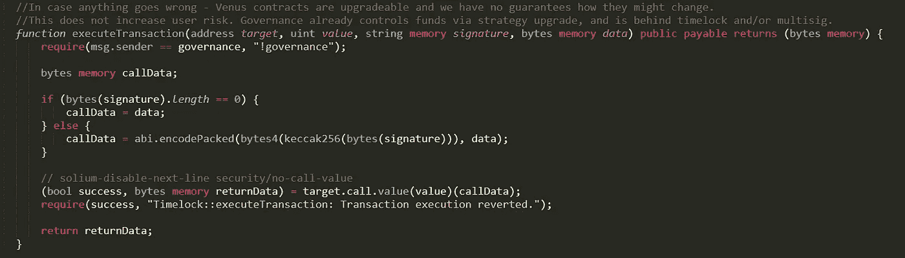

# 结论

Venus 协议是一个通过可升级的代理契约运行的协议，这意味着在协议之上构建保险库是一件棘手的事情。潜在的协议可以被改变，使资金永久停留在任何没有内置故障保险的策略中。由 Acryptos 的 Venus 策略提出的各种安全特征降低了底层协议改变或升级其代理合同的风险。

我们注意到，在该战略的设计中，进一步的风险降低工具是为了使战略制定者能够直接实施变化，以减轻借款风险，而不增加资产风险。

总的来说，该策略是有效的，允许它在维纳斯协议的高借款限额下获得收益。

> 加入 coin monks[Telegram group](https://t.me/joinchat/EPmjKpNYwRMsBI4p)学习加密交易和投资

## 另外，阅读

*   什么是[闪贷](https://blog.coincodecap.com/what-are-flash-loans-on-ethereum)？
*   最好的[密码交易机器人](/coinmonks/crypto-trading-bot-c2ffce8acb2a)
*   [3 商业评论](/coinmonks/3commas-review-an-excellent-crypto-trading-bot-2020-1313a58bec92) | [Pionex 评论](/coinmonks/pionex-review-exchange-with-crypto-trading-bot-1e459d0191ea) | [Coinrule 评论](https://blog.coincodecap.com/coinrule-review-a-perfect-trading-bot)
*   [AAX 交易所评论](/coinmonks/aax-exchange-review-2021-67c5ea09330c) | [德里比特评论](/coinmonks/deribit-review-options-fees-apis-and-testnet-2ca16c4bbdb2) | [FTX 密码交易所评论](/coinmonks/ftx-crypto-exchange-review-53664ac1198f)
*   [n 零审核](/coinmonks/ngrave-zero-review-c465cf8307fc)
*   [Bybit Exchange 审查](/coinmonks/bybit-exchange-review-dbd570019b71) | [Bityard 审查](https://blog.coincodecap.com/bityard-reivew)
*   3Commas vs Cryptohopper
*   最好的比特币[硬件钱包](/coinmonks/the-best-cryptocurrency-hardware-wallets-of-2020-e28b1c124069?source=friends_link&sk=324dd9ff8556ab578d71e7ad7658ad7c)
*   [总账 vs 平均](https://blog.coincodecap.com/ngrave-vs-ledger)
*   [密码本交易平台](/coinmonks/top-10-crypto-copy-trading-platforms-for-beginners-d0c37c7d698c)
*   [莱杰纳米 s vs x](https://blog.coincodecap.com/ledger-nano-s-vs-x)
*   [Vauld 审查](https://blog.coincodecap.com/vauld-review) | [YouHodler 审查](/coinmonks/youhodler-4-easy-ways-to-make-money-98969b9689f2) | [BlockFi 审查](/coinmonks/blockfi-review-53096053c097)
*   最好的[加密税务软件](/coinmonks/best-crypto-tax-tool-for-my-money-72d4b430816b) | [硬币追踪评论](/coinmonks/cointracking-review-a-reliable-cryptocurrency-tax-software-5114e3eb5737)
*   最佳[密码借贷平台](/coinmonks/top-5-crypto-lending-platforms-in-2020-that-you-need-to-know-a1b675cec3fa)
*   [莱杰纳米 S vs 特雷佐 one vs 特雷佐 T vs 莱杰纳米 X](https://blog.coincodecap.com/ledger-nano-s-vs-trezor-one-ledger-nano-x-trezor-t)
*   [BlockFi vs 摄氏度](/coinmonks/blockfi-vs-celsius-vs-hodlnaut-8a1cc8c26630) | [霍德诺回顾](https://blog.coincodecap.com/hodlnaut-review)
*   [Bitsgap 审核](/coinmonks/bitsgap-review-a-crypto-trading-bot-that-makes-easy-money-a5d88a336df2) | [四效审核](/coinmonks/quadency-review-a-crypto-trading-automation-platform-3068eaa374e1)
*   [Ellipal Titan 点评](/coinmonks/ellipal-titan-review-85e9071dd029) | [SecuX Stone 点评](https://blog.coincodecap.com/secux-stone-hardware-wallet-review)
*   [BlockFi 点评](/coinmonks/blockfi-review-53096053c097) |赢取高达 8.6%的加密货币权益
*   [DEX Explorer](https://explorer.bitquery.io/ethereum/dex) 和[区块链 API](https://explorer.bitquery.io/graphql)
*   [加密货币套利](/coinmonks/crypto-arbitrage-guide-how-to-make-money-as-a-beginner-62bfe5c868f6)入门指南:如何赚钱
*   最佳[加密制图工具](/coinmonks/what-are-the-best-charting-platforms-for-cryptocurrency-trading-85aade584d80)
*   了解比特币最好的书是什么？

> [直接在收件箱中获得最佳软件交易](/coinmonks/newsletters/coinmonks)

