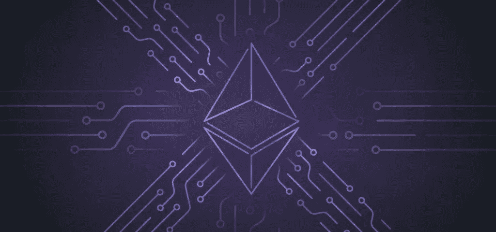
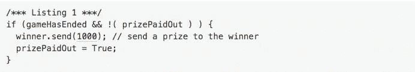

# 智能合同安全第三部分—气体限制

> 原文：<https://medium.com/coinmonks/smart-contract-security-pt-iii-gas-limits-4c48c7d0eba0?source=collection_archive---------0----------------------->

以太坊是一种加密货币，允许开发人员用一种叫做 Solidity 的编程语言编写 dApps(去中心化应用程序)。其背后的基本前提是，任何编写的 dApps 都将被网络中的矿工执行，有效地创建了一个全局计算机！

虽然这听起来很棒，但提出的一个明显问题是，如果有人在网络上部署大量虚拟合同，实际上导致了 DDoS(分布式拒绝服务)攻击，会发生什么？为了解决这个问题，网络要求用户为部署智能合同并与之交互而付费。一个乙醚的最小单位是一个卫。供参考:

*   1 魏= 1 魏
*   1 千微/巴贝奇= 1⁰微
*   1 megawei / lovelace = 1⁰⁶魏
*   1 千兆微/香农= 1⁰⁹微
*   1 微醚/ szabo = 1⁰魏
*   1 米利醚/芬尼=1⁰⁵·魏
*   1 乙醚= 1⁰ ⁸魏

燃气成本简单地说就是燃气*燃气价格(单位为魏)。原因是，如果以太坊的交易价格没有与以太本身的价格紧密联系。

## 以太智能合约之王

当智能合约耗尽汽油时，事情就可能开始出错。

2016 年 2 月，一款名为“以太之王”的 dApp 游戏(想想:山中之王，但你要支付比当前最高价格更多的以太才能登顶)提出了一个安全漏洞，允许有人通过欺骗的方式成为国王。

实现这种利用的方式相对简单。首先，一个聪明的合同发送 KoTE 合同足以成为新的国王，虽然只有 2300 气(最低)。

Not from the KoTE contract, just an example of what was going on.

使用 send()的问题是，如果由于没有足够的气体而失败，那么不会抛出错误，代码会继续执行。

在 KoTE 的例子中，在一个新国王支付了新的价格成为国王之后，前一个国王将通过 send()方法得到补偿。然而，由于没有足够的汽油，前国王失去了他的补偿，新国王被设定在合同中。

以太坊社区对此的解决方案是支持拉推支付。这实质上意味着，智能合约应该通知钱包/用户，然后收取以太网(提取支付)，而不是直接支付钱包(推送支付)。回到 KoTE，一个简单的事件告诉前一任国王他们被出价超过，然后允许他们手动查询智能合同并收取他们的补偿。

## 解决方法

在需要支付多个用户的情况下，支持拉式支付也是非常重要的。许多开发人员倾向于简单地遍历每个需要支付的用户，然后手动支付。然而，正如我们现在所知，如果循环的规模太大，那么智能合约可能会耗尽天然气来执行所有这些支付，导致资金被锁定。

从这种利用中得到的一些关键收获是:

*   避免使用 send()函数，因为它会在出现缺气异常时无声地失败。
*   处理付款时，使用拉而不是推。
*   确保开发人员对以太坊虚拟机(运行智能合约的环境)有一个牢固的理解
*   不仅要测试契约的代码，还要测试在各种情况下与契约的交互

来自一方或多方的外部审计可以防止这种攻击，因为审计是逐行进行的。

CanYa 未来的 Bountysource 平台将允许智能合约开发者发布他们的代码，以检查任何安全漏洞。这些检查通常以智能合同审计的形式进行。

审计包括对整个代码库的逐行注释，突出代码中任何主要和次要的漏洞。此外，还可以编写自动化测试来确保程序按预期运行。

Bountysource 也有很多其他更新正在进行中，比如新的界面和更多的开发路线图功能！

> [在您的收件箱中直接获得最佳软件交易](https://coincodecap.com/?utm_source=coinmonks)

