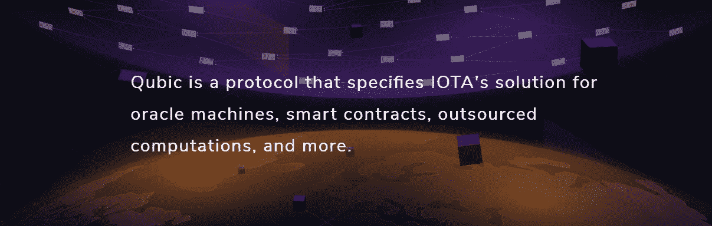
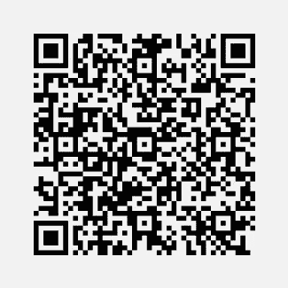

# 智能合同和 IOTA

> 原文：<https://medium.com/coinmonks/smart-contracts-and-iota-f8a59c355084?source=collection_archive---------1----------------------->

智能合同是 IOTA 未来业务流程的一个非常重要的主题。一些读者可能已经听说过所谓的智能合约，对于其他人来说，这是一个全新的术语，其他人也是这方面的专家。本文旨在帮助读者理解为什么智能合同对企业和个人如此重要，以及它们与 IOTA 有什么关系。

> [在您的收件箱中直接获得最佳软件交易](https://coincodecap.com/?utm_source=coinmonks)

智能合约的一个基本要求是区块链技术。只有通过使用区块链技术，才有可能编制智能合同。在这种情况下，数据记录(合同条款)被组合成单独的块，并以加密形式存储为一个链，每个块具有精确计算的和相关的校验位，由此每个块必须与整个链形成一致。

**智能合约促进交易**

乍一看，这对于外行来说可能听起来非常复杂。如果将智能合同与我们习惯的或建立和缔结合同的方式进行比较，智能合同的功能就变得可以理解了。纸质合同的执行可能需要律师和仲裁委员会(即第三方)的参与，而区块链技术可以在不需要第三方的情况下遵守和执行合同条款。这是开创性的事情！不仅小字可以省去。也不再需要质疑智能合同(该合同只有在满足先前定义的条件时才有效),并且没有合同可以在随后被修改和操纵(因为在有效的区块链中仅阻止),具有验证共识的记录可以存在。

**智能合同应用实例**

因此，这种新的签约方式有许多优点。可以显著降低成本并显著提高效率。仅在货物运输中，订单的会计和人工记录以及装载和卸载过程的记录的成本通常比货物本身的价值高 50%。或者，考虑一下收入的公平分配，例如在音乐行业，当音乐家在网上提供他的作品供下载时，他决定谁得到哪个部分。所以潜力是巨大的。

理想情况下，这个用于记录智能合同的区块链也实现其自己的或现有的加密货币，如所描述的，例如以太坊。所以甚至有可能用你自己的货币来履行这个合同。这可以在一个商业区域内创建一个自己的大型社区。

**Qubic IOTA 和智能合约**

对 IOTA 来说，迄今为止还没有任何官方的智能合同，这是一个巨大的挑战。Ralf Rottmann，董事会成员(IOTA Foundation)在 2018 年 3 月写了一篇关于智能合同的有趣文章。上面写着:

> “IOTA 本身并不支持智能合同。IOTA 基金会表示，IOTA 基金会是一流的解决方案。众所周知，IOTA 基金会正在积极致力于这一额外的智能合同层。”

Source: [https://qubic.iota.org/](https://qubic.iota.org/)

2018 年 6 月，关于量子位(基于法定人数的计算)的细节被公布后，智能合同的话题再次被提起。在[量子页面](https://qubic.iota.org/)上，这项开创性的技术创造了许多有趣的东西，智能合同的主题在那里得到了广泛的讨论。上面写着:

> “一般而言，智能合同通过将合同义务封装在软件中，以进行自主验证和执行，从而消除了第三方执行的需要。任何有权接触合同的人都可以证明某个特定事件总是会导致特定结果。虽然预计智能合同在未来可能会被用来取代许多种现实世界中的纸质合同，但迄今为止，智能合同最常见的使用情形是创建虚拟令牌，这些令牌继承了创建它们的分布式系统的许多属性。
> 
> 虽然 Qubic 当然能够支持这些传统的智能合同，但是免费交易和通用的基于法定人数的计算的结合打开了全新可能性的大门。
> 
> 这些类型的智能合同也只是对基于仲裁的计算的更一般能力的迭代。因此，Qubic 还提供了一种标准化的方式来定义、验证和高度确定地执行智能合同的结果。"

Source: [https://qubic.iota.org/](https://qubic.iota.org/)

我们相信，当 IOTA 配备了由 Qubic 提供的智能合同时，未来的机会将会快速增长，IOTA 将进一步巩固其突出的地位。

## 您对咖啡和[公共 IOTA 项目](http://publiciota.com/)的支持

请记住，我们是一个没有财务空间的独立小团体。我们感谢对该项目的任何财务和其他援助。

咖啡总能让漫漫长夜变得美好，如果你喜欢我们的项目，我们将很乐意得到你的支持！非常感谢！

我们的 IOTA 捐赠地址:

gwsjii 9 dpemhtapq 9 whgdvblzysxindewgns 9 lbls h 9 u qu wkdswhaq q 9 lohohuiselhbfrrotj 9 hvhpabzobjj 99 Zea

谢谢你！

“公共 IOTA 项目”不是 IOTA 基金会的一部分，也没有以任何其他方式联系起来，而是一个独立的项目来支持 IOTA 及其应用。

我们期待你的消息。联系人:info@publiciota.com

我们的愿景:“真正的 IOTA 革命将会发生，当应用程序能够使行业和投资者受益，当更多的人理解和接受 IOTA，并认识到其在日常生活中的好处。我们希望作为一个独立的团体支持这一进程”

来源:

[1][https://morethan digital . info/die-wich tige-Rolle-smart-contract-und-kryptowahrungen-zukunft/](https://morethandigital.info/die-wichtige-rolle-smart-contract-und-kryptowahrungen-zukunft/)(文章部分内容翻译成英文)

[2][https://medium . com/@ ralf/about-smart-contracts-in-iota-626 d2bd 3619 e](/@ralf/about-smart-contracts-in-iota-626d2bd3619e)

[3]https://qubic.iota.org/intro

