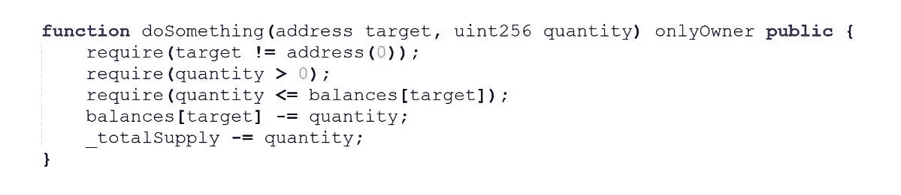
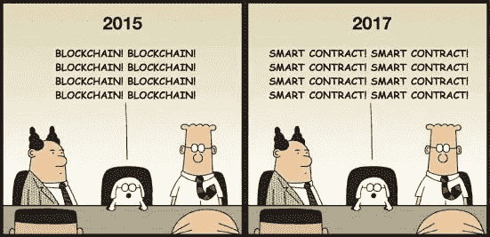

# 智能合同——细节决定成败

> 原文：<https://medium.com/coinmonks/smart-contracts-benjamin-hall-the-devil-is-in-the-detail-c9b760c996f8?source=collection_archive---------7----------------------->

[Luca Bravo](https://unsplash.com/@lucabravo?utm_source=medium&utm_medium=referral) on [Unsplash](https://unsplash.com?utm_source=medium&utm_medium=referral)

截止日期临近，其他人所做的承诺关系到团队是否有能力为一些看似棘手的问题找到解决方案。作为一名非典型的 ICT 系统分析师，我声音很大，讲可怕的笑话，喝高辛烷值咖啡，喜欢去地狱买皮革。在完整的文档、按时交付和确保不引入技术债务之间，这总是一个平衡的行为。缺点是细节。

本，“魔鬼，魔鬼在细节中”，是我的团队中一个极其谦逊的开发人员向我指出的一个常用短语，即“noj”。对我来说幸运的是，我和我的团队团结一致，相互激发我们的力量，按时兑现别人的承诺。

所以你为什么要在乎呢？嗯，我在一家传统的集中式 ICT 开发公司工作，在那里可以发现并修复错误。你知道，它一直都有读写删除的能力。众所周知的标准 [CRUD](https://en.m.wikipedia.org/wiki/Create,_read,_update_and_delete) 函数。一种松散的类比，即在他人留下的技术债务基础上进行改进的能力，以及在需要改进用户体验和业务流程的地方进行重新设计和构建的能力。所以我要带着这些去哪里…

> **欢迎来到区块链和智能合约的世界，在这里编写一行代码可以编译，语法正确，不容易受到已知的攻击，但仍然会让你陷入困境！**

这不是一篇关于智能合约的新颖文章。我不是布特林，潘，宋或博士候选人。

然而，我相信广泛分享一些简单的概念有助于所有区块链、DLT 或密码爱好者准确理解以太坊和其他第二代分布式账本平台和协议提供了什么。

# 那么什么是智能合约呢？

首先，如果你是区块链和分布式账本领域的新手，看看我在这里的[文章](http://“Blockchain Smart Contracts — Legalities Abroad” @crypto_catchup https://medium.com/@benjaminhall/blockchain-smart-contracts-legalities-abroad-a261b2900a3f)，我在这里谈论了这个杜撰术语的起源，以及智能合约本身既不是智能的也不是契约的事实。许多人并没有被设计成两者之一，但是他们可以尝试两者兼而有之。

他们是愚蠢的，他们只知道他们最后的“状态”是什么，更常见的是用于定义日常游戏中的参数，最新的 DApp(去中心化的应用程序)如 [CryptoKitties](https://www.cryptokitties.co) 不能为你的联邦政府定义下一个立法措施。

# 那么，为什么要这么大惊小怪呢？

好吧，你告诉我，下面怎么了？确保你在细节上考虑到魔鬼。

如前所述。

*   语法正确
*   不易受到已知攻击媒介的影响&
*   编制

好吧，我就告诉你…

> 它赋予合同所有者删除任何人拥有的硬币/代币的权力！

这还不是全部，如果合同所有者的钱包受损，攻击者可以在几分钟内删除硬币供应 ***让数十亿美元的市值化为乌有。***

# 我们可以修好它，对吗？

**错了！**

除非精心设计，否则智能合约是不可“升级”的，它们不能简单地返回过去的状态。由于功能锁定或钱包被掏空而损失的 5000 万美元根本无法逆转。这里没有警察来帮助你，这是你自找的，一个**去中心化的**世界，也就是说，远离制度权力。

这就是为什么我们都必须考虑细节中的魔鬼。编写智能合约不同于标准的软件编程，在达到最初期望的产品质量之前，您无法进行迭代。它与构建最关键的医院基础设施或军事应用所依赖的硬件更密切相关。你应该设计、构建和测试。没有时间来“部署”和修复，到那时，你将失去所有投资者的资金。

智能合约的编码需要与传统编程完全不同的思路，每个人都必须被视为对手。

Cryptoeconomics 要求开发人员理解一个简单的概念，即一旦部署了智能合约，世界上网络上的每个节点都会执行代码并维护结果的副本。不仅如此，他们还必须考虑到，为了保持平衡，对优秀行为者的激励是必须的——职能部门需要支持这些要求。

我们都需要放下过去，停止使用流行词汇，开始认识到真相。除了基本的 ERC20 ICO 贿赂基金，交付安全、可扩展、架构良好的 DApps，甚至是单一的智能合同是很难的。

# 最后的想法

我告诉过你，不革命，但是真实。让我们回顾一下。

1.  智能合同本身既不是智能的，也不是契约式的，但可以发展成两者兼而有之。
2.  一旦智能合同被部署到主网上，就不容易，在许多情况下也不可能修复可能发现的错误
3.  永远记住，去中心化的网络意味着任何人都可以攻击你或你的应用——构建得好像全世界都讨厌你一样。
4.  在你的职能中加入激励元素，否则你将建立一个强大而安全的合同，却没有可用性。客户仍然应该是你工作的焦点，是安全和用户体验之间的平衡。
5.  总是让第三方审核你的代码，直到语言、编译器和其他支持工具和文档赶上正在开发的想法和用例
6.  它们是一个强大的概念，当在全球计算能力中使用时，即以太坊虚拟机或任何其他开发出来并在未来几年发现有价值的平台中使用时，您应该会对自动化智能合约的内容感到兴奋。

感谢阅读！

取得联系！

YouTube:[https://www.youtube.com/c/cryptocatchup](https://www.youtube.com/c/cryptocatchup)

推特:【https://twitter.com/crypto_catchup 

领英:【https://www.linkedin.com/in/benjamin-hall-760b9891/ 

网址:[https://www.cryptocatchup.com/](https://www.cryptocatchup.com/)

鸣谢:Binod Nirvan 的代码片段。