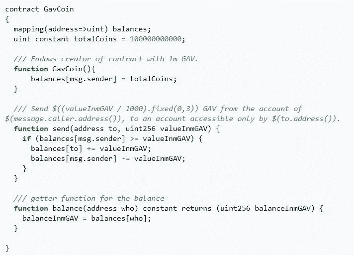

# 智能合同讲解(针对律师)第 1 部分

> 原文：<https://medium.com/coinmonks/smart-contracts-explained-for-lawyers-pt-1-35c4df4ecd10?source=collection_archive---------3----------------------->

Photo by [Markus Spiske](https://unsplash.com/@markusspiske?utm_source=medium&utm_medium=referral) on [Unsplash](https://unsplash.com?utm_source=medium&utm_medium=referral)

几周来，我一直在尝试智能合约。智能合同是在区块链上运行的一个程序，用于促进、验证和/或实施双方之间的协议。它对于管理支付、数字资产、数字身份和[物联网](https://en.wikipedia.org/wiki/Internet_of_things)设备特别有用。当绩效可以客观地衡量时，它对于评估绩效也很有用。今天，人们可能最熟悉的用例是购买、出售和交易加密货币，如比特币(BTC)和以太网(ETH)。当您购买或转移加密货币时，智能合约会将货币从一个钱包转移到另一个钱包，并将交易记录到区块链。

> 智能合同是在区块链上运行的一个程序，用于促进、验证和/或实施双方之间的协议

在[以太坊](https://www.ethereum.org/) [区块链](https://en.wikipedia.org/wiki/Blockchain)上，智能合约是用类似 [JavaScript](https://en.wikipedia.org/wiki/JavaScript) 的脚本语言“ [Solidity](https://solidity.readthedocs.io/en/v0.4.24/introduction-to-smart-contracts.html) 编写的。在 Solidity 中，条款和条件被写成逻辑表达式(if-then，for 循环等。)而不是法律散文。就这一点而言，编写智能合同与编写常规合同完全不同。要撰写甚至理解智能合同，你需要对计算机编程有所了解(见下面的例子)。但这种情况最终会改变，像 open law(ConsenSys 的一部分)这样的组织正致力于通过模板和标记语言实现智能合同。

Example Smart Contract written in Solidity

智能合同不仅仅是纪念性的，它将协议的各个方面自动化，将传统合同与企业技术、在线服务和物联网设备联系起来。用计算机代码实现合同条款并不新鲜(例如，自动化交易和数字版权管理)，但智能合同与其他程序化合同的区别在于 T2 的不变性和 T4 的不变性。智能合约在以太坊区块链上线后，代码(*即*“协议条款”)不可更改。这给了签约双方保证，条款将按约定执行——因为没有人能改变代码。此外，每当交易被记录到区块链(像分布式分类账)时，都使用一致同意过程，因此合同的所有各方在大约相同的时间具有相同的信息。此外，该法确保自动履行义务。所以即使双方互不信任，在某种程度上，他们也不能*信任*合同条款会以确定、透明的方式执行。

> “[各方]可以相信，合同条款将以确定和透明的方式得到执行。”

当交换有价值的东西时——比如说，在网上购买音乐——合同可以作为一种契约，占有物品和付款，只有当协议条款得到满足时才释放它们。这样，卖家可以确定他或她将被支付，而买家可以确定他或她将收到内容。不需要中间人来促成交易。购买一首歌或一张专辑是一件相对来说微不足道的事情，但是你可以想象当更多的事情处于危急关头时会发生什么。

> "不需要中间人来促成交易."

除了确定性和信任之外，可靠性还引入了许多律师可能不习惯的有用特性，包括“继承”合同条款、与其他合同“接口”以及“要求”验证的能力。

# **继承**

继承有点像通过引用将一个契约的部分或全部条款合并到另一个契约中。即使你只是想把一个合同的一部分合并到另一个合同中，Solidity 的继承特性也允许你这样做。有用的是，你可以一次写一个条款，并在包含该条款的所有合同中一致地复制它。

# **界面**

界面允许您的合同与区块链上的其他合同进行交互。假设您有一个依赖于第三方合同中的信息或数据的合同；添加“接口”允许您的合同访问第三方信息或数据。例如，如果您有一个取决于第三方设定的价格的合同，而该第三方有一个智能合同，该合同带有一个报告其当前价格的功能，通过一个接口，您的合同可以读取价格并将其纳入执行中，也许是为了匹配价格。

# **要求**

“Require”是在继续执行合同条款之前验证某事是否为真的功能。例如，它可以用于在允许购买之前验证钱包中是否有足够的资金。它还可以用于验证试图进入合同交易的一方的身份；例如，检查发出请求的地址和签名。

当智能合同与传感器等物联网设备相关联时，可以使用需求来验证真实世界的条件，如位置、天气、交通、生物计量信息等。可能性是无限的。举例来说，如果航班取消，航空公司可以发布一份智能合同，向乘客发放资金。

这是对坚固性的几个漂亮特征的简单解释。这显然有细微的差别，但是在高层次上，您可以看到这些特性如何在合同安排的自动化中证明是有用的。同时，也有一些缺点，我将在另一篇文章中解决。我还应该提到，稳健并不是唯一聪明的合同语言；就像以太坊不是唯一的区块链一样。除了以太坊，还有[卡达诺](https://www.cardano.org/en/home/)、 [EOS](https://eos.io/) 、 [Hyperledger Fabric](https://www.hyperledger.org/) 、 [Stellar](https://www.stellar.org/) 等区块链网络。每种语言都有自己的编写智能合同的语言，并且每种语言都有其优点和缺点。但是我们稍后也会谈到这些。敬请期待！