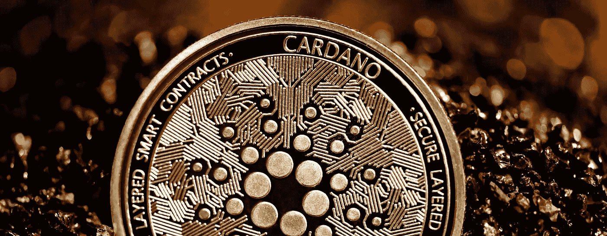

# 智能合约市场概述

> 原文：<https://medium.com/coinmonks/smart-contracts-space-c5230e9bd489?source=collection_archive---------3----------------------->

## Altcoins 研究系列

文章作者 [Lesia M.](https://twitter.com/LesiaMrch)

Photo by [Executium](https://unsplash.com/@executium) | Unsplash.com

本文开始了 JKL Capital 的 Altcoin 研究的新系列，旨在对区块链生态系统进行分类，并特别关注顶级加密项目。

第一类值得你关注的区块链项目是那些旨在运行智能合同的项目。智能合约驱动的区块链前景越来越广阔。Crypto media 喜欢“以太坊-黑仔”这个术语，它一直在寻找第二大智能合约平台。卡尔达诺、波尔卡多特和索拉纳经常被授予这个头衔。

在这篇研究论文中，我们将研究运行智能合同的一些最大的区块链，并根据一组指标评估它们的进步水平，包括它们的分权水平、令牌经济学、社区和其他。

首先，智能合同是双方之间编码的全自动协议，消除了对中介的需求。我们在之前的文章[‘加密货币&传统金融’](/coinmonks/cryptocurrencies-traditional-finance-61cb624fbe75)中提到了它们，在那里我们解释了智能合约如何(r)演进传统金融以及其他行业。

以太坊是世界上第一个智能合约平台。它允许开发人员在其区块链上构建他们的项目和应用程序，方便了本地令牌的创建，并允许产品之间的无缝集成。以太坊于 2015 年推出，在行业中具有先发优势，大多数 dApps 都建立在它的网络上。事实上，超过 25 万开发者选择了以太坊，为平台提供了巨大的网络效应。

虽然以太坊的主导地位很难反对，但多个成功的加密项目声称是以太坊成功的可行替代方案——如果不是更好的方案的话。但是，哪个候选人具有成为下一代智能合同提供商的技术和社会潜力呢？

# **卡尔达诺(阿达)**

Cardano 于 2017 年推出，是支持智能合约功能的第二大区块链，为加密项目和分散化应用提供平台。在撰写本文的时候，智能合同还没有在 Cardano 的区块链上部署，但是根据开发者的更新，这似乎是迫在眉睫的事情。时间安排在阿隆佐硬分叉完成后的 9 月初至 9 月中旬:

Source: IOHK

随着智能合约的推出，Cardano 预计将超越以太坊:虽然后者只是过渡到股权证明协议，但 Cardano 已经成功地运行了它。事实上，卡达诺是目前世界上市值最大的区块链公司。

Source: JKL Research

去中心化的理念是区块链技术背后的核心创新。它是将权力从一个中心方转移到一个不同的用户网络手中，为加密项目提供更高的弹性和多样化的控制。

卡尔达诺最明显的优势之一是项目的高度分散化。卡尔达诺的 3000 个股份池运营商负责 100%的区块生产。网络上块生产者的数量越多，他们提供的安全性就越高，使得 51%攻击的可能性就越小。相比以太坊网络上 25 万的验证器，Cardano 还有一定的成长空间。然而，与市值较低的竞争对手相比，Cardano 确实是第二好的智能合约平台。在最近的以太坊伦敦硬分叉(特别是以太坊改进提案 1559 削减了一部分 ETH 验证者的奖励)的背景下，平台之间可能会发生一些节点迁移。

有助于区块链内在价值的另一个方面是在此基础上建设的项目的质量。Cardano 的高度分散化反映在其网络在平台治理方面的权力程度上。卡尔达诺的 Dapps 建筑是通过 project Catalyst 在“内部”开发的，这是一系列可供社区成员在提议的项目中分配的资金。正如在任何利益证明协议中一样，节点的投票权取决于它们的 ADA 股份。部分原因是由于这种观念，Cardano 的押记加密资产的美元价值最大，超过 70%的可用 ADA 押记在其区块链上[2]。

ADA 在流通中的分布是项目偏好去中心化的另一个证据，只有 16%的加密资产属于团队&创始人，84%掌握在投资者手中。

就网络数据而言，在撰写本文时，ADA 的余额地址数量达到 200 万个。这几乎比非零 ETH 地址少 30 倍，比 DOGE 低两倍多(DOGE 的市值实际上比 Cardano 低 40%)。如果 Cardano 能够在不考虑地址数量相对较低的情况下成为市值第四的加密货币，那么当 ADA 获得更多主流关注时，就有很高的增长潜力。

最后，Cardano 的社区在加密领域的其他项目中脱颖而出。卡尔达诺的创始人查尔斯·霍斯金森(Charles Hoskinson)是以太坊的八大创始人之一。他在 Cardano 开发中的特别关注点在于同行评审研究和基于证据的方法。在过去的 4 年里，Cardano 开发人员遵循了一个明确的项目路线图，并被视为最积极开发的加密货币项目之一[3]。

# **波尔卡多(点)**

Polkadot 是一个更年轻的项目(于 2020 年启动)，为跨链互操作性提供了一个区块链平台。其创始人加文·伍德博士也是以太坊的早期创始人之一。

Source: JKL Research

Polkadot 的主要特性是它的副链——在 Polkadot 生态系统中并行运行的定制的、特定于应用程序的区块链。在对 ku sama-Polkadot 的测试网络进行了一段时间的审计和优化之后，Parachains 计划于今年晚些时候在 Polkadot 上推出。

就权力下放而言，总体情况不如卡尔达诺那样令人信服。在撰写本文时，Polkadot 大约有 300 个开放的验证职位，并计划在项目成熟时将这个数字增加到 1000 个。

提名利益证明协议是指“提名”和提名委员会候选人的奖励节点。Polkadot 的委员会由 13-23 个保持系统运行的砌块生产商组成。在每一个利益相关证明机制中，投票和验证能力取决于利益相关点的数量。这就是为什么大约 60%的可用网点都集中在其网络上。

虽然减少验证器的数量有助于项目的可伸缩性，但这无疑是从分散化的倒退。此外，将块生产者的数量减少到 13-23 个位置会产生增加 51%攻击的安全风险。

DOT 大约 55%的股份掌握在投资者手中，其余分配给项目创始人和奖励。这意味着 Polkadot 的团队比其他持有令牌的投资者拥有更高的赌注(以及投票/确认)权力。

建立在 Polkadot Parachain 上的项目在 Polkadot Parachain 拍卖中确定，点持有者有机会通过首次 para chain 发行支持他们最喜爱的项目。

尽管 Polkadot 在去中心化方面的地位较弱，但它拥有令人印象深刻的社会数据。事实上，该项目拥有 52.6 万名 twitter 粉丝，几乎和 Cardano 一样多。尽管它可能是由对加密空间的系统化社会兴趣推动的，但考虑到 ADA 的市值是 DOT 的 3 倍，它仍然令人印象深刻。

# **索拉纳(SOL)**

Source: JKL Research

Solana 也是一个相对较新的网络规模的区块链，旨在提供快速、安全和可扩展的应用程序和市场。重点是交易速度，Solana 用历史证明机制解决。它为每个事务分配一个时间戳，以实现可伸缩性和高吞吐量。

目前有 302 个项目基于 Solana 构建，ERC20 桥接功能自 2020 年 10 月起开始运行，一些项目已经从以太坊迁移到 Solana(例如 Audius)。从这个意义上来说，Solana 的表现优于 Cardano 和 Polkadot，因为智能合同已经在 Sealevel 项目[4]的平台上上线，而基于 Solana 的 dapps 可以(或者至少可以选择)上线。

目前大约有 600 个验证器帮助保护网络[5]超过 75%的合格令牌。Solana 上的所有节点在实现所有网络角色中发挥作用:领导者的任务是生产新的块，Solana 集群使用数字时间戳作为参考来验证交易。自然地，块奖励的数量与网络上下注的 SOL 代币的数量成比例。赌注 SOL 的数量也会影响节点成为领导者的可能性[6]。

为了加速生态系统的快速增长，索拉纳基金会与领先的加密项目合作举办黑客马拉松比赛，在比赛中，项目由专家评委和社区根据其技术价值进行评估。索拉纳和索拉纳基金会得到了阿拉米达研究和 FTX 首席执行官萨姆·班克曼-弗里德的大力支持，他经常为索拉纳的项目提供资金。

然而，在本文研究的三个平台中，Solana 的分散令牌分布最少。超过 60%的 SOL 属于团队和创始人，只有大约 37%掌握在投资者手中。Solana network 上的开发者不得不接受这种高度的集中化，并把他们的信任放在项目的创始团队上。

# **结论**

那么以太坊最大的对手是哪个项目呢？

简单的结论就是卡尔达诺。在撰写本文时，这个项目已经拥有了第二代智能合约平台的最大市场份额。这与最大的资产价值相结合，证实了社区对 Cardano 项目的大力支持。

每个加密项目背后的驱动力是它的社区，在网络上创建了多少人和项目之间的实际互连。在我们之前的研究中，我们特别关注梅特卡夫定律——基于用户之间连接性的模型。简单来说，在 5 个用户的网络中，可以建立 10 个不同的连接；在 12 个用户的网络中，这个数字增加到 66。这个模型从技术上解释了“网络效应”的商业概念。

此外，Cardano 是一个基于分散化指标的卓越网络，如区块链验证器、治理和令牌分发。Polkadot 和 Solana 都有更高的集中化内在风险，项目创建者分别拥有 45%和 60%的流通代币。

然而，事情比这更复杂。在智能合约实际推出之前，基于 Cardano 的项目都没有投入运营，也不具备建立互联的功能。从这个角度来看，Solana 已经领先多个项目。在最近的 SOL 拉力赛中，我们已经看到了在其生态系统中拥有领先项目的好处，此前有消息称，NFT 的一个项目在 Solana 上进行建设，并与抖音合作。

更广泛地说，这三个项目都在以惊人速度发展。它们都有独特的特点，无论是基于证据的对等审查研究，具有“内部”测试网络的 parachains 功能，还是解决可扩展性问题的时间戳事务。

## 来源:

[1]《福布斯》(2021 年 11 月 8 日)。以太坊的竞争对手 Cardano 因其创始人推出智能合约而重整旗鼓。

[2]https://www.stakingrewards.com

[3]https://roadmap.cardano.org/en/

[4][https://medium . com/Solana-labs/sealevel-parallel-processing-千家智能合同-d814b378192](/solana-labs/sealevel-parallel-processing-thousands-of-smart-contracts-d814b378192)

[https://techcrunch.com](https://techcrunch.com)

[https://www.coinbureau.com/review/solana-sol/](https://www.coinbureau.com/review/solana-sol/)

[https://finance . Yahoo . com/news/cardano-区块链-achieves-100-去中心化-220615285.html](https://finance.yahoo.com/news/cardano-blockchain-achieves-100-decentralization-220615285.html)

[https://kriptomat.io/cardano/](https://kriptomat.io/cardano/)

[https://level up . git connected . com/why-I-am-betting-on-cardano-ada-93 e 34 ea 59 BDA](https://levelup.gitconnected.com/why-i-am-betting-on-cardano-ada-93e34ea59bda)

[https://developers.cardano.org/showcase/](https://developers.cardano.org/showcase/)

 [## 购买波尔卡多特前要知道的 6 件事

### 以下是人们将波尔卡多特视为潜在的“以太坊杀手”的一些原因为了理解波尔卡多(点)，我们…

www.fool.com](https://www.fool.com/the-ascent/cryptocurrency/articles/6-things-to-know-before-you-buy-polkadot/)  [## PolkaProject -在 Polkadot & Substrate 上构建的所有项目

### 所有项目都建立在 Polkadot & Substrate 上

波尔卡多特和 Substratewww.polkaproject.com 的所有建筑项目](https://www.polkaproject.com/#/projects?cateID=0&tagID=0)  [## Polkadot (DOT) ICO -评级、新闻和详情| CoinCodex

### Polkadot 是一个区块链平台，旨在通过使专门的区块链成为可能来实现可伸缩性

coincodex.com](https://coincodex.com/ico/polkadot/)  [## 生态系统

### 每一个索拉纳伙伴关系，协作和集成-都在一个地方。

solana.com](https://solana.com/ecosystem?categories=app) 

> 加入 coin monks 电报频道，了解加密交易和投资

## 另外，阅读

*   [尤霍德勒 vs 考尼洛 vs 霍德诺特](/coinmonks/youhodler-vs-coinloan-vs-hodlnaut-b1050acde55a) | [Cryptohopper vs 哈斯博特](https://blog.coincodecap.com/cryptohopper-vs-haasbot)
*   [币安 vs 北海巨妖](https://blog.coincodecap.com/binance-vs-kraken) | [美元成本平均交易机器人](https://blog.coincodecap.com/pionex-dca-bot)
*   [如何在印度购买比特币？](/coinmonks/buy-bitcoin-in-india-feb50ddfef94) | [WazirX 评论](/coinmonks/wazirx-review-5c811b074f5b) | [BitMEX 评论](https://blog.coincodecap.com/bitmex-review)
*   [比特币主根](https://blog.coincodecap.com/bitcoin-taproot) | [Bitso 点评](https://blog.coincodecap.com/bitso-review) | [排名前 6 的比特币信用卡](/coinmonks/bitcoin-credit-card-bc8ab6f377c6)
*   [双子座 vs 比特币基地](https://blog.coincodecap.com/gemini-vs-coinbase) | [比特币基地 vs 北海巨妖](https://blog.coincodecap.com/kraken-vs-coinbase) | [硬币罐 vs 硬币点](https://blog.coincodecap.com/coinspot-vs-coinjar)
*   [印度密码交易所](/coinmonks/bitcoin-exchange-in-india-7f1fe79715c9) | [比特币储蓄账户](/coinmonks/bitcoin-savings-account-e65b13f92451) | [Paxful 审核](/coinmonks/paxful-review-4daf2354ab70)
*   [杠杆令牌](/coinmonks/leveraged-token-3f5257808b22) | [最佳加密交易所](/coinmonks/crypto-exchange-dd2f9d6f3769) | [AscendEX 评论](/coinmonks/ascendex-review-53e829cf75fa)
*   [Godex.io 审核](/coinmonks/godex-io-review-7366086519fb) | [邀请审核](/coinmonks/invity-review-70f3030c0502) | [BitForex 审核](https://blog.coincodecap.com/bitforex-review) | [HitBTC 审核](/coinmonks/hitbtc-review-c5143c5d53c2)
*   [Crypto.com 费用](/coinmonks/binance-fees-8588ec17965) | [Botcrypto 审查](/coinmonks/botcrypto-review-2021-build-your-own-trading-bot-coincodecap-6b8332d736c7) | [替代方案](https://blog.coincodecap.com/crypto-com-alternatives)
*   [MXC 交易所评论](/coinmonks/mxc-exchange-review-3af0ec1cba8c) | [Pionex vs 币安](https://blog.coincodecap.com/pionex-vs-binance) | [Pionex 套利机器人](https://blog.coincodecap.com/pionex-arbitrage-bot)
*   [我的密码交易经验](/coinmonks/my-experience-with-crypto-copy-trading-d6feb2ce3ac5) | [比特币基地评论](/coinmonks/coinbase-review-6ef4e0f56064)
*   [CoinFLEX 评论](https://blog.coincodecap.com/coinflex-review) | [AEX 交易所评论](https://blog.coincodecap.com/aex-exchange-review) | [UPbit 评论](https://blog.coincodecap.com/upbit-review)
*   [AscendEx 保证金交易](https://blog.coincodecap.com/ascendex-margin-trading) | [Bitfinex 赌注](https://blog.coincodecap.com/bitfinex-staking) | [bitFlyer 审核](https://blog.coincodecap.com/bitflyer-review)
*   [麻雀交易所评论](https://blog.coincodecap.com/sparrow-exchange-review) | [纳什交易所评论](https://blog.coincodecap.com/nash-exchange-review) | [菜鸟评论](https://blog.coincodecap.com/probit-review)