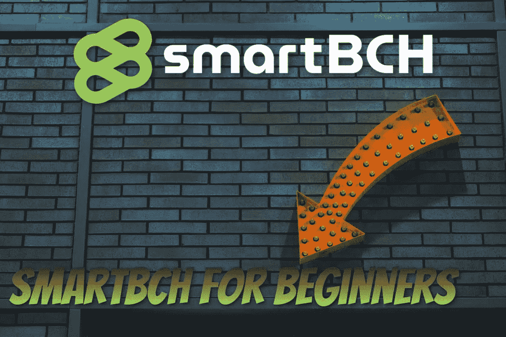
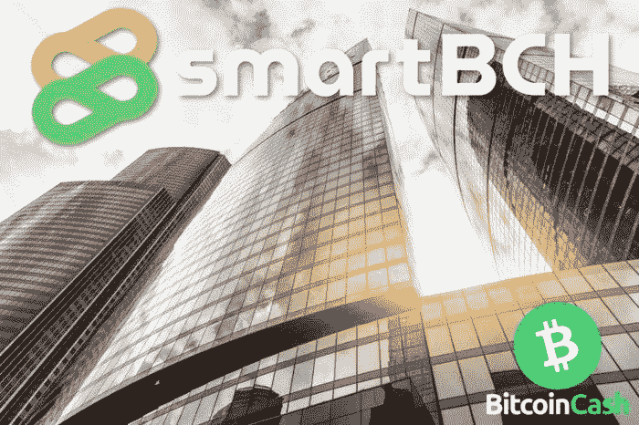
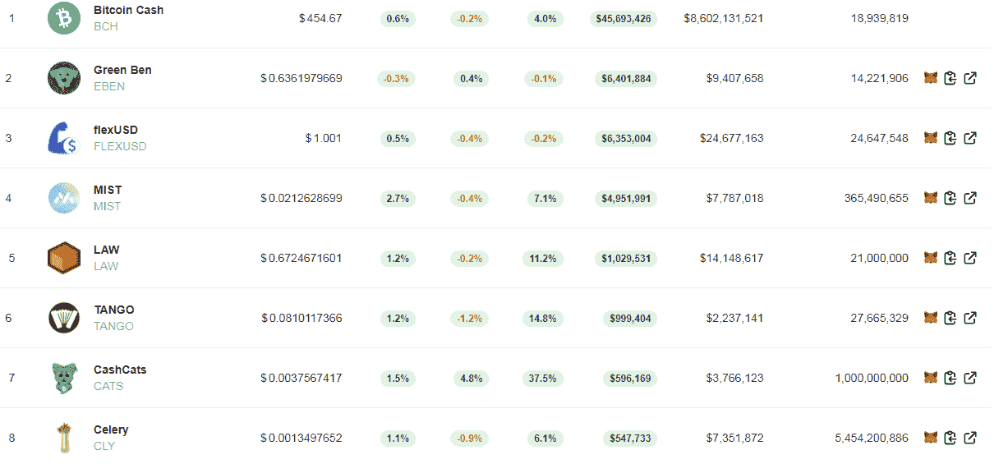
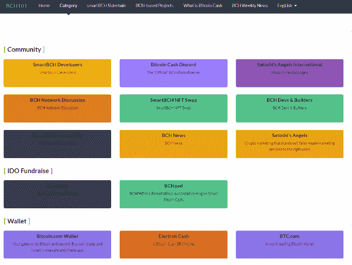

# SmartBCH For 初学者:从这里开始！

> 原文：<https://medium.com/coinmonks/smartbch-for-beginners-start-here-e5bcea0ec453?source=collection_archive---------2----------------------->

*Lead Image:* [*Unsplash*](https://unsplash.com/photos/J59wWPn09BE)

自 smartBCH 网络推出以来，我们见证了令人难以置信的智能合约开发热潮，每天都有新的 DeFi DEXs、NFT、Dapps 和各种令牌涌现。

直到最近，初学者可能发现很难与 Web3 基础设施交互，尤其是以太坊网络中的困难。

今天，SmartBCH 提供了一个至关重要的选择，增强了经济高效的应用程序的精髓，并允许世界上的每个人都可以体验。

这个领域的初学者最终能够互动并理解 Web3 背后的核心原则，以及区块链开发者如何构建今天互联网和金融的未来。

Metamask 作为几乎所有智能合约网络的一个组成部分，已经成为标准的 Web3 钱包，它与 Web3 应用程序互连，用于货币化和识别目的。

最近，出现了许多关于元宇宙的讨论，然而主流媒体和金融利益集团正在压制这样一个事实，即去中心化的应用程序、Web3 和 NFTs 将发挥关键作用。

此外，DeFi 和各种智能合约的应用目前正在金融行业中接受测试，但其在当前基础设施中的应用令许多人感到困惑，因为这项从比特币诞生的核心原则中衍生出来的革命性技术仍然与传统金融系统不兼容。

# 为什么选择 SmartBCH？

[***Source***](https://unsplash.com/photos/-xtsxuWBpqg)

任何人都应该使用 smartBCH 的原因是什么，而不仅仅是密码初学者？

简单来说:

*   smartBCH 提供以太坊所没有的东西，但是以一种**经济高效的方式**
*   智能合同、web3 应用、Dapps、DeFi、NFTs、令牌化、开发人员工具
*   未来与其他 EVM 链(以太坊、币安智能链、多边形等)的互操作性。)

smartBCH 的每笔交易费用只有几分钱，是使用 EVM sidechain 最便宜的。例如，在以太坊中，每笔交易将花费 15-200 美元，因为费用正在飙升，尤其是当网络经历高流量时。SmartBCH 费用将保持在较低水平，而且有计划随着流量的增加进一步降低费用。

smartBCH 生态系统中出现了巨大的机会，可以提供最大的利润。

对于加密的新手来说，smartBCH 提供了以太坊的经济高效的替代方案。它甚至可以成为 DeFi 的一个测试阶段，体验一切是如何工作的，而不会在这个过程中牺牲数千美元。

那些想参与 NFTs、DeFi、Dapps、区块链游戏等的人。但是发现很多困难就会发现 smartBCH 是最好的切入点。

以太币费用和许多其他智能合同网络的用户基数低不利于他们有限的成功。

机会就在那里，smartBCH 的当前投资者已经享受到了与 DeFi 和 NFTs 的有利可图的努力。当然有危险，但也有很多很多有前途的项目。

# 如何通过 3 个步骤变得聪明！

*   **第一步:设置元掩码**

设置 Metamask 需要时间，有一定的学习曲线。通常，设置元掩码并理解如何使用它需要几个小时。

已经有很多指南了，但是我们应该尽量使它们简单。

Metamask 是 Web3 的入口。

这项服务是对我们浏览器的扩展(支持 Chrome、Firefox、Brave、Edge)，这是一个插件，也可以让我们访问我们称为 EVM 兼容的网络。

除了以太坊，我们还可以连接到 BSC、Polygon 和我们最喜欢的 smartBCH。

下面是一些关于如何安装元掩码的指南:

*   [设置元掩码并添加网络](https://read.cash/@Pantera/how-to-set-up-metamask-and-add-networks-binance-bsc-polygon-matic-okex-smartbch-tutorial-7265e1c4)(推荐新手使用)
*   [SmartBCH Metamask 教程](https://read.cash/@Pantera/smartbch-metamask-tutorial-connect-to-network-transfer-bch-add-tokens-5ac3e8d1)

迄今为止我发现的最好的一个是海登·奥托的:

*   **第二步:用 BCH 为你的钱包存钱**

smartBCH 需要 BCH，因为该网络使用令牌化形式的比特币现金。这种 BCH 被用作气体。天然气是每笔交易所需的费用，这些费用支付给这些网络的验证者。

smartBCH 网络仍处于起步阶段，尚未完全分散。在 2022 年，smartBCH 网络的计划是转向分散模式，同时增加一个升级(SHAgate ),允许将 smartBCH 连接到以太坊。

对于初学者来说，这可能并不重要，但是对于开发人员和更有经验的用户来说却很重要。

需要一个转移资金的桥梁。

【编辑 2022 年 8 月 16 日】:以下信息已过时。由于 Coinflex-SmartBCH 桥最近发生的事件，CoinFLEX 冻结账户和提款以及其余两种方法也暂停了。

目前，有三种桥可用:

*   [**Coinflex**](https://coinflex.com/)
*   [**prompt.cash**](https://prompt.cash/bridge)
*   [**hop.cash**](https://hop.cash/)

在此链接中，用户可以找到如何使用 Coinflex 将 BCH 转换为 smartBCH: [*SmartBCH 元掩码教程*](https://read.cash/@Pantera/smartbch-metamask-tutorial-connect-to-network-transfer-bch-add-tokens-5ac3e8d1)

此外，我以前写过一个关于 Prompt.cash 和 hop.cash bridges 的教程，在这个链接中: [*用 Wagon 轻松地将你的 BCH 转移到 SmartBCH。现金&提示。现金*](https://read.cash/@Pantera/transfer-your-bch-to-smartbch-easily-with-wagoncash-promptcash-936f88a7) (Wagon.cash 现在重定向到 hop.cash)。

小心桥接，因为处理一个事务有一个最小值。如果用户发送的少于最小值，那么服务将等待一个新的交易添加到总数中并继续。

*   **第三步:探索 smartBCH**

在向 smartBCH 钱包注入任意数量的 BCH 后，用户现在可以开始他们的 smartBCH 冒险了。

最好的网站是 [**MarketCap，不需要处理 smartBCH 的技术细节。现金**](https://www.marketcap.cash/) **。**

Marketcap.cash 是一个 smartBCH 指数，列出了目前在 smartBCH 上活跃的六个指数中可用于交易的所有流行代币。

Marketcap.cash 也是查找 smartBCH 上运行的不同代币信息的中心，因为它为每个不同的代币设置了一个主页，提供了更多的价格信息以及网站和社交媒体的链接。

目前，smartBCH 拥有 6 种 dex，提供各种 DeFi 选项(产量耕作、打桩等)。):

*   [**Benswap**](https://benswap.cash/)
*   [**误交换**](https://app.mistswap.fi/swap)
*   [**TangoSwap**](https://tangoswap.cash/swap)
*   [**1BCH**](https://1bch.com/)
*   [**MuesliSwap**](https://bch.muesliswap.com/)
*   [**热带。财务**](https://tropical.finance/)

任何想要了解 smartBCH 背后的技术的人都应该访问 smartBCH [官方网站](https://smartbch.org/)，或者在[官方 smartBCH 社区电报](https://t.me/smartbch_community)中与 smartBCH 和比特币现金开发者直接讨论。

从跟随一些电报频道开始，并且用书签标记一些将被需要的页面。

*Source:* [***BCH101***](https://bch101.com/friends)

包含大量 smartBCH 信息的一些网站有:

*   [**BCH101**](https://bch101.com/home)
*   
*   **[help me . cash](https://helpme.cash/)**

**SmartBCH 作为比特币现金的侧链，在各种比特币现金相关的网站和社区中广受欢迎。新闻可以在 Reddit (r/btc 和 r/bitcoincash)，read.cash & noise.cash 中找到。**

****

# **结论**

**对于想要探索智能合约、DeFi、NFTs 或这种令人难以置信的自动化技术所提供的任何应用的初学者来说，smartBCH 是最佳的切入点。**

**它在一个分散的环境中提供了低成本的交易，有一个快速增长的强大社区。机会是有的，但正如加密中的其他事物一样，也有危险。我们研究得越多，我们成功投资的机会就越大，风险就越小。**

**数字(数量、TVL、用户群)正在增长，而 smartBCH 只是在大约 9 月份第一个 DEX 和 tokens 出现后才开始。第一阶段是成功的，这个网络已经被大量的用户所接受。**

**下一步是将 smartBCH 设置为一个已建立的 EVM 链，届时大量资金将开始流入生态系统。**

****

****访问我在 BCH101.com 上的最新 smartBCH 相关文章:****

> **[*10 万 BCH 锁定 smart BCH——无与伦比的增长&网络效应*](https://bch101.com/blog/68)**
> 
> **[*用这五个唯一指标输入 smartBCH DeFi 字段*](https://bch101.com/blog/72)**
> 
> **[*【smart BCH NFTs 完全指南(2021 年 12 月)*](https://bch101.com/blog/75)**
> 
> **[*GoCrypto GOC 令牌现已在 SmartBCH 上可用*](https://bch101.com/blog/80)**

****另外，我最近在 read.cash 上的 smartBCH 文章:****

> **[*通过投资比特币现金投资 smart BCH*](https://read.cash/@Pantera/invest-in-smartbch-by-investing-in-bitcoin-cash-61be7dfc)**
> 
> **[*smart BCH DEX mis swap 分析服务*](https://read.cash/@Pantera/smartbch-dex-mistswap-analytics-service-ef0efde9)**

**如果你喜欢这篇文章，别忘了订阅并点赞！**

> **免责声明:本内容中发布的所有材料均用于娱乐和教育目的，并符合合理使用的准则。无意侵犯版权。如果您是或代表本文所用材料的版权所有者，并且对所述材料的使用有疑问，请发送[电子邮件](https://read.cash/@Pantera/cryptouknowns-battlegrounds-the-crypto-battle-royal-part-i-0ca762da#bad-link)。**

***原载于*[*https://read . cash*](https://read.cash/@Pantera/smartbch-for-beginners-start-here-9f7ec63e)*。***

****

> **加入 Coinmonks [电报频道](https://t.me/coincodecap)和 [Youtube 频道](https://www.youtube.com/c/coinmonks/videos)了解加密交易和投资**

## **也阅读**

** [## 杠杆代币[多头代币]终极指南

### 杠杆化令牌是具有杠杆化风险敞口的 ERC20 令牌，不考虑保证金、要求、管理…

medium.com](/coinmonks/leveraged-token-3f5257808b22)  [## 最佳加密交易所| 2021 年十大加密货币交易所

### 编辑描述

blog.coincodecap.com](https://blog.coincodecap.com/crypto-exchange)  [## 2021 年最佳加密交换平台| CoinCodeCap

### 编辑描述

blog.coincodecap.com](https://blog.coincodecap.com/best-swap-platforms)  [## 2021 年最佳加密借贷平台| 6 大比特币借贷平台

### 获得比特币和其他加密货币的最佳贷款利率

medium.com](/coinmonks/top-5-crypto-lending-platforms-in-2020-that-you-need-to-know-a1b675cec3fa)  [## 2021 年 6 大最佳硬件钱包|顶级加密硬件钱包[更新]

### 最好的加密货币硬件钱包是绝对必要的。我们将在 NGRAVE、Ledger Nano X 和…

medium.com](/coinmonks/the-best-cryptocurrency-hardware-wallets-of-2020-e28b1c124069)  [## 2021 年最佳免费加密交易机器人

### 2021 年币安、比特币基地、库币和其他密码交易所的最佳密码交易机器人。四进制，位间隙…

medium.com](/coinmonks/crypto-trading-bot-c2ffce8acb2a)  [## 最佳 4 个加密交易信号电报通道

### 这是乏味的找到正确的加密交易信号提供商。因此，在本文中，我们将讨论最好的…

medium.com](/coinmonks/best-crypto-signals-telegram-5785cdbc4b2b)  [## 获取信号、交易机器人和套利

### 编辑描述

blog.coincodecap.com](https://blog.coincodecap.com/bitsgap-review)**