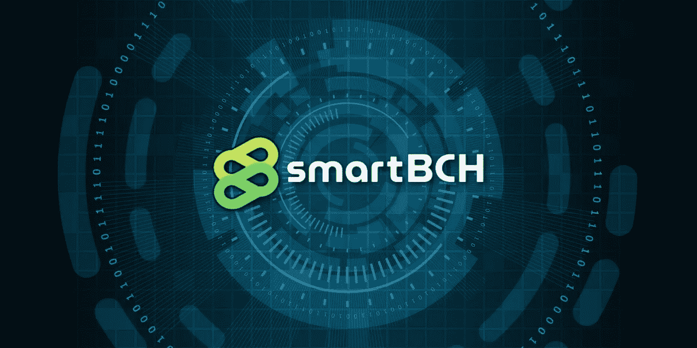

# SmartBCH 元掩码教程:连接、转移 BCH、添加令牌和在 dex 上交易

> 原文：<https://medium.com/coinmonks/smartbch-metamask-tutorial-connect-to-network-transfer-bch-add-tokens-and-trade-on-dexs-243b49168142?source=collection_archive---------6----------------------->

*Image from:* [*Pixabay*](https://pixabay.com/illustrations/cyber-network-technology-futuristic-3400789/) *(modified)*

SmartBCH 是一个运行在比特币现金之上的侧链。与 EVM (Ethereum 虚拟机)兼容，它为比特币现金生态系统创造了一个全新的机遇世界。

它支持智能合同，并为以下方面创建安全环境:

*   创建运行在 SmartBCH 上的令牌