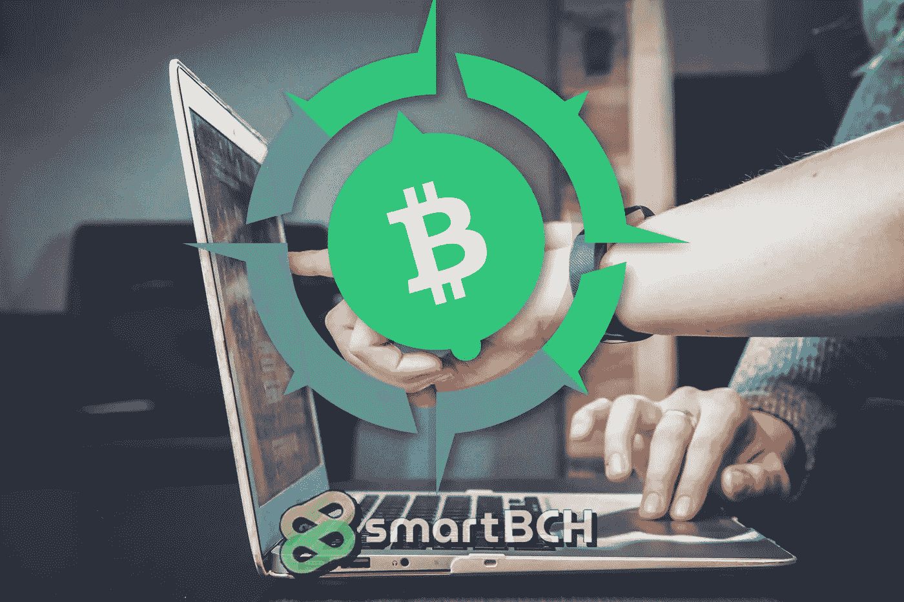

# SmartBCH:现在和未来——BCH 网络讨论

> 原文：<https://medium.com/coinmonks/smartbch-the-present-and-the-future-bch-network-discussions-277c3efe9863?source=collection_archive---------8----------------------->

*Image from:* [*Unsplash*](https://unsplash.com/photos/FlPc9_VocJ4)*, by* [*John Schnobrich*](https://unsplash.com/@johnschno) *(modified)*

比特币现金网络讨论经常是与重要的比特币现金发展相关的直播讨论。

比特币现金生态系统中几个月来的热门话题是比特币现金上的侧链 SmartBCH，它开启了智能合约领域。

SmartBCH 支持在强大的比特币现金网络上创建 DeFi、Dapps 和 NFT，在安全和分散的环境中提供效率。

如 Defi 所展示的智能合同，通过自动化程序和先进的机制，产生了高效的分散式金融网络。快速贷款、高收益和增加流动性的便利甚至在银行业内部也引起了人们的兴趣。

SmartBCH 现在可以在比特币现金侧链中使用智能合约，“最大限度地提高 EVM 和 Web3 的吞吐量”。

# 关于 SmartBCH 主题的重要讨论

比特币现金网络讨论网站包含了关于这种直播的所有信息。

## 主机:

John Moriarty 将作为本次对话的主持人，邀请该领域中一些在 SmartBCH 网络中工作和发展的知名人士作为嘉宾。

[*Source*](https://bitcoincashnetworkdiscussions.org/)

[@CheapLightning](https://read.cash/@CheapLightning) ( *噪音。cash:*[***cheap lightning***](https://noise.cash/u/CheapLightning))也将主持聊天并帮助办理手续。

[*Source*](https://twitter.com/CheapLightning)

## 来宾:

> ***王奎*** *，首席开发者 smartBCH*
> 
> ***乔希·埃利索普(***[***zquestz***](https://noise.cash/u/zquestz)***)****、参谋软件工程师比特币基地、智能屏蔽*
> 
> ***费尔南多·佩利乔尼(*** [***费尔南多***](https://noise.cash/u/Fernando)***)****、克努特、比特币现金节点、Kth 代币*
> 
> ***伊恩布拉斯*** *、BCH 阿根廷、ARG Token*
> 
> ***王灏儿*** *，球体的创造者，宝珠令牌*
> 
> ***马克·兰姆*** *，首席执行官 CoinFLEX，FLEX Tokens*

[*-来源*](https://bitcoincashnetworkdiscussions.org/#tab-1-content)

这些都是比特币现金社区中的顶级人物，他们今天都与 SmartBCH 有关。所有这些积极推广比特币现金和建设金融网络未来的社区成员之间的讨论肯定会很有趣。

点击这里关注 YouTube 上的比特币现金网络讨论，并按下通知按钮，因为现场讨论将于 10 月 1 日(三天后)举行。

比特币现金网络讨论将在 YouTube 链接上直播会议。像往常一样，比特币现金网络讨论直播提供问答，观众的问题将被导向嘉宾，以获得精心的回应。

我认为，通过这次讨论，我们将对当前和未来的发展有更好的了解，因为 SmartBCH 仍处于非常年轻的阶段，许多人都在观望。

# 最后

[https://smartbch.org/](https://smartbch.org/)

我经常讨论 SmartBCH 主题，因为我发现它是一种潜在的破坏性技术，可以吸引其他网络的开发者和投资者。

上一主题: [***SmartBCH:这是关于什么的，我们为什么要关心？***](https://read.cash/@Pantera/smartbch-what-is-this-about-and-why-we-should-care-5688867f)

我还为初学者发布了两个教程来设置 Metamask 并连接到 SmartBCH 网络:

*   [***SmartBCH Metamask 教程—连接网络、转移 BCH、添加代币和代币交易***](https://read.cash/@Pantera/smartbch-metamask-tutorial-connect-to-network-transfer-bch-add-tokens-and-trade-on-dexs-601f4b17)
*   [***如何设置元遮罩并添加网络:币安(BSC)、多边形(Matic)、OKEx、SmartBCH —教程***](https://read.cash/@Pantera/how-to-set-up-metamask-and-add-networks-binance-bsc-polygon-matic-okex-smartbch-tutorial-7265e1c4)

像 SmartBCH 这样的新发展鼓舞了人们的信心，并得到了更广泛的加密货币社区的认真考虑。SmartBCH 可能成为人们对比特币现金兴趣大幅增加的原因，因为它最近才开始受到关注。

SmartBCH 正在将智能合约引入比特币现金，而无需使用本地令牌。相反，它使用 BCH 的令牌化版本，因此如果投资者发现 SmartBCH 有趣且有潜力，他们应该投资比特币现金。

关注**比特币现金网** **讨论:**

*   [**网站**](https://bitcoincashnetworkdiscussions.org/)
*   [**YouTube**](https://www.youtube.com/channel/UCmyoHmbSsChInLzZ9S5aAAw)

记得在**10 月 1 日**收听 SmartBCH 讨论！

**跟我上:***●*[***read cash***](https://read.cash/@Pantera)*●*[***noise cash***](https://noise.cash/u/Pantera99)*●*[***Medium***](/@panterabch)*●*[***蜂巢***](https://hive.blog/@pantera1) ***●*[***Twitter***](https://twitter.com/Panterabch)*●*[***LinkedIn***](https://www.linkedin.com/in/panterabch/)**●*[***red***](https://www.reddit.com/user/PanteraBCH)***

****如果你喜欢这篇文章，别忘了订阅并点赞！****

**原载于*[*https://read . cash*](https://read.cash/@Pantera/smartbch-the-present-and-the-future-bch-network-discussions-785d4ae0)*。**

> *加入 Coinmonks [电报频道](https://t.me/coincodecap)和 [Youtube 频道](https://www.youtube.com/c/coinmonks/videos)了解加密交易和投资*

## *也阅读*

*   *[AscendEx Staking](https://blog.coincodecap.com/ascendex-staking)|[Bot Ocean Review](https://blog.coincodecap.com/bot-ocean-review)|[最佳比特币钱包](https://blog.coincodecap.com/bitcoin-wallets-india)*
*   *[霍比评论](https://blog.coincodecap.com/huobi-review) | [OKEx 保证金交易](https://blog.coincodecap.com/okex-margin-trading) | [期货交易](https://blog.coincodecap.com/futures-trading)*
*   *[比特币基地跑马圈地](https://blog.coincodecap.com/coinbase-staking) | [Hotbit 评论](/coinmonks/hotbit-review-cd5bec41dafb) | [KuCoin 评论](https://blog.coincodecap.com/kucoin-review)*
*   *[最佳加密交易信号电报](/coinmonks/best-crypto-signals-telegram-5785cdbc4b2b) | [MoonXBT 评论](/coinmonks/moonxbt-review-6e4ab26d037)*
*   *[Coinswitch 俱吠罗评论](/coinmonks/coinswitch-kuber-review-1a8dc5c7a739) | [电网交易机器人](https://blog.coincodecap.com/grid-trading) | [比特币基地收费](/coinmonks/coinbase-fees-831e77d4f2c5)*
*   *[Bitget 评论](https://blog.coincodecap.com/bitget-review) | [双子星 vs BlockFi](https://blog.coincodecap.com/gemini-vs-blockfi) | [OKEx 期货交易](https://blog.coincodecap.com/okex-futures-trading)*
*   *[OKEx vs KuCoin](https://blog.coincodecap.com/okex-kucoin) | [摄氏替代度](https://blog.coincodecap.com/celsius-alternatives) | [如何购买 VeChain](https://blog.coincodecap.com/buy-vechain)*
*   *[币安期货交易](https://blog.coincodecap.com/binance-futures-trading)|[3 commas vs Mudrex vs eToro](https://blog.coincodecap.com/mudrex-3commas-etoro)*
*   *[在印度利用加密套利赚取被动收入](https://blog.coincodecap.com/crypto-arbitrage-in-india)*
*   *[德国最佳加密交易所](https://blog.coincodecap.com/crypto-exchanges-in-germany) | [WazirX P2P](https://blog.coincodecap.com/wazirx-p2p)*
*   *[如何购买 Monero](https://blog.coincodecap.com/buy-monero) | [IDEX 评论](https://blog.coincodecap.com/idex-review) | [BitKan 交易机器人](https://blog.coincodecap.com/bitkan-trading-bot)*
*   *[币安 vs 比特邮票](https://blog.coincodecap.com/binance-vs-bitstamp) | [比特熊猫 vs 比特币基地 vs Coinsbit](https://blog.coincodecap.com/bitpanda-coinbase-coinsbit)*
*   *[如何购买 Ripple (XRP)](https://blog.coincodecap.com/buy-ripple-india) | [非洲最好的加密交易所](https://blog.coincodecap.com/crypto-exchange-africa)*
*   *[非洲最佳加密交易所](https://blog.coincodecap.com/crypto-exchange-africa) | [胡交易所评论](https://blog.coincodecap.com/hoo-exchange-review)*