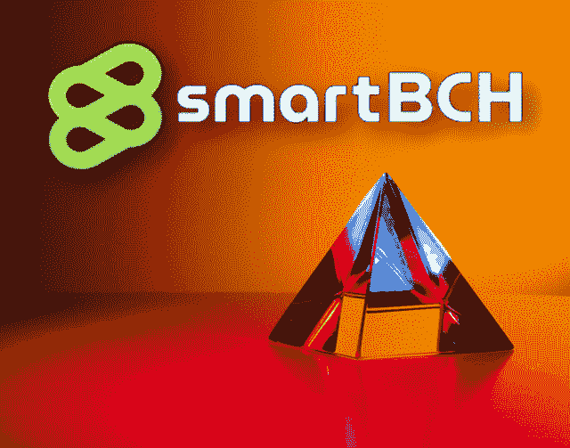
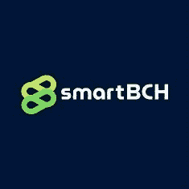
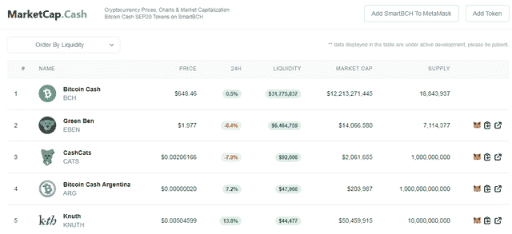

# SmartBCH:这是关于什么的，为什么我们应该关注？

> 原文：<https://medium.com/coinmonks/smartbch-what-is-this-about-and-why-we-should-care-leofinance-ff3ae20a1ccc?source=collection_archive---------12----------------------->

[Source](https://unsplash.com/photos/ir5gC4hlqT0) (modified)

SmartBCH 是一个比特币现金侧链，支持令牌化、DeFi 和 NFTs，同时也兼容 Web 3.0 Dapps，如 Metamask。

以太坊，随着 DeFi 和 NFTs 的崛起，已经成长为一个市值 4000 亿美元的庞大网络。

在整个 2020 年和 2021 年，比特币现金用户群不断扩大，甚至一度超过了 BTC 的日交易量。不过，作为一项资产，它的表现不如预期。是 DeFi 让许多项目的排名上升。

SmartBCH 是一个 BCH 侧链，运行在比特币现金之上，开启了一个全新的机会世界。凭借 EMV 兼容性和以太坊区块链互操作性，它在两个网络之间建立了一座桥梁，以进行交互和交换价值。

# 为什么选择 SmartBCH？

既然比特币现金区块链已经提供了 0-conf 交易的高速度和非常低的费用(不到 0.01 美元)，为什么还需要侧链呢？

SmartBCH 的目的不是提供扩展解决方案和降低费用。比特币现金从一开始就已经在完美地扩展。使用比特币现金，交易是即时的，几乎没有感觉。

> 在比特币现金的侧链上最大化 EVM 和 Web3 的吞吐量

SmartBCH 正在填补智能合约、令牌化和 DeFi 的空白，这是比特币现金所缺少的。以前有一些发展，SLP 令牌化(另一个 BCH 第二层)，但 DeFi 发展是不可能的。虽然一些项目开发了 DeFi 平台，但这些平台都是编号的，并且没有后台基础设施来支持它们。

此外，SmartBCH 为当前以太坊 DeFi 项目提供了一个解决方案，这些项目在区块链联邦理工学院拥挤时遭受不合理的高额费用。SmartBCH 利用比特币现金区块链的极低费用，可以支持以太坊项目，这些项目由于高昂的以太网气费而损失流量。

通过 EVM 互操作性，SmartBCH 提供了一个使用 Solidity 语言的标记化过程。在 SmartBCH 网络中创建的令牌遵循 SEP20 协议，并且在 NFTs 的协议标准方面有所发展，我们将很快了解更多信息。

SmartBCH 也燃烧比特币现金收费，因为它产生的费用有一半被转移到一个燃烧地址。到目前为止，8.88 BCH 已经被刻录后自动发送到 SmartBCH 刻录地址。

已经有代币被创造出来了，但是目前大多数代币的用途有限。尽管如此，一些是社区驱动的令牌，并有增长的潜力。目前，只有一家 DEX active 同时提供 DeFi yield 农业和贸易。这是“Benswap.cash”。与所有 DeFi 平台一样，特别是在早期阶段，投资者需要进行尽职调查和研究。

# 最后

[MarketCap.Cash](https://www.marketcap.cash/)

最初的积极迹象已经出现。比特币现金社区已经接受了 SmartBCH，并对生态系统的这一改进抱有很高的期望。

总而言之，SmartBCH 为比特币现金生态系统打开了 DeFi 的大门。它不仅仅是某种类似于 DeFi on Tron 的营销方案。这是一个完整的解决方案，不仅为 SmartBCH 本地项目创造了一个完美的环境，而且由于费用极低，还可以吸引以太坊的既定 DeFi 的注意。

实际上，对于用户来说，这意味着一个坚实的环境已经准备好，等待分散的金融发展，第一批到达的将得到社区的最大关注。

我们还可以期待 SmartBCH 增加当前的比特币现金用户群，已经有成千上万的加密货币爱好者涌向 SmartBCH 令牌社区。虽然这仅仅是因为一些项目的大量空投，但它仍然以类似以太坊网络的 ICO 时代的方式提升了网络效应。

最后，最后一个细节:SmartBCH 不会创建原生硬币/代币。它的作用是支持和扩大强大的比特币现金区块链的可能性，它不会像其他人一样成为运行其令牌的侧链。如果有人想投资 SmartBCH，投资应该是比特币现金。

**smart BCH 上的推荐指南:**

*   [如何设置 Metamask 和添加网络:币安(BSC)，多边形(Matic)，OKEx，SmartBCH —教程](/coinmonks/how-to-set-up-metamask-and-add-networks-bsc-matic-smartbch-476d5d023191)
*   [SmartBCH Metamask 教程——连接网络，转移 BCH，添加代币，进行代币交易](/coinmonks/smartbch-metamask-tutorial-connect-to-network-transfer-bch-add-tokens-and-trade-on-dexs-243b49168142)

有关 SmartBCH 的更多信息，请访问:

*   [网站](https://smartbch.org/)
*   [推特](https://ecency.com/hive-167922/@pantera1/smartbch-what-is-this-about-and-why-we-should-care)
*   [白皮书](https://smartbch.github.io/whitepaper/SmartBCH_Whitepaper-en.pdf)
*   [阅读。现金](https://read.cash/@SmartBCH)
*   [电报](https://t.me/smartbch_community)(设备激活)

**找我:**

*●*[*read cash*](https://read.cash/@Pantera)*●*[*noise cash*](https://noise.cash/u/Pantera99)*●*[*Medium*](/@panterabch)*●*[*Hive*](https://hive.blog/@pantera1)*●*[*steem it**●*](https://steemit.com/@pantera1)[*声乐*](https://vocal.media/authors/pantera)

***如果你喜欢的内容，不要忘记订阅和点赞！***

*原载于 2021 年 9 月 12 日*[*https://Leo finance . io*](https://leofinance.io/@pantera1/smartbch-what-is-this-about-and-why-we-should-care)*。*

> 加入 Coinmonks [电报频道](https://t.me/coincodecap)和 [Youtube 频道](https://www.youtube.com/channel/UCbyDhTbOiKh2iUMKBi4-4Zg)了解加密交易和投资

## 也阅读

*   [非洲最佳加密交易所](https://blog.coincodecap.com/crypto-exchange-africa) | [Hoo 交易所评论](https://blog.coincodecap.com/hoo-exchange-review)
*   [eToro vs robin hood](https://blog.coincodecap.com/etoro-robinhood)|[MoonXBT vs Bybit vs Bityard](https://blog.coincodecap.com/bybit-bityard-moonxbt)
*   [Stormgain 回顾](https://blog.coincodecap.com/stormgain-review) | [Bexplus 回顾](https://blog.coincodecap.com/bexplus-review) | [币安 vs Bittrex](https://blog.coincodecap.com/binance-vs-bittrex)
*   [Bookmap 评论](https://blog.coincodecap.com/bookmap-review-2021-best-trading-software) | [美国 5 大最佳加密交易所](https://blog.coincodecap.com/crypto-exchange-usa)
*   [如何在 FTX 交易所交易期货](https://blog.coincodecap.com/ftx-futures-trading) | [OKEx vs 币安](https://blog.coincodecap.com/okex-vs-binance)
*   [如何在势不可挡的域名上购买域名？](https://blog.coincodecap.com/buy-domain-on-unstoppable-domains)
*   [印度的秘密税](https://blog.coincodecap.com/crypto-tax-india) | [altFINS 审查](https://blog.coincodecap.com/altfins-review) | [Prokey 审查](/coinmonks/prokey-review-26611173c13c)
*   [布洛克菲 vs 比特币基地](https://blog.coincodecap.com/blockfi-vs-coinbase) | [比特坎评论](https://blog.coincodecap.com/bitkan-review) | [币安评论](/coinmonks/binance-review-ee10d3bf3b6e)
*   [Coldcard 评论](https://blog.coincodecap.com/coldcard-review) | [BOXtradEX 评论](https://blog.coincodecap.com/boxtradex-review)|[unis WAP 指南](https://blog.coincodecap.com/uniswap)
*   [阿联酋 5 大最佳加密交易所](https://blog.coincodecap.com/best-crypto-exchanges-in-uae) | [SimpleSwap 评论](https://blog.coincodecap.com/simpleswap-review)
*   [7 种购买 Dogecoin 的最佳方式](https://blog.coincodecap.com/ways-to-buy-dogecoin) | [ZebPay 评论](https://blog.coincodecap.com/zebpay-review)|[matrix export 评论](https://blog.coincodecap.com/matrixport-review)
*   [最佳期货交易信号](https://blog.coincodecap.com/futures-trading-signals) | [流动性交易所评论](https://blog.coincodecap.com/liquid-exchange-review)