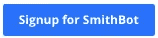
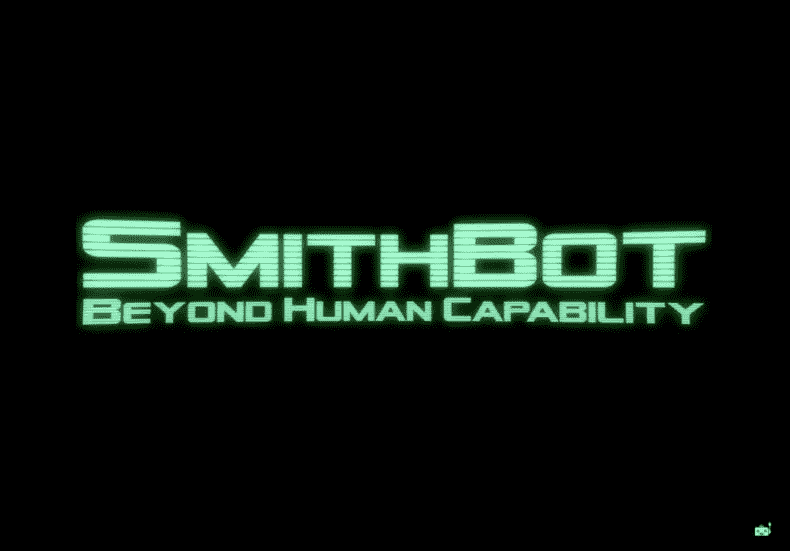
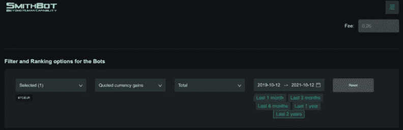
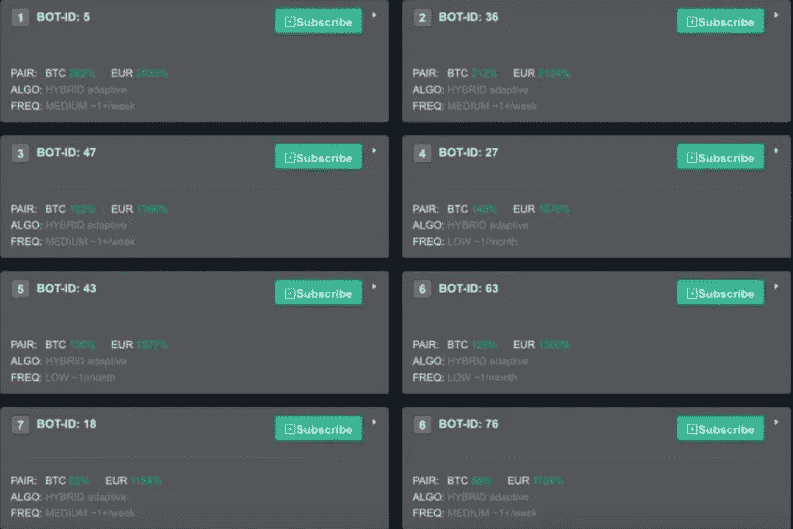
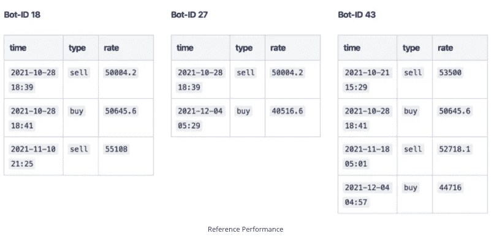
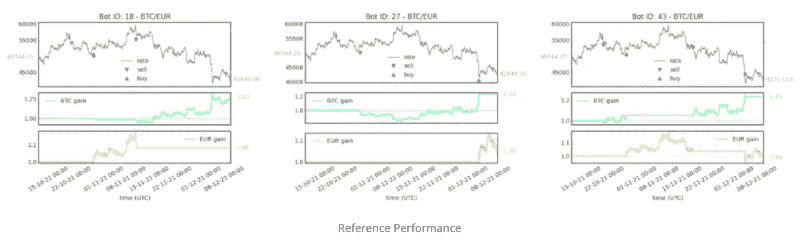
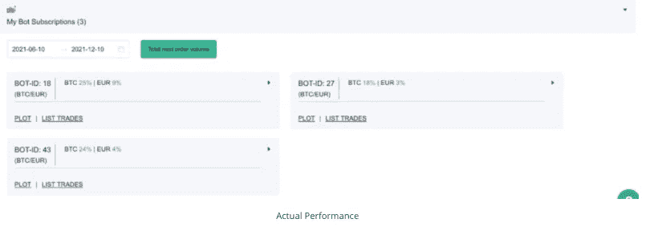
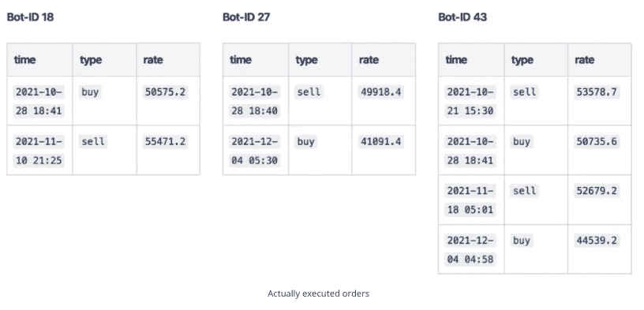
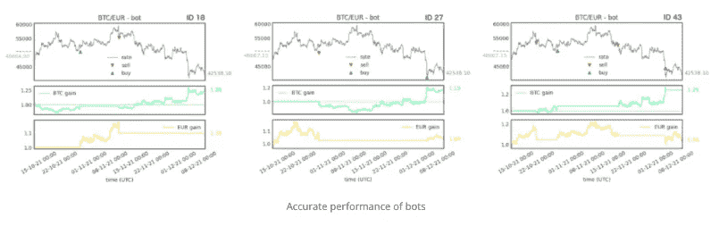

# 史密斯机器人人工智能加密交易机器人-现场交易测试

> 原文：<https://medium.com/coinmonks/smithbot-ai-crypto-trading-bots-8bed457a2d8d?source=collection_archive---------7----------------------->

[加密货币交易机器人](/coinmonks/crypto-trading-bot-c2ffce8acb2a)便于在加密货币交易所实现自动化交易。他们严格执行预先设定的策略，不会被情绪所误导。大多数 bot 提供者要求用户选择一个策略并反复调整参数。这些都是基于使用大数据和人工智能(AI)的定量分析。在本文中，我们用 SmithBot AI 加密交易机器人进行了一次现场交易测试。

# 摘要

*   SmithBot 是一个易于使用、记录良好的加密交易机器人。
*   客户支持很有帮助。
*   尽管加密市场下跌了 14.5%，但在 2 个月的测试中，利润为 8%。
*   应用程序中为每个机器人提供的参考性能与实际性能非常接近。
*   他们吸引人的历史业绩声明是可信的。

***也，读*** [***SmithBot 评论:赚 UPTO 104%***](https://smithbot.com?utm_source=636f696e6d6f6e6b73&utm_medium=social&utm_campaign=20211204_636f)

# 注册和设置

我按照[在线 SmithBot 用户指南](https://smithbot.atlassian.net/wiki/external/127598736/NGI4ZWE0OTFkOTdlNGQyOTk0OGMwM2YyMTBhOTRkZDY)来设置服务。第一步是[注册](https://blog.coincodecap.com/go/smithbot)使用他们的服务，首先是创建一个免费的模拟账户。因为我想用真钱测试交易，所以我选择了基本订阅。当选择更长的订阅期时，他们会提供折扣，所以我最终以 134.95 美元的价格扩大了 6 个月的订阅。

它只接受 BTC、瑞士联邦理工学院、瑞士电信公司和 BCH 的加密支付。但是，使用此服务需要加密交换帐户。所以下一步是连接您的加密交换帐户。我将使用我的北海巨妖账户。现在，下一步是为北海巨妖创建一个 API 密钥。之后，将您的 exchange 添加到 dashboard 选项卡。其他支持的交易所有****[**Bitstamp**](https://blog.coincodecap.com/bitstamp-review)**和**[**Bitfinex**](https://blog.coincodecap.com/bitfinex-review)**。**********

*******API 密匙注意:为了保证资金安全，不要授予提款权限，因为交易机器人只需检查我们的余额并下单。*******

********

# ****选择机器人****

******“机器人名人堂”**选项卡是检查和选择交易机器人的地方。SmithBot 的用户指南建议用不同的组合进行交易。这个理由是为了分散风险。但在这次测试中，我只选择了一对，即以欧元报价的 BTC。我设置了北海巨妖申请的收取费用，并根据过去两年的表现对机器人进行了排名。****

********

****以下部分显示了所有 BTC/欧元机器人的列表，按过去两年以欧元计价的利润排序。我对普通机器人的性能更感兴趣，所以我选择了 id 为 18、27 和 43 的机器人。****

********

****当点击 subscribe 按钮时，会出现一个对话框，指定我的交易所并输入初始交易量、最大交易量和最小交易量。我选择给每个机器人分配 100 欧元的初始容量。事实上，我在 BTC 的外汇账户余额是 200 欧元。这三个交易机器人都在 2021 年 10 月 13 日开始交易，大约两个月后我检查了它们的结果。****

********

# ****参考性能****

****SmithBot 应用程序通过将市场平均参考利率和真实世界影响的统计数据应用于模拟的交易信号执行，来计算**“Bot 名人堂”**选项卡中的数据。虽然它可能与你在现实中得到的不同，但结果至少应该非常接近。下表显示了这三个机器人在两个月的测试期间生成的每个交易信号的详细信息。****

********

****ID 为 18、27 和 43 的机器人的性能图显示，以欧元计价的利润分别为 8%、5%和-1%。也就是说，BTC 的市场价格下跌了近 15%。所有的机器人都在价格稳定的地方出售。相应的以 BTC 计价的利润告诉你你的比特币余额增加了多少，分别是 27%、23%和 23%。****

********

# ****实际经济指标****

****现在，让我们看看机器人在过去两个月里用我的 200 欧元创造的实际利润。SmithBot 应用程序中的仪表盘显示了性能。****

********

****仔细观察在我的交易所执行的订单，会发现它们与上一节中显示的参考信号非常相似。事实上，订单在参考交易信号发出后不到一分钟内执行，在大多数情况下不到 20 秒。订单的实际灌装价格通常与参考价格相差不到 0.1%。但在极少数情况下，当在价格波动非常快的时期下单时，它会达到 0.7%。****

****有时价格更高，有时比参考价格低。参考汇率和准确汇率之间的差异主要是由于交易所之间的滑点和价格差异。根据支持，订单模型在统计上平均考虑这些影响，但个别订单有时会稍微偏离这一平均值。****

********

****bot #18 的第一个参考交易信号没有执行。这样做的原因是，这是一个卖出信号，当时，在另外两个机器人执行卖出指令后，交易所中没有足够的 BTC 余额。因此，机器人跳过了这个交易信号，这是在这种情况下的正确反应，根据史密斯博特。****

******查看性能图，我们发现 ID 为 18、27 和 43 的机器人的报价欧元利润分别为 10%、4%和 4%。相应的 BTC 利润分别为 26%、19%和 25%。******

********

# ****比较和结果****

****实际利润接近参考利润，但不完全相同。参考订单和正确订单之间略有不同的比率并不能完全解释偏差。因此，我再次联系了 SmithBot 支持部门，并从他们那里收到了以下描述，以了解发生了什么事情。****

*   *******与参考绩效相比，个人绩效的利润计算使用不同的初始条件。由于您可能会使用您的 exchange 帐户进行手动交易，并与各种机器人提供商进行交易，因此 SmithBot 无法知道您希望如何将资金分配给每个机器人。因此，如果机器人实际执行的第一个订单是“购买”，机器人会假设您只分配了欧元资金如果第一个完成的订单是“sell”，它假设您只将 BTC 基金分配给机器人。*******
*   *******因为在应用程序用于计算利润的时间间隔结束时有一个稍微不同的比率，所以每个图之间会有几分钟的时间。*******
*   ************

****我想我应该把更多的 BTC 放入我的交易所，以避免未履行和部分履行订单的问题。总的来说，根据上面的解释，SmithBot 的表现相当准确。****

****最后，在这次测试后，我在交易所的最终余额是多少？记住，我从 0.00411 BTC 开始，差不多值 200 欧元。经过两个月的测试，我的余额是 0.00485 BTC 和 9.40 欧元。因此，以 42538.1 欧元/BTC 的最终汇率换算的最终实际利润为:****

*   ******报价:200 欧元→ 216.10 欧元。利润:8%******
*   ******基数:0.00411 BTC → 0.00508 BTC。利润:23.6%******

********

# ****史密斯机器人人工智能加密交易机器人:结论****

****3 个机器人的 2 个月测试带来了 8%的出色利润。这尤其引人注目，因为 BTC 股市同期下跌了 14.5%。由于 SmithBot 中的参考结果在最小误差范围内与实际性能相匹配，因此可以认为“Bot 名人堂”中的历史性能是准确的。我还要感谢 SmithBot 出色的客户服务，包括耐心地解决我所有的问题，并为我提供高分辨率的解决方案。****

********

# ****常见问题****

## ****问:一些买入/卖出标记与利率曲线脱节。****

****答:标记实际上在图表上，但价格曲线有一个尖锐的尖峰，由于分辨率有限，在图中不可见。****

## ****问:间隔结束时(每个图的右侧)3 个机器人的价格不同。****

****答:这些图是以实际时间作为结束时间生成的，中间有 1-2 分钟，因此市场价格已经略有波动。****

## ****问:增益曲线在间隔开始时总是平坦的。****

****答:为了计算 BTC 收益，我们假设你在区间开始时持有一个单位的 BTC，没有欧元。类似地，我们假设欧元收益曲线从一个单位的欧元开始。****

******亦读，******

*   ****[比特币基地评论](/coinmonks/coinbase-review-6ef4e0f56064) | [德里比特评论](/coinmonks/deribit-review-options-fees-apis-and-testnet-2ca16c4bbdb2) | [FTX 评论](/coinmonks/ftx-crypto-exchange-review-53664ac1198f)****
*   ****[Unocoin 评论](https://coincodecap.com/unocoin-review) | [最佳加密赌注硬币](https://coincodecap.com/best-crypto-staking-coins)****
*   ****[如何使用 MetaMask Wallet 获得 KCC 地址？](https://coincodecap.com/kcc-address-metamask)****
*   ****[如何获得自己的。XYZ 领域？](https://coincodecap.com/xyz-domain)****
*   ****[最佳加密交换平台](https://coincodecap.com/best-crypto-swap-platforms) | [最佳加密交易所](https://coincodecap.com/crypto-exchange)****
*   ****[购买比特币印度](/coinmonks/buy-bitcoin-in-india-feb50ddfef94) | [Pionex 评论](/coinmonks/pionex-review-exchange-with-crypto-trading-bot-1e459d0191ea) | [加密交易机器人](/coinmonks/crypto-trading-bot-c2ffce8acb2a)****
*   ****[n rave 零点回顾](/coinmonks/ngrave-zero-review-c465cf8307fc) | [Phemex 回顾](/coinmonks/phemex-review-4cfba0b49e28) | [PrimeXBT 回顾](/coinmonks/primexbt-review-88e0815be858)****