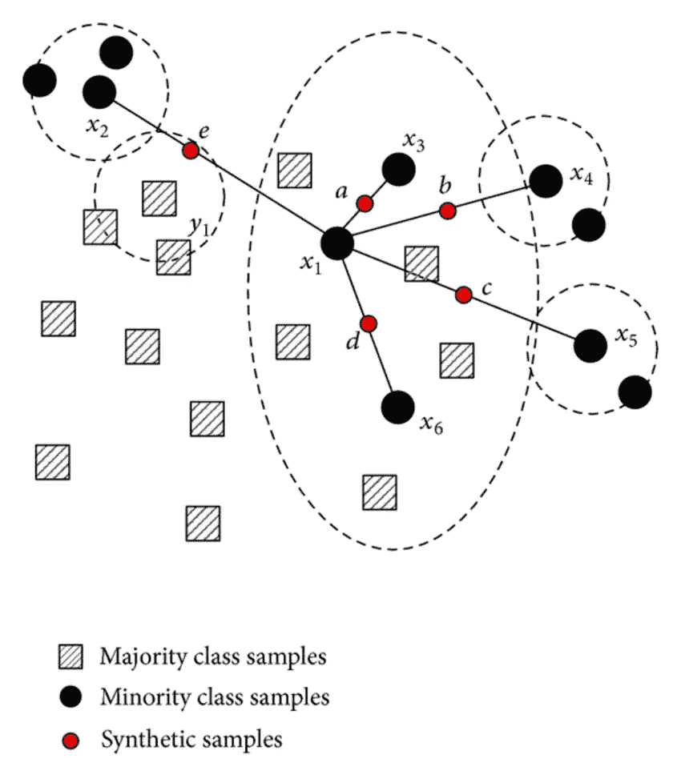

# SMOTE 和 ADASYN(处理不平衡数据集)

> 原文：<https://medium.com/coinmonks/smote-and-adasyn-handling-imbalanced-data-set-34f5223e167?source=collection_archive---------0----------------------->

最近我在做一个项目，我的数据集完全不平衡。这是一个二元分类问题，0 类和 1 类的比例是 99:1。

> 数据集不平衡会怎样？

如果数据集不平衡，模型就会有偏差。你可以这样想，如果你给模型的每一个可能的组合都输入 0，那么它给你的每一组输入都是 0。

> 我们如何知道模型是否不平衡？

1.  我们检查相关分类值的计数。对于被视为平衡数据集的数据集，比率应为 10:1。

2.混淆矩阵:预测完成后，检查混淆矩阵。

[[真阳性] [假阳性]

[假阴性][真阴性]]

如果任何值变为 0。你的模型有偏见，你的数据集不平衡

3.这不是一个好主意，但我也检查了预测变量的数量，从测试数据测试模型中获得。如果计数为 0 或 1，则认为您的模型有偏差。

> 处理不平衡数据集的方法:

> **欠采样:**在这种方法中，我们基本上以这样一种方式缩减实际数据集，即相关类别的比率变为 10:1。进行欠采样的一些方法是:

a.浓缩最近邻

b.片面选择

更多细节和算法请看列表:

[](https://github.com/scikit-learn-contrib/imbalanced-learn) [## sci kit-learn-contrib/不平衡学习

### 不平衡-学习- Python 模块，使用各种技术执行欠采样和过采样。

github.com](https://github.com/scikit-learn-contrib/imbalanced-learn) 

## 我个人的意见是不要用欠采样。

# 为什么？

原因是我们实际上减少了数据集，从而给模型提供了更少的数据。我给你举个例子，我们有一个 10000 个数据的数据集，只有 100 个数据点是 1，而其他的都是 0。现在，在执行欠采样后，我们基本上将数据集减少到 1100 个样本，其中 1000 个为 0，100 个为 1。因此，我们去掉了近 9000 个样本，并将其输入到模型中。所以模型更容易出错。尽管不同的模型使用不同的方法进行欠采样，但最终结果是相同的，即数据集中的行数较少。

**注意:**我只是在讨论不要说一个比另一个更好的可能性。这是我个人的看法。我们不打算在这里讨论。

2. ***过采样:*** 这种方法使用合成数据生成来增加数据集中的样本数。

***目标:*** *增加少数类，以便通过基于现有的少数观察值创建合成观察值来使数据集变得平衡。*

> **重击:**

smote 做的事情很简单。首先，它为类中的每个样本找到少数类中的 n 个最近邻。然后，它在邻居之间画一条线，并在线上生成随机点。



img url: [https://www.researchgate.net/publication/287601878/figure/fig1/AS:316826589384744@1452548753581/The-schematic-of-NRSBoundary-SMOTE-algorithm.png](https://www.researchgate.net/publication/287601878/figure/fig1/AS:316826589384744@1452548753581/The-schematic-of-NRSBoundary-SMOTE-algorithm.png)

看到上面的图像，所以它找到了样本点的 5 个最近的邻居。然后给每个人画一条线。然后在 class == minority class 的行上创建样本。

*这是 Smote 的改进版本。它做的和 SMOTE 一样，只是有一点小的改进。创建这些样本后，它会在点上添加一个随机的小值，从而使其更加真实。换句话说，不是所有的样本都与亲本线性相关，而是它们有更多的方差，即它们有点分散。*

> *好吧！所以它的实现时间:所以首先我们必须做 KNN，然后创建合成点。开个玩笑！SCIKIT-LEARN 已经为它准备了一个包，那就是“不平衡学习”*

*装置*

```
*pip install **-**U imbalanced**-**learn*
```

*康达安装:*

*`conda install -c conda-forge imbalanced-learn`*

 *[## 安装和贡献-不平衡-学习 0.3.0 文档

### 编辑描述

contrib.scikit-learn.org](http://contrib.scikit-learn.org/imbalanced-learn/stable/install.html)* 

```
*def **makeOverSamplesSMOTE(**X,y**)**:
 #input DataFrame
 #X →Independent Variable in DataFrame\
 #y →dependent Variable in Pandas DataFrame format
 **from imblearn.over_sampling import SMOTE**
 sm = **SMOTE()**
 X, y = sm.**fit_sample**(X, y)
 **return** X,y*
```

***注:***

*熊猫数据框架中的# X→自变量
# y→熊猫数据框架格式中的因变量*

```
*def **makeOverSamplesADASYN(**X,y**)**:
 #input DataFrame
 #X →Independent Variable in DataFrame\
 #y →dependent Variable in Pandas DataFrame format
 **from imblearn.over_sampling import ADASYN** 
 sm = **ADASYN()**
 X, y = sm**.fit_sample(X, y)**
 **return**(X,y)*
```

***注:***

*Pandas 数据框架中的# X→自变量
# y→Pandas 数据框架格式中的因变量*

*跟我来*

*[](https://dataneel.wordpress.com/) [## 面向所有人的数据科学

### 这篇文章是关于支持向量回归的。从事机器学习或数据科学的人非常熟悉…

dataneel.wordpress.com](https://dataneel.wordpress.com/) 

> 加入 Coinmonks [电报频道](https://t.me/coincodecap)和 [Youtube 频道](https://www.youtube.com/c/coinmonks/videos)获取每日[加密新闻](http://coincodecap.com/)

## 另外，阅读

*   [密码电报信号](http://Top 4 Telegram Channels for Crypto Traders) | [密码交易机器人](/coinmonks/crypto-trading-bot-c2ffce8acb2a)
*   [复制交易](/coinmonks/top-10-crypto-copy-trading-platforms-for-beginners-d0c37c7d698c) | [加密税务软件](/coinmonks/crypto-tax-software-ed4b4810e338)
*   [网格交易](https://coincodecap.com/grid-trading) | [加密硬件钱包](/coinmonks/the-best-cryptocurrency-hardware-wallets-of-2020-e28b1c124069)
*   [加密交换](/coinmonks/crypto-exchange-dd2f9d6f3769) | [印度的加密应用](/coinmonks/buy-bitcoin-in-india-feb50ddfef94)
*   面向开发者的最佳加密 API
*   最佳[密码借贷平台](/coinmonks/top-5-crypto-lending-platforms-in-2020-that-you-need-to-know-a1b675cec3fa)
*   [杠杆代币的终极指南](/coinmonks/leveraged-token-3f5257808b22)
*   [ko only 回顾](https://coincodecap.com/koinly-review) | [Binaryx 回顾](https://coincodecap.com/binaryx-review)|[Hodlnaut vs CakeDefi](https://coincodecap.com/hodlnaut-vs-cakedefi-vs-celsius)
*   [40 个最佳电报频道](https://coincodecap.com/best-telegram-channels) | [1xBit 回顾](https://coincodecap.com/1xbit-review) | [Keevo 钱包回顾](https://coincodecap.com/keevo-wallet-review)
*   [如何在印度购买以太坊？](https://coincodecap.com/buy-ethereum-in-india) | [如何在币安购买比特币](https://coincodecap.com/buy-bitcoin-binance)
*   [在美国如何使用 BitMEX？](https://coincodecap.com/use-bitmex-in-usa) | [BitMEX 回顾](https://coincodecap.com/bitmex-review) | [买入索拉纳](https://coincodecap.com/buy-solana)*