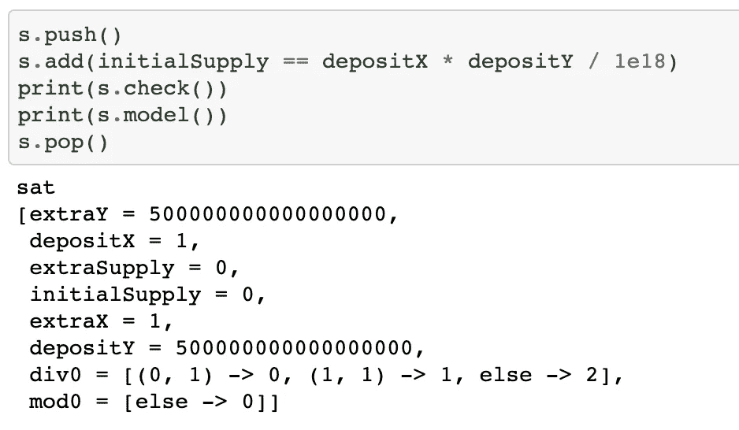
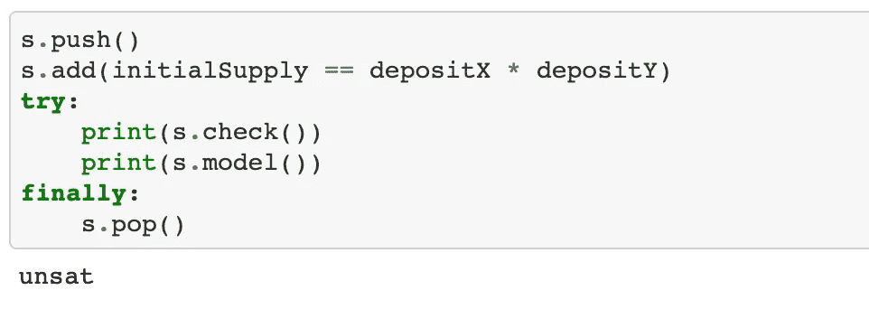

# (几乎)实用的超级大国

> 原文：<https://medium.com/coinmonks/smtchecker-almost-practical-superpower-5a3efdb3cf19?source=collection_archive---------1----------------------->

# 理论:什么是 SMTChecker？

你会拿你的第一个孩子打赌你刚刚部署的契约没有严重的漏洞吗？如果你和我一样，答案是响亮的“不”。

我在传统软件工程中见过足够多的黑客，知道你永远不可能 100%确定。这很可怕，但是不同技术的结合可以让我们非常接近期望的信心水平。 [SMTChecker](https://docs.soliditylang.org/en/v0.8.7/smtchecker.html) 就是其中之一。

它是一个对你的契约进行正式验证的工具:你定义一个规范(你认为你的契约应该做什么)，SMTChecker 正式证明契约符合规范。如果没有，SMTChecker 通常会给出一个具体的反例:一系列违反规范的事务。

最棒的是。如果你使用 Solidity，你已经有了 SMT checker——它是 Solidity 编译器的一部分。

无论如何，这都不是一个万无一失的解决方案——存在缺陷，验证缓慢。最重要的是，很难定义一个完整的规范。但即使知道这一点，还是值得一试。

## 示例:跳棋

契约实现了一个计数器——在一个 8x8 的棋盘上玩的跳棋游戏中的一个棋子。

我们将实现一个(虚构的)“懒惰计数器”:它不能移动，但可以通过“跳过”它们来捕获对角相邻单元格上的块:如果我在(0，0)处，想在(1，1)处捕获一块，我将在(2，2)处结束。简单。

代码很简单:我们在给定的位置创建一个计数器。然后它可以捕捉其他部分。

有趣的是最后一个函数——它定义了一个在任何时候都必须成立的不变量。不变量很简单——计数器不能离开棋盘。让我们编译契约，看看我们的不变量是否被打破(注意额外的`solc`参数——它们在[激进](https://docs.soliditylang.org/en/v0.8.7/smtchecker.html#timeout)但[精确](https://docs.soliditylang.org/en/v0.8.7/smtchecker.html#constrained-horn-clauses-chc)模式下打开 SMTChecker):

```
~/src/smtchecker_demo ❯❯❯ solc 1.sol --model-checker-engine chc --model-checker-show-unproved --model-checker-timeout 0
Warning: CHC: Assertion violation happens here.
Counterexample:
x = 0, y = 8Transaction trace:
LazyCounter.constructor(2, 6)
State: x = 2, y = 6
LazyCounter.capture(1, 7)
State: x = 0, y = 8
LazyCounter.invariant()
  --> 1.sol:32:9:
   |
32 |         assert(x >= 0 && x < 8 && y >= 0 && y < 8);
   |         ^^^^^^^^^^^^^^^^^^^^^^^^^^^^^^^^^^^^^^^^^^
```

哎呀，我们的不变量坏了。SMTChecker 甚至给了我们一个反例！如果我们的棋子在(2，6)处，并且它在(1，7)处捕获了该棋子，那么它在棋盘之外的(0，8)处结束。我们忘记在捕获后检查计数器位置的有效性。

我们给了它一个契约，其中包含一组操作边界(定义一组有效输入的`require`语句)和一个不变量。SMTChecker 进行了**详尽的分析**:将**所有公共函数**与**所有可能的输入**以**所有可能的组合**循环调用。实际上，它并没有采用暴力的方式(那太昂贵了)，而是依靠*数学*来实现(我不会假装完全理解这一点，这里[有一些细节](https://docs.soliditylang.org/en/v0.8.7/smtchecker.html#smt-and-horn-solvers))。

下面是另一个例子，说明了 SMTChecker 尝试用长序列的事务来测试不变量:一个实现了象棋骑士的契约。我们将添加一个我们知道无效的不变量，只是为了给 SMTChecker 一些线索:骑士无法到达(7，7)位置。SMTChecker 还会给我们一个反例。

```
~/src/smtchecker_demo ❯❯❯ solc 2.sol --model-checker-engine chc --model-checker-show-unproved --model-checker-timeout 0
Warning: CHC: Assertion violation happens here.
Counterexample:
x = 7, y = 7Transaction trace:
Knight.constructor()
State: x = 0, y = 0
Knight.move2()
    Knight.isValidPosition() -- internal call
State: x = 2, y = 1
Knight.move2()
    Knight.isValidPosition() -- internal call
State: x = 4, y = 2
Knight.move5()
    Knight.isValidPosition() -- internal call
State: x = 3, y = 4
Knight.move1()
    Knight.isValidPosition() -- internal call
State: x = 4, y = 6
Knight.move3()
    Knight.isValidPosition() -- internal call
State: x = 6, y = 5
Knight.move1()
    Knight.isValidPosition() -- internal call
State: x = 7, y = 7
Knight.get_to_7_7()
  --> 2.sol:61:9:
   |
61 |         assert(!(x == 7 && y == 7));
   |         ^^^^^^^^^^^^^^^^^^^^^^^^^^^
```

真棒。它给出了将骑士从(0，0)移动到(7，7)的步骤序列。

# 实践

*免责声明:其他一切都是一个大实验，看看如何让它在‘生产环境’中有用。可能还有其他的方法，我并不自称已经找到了。*

让我们做一些更实际的事情:AMM 的一部分:流动性提供者给交易对增加流动性，但实际上没有人可以交易。

*   建设完成后，业主交存若干(`x` ) X 代币和若干(`y` ) Y 代币。AMM 生成`x * y` LP 代币
*   任何人都可以存入`x1` X 和`y1` Y 代币，只要不改变 X/Y 余额比例(`x1/y1 == xReserves / yReserves`)。AMM 生成`totalSupply(LP) * (x1 / xReserves)` LP 代币
*   我们仅支持小数位数为()的定点 ERC20 代币== 18

就是这样。我们甚至没有分发 LP 代币，只是生成代币。

我们可以加上哪些不变量？没多少——或许外汇储备并不是空的，但仅此而已。

让我们将不变量的定义转向另一面，称之为“动态不变量”:了解执行`addLiquidity`前后的状态，我们能断言什么？

请注意末尾的`revert()`，它确保不变函数没有副作用(可以将其视为`view`函数)。让我们来试试吧！

```
~/src/smtchecker_demo ❯❯❯ solc --model-checker-engine chc --model-checker-show-unproved --model-checker-timeout 0 --model-checker-contracts 3.sol
...
```

这需要一段时间(最多几个小时)。对于 1 个简单不变量来说不够实用。

什么会让它变慢？我猜是地址和外部调用(`transferFrom` ) — SMTChecker 将它们建模为可以做任何事情的未知函数，包括回调你的合同。这很好也很有用(它们[可以发现可重入性问题](https://docs.soliditylang.org/en/v0.8.7/smtchecker.html#external-calls-and-reentrancy))，但是对于我们的场景来说不实用。

我们将重新构建合同:将所有外部通信分离到一个单独的合同中。我们的“核心”合同将保持最小状态，只是一个数字处理器。额外的好处是——它使得跟随 CEI(检查-效果-互动)几乎是自动的。

`AMMPairEngine`有`addLiquidityStateChange`作为内部函数。本来打算叫`AMMPair`(继承自`AMMPairEngine`)。`AMMPairEngine`仅有的公共函数是不变量。如果我们不希望它们出现在已部署的代码中，可以将它们移到`AMMPairEngineTest is AMMPairEngine`契约中。

```
~/src/smtchecker_demo ❯❯❯ time solc --model-checker-engine chc --model-checker-show-unproved --model-checker-timeout 0 --model-checker-contracts 3.sol:AMMPairEngine 3.sol
Warning: CHC: Division by zero happens here.
Counterexample:
xReserves = 2, yReserves = 2, totalSupply = 0
depositX = 1
depositY = 1
oldSupply = 0
oldXReserves = 1
supplyAdded = 0Transaction trace:
AMMPairEngine.constructor(1, 1)
State: xReserves = 1, yReserves = 1, totalSupply = 0
AMMPairEngine.invariantAddLiquidity(1, 1)
    AMMPairEngine.addLiquidityStateChange(1, 1) -- internal call
   --> 3.sol:117:43:
    |
117 |         assert(depositX / oldXReserves == supplyAdded / oldSupply);
    |                                           ^^^^^^^^^^^^^^^^^^^^^^^Warning: CHC: Assertion violation happens here.
   --> 3.sol:117:9:
    |
117 |         assert(depositX / oldXReserves == supplyAdded / oldSupply);
    |         ^^^^^^^^^^^^^^^^^^^^^^^^^^^^^^^^^^^^^^^^^^^^^^^^^^^^^^^^^^solc --model-checker-engine chc --model-checker-show-unproved  0   3.sol  7.11s user 0.17s system 98% cpu 7.357 total
```

被零除会导致断言冲突。反例(`depositX = 1; depositY = 1; oldSupply = 0`)让问题显而易见:契约创建者存放了 X 的 1e-18 和 Y 令牌的 1e-18。这使得合约发行了 0 个 LP 令牌(1e-36 太小，无法用 18 进制定点数学表示)。我们将切换到 36 位十进制数学，这应该可以解决这个问题:

```
~/src/smtchecker_demo ❯❯❯ time solc --model-checker-engine chc --model-checker-show-unproved --model-checker-timeout 0 --model-checker-contracts 3.sol:AMMPairEngine 3.sol
Warning: CHC: Assertion violation might happen here.
   --> 3.sol:117:9:
    |
117 |         assert(depositX / oldXReserves == supplyAdded / oldSupply);
    |         ^^^^^^^^^^^^^^^^^^^^^^^^^^^^^^^^^^^^^^^^^^^^^^^^^^^^^^^^^^solc --model-checker-engine chc --model-checker-show-unproved  0   3.sol  75.19s user 0.50s system 99% cpu 1:16.27 total
```

注意变化:没有被零除，并且“断言违反**发生在**这里”现在是“断言违反**可能发生在**这里”。我认为将不确定性解释为“这里肯定没有断言违反”是不安全的，但这是部分成功。我需要做更多的调查来更好地了解这里发生了什么。

**更新 09/05/2021**:[Leo Alt](https://twitter.com/leonardoalt)指出‘可能发生’还不足以称之为‘部分成功’——SMT checker 真的很难证明这个断言，所以我们真的不能依赖它:

FWIW，[您可以手动证明上一个示例中的数学公式](https://github.com/sblOWPCKCR/smtchecker_demo/blob/main/z3.ipynb)，但是这显然不可扩展。带有反例的原始代码中的断言冲突:



证明新代码中没有断言冲突:



# 结论

SMTChecker 可以成为你的个人超能力——它可能需要一些工作，你的合同需要牢记这一点。但是如果情况一致，每个人都可以享受自动正式验证的好处。

我希望花些时间深入了解 SMTChecker，敬请关注。

# 可供选择的事物

1.  [蝎狮](https://github.com/trailofbits/manticore)是一个符号执行引擎，可以做类似 SMTChecker 的事情。它是高度可编程的——一方面，它可以做更少的开箱即用的事情(`invariantAddLiquidity`有两个参数，SMTChecker 为它们探索了所有可能的输入；蝎狮做不到)。另一方面，这些东西是可实现的，加上我们对验证过程有更多的控制(也许我们可以对外部合同做一些假设？)
2.  [鼹鼠](https://github.com/crytic/echidna)是一个模糊化工具——使用类似的不变量概念，随机尝试寻找破坏它们的输入。它没有**证明**不变量成立(也许它只是没有发现一个边缘情况)，但可以很快发现许多非边缘情况的缺陷。鼹鼠使用相同的语法和蝎狮，所以它们可以并行使用(至少在理论上)。
3.  [Scribble](https://consensys.net/diligence/scribble/) 采取了不同的方法——你**用动态不变量注释**每个函数。对于不变量，它使用自己的语言，并且可以用物化的不变量来检测您的代码。
4.  无数的静态分析/其他模糊工具——它们非常有用，但是超出了本文的范围

# 感谢

[阿尔贝托·单面山·卡尼亚达](https://medium.com/u/8206cbb70805?source=post_page-----5a3efdb3cf19--------------------------------)对于上述大部分参考资料和小 AMM 的想法

> 加入 Coinmonks [电报频道](https://t.me/coincodecap)和 [Youtube 频道](https://www.youtube.com/channel/UCbyDhTbOiKh2iUMKBi4-4Zg)了解加密交易和投资

## 另外，阅读

*   [Bitget 评论](https://blog.coincodecap.com/bitget-review) | [双子星 vs BlockFi](https://blog.coincodecap.com/gemini-vs-blockfi) | [OKEx 期货交易](https://blog.coincodecap.com/okex-futures-trading)
*   [OKEx vs KuCoin](https://blog.coincodecap.com/okex-kucoin) | [摄氏替代度](https://blog.coincodecap.com/celsius-alternatives) | [如何购买 VeChain](https://blog.coincodecap.com/buy-vechain)
*   [Stormgain 回顾](https://blog.coincodecap.com/stormgain-review) | [Bexplus 回顾](https://blog.coincodecap.com/bexplus-review) | [币安 vs Bittrex](https://blog.coincodecap.com/binance-vs-bittrex)
*   [Bookmap 评论](https://blog.coincodecap.com/bookmap-review-2021-best-trading-software) | [美国 5 大最佳加密交易所](https://blog.coincodecap.com/crypto-exchange-usa)
*   [如何在 FTX 交易所交易期货](https://blog.coincodecap.com/ftx-futures-trading) | [OKEx vs 币安](https://blog.coincodecap.com/okex-vs-binance)
*   [如何在势不可挡的域名上购买域名？](https://blog.coincodecap.com/buy-domain-on-unstoppable-domains)
*   [印度的秘密税](https://blog.coincodecap.com/crypto-tax-india) | [altFINS 审查](https://blog.coincodecap.com/altfins-review) | [Prokey 审查](/coinmonks/prokey-review-26611173c13c)
*   [布洛克菲 vs 比特币基地](https://blog.coincodecap.com/blockfi-vs-coinbase) | [比特坎评论](https://blog.coincodecap.com/bitkan-review) | [币安评论](/coinmonks/binance-review-ee10d3bf3b6e)
*   [Coldcard 评论](https://blog.coincodecap.com/coldcard-review) | [BOXtradEX 评论](https://blog.coincodecap.com/boxtradex-review)|[unis WAP 指南](https://blog.coincodecap.com/uniswap)
*   [阿联酋 5 大最佳加密交易所](https://blog.coincodecap.com/best-crypto-exchanges-in-uae) | [SimpleSwap 评论](https://blog.coincodecap.com/simpleswap-review)
*   [购买 Dogecoin 的 7 种最佳方式](https://blog.coincodecap.com/ways-to-buy-dogecoin) | [ZebPay 评论](https://blog.coincodecap.com/zebpay-review)
*   [美国最佳加密交易机器人](https://blog.coincodecap.com/crypto-trading-bots-in-the-us) | [不断回顾](https://blog.coincodecap.com/changelly-review)
*   [huo bi 的加密交易信号](https://blog.coincodecap.com/huobi-crypto-trading-signals) | [BitMEX 评论](https://blog.coincodecap.com/bitmex-review)