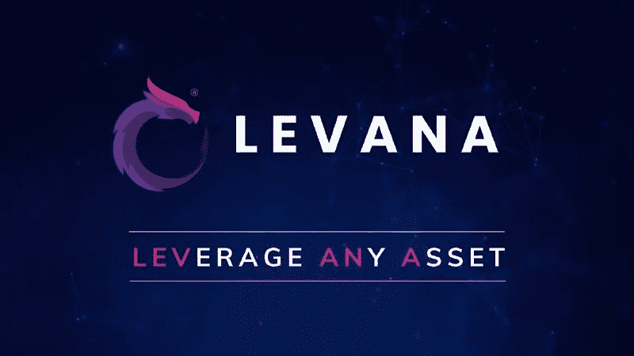

# 先睹为快

> 原文：<https://medium.com/coinmonks/sneak-peek-into-levana-protocol-f702ffc6939d?source=collection_archive---------2----------------------->

## 利用任何资产

LEVANA 是 Terra 区块链中令人兴奋的即将到来的协议之一。继合成资产的 MIRROR、银行的 ANCHOR、货币市场的 MARS 之后，LEVANA 为 Terra 区块链增加了一个新功能——杠杆交易。他们的目标是向用户开放杠杆资产的世界，路线图包括杠杆代币、永久和期权交易。