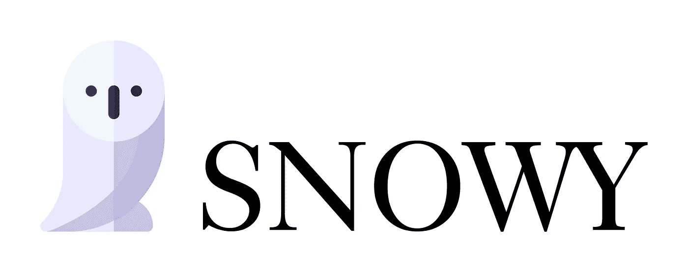
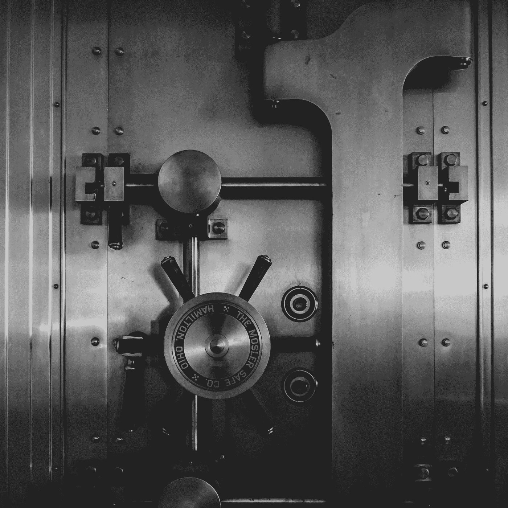
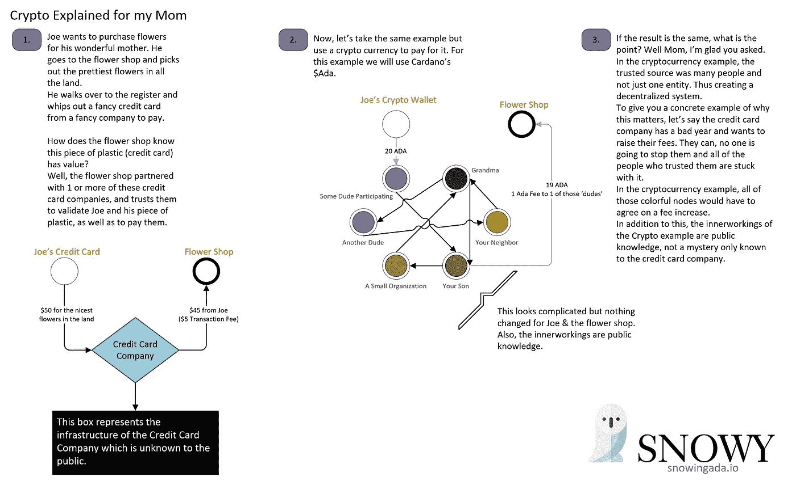

# 卡尔达诺，这么简单我妈妈就能做到

> 原文：<https://medium.com/coinmonks/snowy-hoots-cardano-so-easy-my-mom-can-do-it-eeeefc0c6483?source=collection_archive---------2----------------------->

正如大多数人所知，加密货币的知识壁垒非常高。对于新人来说，思考“什么是加密货币？”令人生畏。即使在你掌握了“是什么”之后，建立足够的舒适来参与/投资也是一个更大的挑战。

我最近引导我的母亲进入了加密货币的世界(特别是 Cardano ),我从这个过程中学到了很多。作为一名软件工程师，很容易忽略加密货币的知识壁垒，因此指导一个拥有“正常”技术水平的人是非常有启发性的。出于这个原因，我决定写一篇文章详细描述这次经历。

免责声明:本文是关于一次经历的细节，绝不是财务建议。加密货币是一种高度不稳定的投资，每个人都应该权衡自己的风险承受能力，最好是咨询金融专家。我是一名软件工程师，我不是财务规划师或顾问。

# **简介**

不久前，我和一个朋友决定更多地涉足加密货币领域。为了做到这一点，我们决定成为 Cardano stake pool 的所有者和经营者。所以当我妈妈问我“有什么新鲜事”时，我提出了这个新的尝试。作为一个慈爱的母亲，她想支持我。*(平心而论，我父亲也有同样多，甚至更多的兴趣，接下来的大部分内容也适用于他，但《我妈妈能做的如此简单》听起来更好。)*

# **什么是加密货币？**

我一开始解释说，加密货币是一种货币，就像美元、加拿大元、人民币，或者在这里插入任何其他政府货币一样。这就带来了一个问题，“美国政府支持我的美元，加密货币背后是什么？”为了更好地解释这一点，将它分解成几个更具体的问题会更容易。

**是什么赋予了加密货币价值？**

Photo by [Jason Dent](https://unsplash.com/@jdent?utm_source=medium&utm_medium=referral) on [Unsplash](https://unsplash.com?utm_source=medium&utm_medium=referral)

推测。在这个时间点上，加密货币与拥有一家公司的公开交易股票(股份)没有太大区别。基于投机，这些股票是有价值的。人们买入并猜测价格会上涨，这样他们就可以获利，加密货币也是如此(目前)。人们根据与公司和公司效用相关的新闻和事件做出这种猜测，加密货币即使不相同，也是相似的。*值得注意的是，在公司中,“大”股东有时会获得能够直接影响公司方向的特权。在加密货币中，所有权的特权是很小的。*

**是什么阻止了人们制造更多的加密货币？**

协议。加密货币内置了算法，可以控制什么可以发生，什么不可以发生。一般来说，这些协议是众所周知的，并在一份名为白皮书的精美文件中有详细说明。这并不是说这些货币不能改变，它们可以，但要做到这一点，确实需要“矿商”或股权池运营商的多数同意。(我将在本文后面解释挖掘和股份池操作符。)你可以把这想成是民选官员代表你做决定，不同的是，如果你想参与，你可以这样做。不需要竞选公职和争取选票，就可以直接参与加密货币的决策。你需要做的就是参与网络。

**黑客呢？**

这是一个复杂的问题，但为了让它变得简单，让我们这样来考虑:要真正入侵并控制网络，你需要拥有 51%的网络。当你考虑这样做要花多少钱时，这实际上是不可能的。*注意:有很多不同的加密货币，所以当我做一个总括声明时，我指的是那些更知名的。*如果你把这比作一家公司甚至一个政府，它们可能只需要一个被入侵的节点就能入侵，那么它是非常安全的。

**你是如何制造加密货币的？**

加密货币是如何创建的，是基于我之前提到的协议。一些协议被设置成只有有限数量的加密货币可以存在。其他的是通货膨胀(创造更多的硬币)甚至通货紧缩(摧毁硬币)的性质。例如，比特币是可以存在的有限数量的硬币，但是，你必须挖掘它们才能使它们存在。卡尔达诺也是数量有限的硬币，但它们都已经存在，并在首次公开发行中发行(就像上市公司股票首次公开发行)。

*采矿*

以比特币为例，必须挖掘(发现)供给。这是通过计算机解决极其复杂的数学问题来决定谁将获得下一个比特币来实现的。这样做的目的是鼓励参与网络。比特币的协议增加和降低了问题的复杂性，以确保新发现硬币的稳定供应。这些矿工是网络的骨干。他们处理网络上的所有交易。同样，这样做的回报是获得比特币。这个协议被称为工作证明。

*打桩*

Cardano 使用一种不同的方法来处理它对网络的激励，这种方法叫做股权证明。这是通过利益相关方(又名 Cardano 或 Ada)的授权流程完成的。这些委托人选择一个股份池来代表他们处理有关网络决策的事务。该协议每大约 20 秒(在撰写本文时)选择一个股东来处理网络的所有事务(也称为创建一个块)。无论该利益相关方被委派到哪个池，该池都将创建该区块，并获得这些交易费以及来自协议控制储备的少量奖金。最终储备将耗尽，交易费用将成为回报。这是很多年以后的事了，所以到那时应该会有足够多的交易不需要这笔奖金。股份池开始在所有委托人之间分配生产区块的奖励。这导致授权人对其持有的资产产生“利息”。此时此刻，我们看到人们每年从赌博中获得高达 6%的收益。此外，利益相关者可以自由离开、出售、消费等。他们的赌注。它不会被锁起来，也不会离开他们。

*[1]您不会得到交易的确切金额，但会得到您在该时段(5 天时间)内创建的所有数据块中的份额。从而使所有块在该时期内相等。*

下面是我发给我妈解释的图片:

Joe buys flowers for his Mom using cryptocurrency

# 我如何加密？

现在我妈妈明白了它的要点，接下来的自然问题是，“我如何购买加密货币并与你打赌？”我最初的想法是给她设立一个币安的美国账户，因为这是我个人的偏好。然而，我意识到这并不是对初学者最友好的(她也从未使用过任何日间交易平台)。然后我想起了比特币基地对新来者的友好。所以我决定去比特币基地。我还决定在她的 iPhone 上做所有这些。

在给她发送了一个比特币基地应用下载的直接链接后，她很容易就弄清楚了账户设置。然而，当它询问她的银行信息时，她确实问了我一个问题:

> 这安全吗？

她特别提到了比特币基地，我回答说“是的，很安全。”我后来解释说，网上的任何东西总是有一些风险，但最终他们得到了数百万人的信任。我意识到，这个事实并没有具体说明他们的安全性，但它确实让人们感到更安全。

在得到一些保证后，她迅速建立了自己的账户并转了钱进去。这是第一个有趣的问题出现的地方:

> 我想买 Ada，它想从我的银行账户里提款，但是我已经把钱存进去了？我如何让它使用我已经转移的钱。

她去买了一些 Ada，但后来意识到它又从她的银行账户中取出，而不是使用转账的钱。我决定在比特币基地身上做一些测试，因为我不明白这是怎么发生的。我最终发现了比特币基地糟糕的用户界面设计。他们默认到银行账户，而不是你的比特币基地余额。它这样做也不明显。

Poor Coinbase Design Decision

我妈妈认为她搞砸了，但我向她保证这是比特币基地的一个糟糕的设计决定，它很容易混淆许多人(我后来发现我的一个朋友也这么做)。

无论如何，她决定买更多的 Ada，而不是把它转回银行账户。大概正是比特币基地所希望的，不是一个 bug 而是一个特性，对吗？

# 我如何下注？

现在我妈妈是 Ada 的骄傲的所有者，但是因为她的 Ada 在一个交易所，她并不真正拥有它。我的意思是，她正在使用交易所的钱包，而她实际上没有钱包的钥匙。离开交易所的第一步是得到一个 Ada 钱包。为此，我给她发了一个轻钱包 Yoroi 的直接链接。她下载后，我们开始浏览钱包的制作过程。

Photo by [Glen Carrie](https://unsplash.com/@glencarrie?utm_source=medium&utm_medium=referral) on [Unsplash](https://unsplash.com?utm_source=medium&utm_medium=referral)

我们到了安全存储这些随机不同的单词的步骤，是时候解释一下了。我解释道:“这些单词叫做助记短语，是你钱包的钥匙。”我告诉她把这些写在一张纸上，安全地存放在某个地方，最好是防火保险箱。我还告诉她永远不要把它们给任何人。我解释说，有许多“黑客”会试图欺骗你给出这个短语，一旦他们有了它，他们就有了你所有的 Ada。我还提到，这个短语永远不要放在网上。

在我长时间的安全泄漏后，她终于有了一个 Cardano (ad a)钱包，并准备将她的 Ada 从交易所转移到她的新钱包。我让她抄下她的钱包地址，打开比特币基地。我轻而易举地给她演示了如何转账，以及在哪里粘贴她的钱包地址。然后我让她在 Yoroi 和比特币基地之间切换，以确认地址匹配。他们照做了，她点击了“发送”

过了一会儿，她的阿达出现在她的钱包里。因此只剩下最后一步，打桩。她的决定很容易决定她会选择哪个游泳池。因此，这很简单，只需进入“代表”标签，搜索 SNOWY 并点击大的“代表”按钮。*这确实带来了另一个问题，在她点击 delegate 之后，因为她的 Yoroi 仪表板页面过了几分钟才显示出来。*

就是这样，我妈妈是卡尔达诺雪桩池的骄傲代表！🎉🥳

*自己的卡达诺(ADA)又想委托给白雪？在 PoolTool 上查看我们的游泳池，或者搜索 SNOWY ticker:*

 [## 卡尔达诺台球工具

### 卡尔达诺最全面的赌注统计数据。跟踪和比较池性能。看谁是…

pooltool.io](https://pooltool.io/pool/c3102f5ac6b0518e15f1ba1125c105f6c974ec592e695f61c2862949/epochs) 

*更多文章由雪阿达:*

 [## 雪呼:卡达诺能源使用，NFTs 和游戏

### 如果你是游戏社区的活跃分子，你很有可能熟悉 Valve 禁止游戏的决定…

medium.com](/@snowingada/snowy-hoots-cardano-energy-usage-nfts-and-gaming-79c7f279bfd0) 

*查看我们的网站:*

 [## 首页|雪桩池

### Cardano Stake Pool Snowy 是一个高度安全可靠的 Stake Pool。我们的团队相信创新的未来…

snowingada.io](https://snowingada.io/) 

> 加入 Coinmonks [电报频道](https://t.me/coincodecap)和 [Youtube 频道](https://www.youtube.com/c/coinmonks/videos)了解加密交易和投资

## 另外，阅读

*   [阿联酋 5 大最佳加密交易所](https://blog.coincodecap.com/best-crypto-exchanges-in-uae) | [SimpleSwap 评论](https://blog.coincodecap.com/simpleswap-review)
*   [购买 Dogecoin 的 7 种最佳方式](https://blog.coincodecap.com/ways-to-buy-dogecoin) | [ZebPay 评论](https://blog.coincodecap.com/zebpay-review)
*   [如何在 Bitbns 上购买柴犬(SHIB)币？](https://blog.coincodecap.com/buy-shiba-bitbns)
*   [iTop VPN 审查](https://blog.coincodecap.com/itop-vpn-review) | [曼陀罗交易所审查](https://blog.coincodecap.com/mandala-exchange-review)
*   [最佳期货交易信号](https://blog.coincodecap.com/futures-trading-signals) | [流动性交易所评论](https://blog.coincodecap.com/liquid-exchange-review)
*   [最佳加密交易信号电报](/coinmonks/best-crypto-signals-telegram-5785cdbc4b2b) | [MoonXBT 评论](/coinmonks/moonxbt-review-6e4ab26d037)
*   [OKEx 评论](/coinmonks/okex-review-6b369304110f) | [Coinswitch 俱吠罗评论](/coinmonks/coinswitch-kuber-review-1a8dc5c7a739) | [比特币基地收费](/coinmonks/coinbase-fees-831e77d4f2c5)
*   [AscendEX 审查](/coinmonks/ascendex-review-53e829cf75fa) | [OKEx 交易机器人](/coinmonks/okex-trading-bots-234920f61e60) | [OKEx 交易机器人](/coinmonks/okex-trading-bots-234920f61e60)
*   [火币交易机器人](https://blog.coincodecap.com/huobi-trading-bot) | [如何购买 ADA](https://blog.coincodecap.com/buy-ada-cardano) | [Geco。一次复习](https://blog.coincodecap.com/geco-one-review)
*   [币安 vs 比特邮票](https://blog.coincodecap.com/binance-vs-bitstamp) | [比特熊猫 vs 比特币基地 vs Coinsbit](https://blog.coincodecap.com/bitpanda-coinbase-coinsbit)
*   [如何购买 Ripple (XRP)](https://blog.coincodecap.com/buy-ripple-india) | [非洲最好的加密交易所](https://blog.coincodecap.com/crypto-exchange-africa)
*   [非洲最佳加密交易所](https://blog.coincodecap.com/crypto-exchange-africa) | [胡交易所评论](https://blog.coincodecap.com/hoo-exchange-review)
*   [eToro vs robin hood](https://blog.coincodecap.com/etoro-robinhood)|[MoonXBT vs Bybit vs Bityard](https://blog.coincodecap.com/bybit-bityard-moonxbt)
*   [Stormgain 评论](https://blog.coincodecap.com/stormgain-review) | [Probit 评论](https://blog.coincodecap.com/probit-review) | [北海巨妖评论](/coinmonks/kraken-review-6165fc1056ac)