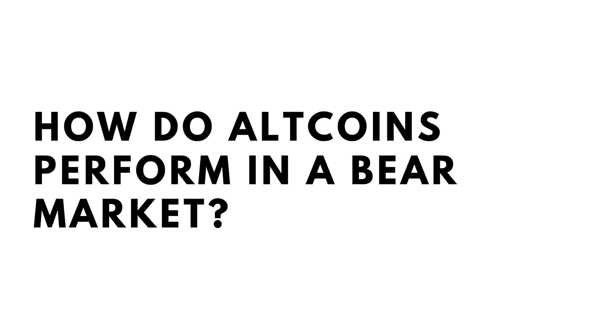
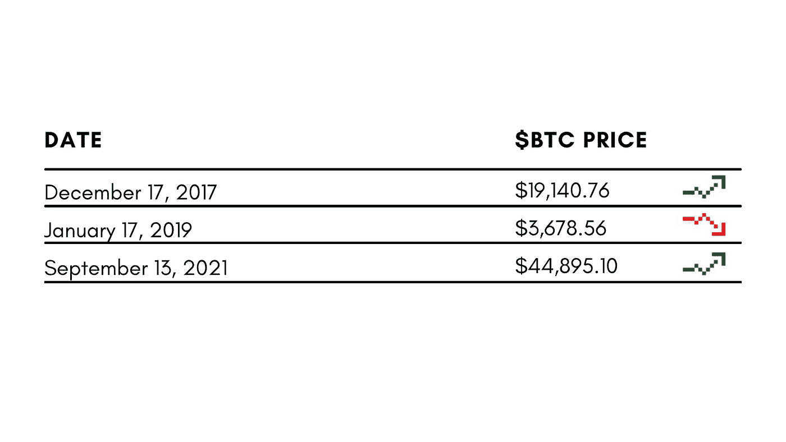
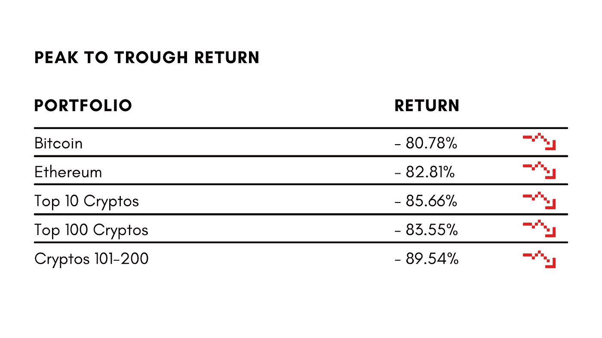
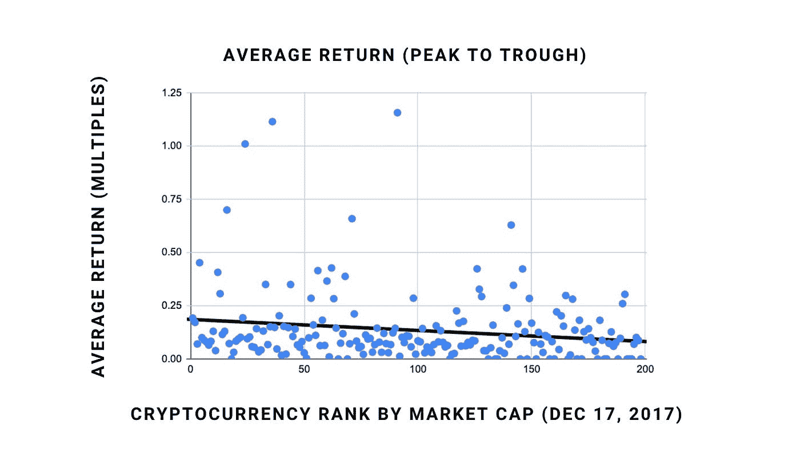
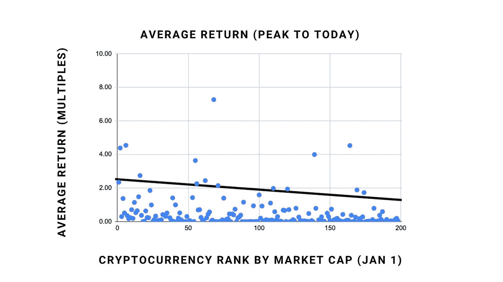
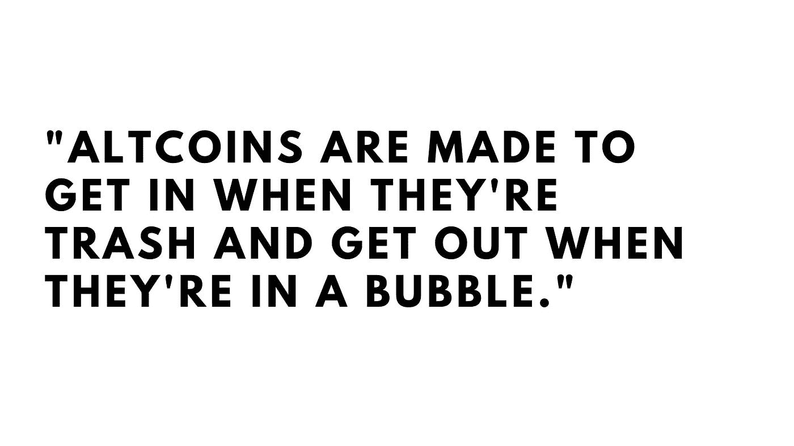
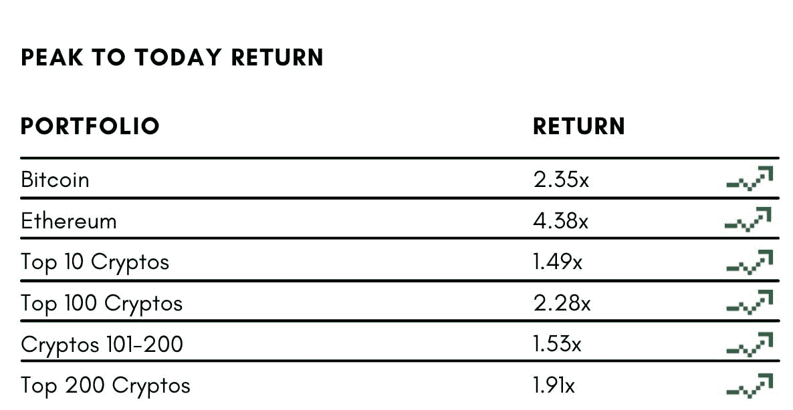
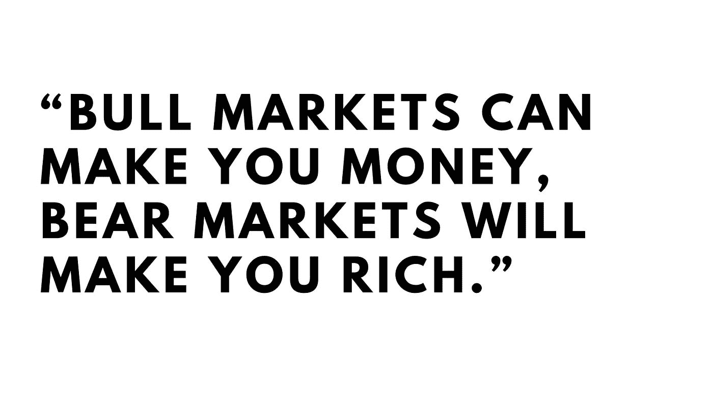
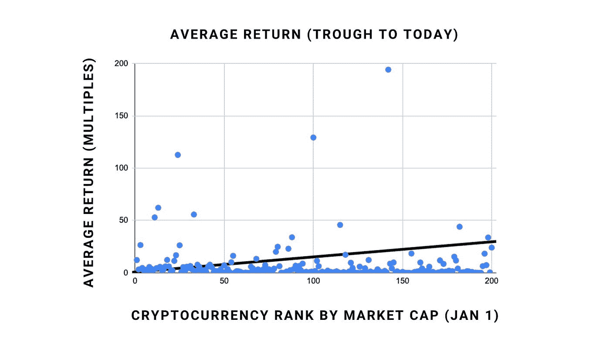
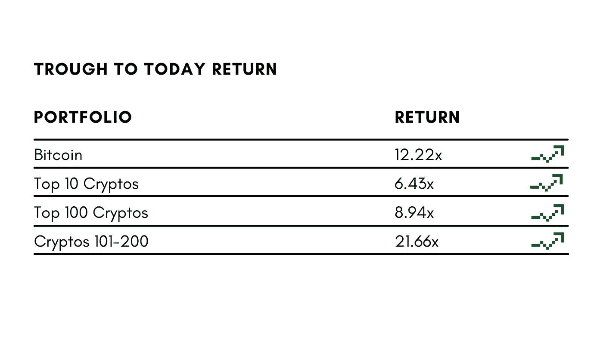

# 那么，秘密熊市到底有多糟糕？

> 原文：<https://medium.com/coinmonks/so-just-how-bad-is-a-crypto-bear-market-e4b0d2c30c96?source=collection_archive---------0----------------------->

## 我只把一小部分内容放在媒体上。如果你想获得所有加密实用主义的新闻更新、投资公告和 altcoin 报告，请在这里 **免费注册新闻简报** [**。**](http://cryptopragmatist.com/sign-up/)

作为一名另类投资者/时事通讯作者，我有时会因为自己对另类投资的乐观态度而受到批评。当然，在牛市中，小型加密货币的表现可以超过比特币，但当市场下跌时呢？当情况不太乐观时，另类投资看起来像什么？

我们来看看吧！****

**参数**

这种分析基于三个时间点:

第一个日期是比特币 2017 年的高点，几乎被普遍认为是上一轮牛市的“周期峰值”。

到第二年 12 月，市场状况相当糟糕，跌至约 3500 美元，一次是在 2018 年 12 月，另一次是在 2019 年 1 月。我们将使用 2019 年 1 月的日期进行“市场底部”分析。

最终日期是 9 月 13 日，我目前使用的日期。

**第一阶段:熊市(2017 年 12 月—2019 年 1 月)**

首先是。小盘股 altcoins，市值排名 101-200。我们买它们只有一个原因:牛市中的疯狂回报。但在熊市中，情况会有所不同吗？

绝对是。

这些资产从市场峰值到市场底部的平均回报率？负 90%。表现最好的硬币(KuCoin)下跌了 37%，其中 20 枚硬币的价值不到 1 美分。100 枚硬币中有 99 枚下跌了 50%以上，少数(100 枚硬币中的 37 枚)下跌了不到 90%。

在顶峰时期，每种硬币投资 1000 美元(总计 10 万美元)，价值仅为 10480 美元:在市场周期的底部，你很难对自己的另类硬币投资组合感觉良好。

替代硬币的情况看起来不太妙。但公平地说，我们还没有看到前 100 名硬币的表现。

这是一个按群组划分的时间表，包括排名前两位的 cryptos 比特币和以太坊。

好吧，不管怎样，结果都很糟糕，但排名前 100 位的加密技术表现得稍微好一点:每枚硬币价值 1，000 美元的前 100 名投资组合比我们的小盘股加密投资组合(16，499 美元至 10，480 美元)高出约 60%。

前 100 名中只有 6 只股票下跌了 99%以上，而 12 只小盘股表现了同样(令人沮丧)的壮举。只有两家不稳定的银行取得了正回报，它们都进入了前 100 名(BNB 从第 36 名开始，而$LINK 从第 91 名开始)。

你在这个时期看空替代硬币是正确的。这是前 200 种硬币及其平均回报率的图表。我对这些数据进行了线性回归，但不要全信。

事实已经证明，对另类投资的批评基本上是正确的:在持续下行的市场低迷中，数据显示，投资于市值较大的股票会让你受益匪浅。对前 100 名的随机投资归零的可能性是对后 100 名的随机投资的一半。但不管怎样，事情都不太妙。

虽然加密领域的许多人主张比特币是一种相对安全的资产，但与几乎任何其他资产相比，它的表现仍然非常糟糕，非常糟糕。在同一时期，标准普尔 500 只损失了大约 5%。在大萧条时期，从峰值到谷底，标准普尔 500 下跌了 57.7%。那是痛苦的，但没有 90%的痛苦。

**第二阶段:高峰期到今天(2017 年 12 月—2021 年 9 月)**

现实地说，人们普遍认为，在熊市中，劣币比蓝筹股更容易流失。这是理所当然的，这也是替代硬币在牛市中上涨更快的部分原因。

但是也许最有趣的数据来自一种 HODL 方法。这些硬币从上到下再到从上到下是如何表现的？山寨币最终会反弹吗？或者这些曾经炙手可热的资产会从地图上消失，永远不再出现？

这是一个带有线性回归的图表:

同样，我们在图表上有一个负斜率，这意味着在此期间，市值较大的硬币平均表现更好。但这些数据似乎并没有指出 altcoin 批评者提出的理论，该理论总结如下:

我们的图表显示，替代硬币不会永远消失。小盘股替代币反弹力度不大，但也不会消失。以下是按群组划分的一些平均值，我们可以仔细看看:

这个数据对我来说至少证明了一件事:前 100 名之外的多元化替代硬币投资组合不会变得一文不值，无论如何都不会。投资组合并不繁荣，这是肯定的:前 100 名中的 20 名已经损失了超过 99%的价值，只有 7 名硬币有 2x'd 或更好。但大多数人不会抱怨几年后回报率超过 50%的投资组合。

话虽如此，这个周期的这一点肯定是以太坊和比特币多头复仇的地方。这两种密码的表现都远高于平均水平。但市值较低的替代币的表现似乎与平均排名前 10 位的加密币不相上下，这两种加密币的表现与标准普尔 500 不相上下(65%)。

**低谷到今天(2019 年 1 月—2021 年 9 月)**

显然，预测市场周期的底部是不可能的，也很难有勇气在那里购买替代硬币，但为了好玩，让我们想象我们可以完美地把握市场时机，并在准确的底部购买硬币。什么会做得更好？前 10，前 100，还是后 100？

请记住，在这个实验中，我们购买的是新的硬币排名，而不是旧的。这是图表:

一些群组平均值:

对于第二批投资者来说，这些回报相当可观。将 100，000 美元平均分配(每个密码 1000 美元)，今天你将获得超过 210 万美元。即使把所有钱都投入比特币，你也能净赚 120 万美元，所以如果你只想投资$BTC，我想我不会怪你。我，我自己，我会继续追逐那些 100 倍的收益。

按群组统计的一些数据:

*   前 100 名中有 6 名已经归零，与之相比，后 100 名中有 8 名归零
*   两组都有 12 枚硬币回报超过 15 倍
*   排名前 100 的公司中有 61 家的回报率超过了 100%，而排名后 100 的公司中只有 34 家
*   第二个投资组合的收益主要是由回报率超过 40 倍的硬币推动的，如 Quant、Theta、金恩硬币和 Telcoin。

​

我认为我要从这一分析中吸取的教训是，将你的钱放在比特币和以太坊中肯定有充分的理由。它们的下行风险较低，反弹力度可能会比普通替代硬币更大。

但是，如果你想创造难以置信的回报，那些后起之秀，那些在前 100 名之外的另类硬币非常诱人。这说起来容易做起来难，但有强大的替代货币研究支持的多元化投资组合是一个很好的起点。

​

杰克·尼沃尔德

**密码实用主义者**

[**点击这里**](http://cryptopragmatist.com/sign-up/) **每周从 Crypto Pragmatist 获取内容，绝对免费。**

> 加入 Coinmonks [电报频道](https://t.me/coincodecap)和 [Youtube 频道](https://www.youtube.com/c/coinmonks/videos)了解加密交易和投资

## 另外，阅读

*   [网格交易机器人](https://blog.coincodecap.com/grid-trading) | [Cryptohopper 审核](/coinmonks/cryptohopper-review-a388ff5bae88) | [Bexplus 审核](https://blog.coincodecap.com/bexplus-review)
*   [7 大最佳零费用密码交易平台](https://blog.coincodecap.com/zero-fee-crypto-exchanges)
*   [分散交易所](https://blog.coincodecap.com/what-are-decentralized-exchanges) | [比特 FIP](https://blog.coincodecap.com/bitbns-fip) | [Pionex 评论](https://blog.coincodecap.com/pionex-review-exchange-with-crypto-trading-bot)
*   [用信用卡购买密码的 10 个最佳地点](https://blog.coincodecap.com/buy-crypto-with-credit-card)
*   [加密复制交易平台](/coinmonks/top-10-crypto-copy-trading-platforms-for-beginners-d0c37c7d698c) | [如何在 WazirX 上购买比特币](/coinmonks/buy-bitcoin-on-wazirx-2d12b7989af1)
*   [顶级付费加密货币和区块链课程](https://blog.coincodecap.com/blockchain-courses) | [币安评论](/coinmonks/binance-review-ee10d3bf3b6e)
*   [MXC 交易所评论](/coinmonks/mxc-exchange-review-3af0ec1cba8c) | [Pionex vs 币安](https://blog.coincodecap.com/pionex-vs-binance) | [Pionex 套利机器人](https://blog.coincodecap.com/pionex-arbitrage-bot)
*   [如何在印度购买比特币？](/coinmonks/buy-bitcoin-in-india-feb50ddfef94) | [WazirX 评论](/coinmonks/wazirx-review-5c811b074f5b) | [BitMEX 评论](https://blog.coincodecap.com/bitmex-review)
*   [印度的加密交易所](/coinmonks/bitcoin-exchange-in-india-7f1fe79715c9) | [比特币储蓄账户](/coinmonks/bitcoin-savings-account-e65b13f92451)
*   [币安收费](/coinmonks/binance-fees-8588ec17965) | [僵尸加密审查](/coinmonks/botcrypto-review-2021-build-your-own-trading-bot-coincodecap-6b8332d736c7) | [热点审查](/coinmonks/hotbit-review-cd5bec41dafb)
*   [我的加密副本交易经历](/coinmonks/my-experience-with-crypto-copy-trading-d6feb2ce3ac5) | [AAX 交易所评论](/coinmonks/aax-exchange-review-2021-67c5ea09330c)
*   [Bybit 融资融券交易](/coinmonks/bybit-margin-trading-e5071676244e) | [币安融资融券交易](/coinmonks/binance-margin-trading-c9eb5e9d2116) | [Overbit 审核](/coinmonks/overbit-review-9446ed4f2188)
*   [交易信号是什么？](https://blog.coincodecap.com/trading-signal) | [Bitstamp vs 比特币基地](https://blog.coincodecap.com/bitstamp-coinbase)
*   [ProfitFarmers 回顾](https://blog.coincodecap.com/profitfarmers-review) | [如何使用 Cornix 交易机器人](https://blog.coincodecap.com/cornix-trading-bot)
*   [加密货币储蓄账户](/coinmonks/cryptocurrency-savings-accounts-be3bc0feffbf) | [YoBit 审核](/coinmonks/yobit-review-175464162c62)
*   [Botsfolio vs nap bots vs Mudrex](/coinmonks/botsfolio-vs-napbots-vs-mudrex-c81344970c02)|[gate . io 交流回顾](/coinmonks/gate-io-exchange-review-61bf87b7078f)
*   [CoinFLEX 评论](https://blog.coincodecap.com/coinflex-review) | [AEX 交易所评论](https://blog.coincodecap.com/aex-exchange-review) | [UPbit 评论](https://blog.coincodecap.com/upbit-review)
*   [AscendEx 保证金交易](https://blog.coincodecap.com/ascendex-margin-trading) | [Bitfinex 赌注](https://blog.coincodecap.com/bitfinex-staking) | [bitFlyer 点评](https://blog.coincodecap.com/bitflyer-review)