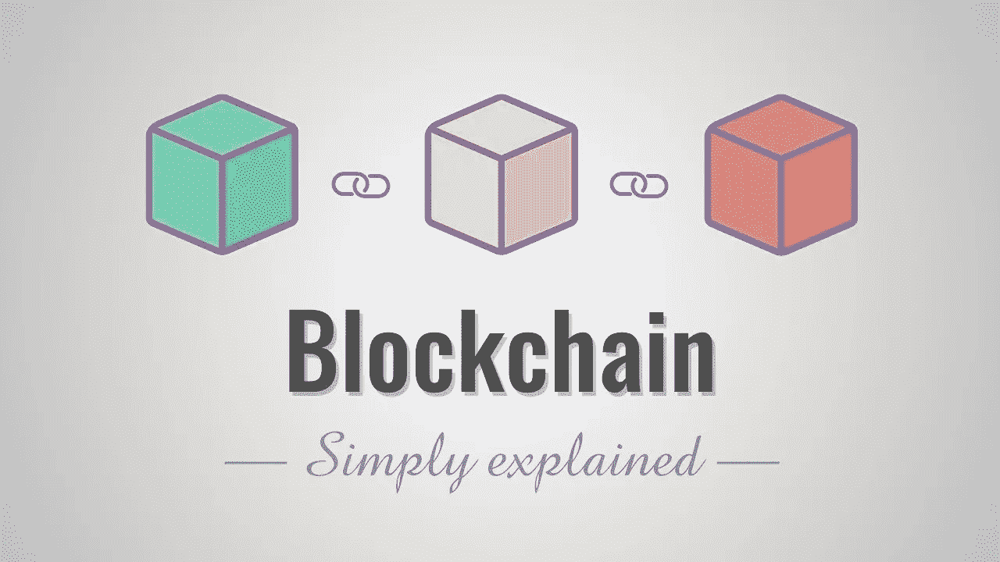

# 那么什么是区块链呢？“全栈开发者”

> 原文：<https://medium.com/coinmonks/so-what-is-a-blockchain-by-a-full-stack-developer-416a2ea3428f?source=collection_archive---------0----------------------->



source: [https://www.youtube.com/watch?v=SSo_EIwHSd4](https://www.youtube.com/watch?v=SSo_EIwHSd4)

关于区块链的炒作越来越多。但这到底是什么？

> 区块链是下一代技术，具有高度可扩展的分布式网络，支持智能合约，可用于解决许多问题。

现在大多数区块链的粉丝已经认为这只是另一篇复制粘贴的文章，我会告诉你我所知道的。我只是不希望他们批评这一点，因为有些事情不是根据他们所知道的:/

在我开始讲述区块链是什么之前，让我告诉你在我看到区块链之前我是什么。

# 我

我只是另一个现在随处可见的全栈 NodeJS 开发者


这就是我，我不羞于承认这一点。

那么，作为一个全栈开发人员，你都用什么呢？一些编码语言，一些运行它的平台，一些存储数据的东西等等。出于这种心态，我无法理解区块链是什么。对我来说，区块链可能只是用来存储银行信息。对于与加密货币相关的东西，你还能做什么？

# 僵尸

什么？僵尸？

哦，我只是喜欢在中间放一些有趣的东西，这样我就能引起你的注意。😆

所以有一天，当我厌倦了编写另一套 CRUD 操作时，我偶然发现了一个网站[https://cryptozombies.io/](https://cryptozombies.io/en/course)。就这样，孩子们，我对区块链的看法改变了。


完成他们的 6 课后，我学到的是:

1.  在区块链工作并没有那么无聊。
2.  它不仅仅是加密货币。

最初，当你开始上课时，你会觉得“啊，又一门要学的语言”，但为什么不呢？你是一个全栈开发人员，你可以用任何语言编写 hello world，并将其添加到你的简历中。

所以带着以上的目标我开始了。第一眼看上去，Solidity 就像 JavaScript，但带有一丝苦涩和一层焦糖。

你有合同，而不是课程。你要的合同..？？契约只是类的一个美化了的名字。班级？？将一组功能集合在一起的名称空间🙄

# 遗产

一个类或契约可以扩展另一个类的功能的概念。我不知道多少语言，但你如何继承的总趋势是

```
class SomeClass extends BaseClass {
```

这是有道理的。SomeClass 扩展了 BaseClass 的功能。

但是在坚固性方面，它就像

```
contract SomeContract is BaseContract {
```

现在又怎么了？？？这里的基础英语有缺陷。当一个对象 A 是 B，那么显然 A 不可能比 B 有更多的功能性，反正我是没人评判。

# 数据库

哦耶…你因为阅读“数据库”而变得兴奋…😈


source: [https://www.lynda.com/](https://www.lynda.com/SQL-Server-tutorials/Developing-Microsoft-SQL-Server-2014-Databases/383047-2.html) — An image because I now you don’t like to read longs texts

我理解的一件事是，区块链是某种存储数据的数据库。但是这是一种特殊的数据库，它存在于网络中的每个节点。因此，与我们将生产数据库保存在安全位置的总体趋势相反，我们实际上是将它发送给使用我们网络的每个人。

你用数据库做什么？读写？在这里你也做同样的事情。除了…！！！读数正常。但是写入时，您对存储的任何写入实际上都将写入区块链。永远*…..是的，您对数据所做的每个更改都会作为另一个数据添加到该节点上，然后传播到世界上的所有其他节点。(*现在这里有些人用术语* ***工作证明*** *，但是我现在还不是很懂但是一旦我懂了就会更新这个*)。

这类似于数据库复制，但不同之处在于，每个节点都能够写入网络，并且真正的数据是由共识决定的。所以如果我的名字是季斌，但是如果 51%的节点说我的名字不是季斌，那么网络就会说我的名字不是季斌。

还有一点需要注意的是，你写的每一篇文章或你做的任何操作都要花钱，特别是油钱。这意味着，如果你想在区块链把 a=1 换成 a=2，你就要花很多汽油。是的，执行它的人必须付费，而不是提供者(根据我目前的理解)。

# 但是为什么是另一个数据库呢？

另一个术语你会听到很多“**分权**”。这意味着，如果一个技术人员灭霸打个响指，摧毁了宇宙中一半的数据库，你的数据仍将完好无损，因为你的数据存在于每个节点。

基本上没有人能完全访问你的数据。在现有的基础设施中，某个特定的公司或个人将你的数据保存在你的数据库中，如果他们想要的话，可以根据他们的意愿修改它，并造成破坏。因此，如果明天谷歌判定你是罪犯，他们可以让它发生，除非其他人使用必应或其他搜索引擎。和区块链一起，我会有一份谷歌数据的拷贝。因此，如果谷歌改变他们节点中的数据，世界上其他网络不会同意并丢弃它。

区块链比这个博客所能涵盖的要大得多，我只是想鼓励你和区块链一起试水。这很有趣。我急切地等待着下一堂关于隐型僵尸的课。

因为你知道什么比全栈开发者更酷吗？

**全栈区块链开发者**

现在开始或者返回编写 CRUD 操作。选择权在你…