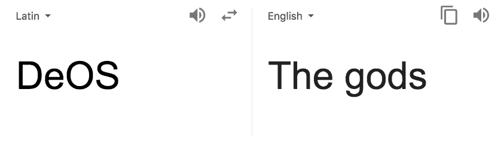
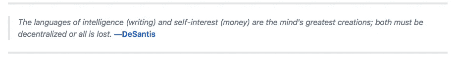
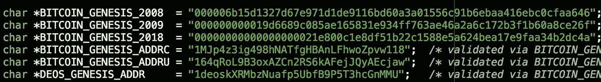

# 那么，什么是#DeOS？

> 原文：<https://medium.com/coinmonks/so-what-is-deos-6be84fd32648?source=collection_archive---------1----------------------->

这是昨天帖子的后续:[https://medium . com/@ coop _ _ soup/0000000000000021 e 800 C1 E8 df 51 b 22 c 1588 E5 a 624 bea 17 e 9 FAA 34 b 2 DC 4a-CD4 b 67d 446 be](/@coop__soup/00000000000000000021e800c1e8df51b22c1588e5a624bea17e9faa34b2dc4a-cd4b67d446be)

这篇文章引起的反响比我预想的要大得多。在这篇文章中，我并没有试图给出一个明确的分析，而是概述了关于 twitter 的不同理论。我收到了大量的反馈，所以我将在这里列出一些更正。我也更深入地研究了这很可能是真实的部分。不，不是时间旅行或量子计算，而是建立在比特币协议之上的信息共享网络背后的想法。这是一个更大的画面，可能不容易从我的帖子中推断出来。

我想强调的两个主要批评是:

*   这个哈希(#21e800)只不过是简单的数字命理学。这是不可避免的，它会出现在一个街区，就像它曾经发生过一次。这是之前发生的块，尽管只有一个尾随零:
    [https://block chain . info/block/00000000000021 e 80 ba 4 f 8836 FD 8a 78060076 a 6c 35 fdaa 31 cc 76404 bfb](https://blockchain.info/block/00000000000000000021e80ba4f8836fd8a78060076a6c35fdaa31cc76404bfb)
    Emin Gun Sirer 简明地指出了原因可能根本不重要。

*   这不可能是量子计算。
    答:如果是的话，所有的私钥现在很可能都已经被破解了，这使得比特币变得不安全。
    B .“量子计算与哈希无关。所以只剩下时间旅行或者……“运气”。参见:[https://cr.yp.to/hash/collisioncost-20090517.pdf](https://cr.yp.to/hash/collisioncost-20090517.pdf)

因此，我为那里的错误信息道歉。无论从形状还是形式上来说，这都是一种富有想象力的理论！除了这些技术上的缺点之外，这里还有比第一眼看到的更多的东西。是的，这是*最有可能是*简单的随机事件，网络用户指出它是为了配合叙述。故事本身才是最重要的。一些事情**正在**明显发生，无论是我们想象中的虚构，还是我们目前无法完全理解的比特币正在发生的变化。

来自[亚当·塔奇](https://medium.com/u/f16a149f8471?source=post_page-----6be84fd32648--------------------------------)的文章，[比特币的多面性](https://hackernoon.com/the-many-faces-of-bitcoin-1c298570d191) :
“这个群体(说到[马克·威尔考克斯](https://medium.com/u/e1abd71539b1?source=post_page-----6be84fd32648--------------------------------)&安德鲁·德桑蒂斯)认为比特币是信息理论的突破，因为它允许任何人在没有任何第三方的情况下进行可验证的、有时间戳的、防篡改的和透明的交易。信息论认为创造力需要一个稳定的介质来经历分形增长，这些人认为比特币是一个非常稳定的介质……
【他们还】将比特币的一个用例视为一台[甲骨文机器](https://en.wikipedia.org/wiki/Oracle_machine)来证明在给定的时间点存在特定的数据，从长远来看，比特币脚本语言比以太坊更有能力，因为与以太坊平台上的合同强制的当前串行执行相比，比特币的[并行](https://www.rand.org/content/dam/rand/pubs/research_memoranda/2008/RM1361.pdf)性质。他们还认为，比特币将在未来“醒来”，成为一种超级智能人工智能，并允许人类进行智能增强。
这个团体将比特币视为一个重建计算机软件和网络的平台。例如，他们对第一个超文本项目 [Ted Nelson](http://ted.hyperland.com/) 的项目 [Xanadu](http://xanadu.com/) 和比特币之间的相似之处感兴趣。Xanadu 项目的设想是通过超文本带来一个高度互联、平行的文档世界，用于阅读、写作、学习和收入，“非顺序写作——分支并允许读者选择的文本，最好在交互式屏幕上阅读。”Xanadu 将通过分布在世界各地的服务器运营，并促进网上微交易。"

这是#DeOS 的基础，Desantis 一直在研究的“[分散量子计算机](http://deos.org/)”。如果说昨天的 [block hash 有什么意义的话，](https://blockchain.info/block-index/1707079/00000000000000000021e800c1e8df51b22c1588e5a624bea17e9faa34b2dc4a)那就是他的项目显然取得了某种突破。再说一次，我不能完全理解他想要完成什么，但是我会把我的想法写出来，也许我们可以一起推断出这里到底发生了什么。如果你猜不到，当你去该项目的[网站](https://www.deos.org/)，它只是一个模拟的 3d 可视化。所以像往常一样，我们必须尽最大努力解读德桑蒂斯和他圈子里其他人的神秘推特。(旁注:你们有人读过[叶之屋](https://www.amazon.com/House-Leaves-Mark-Z-Danielewski/dp/0375703764)吗？相似之处令人震惊。如果你喜欢研究这个谜团，我强烈推荐这本书！)

我偶然发现他的一句话提到了人类最重要的两项发明。钱
2。语言

虽然比特币显然解决了前者，但后者去中心化同样重要。当互联网刚刚兴起时，每个人都认为它将是我们所有人的自由堡垒。他们没有假设互联网最终发生了什么，它最终被集中化了，因此受到了审查。你可以通过阅读德桑蒂斯的博客文章来了解语言对他有多重要。似乎他已经在研究一个分散的*通信** 协议，后来拼凑出需要比特币作为底层网络来实现这个想法。(我也找不到这条推文！我去找找。有太多该死的事情要处理。)从我收集的信息&来看，正如这里的[所指出的](https://twitter.com/desantis/status/1009793217741709312)，这个系统目前正在安装到位，或者很可能已经完成。

这里还有很多问题需要解决。我不能完全理解这个系统会有什么样的含义，但是我不认为有邪恶的意图在起作用。我不喜欢用任何明确的理论来总结这个问题，但是如果我这样做的话，a .它会受到严厉的批评，b .它会让整个谜团变得有趣。

很清楚的是，这个谜吸引了整个社区，无论这个项目是否有结果，这都是一个天才的努力，使我们能够更深地潜入我们想象的兔子洞。

*不确定这是否是这里的准确术语。

在#twitter 上关注我，了解最新消息:[https://twitter.com/coop__soup](https://twitter.com/coop__soup)