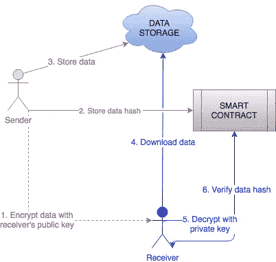
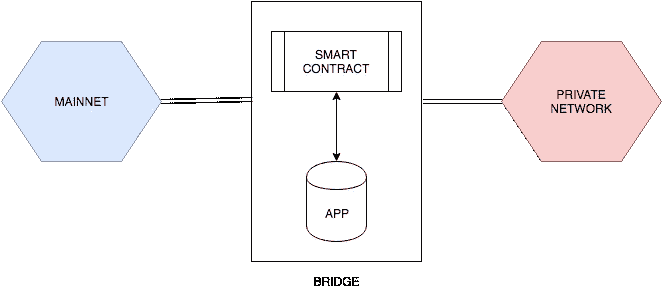

# 所以，你不希望你的区块链网络公开？

> 原文：<https://medium.com/coinmonks/so-you-dont-want-your-blockchain-network-to-be-public-bcc8ec676753?source=collection_archive---------2----------------------->

我们经常接触到一些客户，他们对与世界分享他们的一些数据感到不舒服，但被互联网上一些关于私人区块链是如何创建和工作的神话所迷惑。这篇文章将打破一些神话，并试图回答最常见的问题。

**公共 vs 私有 vs 许可的区块链网络**

简单说一下。

*公共网络*很好，因为它们是完全分散的，因此最安全。他们最好的用例之一是完全切断中间人，让用户在全球范围内互动。

*专用网络*的工作方式与公共网络几乎相同，但它们通常只由少数几个实体管理，这些实体达成共识，因此交易速度更快。网络通常由这些实体以他们想要的方式配置和管理。在隐私方面，默认情况下，这种网络仅不允许非参与者能够查看网络的参与者和合同。然而，它们不提供任何额外的隐私功能，而是作为应用程序的额外一层而内置的。

通过在协议中包含访问控制机制以及仅对授权网络参与者可见的私有事务，私有网络也可以被*许可*。然而，由于对大多数网络隐藏的私人交易，这并不罕见地以传统的集中式系统告终，因为它创建了盲目的透明性并破坏了区块链的一些关键特征。

**好的，我需要我的网络是私有的。**

这里通常出现的第一个问题是:“*我需要多少矿工？*”。你不需要任何采矿权力，因为工作证明不是达成网络共识的唯一途径！见见街区的新成员— *权威证明*。确认交易的实体“押上”他们的身份，而不是电或钱，因此这种实体通常是公司和某种组织，它们不想被网络抛弃或因网络欺诈的企图而公开感到羞耻。这些权限(验证器)可以在网络初始化时定义，也可以在以后投票决定。运行安全网络需要大多数验证者的签名。在不诚实的签名者的情况下，在被踢出之前不会有太大的损害，因为每个签名者每 N/2 + 1 个块只能签名一次。PoA 由于其便利性，在新的以太坊测试网和企业公司的其他私有网络中变得非常流行。

交易费用呢？既然是自建网络，可以把气价设为 0。这样，参与者就不需要花费 ETH 来进行交易。

网络能够处理多少交易？交易容量取决于阻塞气体限制和阻塞时间。这意味着要么在一个块中放入更多的事务，要么使块发布更快。根据架构的不同，如果设置过多，这些东西可能会影响稳定性，并使节点不同步。承认这一点需要反复试验。另一个后果是硬件限制，尤其是存储大小，因为空块大约是 1MB。5s 阻塞时间的默认设置可以提供 40–50tx/s 的传输速度。

那么，谁有读或写的权限？对两者来说，只有网络的参与者才是答案。对于写操作，权限是通过带有编程访问控制的智能合约来处理的，但是读操作是在另一层上完成的。只有一组参与者(通常是其中的两个)可见而网络中的其他人不可见的私有交易可以通过信道的概念来保证。然而，区块链上的隐私是一个新概念，社区正在致力于此，我们将很快看到零知识的实际应用，即 [zk-SNARKs](https://media.consensys.net/introduction-to-zksnarks-with-examples-3283b554fc3b) 和 [Arnaud @AZTEC 协议](https://medium.com/u/fcf0cd0b3216?source=post_page-----bcc8ec676753--------------------------------)。

**数据隐私**

首先，根据设计，大部分数据不应该存储在任何区块链网络上。尽管如此，你还有其他机会将你的数据连接到区块链网络。由于区块链是不可变的分类帐，您可以通过存储数据的加密*哈希*(摘要)来保证数据的完整性，只有当数据发生变化时，它的值才会发生变化。这使得数据是可验证的，意味着下载的文件与上传的文件是相同的。

数据必须加密，以确保它只能在正确的参与者之间读取。加密函数是要在链上完成的复杂计算，因此你无法通过智能合约真正做到这一点。但是，使用前面的组合验证方法，您可以存储离线加密和链上哈希加密的文件。异步加密可用于使用接收方的公钥加密数据，然后使用只有接收方知道的接收方的私钥解密数据。这种流在下面的模式中表示。

Flow for storing verifiable, encrypted and trusted data

**造桥**

如果你能把内部灵活性和全球参与者的规模经济结合起来，会怎么样？可以在您的专用网络和 *mainnet* 之间建立一座桥梁，这样用户就可以将他们的真实 ETH 转换为专用网络的令牌或 ETH，反之亦然。这不仅提供了更低的交易费用和更快的交易而不受 T2 主网 T3 拥塞的影响，而且还提供了经济激励和 T4 主网 T5 网络安全性的可能性。

Example of a network design with a simple bridge connection

这篇文章主要解释了如何使用以太坊区块链来实现私有网络，但是我们也在使用其他网络来实现，所以在接下来的文章中，我们将会讲述更多关于我们使用 [Hyperledger Fabric](https://www.hyperledger.org/projects/fabric) 和 [Quorum](https://www.jpmorgan.com/country/US/en/Quorum) 的经验。

[*node factory*](https://www.nodefactory.io/)*是一家区块链开发公司，提供分散应用程序的采用、集成和实现。我们一直在寻找新的冒险，所以请在 info@nodefactory.io 上告诉我们您的项目！*

此外，我们是致力于新 PoA 网络的团队的一部分，该网络将作为公共测试网，所以请继续关注关于 [*Lisinski*](https://github.com/hpoa) 的更多信息！

> [直接在您的收件箱中获得最佳软件交易](https://coincodecap.com/?utm_source=coinmonks)

