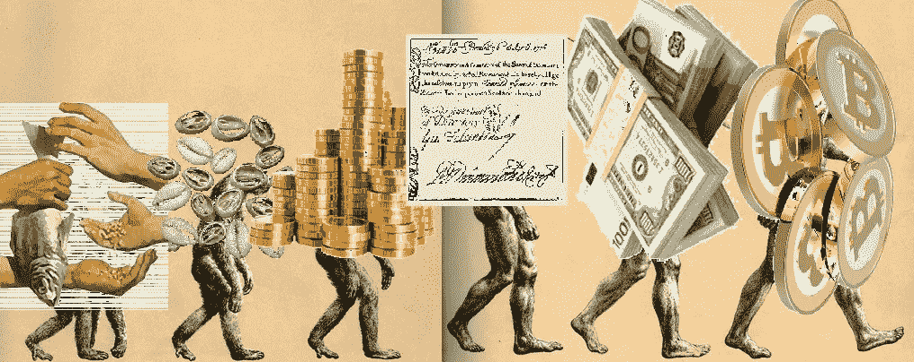
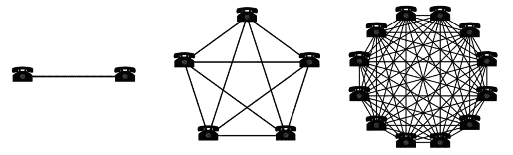
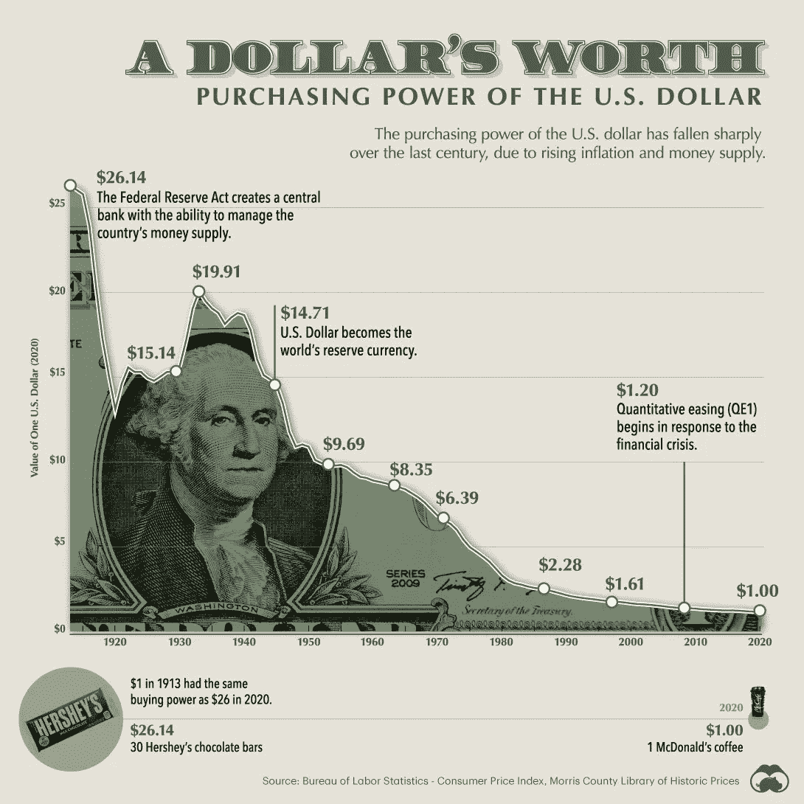

# 所以你认为你了解钱？

> 原文：<https://medium.com/coinmonks/so-you-think-you-know-money-c03c46265c84?source=collection_archive---------4----------------------->

## 金融知识 101

# **价值的概念**

在问钱是什么之前，我们需要解决另一个有趣的问题。

# “什么是 ***值*** ？”

# 价值是人类所有行为的目标。

在经济体系中，*货币*是价值的基本计算单位，它可以用来兑换人类为了实现目标而需要的任何东西。

这就是为什么金钱对每个经济体都如此重要的原因。

那么，货币就是一种交换媒介，它允许不同的当事人会面并就价值转移达成一致，给予他们购买任何他们可能需要的东西的选择权，以追求他们的目标并满足他们的需求。

# **那么钱是什么？**

> **“当涉及到钱的问题时，每个人都有相同的信仰”**
> 
> **伏尔泰**

所有这些类型的交换媒介都随着市场的发展而发展，在整个竞争过程中，市场决定了哪一种媒介最适合作为价值储存手段。

# 然后我们可以说，货币的目的是作为一种跨空间和时间表达信息的工具，如价值 T21。

因为金钱是一种工具，所以人们用他们的时间互相交易

# 然后，货币被及时称重。

# **货币的 3 大功能**

不过，我们都同意，所有这些类型的交换媒介都具有以下三个关键功能:

## 1) **交换媒介**

这意味着货币是一种手段，通过它我们能够进行贸易、易货和做生意，并被相关经济环境中的各方普遍接受。

## 2)价值储存

这基本上意味着货币随着时间的推移而保值。

今天值*的钱，明天*和明年可能值同样的钱，以此类推。

## 3)记账单位

货币是社会公认的事物定价的标准单位。

它通过*平衡*作为“**衡量标尺**”(*又名可分*)的游戏场来衡量经济价值，不仅允许价值转移，而且还平滑了经济环境中所涉及的各方之间的互动。

# 货币进化之路

The Evolution of money — from the intial barter to the more recent Cryptocurrencies such as Bitcoin

答虽然货币的目的始终与跨越空间和时间表达价值的**相同**，但用于实现这一目的的商品会随着市场的自然演变而发生变化。

特定商品对**价值随时间** ( *由于供应膨胀、变质、新技术的实施、消费者行为的改变、自然因素等而稀释的抵抗力越大。*，它作为**储值手段就越有效。**

那些认识到这种价值储存的人非常愿意使用它作为交换媒介。

金钱，正如我们在现代所期望的那样，已经进化并采用了一些特征，将它转化为你现在手中所握的东西。

由于相对优势，争夺货币商品报价，人类已经多次改变了交易的工具，使我们能够识别不同类型的货币。

# 网络效应

The network effect displayed using the telephone as example

事实证明，尽管社会很复杂，但在受到**‘网络效应’，** **推动的过程中，社会倾向于采用最优越的技术形式，这是一种现象，通过这种现象，越来越多的人或参与者提高了商品或服务的价值。**

> 互联网是网络效应的一个例子。
> 
> 最初，互联网上的用户很少，因为除了军方和一些研究科学家之外，它对任何人都没有什么价值。然而，随着越来越多的用户接入互联网，他们产生了更多的内容、信息和服务。网站的发展和改进吸引了更多的用户相互联系和做生意。随着互联网流量的增加，它提供了更多的价值，从而产生了网络效应。

随着越来越多的人迁移和采用该技术，它鼓励其他人也这样做，因为更多的网络参与指数级地增加了可能的通信伙伴的数量。

> 约翰·龙[撰写的这篇详尽的文章对这一迷人的现象和调节它的梅特卡夫定律进行了更深入的解释。](https://medium.com/u/935314b97931)

 [## 梅特卡夫定律 101

### 网络效应“定律”浅释

john-ryu.medium.com](https://john-ryu.medium.com/metcalfes-law-101-69733d33b167) 

网络效应的概念尤其与金钱纠缠在一起，因为人类总是试图找到一种更有效的方式来跨越时空转移和保留价值。

# 金钱的六大属性

随着时间的推移，人们进行交易，他们尝试不同的货币商品，市场力量倾向于货币，这呈现出以下 6 个特性:

**1)耐久性**——保持其特征的能力，*又名*对物理退化具有弹性；

**2)便携性** —便于携带和移动；

3)可分性——容易被分割/分离成更小的单位，因此可以更精确地匹配商品价值；

**4)统一** —建立各种面额外观的标准(*单位*)；

**5)限量供应**——通过限量来确保货币保值，暗示货币生产有一定难度，使其成为成功的价值储存手段。

> 不幸的是，在过去三十年的货币政策中，中央银行印刷了大量的货币，情况并非如此，正如我们在这张令人大开眼界的信息图中看到的那样，美国美联储毫不费力地印刷了 10+万亿美元的 2020 年经济刺激计划:

[2020 年印多少钱可视化(demonocracy.info)](https://demonocracy.info/infographics/usa/us_stimulus_package_10_trillion_2020/us_stimulus_package_10_trillion.html)

**6)可接受性&可识别性** —被参与经济的每一个人所认可和认证(*普遍可识别*)。

# 作为货币的黄金

历史上，**商品**如**盐**、**海贝**、**牛**被用作*交换媒介，*随后就退出了货币金属的舞台，如**黄金**和**白银**。

然而，在所有金属中，**黄金**是最稀缺的，也是跨越时空保值的最佳工具。

然而，由于黄金是实物*而*重*，它缺乏**便携性，**因此运输和保护起来都很昂贵，限制了它作为货币在**跨空间表达价值**方面的效用。*

由于社会的深刻变化和市场的不断发展，影响市场的自由力量使得货币有必要做出一些改变。

政府和机构开始发行可兑换黄金的货币，也称为**代表货币**，只不过是一种证书或一种‘***代币***’，代表个人或政党对货币的**要求**以换取有价值的东西。

**银行**具体来说，*提高了*黄金跨空间表达价值的能力，但它提出了一个**问题**:

# 这些黄金支持的货币需要相信银行和政府不会发行超过其黄金储备的货币。

历史证明，这种**信任**一再被打破，在 **1971 年，**与黄金挂钩被彻底打破，这给了中央银行无限的能力来任意妥协货币的稀缺，从而从社会窃取货币，并严重加深贫富差距。

> 让我们想想美元，它最初是作为一种“T4”的合法要求来赎回银行金库里的黄金，但是在 1971 年 8 月 13 日星期五，时任总统的理查德·尼克松让美国脱离了金本位制，导致了美元缓慢但不可阻挡的贬值。

The loss fo purchasing power due to both economic policies, historical events and the end of the gold standard led to an impoverishment of the US citizines.

金本位制的放弃导致了货币演变(尽管很有争议)成现在的形式，这种**法定货币** ( *源自拉丁语‘顺其自然/顺其自然’*)基本上是一种**权威**政府反对人民，它基于**信任**于 ***的概念，政府说你手中持有的这张纸是有价值的***

In our current FIAT system, money are barely worth the paper they are printed with, let alone the value the government establishes about them

理解决定什么是金钱的核心要素是很重要的，因为我们生活中的很大一部分时间都在挣钱、存钱、投资，以及在现代网络经济中我们能想到的所有用途。

这篇文章的重点是让你更多地思考什么是现代的法定货币，你需要付出什么才能获得它，以及事实上，正如我们所知，货币基本上是一个由真正危险的货币政策支撑的游戏，这些政策导致了对政府和机构信任的侵蚀。

在这方面， ***【区块链】*** 以及相关的技术变革将会大规模扰乱当前的经济状况。工业革命开创了一个商业模式以等级制度和金融资本主义为基础的世界。

> 区块链革命将见证一个由人类资本主义和更大的个人自主权主导的经济。

目前还不清楚这将如何展开。企业家和创新者将一如既往地通过试错过程来解决不确定性。毫无疑问，在我们确切知道这种破坏将如何展开之前，巨大的财富将会被创造和失去。

**了解我们的新平台**👉**[**【https://thecapital.io/】**](https://thecapital.io/)**

**[https://twitter.com/thecapital_io](https://twitter.com/thecapital_io)**

> **加入 Coinmonks [电报频道](https://t.me/coincodecap)和 [Youtube 频道](https://www.youtube.com/c/coinmonks/videos)了解加密交易和投资**

# **另外，阅读**

*   **[币安 vs FTX](https://coincodecap.com/binance-vs-ftx) | [最佳(SOL)索拉纳钱包](https://coincodecap.com/solana-wallets)**
*   **[比诺莫评论](https://coincodecap.com/binomo-review) | [斯多葛派 vs 3Commas vs TradeSanta](https://coincodecap.com/stoic-vs-3commas-vs-tradesanta)**
*   **[Capital.com 评论](https://coincodecap.com/capital-com-review) | [香港的加密借贷平台](https://coincodecap.com/crypto-lending-hong-kong)**
*   **[如何在 Uniswap 上交换加密？](https://coincodecap.com/swap-crypto-on-uniswap) | [A-Ads 评论](https://coincodecap.com/a-ads-review)**
*   **[WazirX vs coin dcx vs bit bns](/coinmonks/wazirx-vs-coindcx-vs-bitbns-149f4f19a2f1)|[block fi vs coin loan vs Nexo](/coinmonks/blockfi-vs-coinloan-vs-nexo-cb624635230d)**