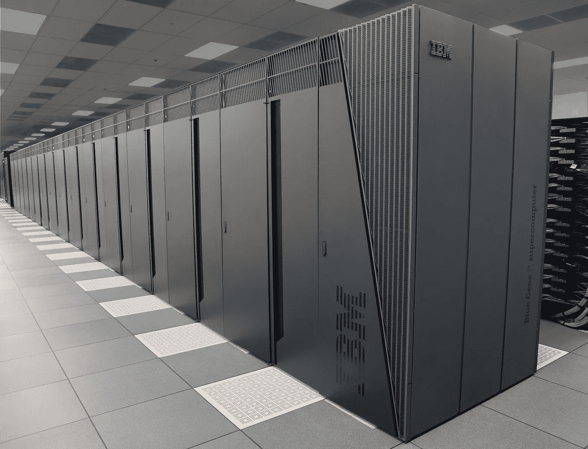

# 如何开始量子编码

> 原文：<https://medium.com/coinmonks/so-you-want-to-be-a-quantum-coder-7ffed2b5741b?source=collection_archive---------5----------------------->

## 开始编写量子程序并在真正的量子计算机上运行它们所需要的东西

你可能听说过所有关于量子计算的炒作，以及它有多神奇等等。这很好，但是现在你想开始写一些量子程序。为此，您有几个选择。

# 选项 1: [IBM Q 体验](https://quantumexperience.ng.bluemix.net/qx/experience)

这可能是你最好的选择。使用 IBM Q Experience 的主要优点是，它让您有机会在多达五台不同的量子计算机上运行您的程序，有些计算机有多达 20 个量子位，并且有多种方式来编写量子程序。有一个可视化的程序编辑器或“Composer”，您可以在其中拖放 quantum gates 来创建程序，或者如果您更喜欢基于文本的编程，您可以使用“Qasm 编辑器”来编写程序。一旦你写了一个程序，你可以很容易地模拟它，或者你可以在他们的量子计算机上运行它。(还有一个有用的 SDK 叫做 [QISKit](https://developer.ibm.com/code/open/projects/qiskit/) 。我不太清楚它是做什么的，但是如果您打算经常使用 IBM Q，您应该研究一下。)

一切都在您的浏览器中完成，不需要下载，因此非常容易上手。唯一的缺点是没有很多量子门可以使用，所以你的能力相当有限。

如果 IBM Q 听起来不错，您可以在这里开始使用它。如果你想让你的程序变得更复杂，请继续读下去。

# 选项 2: [微软的 Q#](https://www.microsoft.com/en-us/quantum/)

如果你想要一个完整的编程语言，其中包含关于量子位的基本属性以及它们如何相互作用的文档和详细的数学解释，或者只是想要一种更传统的编写程序的方式，Q#和微软量子开发工具包就是为你准备的。

Q#是量子计算机的编程语言，你可以用它来写量子程序。QDK 还附带了一个模拟器，允许您运行程序的模拟，让您了解量子编程将会是什么样子。

要使用 Q#编程，您需要编写一个 Q#程序，它将在 quantum 处理器上运行，并且该程序由 C#驱动程序运行，该驱动程序也管理输出。我建议在开始之前至少通读[文档](https://docs.microsoft.com/en-us/quantum/index?view=qsharp-preview)的前几节。

目前没有量子计算机运行 Q#程序，但是对于大多数用户来说，模拟器应该足够令人满意。

你可以在这里下载量子开发工具包。它适用于 Windows、macOS 和 Linux。

# 选项 3:布里斯托大学的“云中的[量子](http://www.bristol.ac.uk/physics/research/quantum/engagement/qcloud/computer/)

如果你需要从基础开始，云中的量子是一个很好的探索工具。云模拟器中的在线量子类似于布里斯托尔大学的小型量子处理器，它使用光子和移相器进行处理。然而，一旦你玩了他们的模拟器，你就可以在他们的量子计算机上运行你的程序。

这对于首次探索量子计算来说很好，但与选项 1 和 2 相比，这算不了什么。没有办法保存程序或以文本形式表示它们，本质上对光子只有一种操作。

你可以在这里开始使用模拟器。

# 最后的想法

我已经向你们展示了，在我看来，开始编写量子程序的最佳选择。当然，你可以在[维基百科](https://en.wikipedia.org/wiki/Quantum_programming)上读到一些其他的选择，但是很少能和这些相比。你已经得到你想要的了。

祝学习量子编程愉快！