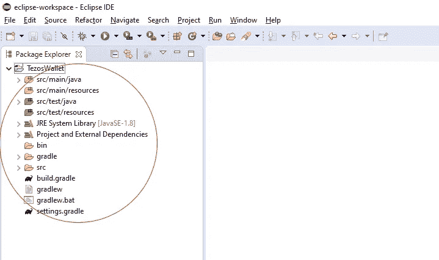

# 所以你想把 Tezos 列在你的交易所里？

> 原文：<https://medium.com/coinmonks/so-you-want-to-list-tezos-in-your-exchange-9d1f5ff87125?source=collection_archive---------1----------------------->

## 将 Tezos 集成到您的系统的逐步指南

泰佐斯上新闻了。这是一个稳健的项目，将持续很多年。自 mainnet 启动以来，非常能干的人一直在努力工作，为其奠定基础。现在结果开始显现了。

突然间，每个人都在社交媒体上谈论 Tezos，并要求他们最喜欢的加密交易所将 Tezos 加入他们的投资组合。

本文将展示将 Tezos 添加到您的交易所列表是多么容易。

第一步——选择一种计算机语言

现在有许多关于计算机语言的选择来开发软件。当然，你的交换已经有了一种语言选择，你的开发团队也有了一种用这种语言构建东西和集成系统的文化。

步骤 2—选择一个库

将 Tezos 集成到您的系统中最简单的方法是使用一个库。与泰佐斯·区块链互动的所有复杂性已经被库开发者嵌入到代码中。这意味着已经建立了一套访问 Tezos 区块链的方法和函数，您的开发团队会很高兴使用它们，因为它们会使工作简单很多。

然而，您将使用哪个库取决于您在步骤 1 中选择的计算机语言。以下是目前可用的 Tezos 库列表(根据 developers.tezos.com 的说法)及其对应的语言:

```
+-------------------+-----------------------+
|      Library      |       Language        |
+-------------------+-----------------------+
|  Taquito          |  TypeScript           |
|  ConseilJS        |  Node.js/Javascript   |
|  ConseilPy        |  Python               |
|  TezosKit         |  Swift                |
|  PyTezos          |  Python               |
|  Eztz             |  Javascript           |
|  TezBridge        |  Web application      |
|  Go-Tezos         |  GoLang               |
|  AirGap-Coin-Lib  |  Node.js/Javascript   |
|  TezosJ_SDK       |  Android Java         |
|  TezosJ_plainJava |  Java                 |
|  Netezos          |  .NET                 |
+-------------------+-----------------------+
```

对于本教程的第一部分，我们将使用 TezosJ_plainJava 库，该库旨在通过使用默认的 Java 语言将 Tezos 集成到其他系统中。已经有相当数量的交易所使用 TezosJ_SDK 作为他们首选的集成工具。

我们将使用 Eclipse IDE 创建一个简单的 Tezos 钱包，并提供简短的示例。

步骤 3 —设置钱包测试项目

打开 Eclipse IDE。您应该会看到这样的屏幕:


Eclipse IDE start screen

选择菜单文件->新建->项目:


在“选择向导”窗口中，选择 Gradle 项目，然后单击“下一步”按钮两次:


现在只需将项目名称设置为 TezosWallet，然后单击 Finish 按钮:


等待 Eclipse 用所有需要的文件创建项目。这可能需要一点时间，因为它将从 bintray 下载它们。

您现在应该有这样的项目结构:



完美。现在我们将添加 Java JAR 库文件。去[泰佐斯。Rio github 库](https://github.com/TezosRio/TezosJ_plainJava)和下载文件[tezosj-SDK-plain-Java-1 . 0 . 9 . jar](https://github.com/TezosRio/TezosJ_plainJava/raw/master/tezosj-sdk-plain-java-1.0.9.jar)

在文件浏览器中，复制 tezosj-SDK-plain-Java-1 . 0 . 9 . jar 文件(CTRL+C)。

返回 Eclipse，单击项目名称，用 CTRL+V 粘贴。

该文件将显示为添加到项目结构中:


现在只需在 tezosj-SDK-plain-Java-1 . 0 . 9 . jar 文件上单击一次鼠标右键，然后选择 Build Path -> Add to Build Path:


一切就绪。现在，我们准备开始打造自己的 Tezos 钱包。

让我们创建我们的主类。右键单击 src/main/java 并选择 New -> Class:


键入 Main 作为类名，选中“public static void Main ”,然后按 Finish 按钮:


好吧。现在我们已经建立了所有的项目。然而，如果您运行项目(选择 Main 作为启动类)，控制台上不会显示任何内容:


所以，让我们从实例化 TezosWallet 类开始。

在主类中，键入:

```
TezosWallet wallet = new TezosWallet("passphrase");
```

您会注意到，Eclipse 最初不会识别 TezosWallet 类:


只需点击 TezosWallet 类引用并选择导入类的选项:


你也必须用试抓来包围它。只需将下面的代码复制并粘贴到您的主类中:

```
 try
        {
            TezosWallet wallet = new TezosWallet("passphrase");
        }
        catch (Exception e)
        {
            e.printStackTrace();
        }
```

现在，如果您运行您的项目，您将看到一些动作。然而，还没有非常有用的东西。所以，让一些重要的东西出现在控制台上。将代码更改为如下所示:

```
try
{
   TezosWallet wallet = new TezosWallet("passphrase");
   System.out.println("PubKey hash:" + wallet.getPublicKeyHash());
   System.out.println("Mnemonic   : " + wallet.getMnemonicWords());
   System.out.println("Balance    : " + wallet.getBalance());
}
catch (Exception e)
{
   e.printStackTrace();
}
```

再次运行该项目。你现在会得到一个有趣得多的结果:


瞧！你已经有了一个真正的 Tezos 钱包，可以在 mainnet 上进行交易了！再简单不过了！

请注意，现在您已经有了助记符和密码短语，您可以通过使用不同的类构造函数来构建 wallet，如下所示:

```
TezosWallet wallet = new TezosWallet("manual avoid finger target drive badge trip involve blind myself main inspire bird romance face", "passphrase");
```

只要试一试，您就会看到地址总是带有这些参数的 tz 1 PS 7 quq 5 wjimvedspt 9 u 28 hrgwcwjmavk 8。

现在我们有了一个合适的功能性钱包，让我们来玩一玩。

向另一个地址发送一些 tez:

```
BigDecimal amount = new BigDecimal("0.123456");
BigDecimal fee = new BigDecimal("0.00294");
JSONObject jsonObject = wallet.send(wallet.getPublicKeyHash(), "tz1ToAddress", amount, fee, "", "");
System.out.println(jsonObject.get("result"));
```

将钱包保存到磁盘:

```
wallet.save("c:\\temp\\mySavedWallet.txt");
```

从磁盘加载先前保存的钱包:

```
TezosWallet myLoadedWallet = new TezosWallet(true, "c:\\temp\\mySavedWallet.txt", "passphrase");
```

发起操作:

```
BigDecimal fee = new BigDecimal("0.001300");
BigDecimal amount = new BigDecimal("2");
JSONObject jsonObject = wallet.originate(wallet.getPublicKeyHash(), true, true, fee, "", "", amount, "", "");
System.out.println(jsonObject.get("result"));
```

委托操作:

```
BigDecimal fee = new BigDecimal("0.001300");
JSONObject jsonObject = wallet.delegate("kt1_delegatorAddress", "tz1_delegate_address", fee, "", "");
System.out.println(jsonObject.get("result"));
```

在这个完整的示例中，让我们将它与许多其他重要功能放在一起，如批量支付、区块链结果等待等:

```
// Creates a new wallet with a passphrase.
TezosWallet wallet = new TezosWallet("myPassphrase");

// Or... creates (imports) a new wallet with its keys.
// TezosWallet wallet = new TezosWallet(privateKey, publicKey, publicKeyHash, myPassphrase);

// Or... imports a previously owned wallet with mnemonic words and passphrase.
// TezosWallet wallet = new TezosWallet("word1, word2, word3, ... word15 ", "myPassphrase");

// Some environment configuration.
// wallet.setIgnoreInvalidCertificates(false);
// wallet.setProxy("", "");

// Shows some wallet data output. 
System.out.println(wallet.getMnemonicWords());
System.out.println(wallet.getPublicKeyHash());
System.out.println(wallet.getBalance());  

// Saves the current wallet from memory to file.
wallet.save("c:\\temp\\mySavedWallet.txt");

System.out.println("Saved the wallet to disk.");

// Creates a new wallet by reading from file.
TezosWallet myLoadedWallet = new TezosWallet(true, "c:\\temp\\mySavedWallet.txt", "myPassphrase");

 System.out.println("Loaded the wallet from disk:");

 // Shows loaded wallet data. 
 System.out.println(myLoadedWallet.getMnemonicWords());
 System.out.println(myLoadedWallet.getPublicKeyHash());
 System.out.println(myLoadedWallet.getBalance());  

 // Example of Sending funds.
 // BigDecimal amount = new BigDecimal("0.123456");
 // BigDecimal fee = new BigDecimal("0.00294");
 // JSONObject jsonObject = wallet.send("tz1FromAddress", "tz1ToAddress", amount, fee, "", "");
 // System.out.println(jsonObject.get("result"));

 // Using Conseil Gateway, from Cryptonomic.
 // ConseilGateway cg = new ConseilGateway(new URL("<URL>"), "<APIKEY>", "alphanet");

 // Example of origination operation.   
 // BigDecimal fee = new BigDecimal("0.001300"); // Needed fee for origination.
// BigDecimal amount = new BigDecimal("2"); // Starting new kt1_delegator address balance.
// JSONObject jsonObject = wallet.originate(wallet.getPublicKeyHash(), true, true, fee, "", "", amount, "", "");
// System.out.println(jsonObject.get("result"));

// Example of delegation operation.
// BigDecimal fee = new BigDecimal("0.001300");
// JSONObject jsonObject = wallet.delegate("kt1_delegatorAddress", "tz1_delegate_address", fee, "", "");
// System.out.println(jsonObject.get("result"));

// Example of undelegation operation.
// BigDecimal fee = new BigDecimal("0.001300");
// JSONObject jsonObject = wallet.undelegate("kt1_delegatorAddress", fee);
// System.out.println(jsonObject.get("result"));       

// Tools

// Routine to extract the publicKey from a privateKey.
// String mySecretKey = "edsk...";
// String publicKey = Crypto.getPkFromSk(mySecretKey);
// System.out.println(publicKey);

// Batch transactions.

// Example of sending batch transactions.

// Clears the transactions batch.
// wallet.clearTransactionBatch(); 

// Adds a first transaction to the batch.
// wallet.addTransactionToBatch("from_address", "to_address", new BigDecimal("1"), new BigDecimal("0.00294"));

// Adds a second transaction to the batch.
// wallet.addTransactionToBatch("from_address", "to_address", new BigDecimal("2"), new BigDecimal("0.00294"));

// Adds a third transaction to the batch.
// wallet.addTransactionToBatch("from_address", "to_address", new BigDecimal("3"), new BigDecimal("0.00294"));

// Note that "from_address" above maybe the manager address or its originated kt1 addresses.

// Gets a list of wallet's current (pending) batch transactions.
// ArrayList<BatchTransactionItem> myBatchTransactionsList = new ArrayList<BatchTransactionItem>();
// myBatchTransactionsList = wallet.getTransactionList();

// Sends all transactions in the batch to the blockchain and clears the batch.
// JSONObject jsonObject = wallet.flushTransactionBatch();
// Or... Specifying gasLimit and storageLimit:
// JSONObject jsonObject = wallet.flushTransactionBatch("15400","300");       
// System.out.println("Batch transaction sent! Returned operation hash is: ");
// System.out.println(jsonObject.get("result"));

// Synchronously waits for previous operation to be included in a block after sending another one.
// (this is to be used if you need to send a sequence of single transactions, having to wait first for each one to be included).

// BigDecimal amount = new BigDecimal("0.02");
// BigDecimal fee = new BigDecimal("0.00294");
// JSONObject jsonObject = wallet.send("tz1FromAddress", "tz1ToAddress", amount, fee, "", "");
// String opHash = (String) jsonObject.get("result");
// Boolean opHashIncluded = wallet.waitForResult(opHash, numberOfBlocksToWait);
// System.out.println(opHashIncluded);
// Now it is safe to send another transaction at this point.
```

你可以通过浏览 github 库获得更多关于 TezosJ_SDK_plainJava 库的细节，网址是[https://github.com/TezosRio/TezosJ_plainJava](https://github.com/TezosRio/TezosJ_plainJava)

本教程展示了构建 Tezos 钱包并将其集成到交换系统、网站、游戏等等是多么简单。

在接下来的章节中，我们将会看到如何对其他库做同样的事情。敬请期待！

派特索斯教程:【https://baking-bad.github.io/pytezos/ 

[](https://coincodecap.com)

> [在您的收件箱中直接获得最佳软件交易](https://coincodecap.com/?utm_source=coinmonks)

[](https://coincodecap.com/?utm_source=coinmonks)