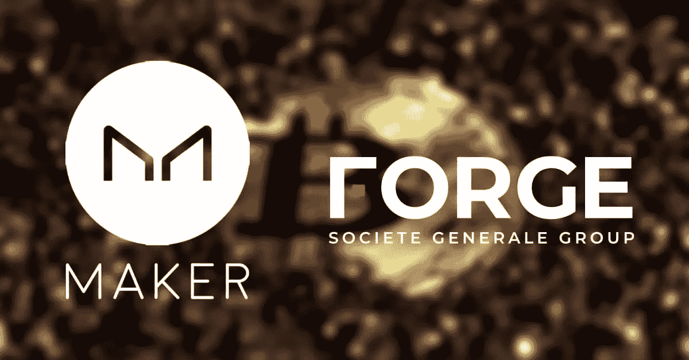
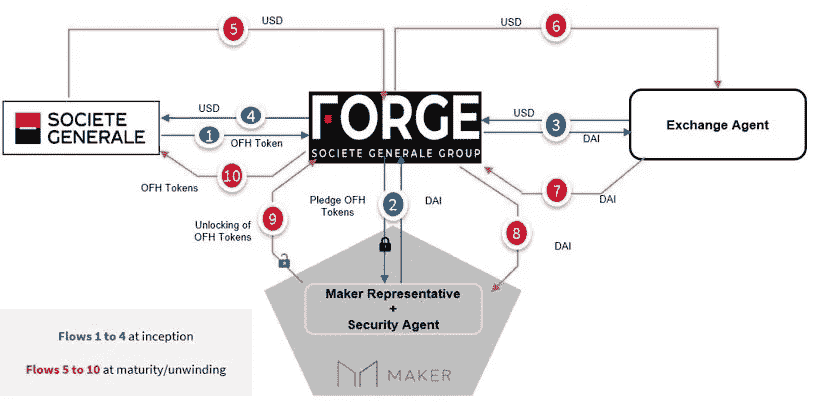

# 法国兴业银行— MakerDAO:银行再融资是 TradFi 和 DeFi 的首次合作

> 原文：<https://medium.com/coinmonks/soci%C3%A9t%C3%A9-g%C3%A9n%C3%A9rale-makerdao-banking-refinancing-as-the-first-collaboration-between-tradfi-and-defi-6fa633831734?source=collection_archive---------4----------------------->

2021 年 10 月 1 日，法国银行集团兴业银行(Société Générale)的子公司 Forge 对 MakerDAO 协议发布了一项 MIP (MIP6 或 MakerDAO 改进提案 6)，通过质押对令牌化的有价证券进行再融资。PoC(概念验证)的这一子类型代表了传统金融界(TradFi)和 DeFi 之间的首次互动，DeFi 是一个金融生态系统，其中传统金融动态通过分布式架构(即通过区块链)复制。

在这方面，在解释交易的结构之前，应该注意的是，在降低交易成本方面通过利用 DeFi 寻求的效率被审慎监管提供的保护机制的缺乏所抵消。这些机制可分为主动型(会计准则、报告义务、审计制度)或被动型(投资担保基金、存款或最后手段的流动性工具或 ELA[【1】](#_ftn1))并允许参与者最大限度地提高传统业务的利润率，以换取通过费用为创建这些机制做出贡献。在 DeFi 生态系统中，当与不受监管的主体或甚至与缺乏法人资格的实体(如 Dao)一起运营时，监管方案不适用，因此，运营是通过超过 100%的抵押程度来构建的，这保证了有足够的保证金要求来平仓而不会造成损失。

> 订阅 [**Coinmonks Youtube 频道**](https://www.youtube.com/c/coinmonks/videos) 获取每日加密新闻。

## **分析底层**

根据法国法律，该交易的基础资产是一笔 4000 万欧元的担保债券，由住房抵押贷款支持。该债券由母公司发行，子公司 Forge 认购，支付 0%的固定利息。因此，执行再融资交易的工具符合国际会计准则 IFRS 9[【2】](#_ftn2)中有关金融工具的定义。但是，仅出于会计理解的目的，由于没有支付利息，且交易是集团内部的——结果和资产负债表项目在母公司的合并账户中被消除——因此，它应被视为子公司的出资和母公司的股息分配交易，而不是单一的债务发行和认购。

在任何情况下，它都不能被归类为加密资产交易，而是金融工具交易，因为它们受技术中立原则的管辖(尽管适用登记制度，但工具的特征不会改变)，它们不受 MiCA 法规[【3】](#_ftn3)的监管，但受 MiFID II[【4】](#_ftn4)的监管。换句话说，它们属于**【证券代币发行】**的范畴，作为代币化的金融工具。

分析的 STO 是自 2019 年以来已经执行的一系列问题的一部分，旨在验证 STO 产生的运营和监管负担，以及监管预期的预期。这些操作的结构是由实体本身认购的简单债务发行，模拟区块链技术下的当前资本市场基础设施，尽管这些操作仅限于一级市场。

它们如下:

*   04/18/2019:法国兴业银行(Société Générale)在以太坊发行 1 亿英镑担保债券，由母公司全额承销，穆迪和惠誉评级为 AAA。
*   2020 年 5 月 14 日:法国兴业银行在区块链(未指明)发行 4000 万英镑担保债券，由母公司全额认购，并通过法兰西银行在区块链发行的中央银行跟单信用证支付。
*   2021 年 4 月 15 日:在 Tezos 上发行 1 亿美元结构债券，由母公司全额认购。

一旦 sto 展示了建立一级市场(在该市场上发行和承销证券)的技术、运营和监管能力，它们面临的挑战是创建二级市场，特别是在银行部门。

## **操作的特征**

所分析的操作可归类为受监管世界中与 DeFi 的第一次已知互动，包括通过抵押担保债券(OFH 代币)的发行进行再融资。这些代币以前是由兴业银行在上述业务中发行的，通过区块链以太坊转给 Forge，以换取美元贷款。为此，在转让代币后，Forge 在 MakerDAO 开立 CDP(债务抵押头寸),以上述代币换取 DAI，因为 DAI (stablecoin)的发行总是以先前的抵押为条件。通过 Forge 获得的 DAI 将通过一个交易所(尚未透露是谁)兑换成美元，进而向 Société Générale 发放贷款。

在偿还 Société Générale 向 Forge 提供的美元贷款后，戴收到的美元被兑换成现金，以解除金库在 MakerDAO 的头寸，从而允许释放抵押品(代币)。

Societe Generale Forge MIP6 diagram

[【5】](#_ftn5)

最终，Forge 承销了由其母公司 Société Générale 发起的融资，随后，MakerDAO 通过 Forge 的证券抵押为 Forge 的头寸进行再融资。

## **操作的优点**

通过区块链的交易结构可能**降低交易成本**，即运营和技术成本。必须对这些的计算进行分析*特别，特别，*并且还没有可比较的交易允许进行这样的操作。然而，这种交易中相关参与者的替换，如交易后系统(清算、登记和结算)，区块链的处理能力，以及通过 DeFi 实现的债务再融资过程的自动化，而不是银行部门的传统谈判，可以推断交易的整体盈利能力有所提高。

此外，该操作为 MakerDAO 提供了使用 stablecoins 以外的工具(USDC、系绳等)打开 CDP 的可能性。)或其他类型的加密资产(BAT、以太坊)。尽管协议中尚未定义，但开立 CDP 所需的抵押程度可能会有所不同，具体取决于充当抵押品的资产类型，以及平仓时应用稳定费或罚金所需的利息。这是因为抵押工具的特征和风险是不同的。

然而，该协议规定，CDP 充当认捐分庭，违反合同义务将导致执行头寸，并将销售中获得的资金用于支付参与节点所欠的金额。在任何情况下，协议都不允许 MakerDAO 代位取得抵押票据的所有权。

给出以太坊、USDC 和 OFH 安全令牌的例子是为了理解使用这些资产所带来的风险和收益范围:

*   **以太坊:**传统的加密资产，其发行没有抵押支持或额外担保。以太坊受制于价格风险，因为它是一种高度不稳定的资产。
*   **USDC:** 一种非连锁担保稳定币，其发行取决于之前的货币存款，此处为美元。货币的支持保证了其价值的稳定，从而降低了价格风险。USDC 的价值下跌，直到违反 MakerDAO 要求的抵押程度，这将导致 CDP 中质押头寸的执行，即 CDP 的关闭。这将导致价格套利，USDC 代币持有人可以用每单位法币兑换 USDC 代币，收回 1 美元。套利交易自动增加了对 USDC 的需求，这反过来提高了它的价格，直到 1 USDC 等于 1 美元，机会关闭。
*   **OFH 代币:**担保债券是由信贷机构发行的可交易债务工具，由符合条件的住宅抵押贷款组合支持(符合一定要求)，有四重保障:符合条件的抵押贷款组合产生的现金流、组合中符合条件的贷款的抵押财产、抵押法规要求的一系列置换资产以及担保债券发行人的偿付能力。这些抵押品增加了投资者的兴趣，保证了其价值的稳定性。

此外，为了计算资本，即资本充足率的分母，需要计算与每项资产相关的意外损失的风险，不同的 CDP 根据担保它们的抵押品进行加权。从这个意义上来说，为了优化风险管理策略，CDP 的结构可能受到数量限制，因此 MakerDAO 只允许一定数量的 CDP 具有以太坊抵押品，另一个数量具有 stablecoins，另一个具有安全令牌。未来欧洲对加密资产的监管要求稳定的硬币发行者满足资本要求的可能性很高，因为它们可能会改变货币政策传导机制和基于存款的银行融资模式，从而给金融稳定带来风险。法国兴业银行为这些 CDP 的校准带来了另一种选择，这些 CDP 是影响整个 MakerDAO 财务动态的关键因素。

## **结论**

通过区块链的传统融资业务的结构在交易成本方面具有优势，这是从区块链的分布式性质(相对于传统银行业的集中式性质)以及流程自动化中推断出来的，并允许将新的受监管和象征性的金融工具纳入可抵押资产池，这增加了 MakerDAO 在 TradFi 领域的使用案例。

[【1】](#_ftnref1)紧急流动性援助

[【2】](#_ftnref2)国际财务报告准则

[[3]](#_ftnref3) 加密资产市场:提议的法规尚未获得批准，该法规制定了欧盟关于加密资产处理的第一个法律框架。

[[4]](#_ftnref4) 金融工具市场指令 II:欧盟指令，旨在提高金融市场的透明度，并使投资服务公司和信贷机构的监管报告要求标准化。由于它是一项指令，因此必须通过国家法律将其转化为国家法律，并在其应用中提供一定程度的酌处权。

[【5】](#_ftnref5)Forge 提出的 MIP6 说明图。可以在这里找到:[https://forum . maker Dao . com/t/security-tokens-re financing-MIP 6-application-for-of-tokens/10605](https://forum.makerdao.com/t/security-tokens-refinancing-mip6-application-for-ofh-tokens/10605)

> 加入 Coinmonks [电报频道](https://t.me/coincodecap)和 [Youtube 频道](https://www.youtube.com/c/coinmonks/videos)了解加密交易和投资

## 也阅读

 [## 最佳加密交易所| 2021 年十大加密货币交易所

### ICON _ PLACEHOLDEREstimated 预计阅读时间:28 分钟加密货币交易所的加密交易需要知识…

blog.coincodecap.com](https://blog.coincodecap.com/crypto-exchange)  [## 2021 年 10 大最佳加密贷款平台| CoinCodeCap

### 当谈到加密货币贷款时，大量因素等同于良好的收入状况。此外，借款的一部分…

blog.coincodecap.com](https://blog.coincodecap.com/crypto-lending)  [## 2021 年最佳免费加密交易机器人

### 2021 年币安、比特币基地、库币和其他密码交易所的最佳密码交易机器人。四进制，位间隙…

medium.com](/coinmonks/crypto-trading-bot-c2ffce8acb2a)  [## 最佳 4 个加密交易信号电报通道

### 这是乏味的找到正确的加密交易信号提供商。因此，在本文中，我们将讨论最好的…

medium.com](/coinmonks/best-crypto-signals-telegram-5785cdbc4b2b)  [## BlockFi 评论 2021:利弊和利率| CoinCodeCap

### 今天，我们提出了一个全面的 BlockFi 评论，这是一个成立于 2017 年的加密贷款平台，拥有其…

blog.coincodecap.com](https://blog.coincodecap.com/blockfi-review)  [## 如何在印度购买比特币？2021 年购买比特币的 7 款最佳应用[手机版]

### 如何使用移动应用程序购买比特币印度

medium.com](/coinmonks/buy-bitcoin-in-india-feb50ddfef94)  [## 加密税务软件——五大最佳比特币税务计算器[2021]

### 不管你是刚接触加密还是已经在这个领域呆了一段时间，你都需要交税。

medium.com](/coinmonks/best-crypto-tax-tool-for-my-money-72d4b430816b)  [## 存储比特币的最佳加密硬件钱包[2021] | CoinCodeCap

### 保管您的数字资产很容易，但找到正确的存储方式却是一项繁琐的任务。在线钱包有一个风险…

blog.coincodecap.com](https://blog.coincodecap.com/best-hardware-wallet-bitcoin)