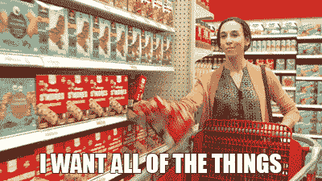
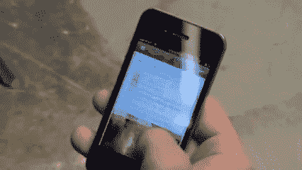
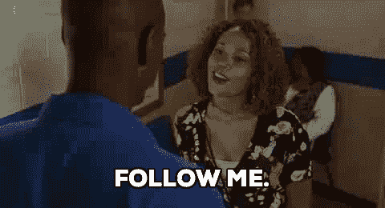

# 社交区块链拯救游侠

> 原文：<https://medium.com/coinmonks/social-blockchain-rescue-rangers-30d9a02e452c?source=collection_archive---------4----------------------->

3 月 21 日，关于脸书数据的丑闻发生了。用户(惊喜，惊喜！)发现搞笑问答 app 使用并分析了他们的数据。

我不确定是同一批人，我更相信那些喜欢测试的人没有注意到，但是那些喜欢丑闻的人注意到了。

***有什么解决办法？***

**区块链**是否为这个众所周知的集中存储社交数据的问题提供了解决方案？在这篇文章中，我只回顾了几个解决这个问题的区块链项目。

# 隐私——我们的数据不属于我们

我的观点——如果我发布了某个东西，它就不再属于我了。如果有人用这些数据给我看广告，会不会不好？

我不这么认为。我不喜欢太多的广告，但这不是定位的问题——他们也可以向我发送一些与我个人特征无关的垃圾邮件。

所以我不认为这是个问题。但是有人这么做了，大多数相关区块链的决定是让广告商直接为你的数据付费(并继续展示他们的广告):

> 有了 [Sphere](https://sphere.social/) 的分散式社交网络，你所有的个人浏览和搜索引擎结果都会得到私人保护和存储，远离广告商的窥探。如果他们想偷看，他们必须付钱给你！

所以这类项目希望商家向用户付费，让他们观看他们的广告。更荒谬的是:为什么用户不应该按行为付费？它几乎就在那里:

> 使用新的 [Ovato Coin](https://www.ovato.com/) ，用户可以从您的日常购买中获得奖励，并参与全国和当地商家的日常交易。商家现在可以节省时间，直接向用户营销。

# 没有对内容创作者的直接奖励

我们来到社交网络是为了找到一些好的内容。系统看起来是这样的:用户为内容而来，组织为用户而来，内容创作者为…什么而来？所以有些项目会奖励其他用户的影响者。

> [**Sapien**](https://www.sapien.network/)**:**创作者和策展人将**为创造了可量化价值的内容获得报酬**。用户可以通过**互相提示**帖子和评论

此外，许多项目希望品牌奖励用户的内容和互动。这种解决方案对用户来说不太有利:影响者现在得到了报酬，这对他们来说不是问题，普通用户无论如何也不会从他们的社交活动中获得可观的金钱，但会惹恼其他人。

## 企业无法接触到他们的受众

《福布斯》认为主要问题是一些组织可以影响我们的观点，但如果你曾经试图接触你的观众，你就会知道这并不容易。要让你的页面帖子在脸书上可见，甚至对订阅者也是如此，你必须付费。当用户只看到付费广告而看不到有价值的页面内容时，问题就来了。

分析目标受众的能力也不是问题(Google Analytics 等平台也可以)。问题是要尽可能经济高效地找到合适的人，即使是小企业也是如此。

这里有一个复杂的想法，不需要中间人来定位广告:

> [MAD Network 不是将用户数据存储在一个集中的数据存储中，而是将广告决策推到用户设备的边缘，从而让用户能够完全保密他们的数据。](https://blog.madnetwork.io/ad-tech-is-violating-your-privacy-how-the-blockchain-can-protect-todays-consumers-7b972e06fa58)
> 
> 为了锁定目标用户，广告商创建了机器学习模型，并将其部署到 MAD 网络。然后，用户设备上的个人人工智能“AI”代理使用消费者的个人可识别信息(PII)运行这些模型，并以加密方式确认或拒绝用户是否在期望的群体中。如果是的话，代理商会在不透露任何用户信息的情况下投放相关广告。

# 我的订阅源由其他人管理

有人选择我看到的，我不知道规则。人们来到社交网络，通过他们的个人订阅源与人、社区和品牌进行交流。然而，脸书代替他们决定。 ***饲料变得索然无味，过时了。***

我个人并不反对有人使用我的数据，但我反对无聊的反馈，即使这些平台拥有所有的分析工具。作为用户，我想要可控的、有趣的、有用的、让我变得更好的 feed。虽然区块链有潜力解决这一问题，但我没有找到任何满足这一需求的项目。它们提供了分散管理的机制，同时能够保持数据的完整性、保密性和可用性。

我猜区块链的项目可能更注重用户体验。奖励普通用户的个人数据或内容并没有激励作用，奖励优秀内容的创作者更有前途。同时，内容分发可能是比奖励更重要的问题。区块链和脸书对企业的态度都是敌对的:你必须付钱才能得到展示(区块链愿意付更少的钱)。

对于大多数广告客户来说，仍然存在一个大问题:他们只准备在客户路径的最后一步付费。这导致了垃圾广告。良好的分析有可能在早期阶段吸引客户。这不仅有利于企业，也有利于客户做出更明智的决策。

> [在您的收件箱中直接获得最佳软件交易](https://coincodecap.com/?utm_source=coinmonks)

# ❤️喜欢，分享，留下你的评论

如果你喜欢这篇文章，不要忘记喜欢，与你的朋友和同事分享，并在下面留下你对这篇文章的评论。
跟我来……

