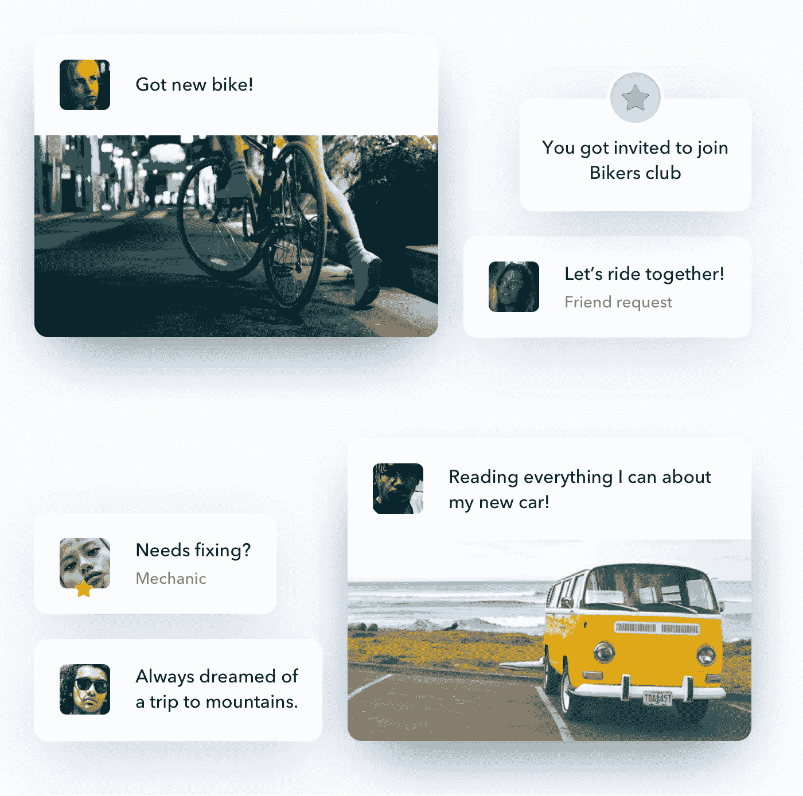
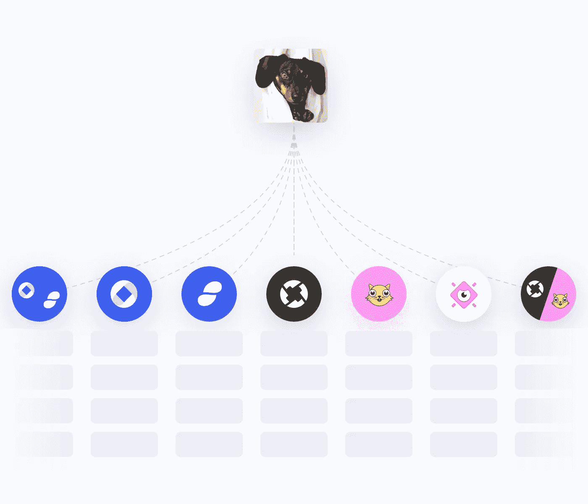

# 任何令牌的社交网络

> 原文：<https://medium.com/coinmonks/social-network-for-any-token-960afd36d280?source=collection_archive---------3----------------------->

所有权揭示了对未来的期望(即价格会上涨)，并表明有相似信仰的人希望相互交流。

ERC20 和 ERC721 令牌越来越多，因此，围绕这些令牌的社区也越来越多。人们现在通过他们的持有物(我拥有一个代币)以及他们的经济行为(我参加了一个 ICO)联系在一起，而不仅仅是通过他们的社会兴趣(我喜欢狗)。

围绕代币的社区在 Twitter、Telegram、Reddit、脸书等网站上形成。但是，由于新关系的性质(经济)和这些遗留平台的设计(利益)之间的冲突，用户继续面临许多问题:

*   **垃圾邮件。**又一个 ICO，赠品，空投。
*   **关于可证实的现实的不可证实的信息。**无证明的自有余额和交易报表。
*   **真人模型。**电子邮件或身份证必须参加。
*   **菲亚特。**区块链项目不能使用自己的代币进行自己的社交存在。
*   **骗局。通过冒充等方式泄露私钥。**

这些只是目前困扰互联网的几个问题，如假新闻，机器人活动增加，社交成瘾，模仿账户，在线话语日益两极分化等。

有史以来第一次，我们可以重新定义我们在社会中大规模合作的方式，但我们却被困在对我们不利的基础设施中。

# 每个令牌都是一个社区

在过去的两年里，我们开发了一种非常简单但功能强大的技术，可以帮助改变这种状况。我们希望我们的工作可以帮助用户分配他们的注意力，并在基于标记的注意力经济中做出更好的选择。

为了说明我们正在考虑的这种情况，我们将把你介绍给我们的朋友娜娜。

娜拉有一个以太坊地址，里面有几个 ERC20 和几个 ERC 721 代币。她可以通过桌面上的 Metamask 和移动设备上的 Toshi、Trust 或 Cipher 访问 Web 3.0。

Nala is a dog

现在，她可以从她的令牌的角度来发现社区…

…看看它们内部发生了什么。

她总是知道消息来自哪里，因为每条消息都由私钥持有者加密签名。

她还可以获得有价值的见解，了解发送者的动机。

每当她写作时，她的信息可以被任何人发现，因为这一切都发生在开放的数据集上。

但它们只能来自其他令牌持有者，因此她的注意力受到保护。

她可以连接她的传统社交媒体，并将其作为分销渠道。

但这对她来说还不够。

娜拉厌倦了只做一只狗。她想变成另一个人。她钱包里有两个 NFT，但也在考虑创建自己的。

她知道 Cryptokitties 是一个充满活力和乐趣的社区，所以她选择了沙拉三明治。

随着时间的推移，她作为社区的积极成员，她的 Cryptokitty 的影响力越来越大。

Nala 懂一点 javascript，所以她决定为 Tok'n'Talk 添加新的功能并赚钱。她认为每只小猫都是艺术家，并根据小猫的基因创建了一小段代码来生成艺术品。

沙拉三明治变得非常受欢迎，所以 Nala 发行了自己的 ERC20 代币。

现在，其他人想为服务付费，并出现在沙拉三明治的个人资料中。

不用说，沙拉三明治成功了。

# 相同，但不同

我们将熟悉的模式和互动，如反应和评论，应用于新的、符号化的世界。这是有意的:我们的目标是增强现有的用户体验，而不是取代它们。我们吸取了两个世界的精华:区块链系统固有的信任，以及外链/传统网络的灵活性。

我们通过在经济地址和任意数据之间建立联系来做到这一点。之后，我们可以通过各种算法对这些连接进行排序，从而生成一个提要。[你可以在这里了解它是如何运作的。](/@patrykadas/tokn-talk-under-the-hood-c88e5a320d4)

换句话说，我们将信息与稀缺资源捆绑在一起，使其变得有价值。因此，我们可以看到主观陈述背后的共识动机。最终目标是生成排名算法和界面市场，为成千上万的替代信息源、推荐引擎、个性化服务等提供动力。安装了“游戏中的皮肤”过滤器来吸引我们的注意力。Tok'n'talk 是这些想法的沙盒。

# 点击。社交网络。

我们正在寻找基于令牌的社区和想尝试不同模式的人加入我们的产品。我们将手动让您参与进来，以收集反馈，并帮助您在值得信赖的环境中成长。不管你是创造者还是爱好者。

**我们支持 ERC721 和 ERC20 标准令牌。**

*   **更强的互操作性。**“真正的数字所有权”不存在一个支持接口
*   **可发现性。您的项目可以在 crypto-native world 中被发现。瞄准与你相关的社区，创建自己的网络。**
*   **受保护社区。**没有垃圾邮件，没有木马，没有不安全的登录过程，经过验证的消息。
*   **使用令牌管理对您社区的访问。**为有特定兴趣的会员创建专属俱乐部。一起策划音乐、诗歌或贸易。
*   **关于代币，用代币。在拥抱代币和交易而不是禁止代币和交易的环境中谈论代币和交易。**
*   **你的界面。**创建更符合您需求的界面。
*   **证明你的持股**

# 联系我们

取得联系！我们会超级幸福的。

app 中的

**[**电报**](https://t.me/joinchat/Ff2fyUYwRF7m3Vxew5UxnA)**

****邮箱:**[**info @ cryptoverse . cc**](mailto:info@cryptoverse.cc)**

> **“你永远无法通过对抗现有的现实来改变事情。要改变什么，就建立一个新的模式，让现有的模式过时。”—巴克明斯特·富勒**