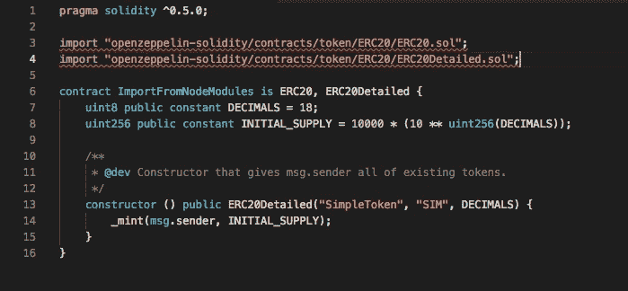

# sol-straighter:从 JavaScript 文件拉直/展平实体文件

> 原文：<https://medium.com/coinmonks/sol-straightener-straighten-flatten-solidity-file-from-javascript-file-d9544db86f1c?source=collection_archive---------1----------------------->

可靠是智能合同开发的主要语言。在编写各种合同时，我们维护代码重用和管理的模块。我们从主文件中的不同文件导入代码。



imports in smart contract

出于各种目的，比如在 Etherscan 上验证合同(尽管 [sol-verifier](https://www.npmjs.com/package/sol-verifier) 使用这个在内部处理它)，我们需要一个拉直的(一个包含所有导入文件数据的文件)文件。有多个 CLI 实用程序可以做到这一点，但如果需要在 javascript 文件中处理它，那么[sol-stranger](https://www.npmjs.com/package/sol-straightener)可能是一个正确的选择。

## **如何使用**

使用起来非常简单。需要模块并提供实体文件的路径。

```
const Straightener = require('sol-straightener');
let result = await Straightener.straighten(<solidity/file/path>);
```

将返回导入的拉直文件内容。

## 支持

可以通过多种方式导入文件。目前 sol-straighter 处理来自以下网站的`import`个文件:

*   相对目录，例如:`import "./lib/SafeMath.sol";`
*   `node_modules`目录，如是；`import "openzeppelin-solidity/contracts/token/ERC20/ERC20.sol";`
*   Github，例如；`import "github.com/oraclize/ethereum-api/oraclizeAPI_0.5.sol";`

希望这将有助于 Solidity 开发人员。

如果有人认为应该有任何其他实用程序可以帮助 Solidity 开发人员，请在下面的评论中告诉我。

感谢阅读！

> [直接在您的收件箱中获得最佳软件交易](https://coincodecap.com/?utm_source=coinmonks)

[](https://coincodecap.com/?utm_source=coinmonks)