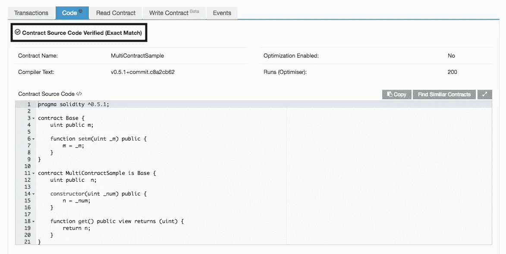

# sol-verifier:一个在 Etherscan 上验证智能合同的 NPM 包

> 原文：<https://medium.com/coinmonks/sol-verifier-an-npm-package-to-verify-smart-contracts-on-etherscan-bd4966eeab8a?source=collection_archive---------1----------------------->

Etherscan 是领先的以太坊区块链浏览器，为使用以太坊开发基于智能合约的应用提供了强大支持。除此之外，它还以用户友好的方式向用户保证智能合同的内容。

举个更好的例子，使用 Etherscan，即使是非技术用户也可以了解智能合约的总供应量和其他公共变量。为此，用户只需访问任何合同的“ReadContract”选项卡。

Etherscan 不会对所有部署的契约都这样做。如果您只是部署了一个合同，并访问“ReadContract”部分，您将看到:

> 抱歉，我们无法找到与此合同匹配的合同 ABI 或源代码。
> 
> 如果您是合同所有者，请在此验证您的合同源代码。

为了使每个访问用户都有资格读取契约的公共值，契约所有者必须通过传递一些参数来验证 Etherscan 上的源代码，以告诉它您的编译方式。成功验证后，智能合同的公共价值将对所有人可见。

通常[合同验证](https://etherscan.io/verifyContract2)是通过访问 Etherscan 平台完成的，但现在可以使用 CLI 或使用 NPM 包 [sol-verifier](https://www.npmjs.com/package/sol-verifier) 在代码内部完成。

Contract verified using sol-verifier

sol-verifier 内部使用 Etherscan 提供的 Api，因此要使用该 API，您需要从[client portal->MyApiKey](https://etherscan.io/myapikey)区域内生成一个免费的 API 密钥令牌。

sol-verifier 在根据用例重复部署新契约并且需要契约验证的情况下非常有用。使用此包，可以在合同部署后连续进行验证。与代码一起，通过提供所需的参数，可以从命令行使用它。

此外，对于接受构造函数参数的契约，需要在 Etherscan 平台上提供 ABI 编码的参数，sol-verifier 在内部处理它，使开发人员更容易理解。

下次部署合同时，请尝试使用此包来验证您的合同。这里的可以知道使用方法[。希望你会喜欢它，并会发现它很有帮助。](https://www.npmjs.com/package/sol-verifier#run)

此外，自 Solidity v0.5.0 以来，已经引入了许多突破性的变化。在这里了解它们并编写更新和安全的智能合同。

感谢阅读。享受智能编码！！！

> [在您的收件箱中直接获得最佳软件交易](https://coincodecap.com/?utm_source=coinmonks)

