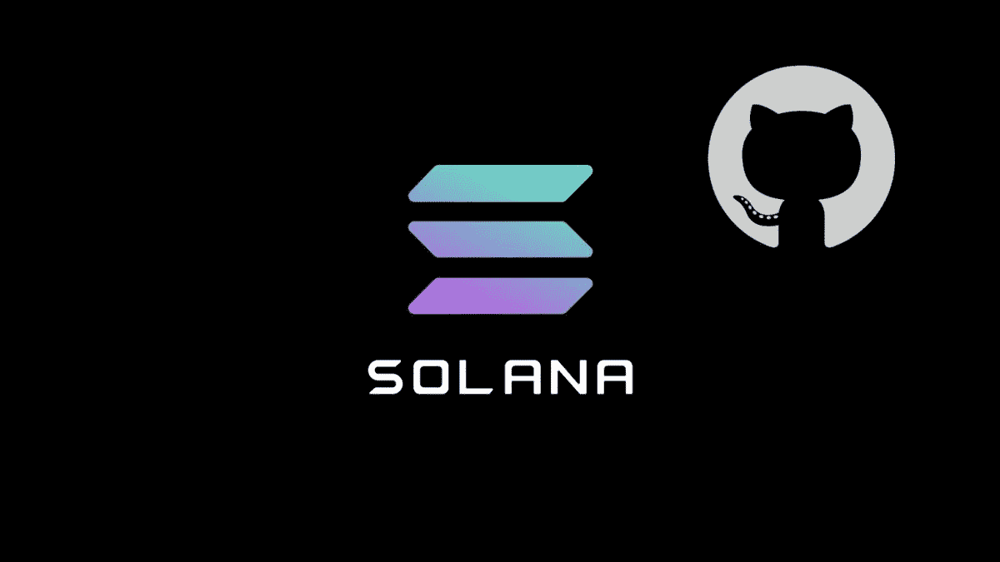

# 来源茄属植物

> 原文：<https://medium.com/coinmonks/solana-from-source-527cec3730b1?source=collection_archive---------1----------------------->



索拉纳是一个有趣的区块链项目，有望成为一个低油费和快速封锁时间的 L1。为了检验它，我决定试着在它上面创建一些测试智能合同。然而，他们的二进制版本只适用于 OSX x86，而且目前还没有提供 OSX arm64 二进制版本。因此，为了让事情继续运行，我必须从他们的主要回购中构建我需要的东西。

要在 M1 系统上构建 Solana 并运行 [Hello World 示例](https://github.com/solana-labs/example-helloworld)你需要 Rust。可以通过 [rustup.rs](https://rustup.rs) 安装。一旦安装了 rust，我们就可以克隆 Solana master 并安装将示例智能合同部署到 devnet 所需的一切。

# 建立索拉纳大师

在撰写本指南时，Solana 的最新 1.7.1 版本没有构建在 M1 系统上。尽管如此，主分支已经有了一些支持 M1 的提交(例如提交`[8a9b7f5](https://github.com/solana-labs/solana/commit/8a9b7f5ef272996c78ec15694678833cf85ddce4)`)。

克隆 Solana repo，并将 cd 放入其中:

```
$ git clone [https://github.com/solana-labs/solana](https://github.com/solana-labs/solana)
$ cd solana
```

接下来，您可以尝试运行脚本`scripts/cargo-install-all.sh`，如 [Solana 工具套件指南](https://docs.solana.com/cli/install-solana-cli-tools#build-from-source)中所述。然而，对我来说，这个脚本不能开箱即用。它使用一些脚本来找到你的`cargo`安装，但它在我的系统上有麻烦。为了解决这个问题，我简单地编辑了脚本，使用路径中的`cargo`:

```
#cargo="$("${readlink_cmd}" -f "${here}/../cargo")"
cargo="cargo"
```

现在您应该可以毫无问题地构建 Solana 了:

```
$ ./scripts/cargo-install-all.sh --validator-only .
```

我们在这里使用`validator-only`开关，因为目前建造`spl-token-cli`几乎是不可能的。该程序位于 [Solana 程序库](https://github.com/solana-labs/solana-program-library) repo 中，该程序目前依赖于 Solana `1.6.11`。依赖于 master 的每夜构建会很好:)

脚本完成后，您应该在`./bin`文件夹中拥有所有的验证器二进制文件。为了简单起见，将这个`bin`文件夹添加到您的路径中。然而，它排除了`solana-test-validator`，但是无论如何，它似乎不能正确地与 M1 系统一起工作，所以没关系。如果你想试一试，你可以用下面的代码来编译它:

```
$ cargo build --release --bin solana-test-validator
$ cp target/release/solana-test-validator ./bin
```

现在测试验证器也应该在`bin`文件夹中了。

# 设置索拉纳

现在我们有了`solana`二进制文件，我们可以配置它使用 devnet:

```
$ solana config set --url [https://api.devnet.solana.com](https://api.devnet.solana.com)
```

创建新的密钥对:

```
$ solana-keygen new
```

有了新生成的密钥对，我们可以请求空投一些 SOL:

```
$ solana airdrop 5
```

这将为我们的钱包增加 5 SOL，我们可以使用它将智能合同部署到 devnet。

# 安装 BPF SDK

为了能够将 hello world 程序部署到测试验证器上，您需要安装 BPF SDK。您可以通过从项目根目录转到`sdk/cargo-build-bpf`来实现。从那里，运行以下命令:

```
$ cargo install --path .
```

这将把`cargo-build-bpf`程序安装到`~/.cargo/bin`上。接下来在`~/.cargo/bin`中，在项目的`bin`文件夹中创建一个指向`sdk`文件夹的符号链接，如下所示:

```
$ ln -s $PROJECT_ROOT/bin/sdk ~/.cargo/bin/sdk
```

用你的 Solana 项目文件夹替换`$PROJECT_ROOT`。

# 编译 Hello World 智能合约

现在创建了所有的二进制文件，我们可以编译 [Hello World 示例程序](https://github.com/solana-labs/example-helloworld)。将它克隆到某个地方，并在项目文件夹中运行以下命令:

```
$ cargo build-bpf \
    --manifest-path=./src/program-rust/Cargo.toml \
    --bpf-out-dir=dist/program
```

如果一切顺利，现在应该编译智能契约了。您可以将它部署到 devnet，如下所示:

```
$ solana program deploy ./dist/program/helloworld.so
```

搞定了。hello world 示例智能合同现已部署到 devnet。

> 加入 [Coinmonks 电报频道](https://t.me/coincodecap)，了解加密交易和投资

## 另外，阅读

*   最好的比特币[硬件钱包](/coinmonks/the-best-cryptocurrency-hardware-wallets-of-2020-e28b1c124069?source=friends_link&sk=324dd9ff8556ab578d71e7ad7658ad7c) | [BitBox02 回顾](/coinmonks/bitbox02-review-your-swiss-bitcoin-hardware-wallet-c36c88fff29)
*   [BlockFi vs Celsius](/coinmonks/blockfi-vs-celsius-vs-hodlnaut-8a1cc8c26630)|[Hodlnaut 点评](/coinmonks/hodlnaut-review-best-way-to-hodl-is-to-earn-interest-on-your-bitcoin-6658a8c19edf) | [KuCoin 点评](https://blog.coincodecap.com/kucoin-review)
*   [Bitsgap 审查](/coinmonks/bitsgap-review-a-crypto-trading-bot-that-makes-easy-money-a5d88a336df2) | [Quadency 审查](/coinmonks/quadency-review-a-crypto-trading-automation-platform-3068eaa374e1) | [Bitbns 审查](/coinmonks/bitbns-review-38256a07e161)
*   [密码本交易平台](/coinmonks/top-10-crypto-copy-trading-platforms-for-beginners-d0c37c7d698c) | [Coinmama 审核](/coinmonks/coinmama-review-ace5641bde6e)
*   [比特币基地评论](/coinmonks/coinbase-review-6ef4e0f56064) | [德里比特评论](/coinmonks/deribit-review-options-fees-apis-and-testnet-2ca16c4bbdb2) | [FTX 评论](/coinmonks/ftx-crypto-exchange-review-53664ac1198f) | [StealthEX 评论](/coinmonks/stealthex-review-396c67309988)
*   [n 平均零点评审](/coinmonks/ngrave-zero-review-c465cf8307fc) | [Phemex 评审](/coinmonks/phemex-review-4cfba0b49e28) | [PrimeXBT 评审](/coinmonks/primexbt-review-88e0815be858)
*   最佳[区块链分析](https://bitquery.io/blog/best-blockchain-analysis-tools-and-software)工具| [赚比特币](/coinmonks/earn-bitcoin-6e8bd3c592d9) | [Swapzone 评论](/coinmonks/swapzone-review-crypto-exchange-data-aggregator-e0ad78e55ed7)
*   [加密套利](/coinmonks/crypto-arbitrage-guide-how-to-make-money-as-a-beginner-62bfe5c868f6)指南| [如何做空比特币](/coinmonks/how-to-short-bitcoin-568a2d0b4ae5) | [Prokey 回顾](/coinmonks/prokey-review-26611173c13c)
*   [币安交易机器人](/coinmonks/binance-trading-bots-d0d57bb62c4c) | [OKEx 审查](/coinmonks/okex-review-6b369304110f) | [Atani 审查](https://blog.coincodecap.com/atani-review)
*   [最佳加密交易信号电报](/coinmonks/best-crypto-signals-telegram-5785cdbc4b2b) | [MoonXBT 评论](/coinmonks/moonxbt-review-6e4ab26d037)
*   [Godex.io 审核](/coinmonks/godex-io-review-7366086519fb) | [邀请审核](/coinmonks/invity-review-70f3030c0502) | [BitForex 审核](/coinmonks/bitforex-review-c4bb28d9e271)