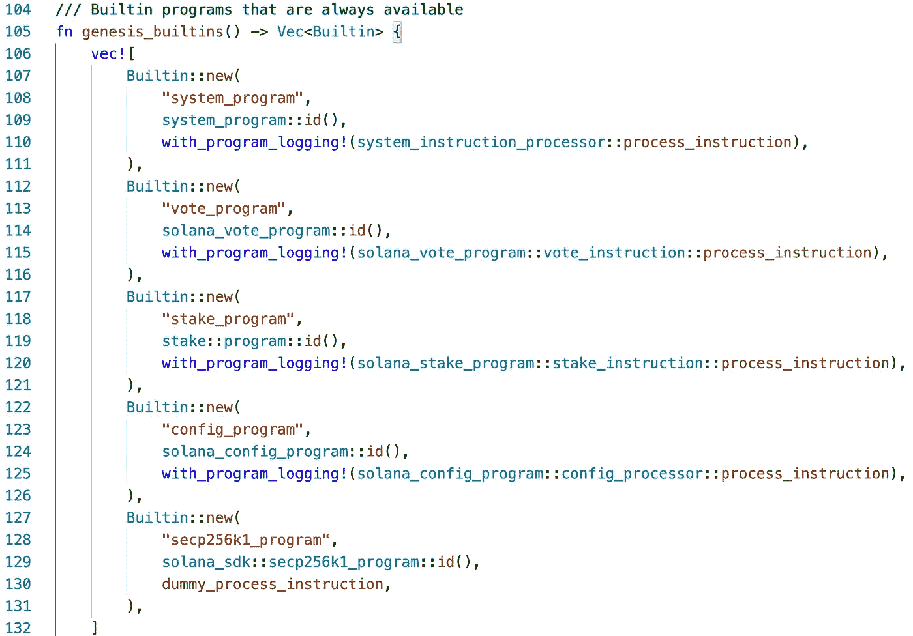

# Solana 内部第 1 部分:什么是本地链上程序，为什么它们很重要？

> 原文：<https://medium.com/coinmonks/solana-internals-part-1-what-are-the-native-on-chain-programs-and-why-do-they-matter-61c981483e86?source=collection_archive---------1----------------------->

Solana 有几个内置(本地链上)程序(例如，`system_program`、`spl_token`、`stake`、`vote`、`ed25519`等)，它们提供基本的指令，通常是可信的。

在本文中，我们将介绍这些程序的内部结构，并强调其中的一些复杂性。

