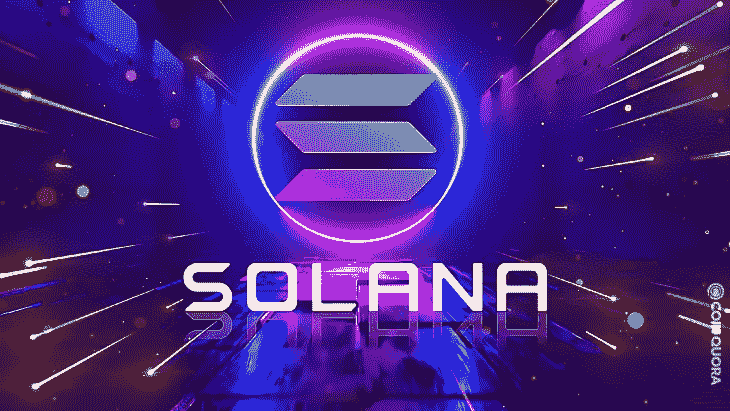
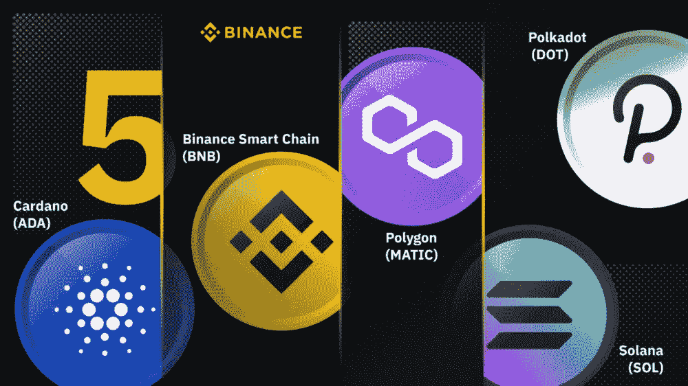
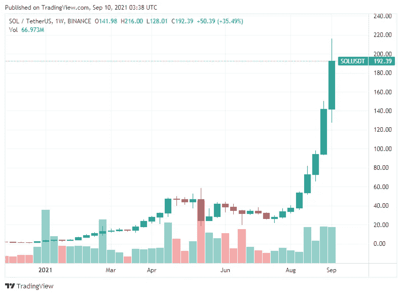

# 索拉纳是以太坊最大的威胁

> 原文：<https://medium.com/coinmonks/solana-is-ethereum-biggest-threat-a11275b8185c?source=collection_archive---------5----------------------->

索拉纳的使用率正以惊人的速度增长。这很大程度上是由于人们希望逃避以太坊的可怕费用。人们不想支付 80 美元来转移 200 美元，也不想支付巨额资金来移除 LP(流动性提供者)令牌。

以太坊是目前第二大加密货币，并且已经存在了很多年。智能合约的发明改变了游戏规则。这也是继 2015 年初比特币之后的第二种加密货币。

多年来，人们一直在寻找所谓的“以太坊杀手”。所有的巨人都会倒下，对吗？迄今为止，ETH 一直是“智能合约之王”。

自从 ETH 第一次上市以来，他们拥有最多的开发人员和最多的在 web3 上构建 Dapps 的经验。这也是 ETH 主导市场，拥有最大生态系统的主要原因之一。

不用说，有一些新的孩子在街区，双关语！索拉纳(索尔)就是这些新成员中的一员，他似乎是一股不可忽视的力量。

索拉纳不像 2020 年 4 月刚刚推出的 ETH 那样经验丰富。SOL 正在成为一个独立的巨人，在区块链上有超过 500 艘船下水。

## **索拉纳需要知道的信息**

为什么 SOL 被认为是 ETH 杀手？嗯，谈到 ETH，最大的问题是交易费。SOL 对每笔交易收取 0.00025 美元的费用。目前，在 ETH 上发送一笔 100 美元的交易大约要花费 40 美元。使用 SOL 与 ETH 相比，同样 100 美元的 SOL 交易将花费大约 0.02 美元。

如果交易费用没有足够的说服力，交易的速度是惊人的。就我个人而言，我更喜欢卡尔达诺和 XLM 快速有效地发送加密，SOL 在做同样的事情上非常有用。

交易发生在几秒钟内，不是几分钟或几小时，而是几秒钟。ETH 对 Sol 的速度就像侯赛因·博尔特和一个高中运动员跑 100 米一样。这之所以成为可能，是因为他们使用了被称为“历史证明”的验证模型。

关于 SOL，最容易被忽视的是它的编程语言，这一点大多数人都没有意识到。ETH 使用它为智能合约创建的 Solidity 编程语言。

使用 Solidity 的缺点是，每个想在以太坊上制作 Dapps 的人都必须学习一种没有人真正了解的新语言，并且被证明存在一些安全问题；一个边学边做的系统。

Solana 使用的编程语言与脸书或现在的“META”使用的相同。如果地球上最大的公司之一正在使用它，它可能是相当可靠的。SOL 使用 Rust 或 shadding，虽然不像 Python 或 JavaScript 那样流行，但在开发人员社区中是众所周知的。

Solana Sept Price Chart

SOL 有超过 500 个项目在进行中，是成为“以太黑仔”的非常好的候选人。考虑到速度、采用和低成本过渡，Solana 是在区块链战争中与 ETH 竞争的主要候选人。

关于索拉纳的更多信息

想了解更多关于 Web3、区块链和加密货币的新闻和信息:点击关注按钮，在 [@Web3FreshcoTech](https://twitter.com/Web3FreshcoTech) 上关注我

> 加入 Coinmonks [电报频道](https://t.me/coincodecap)和 [Youtube 频道](https://www.youtube.com/c/coinmonks/videos)了解加密交易和投资

## 也阅读

 [## 最佳加密交易所| 2021 年十大加密货币交易所

### 编辑描述

blog.coincodecap.com](https://blog.coincodecap.com/crypto-exchange)  [## 2021 年 10 大最佳加密贷款平台| CoinCodeCap

### 编辑描述

blog.coincodecap.com](https://blog.coincodecap.com/crypto-lending)  [## 2021 年最佳免费加密交易机器人

### 2021 年币安、比特币基地、库币和其他密码交易所的最佳密码交易机器人。四进制，位间隙…

medium.com](/coinmonks/crypto-trading-bot-c2ffce8acb2a)  [## 最佳 4 个加密交易信号电报通道

### 这是乏味的找到正确的加密交易信号提供商。因此，在本文中，我们将讨论最好的…

medium.com](/coinmonks/best-crypto-signals-telegram-5785cdbc4b2b)  [## BlockFi 评论 2021:利弊和利率| CoinCodeCap

### 编辑描述

blog.coincodecap.com](https://blog.coincodecap.com/blockfi-review)  [## 如何在印度购买比特币？2021 年购买比特币的 7 款最佳应用[手机版]

### 如何使用移动应用程序购买比特币印度

medium.com](/coinmonks/buy-bitcoin-in-india-feb50ddfef94)  [## 加密税务软件——五大最佳比特币税务计算器[2021]

### 不管你是刚接触加密还是已经在这个领域呆了一段时间，你都需要交税。

medium.com](/coinmonks/best-crypto-tax-tool-for-my-money-72d4b430816b)  [## 存储比特币的最佳加密硬件钱包[2021] | CoinCodeCap

### 编辑描述

blog.coincodecap.com](https://blog.coincodecap.com/best-hardware-wallet-bitcoin)  [## Pionex 评论 2021 |免费加密交易机器人和交换

### Pionex 是为交易自动化提供工具的后起之秀。Pionex 上提供了 9 个加密交易机器人…

medium.com](/coinmonks/pionex-review-exchange-with-crypto-trading-bot-1e459d0191ea)