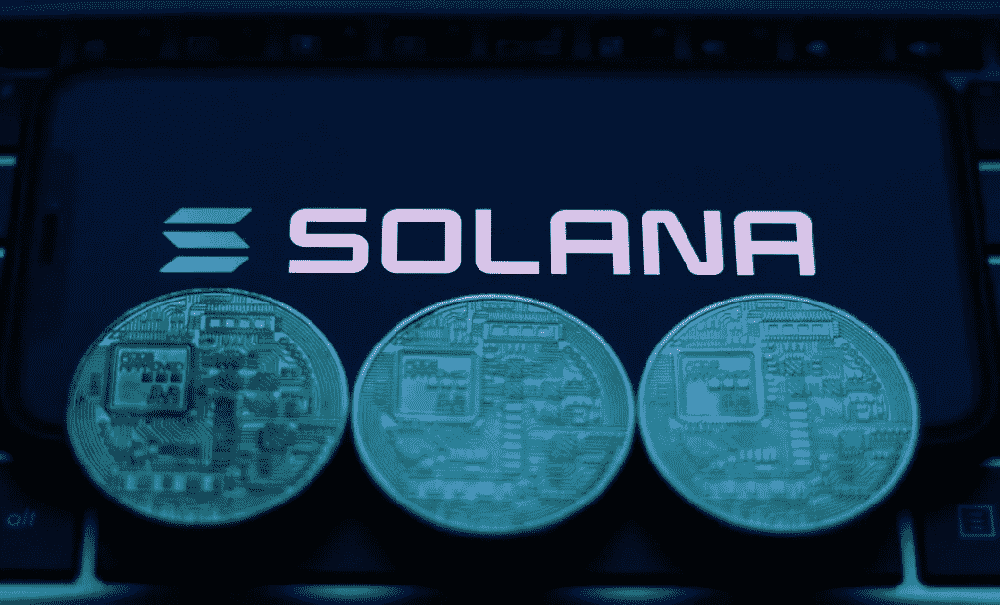
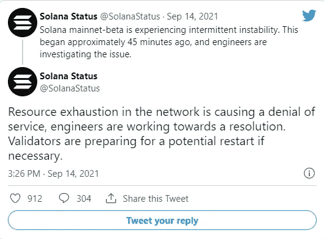
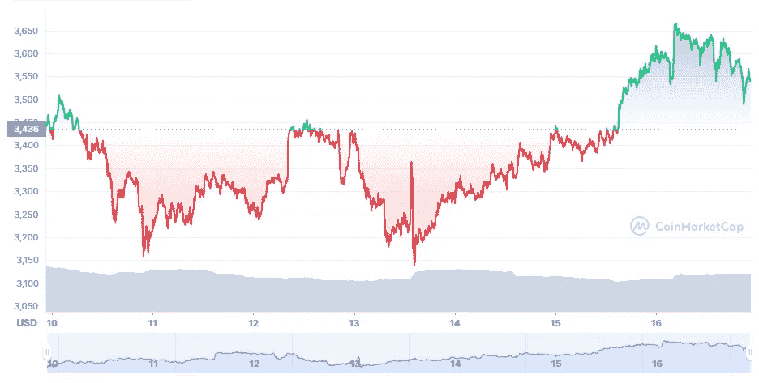
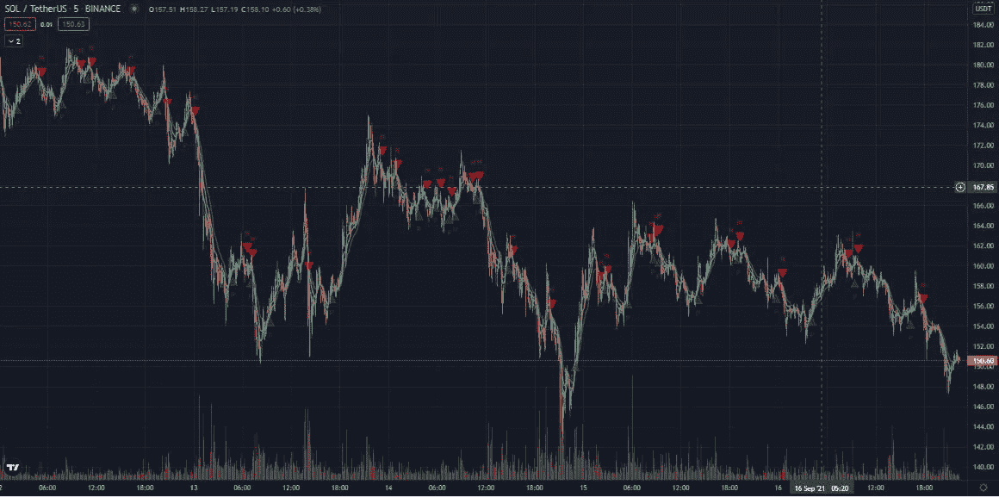

# 重启后的索拉纳价格走势

> 原文：<https://medium.com/coinmonks/solana-price-movement-after-restart-following-the-downtime-445730314001?source=collection_archive---------8----------------------->

# 注意力转向第 1 层

像以太坊这样的开源区块链网络允许你用软件创建一个经济系统。以太坊的建立是基于这样的假设，即需要许多区块链为不同的目的服务。区块链需要具有互操作性。

自从以太坊的成功故事之后，许多开发者选择在以太坊区块链上开发他们的应用程序。由于这个因素，再加上以太坊区块链上 NFT 的快速增长，代币的价值增加了。因此，截至本文撰写之时，其价值已升至 3540 英镑。

Solana 网络中断了几个小时，因为其本地加密货币的价值飙升，出现了一系列交易。第一层区块链，如以太坊、索拉纳和卡尔达诺最近越来越受关注。

SOL Network went down for 18 Hours

ETHUSD Chart

# Altcoin 赛季

同样，Solana 和 Cardano 的活动也有所增加，尤其是 Cardano 在今年 9 月宣布了智能合约功能。在卡达诺生态系统中，每天都有许多不同类别的项目涌现出来。

solscan 的详细信息显示，在关闭之前，最后一个区块是在世界标准时间下午 12:00 之前生产的。由于资源耗尽，分钟网络正经历不稳定。根据一个资源，网络中的耗尽导致了拒绝服务，验证者为潜在的重启做准备。

# 一连串的交易

索拉纳基金会将网络中断归因于淹没网络的一连串交易。工程师无法及时稳定网络。区块链遇到了不断增加的事务负载。

在中断期间，Solana 的本地加密货币跌至约 145 美元，但自网络恢复以来，截至本文撰写之时，它已上涨至 151 美元。索拉纳以近 500 亿美元的市值已经超过了 XRP 和道奇币。由[市值](https://coinmarketcap.com/)成为**第 6 种加密货币**。对许多人来说，索拉纳是下一个以太坊杀手。

Sideways movement on Solana

# 有什么额外津贴？

目前，索拉纳的生态系统正在增长，它提供比以太坊更便宜的交易费用。每 100 万笔交易收费 10 美元。难怪事务太多，系统不堪重负，可用资源无法承受流量。

索拉纳的生态系统目前有 300 多个项目在运行。支持索拉纳的最有说服力的论据是它的驱动生态系统。这对任何智能合约平台都至关重要。索拉纳网络有大约 5 亿美元的稳定收入。

> 加入 Coinmonks [电报频道](https://t.me/coincodecap)和 [Youtube 频道](https://www.youtube.com/channel/UCbyDhTbOiKh2iUMKBi4-4Zg)了解加密交易和投资

## 另外，阅读

*   [电网交易机器人](https://blog.coincodecap.com/grid-trading) | [Cryptohopper 审查](/coinmonks/cryptohopper-review-a388ff5bae88) | [Bexplus 审查](https://blog.coincodecap.com/bexplus-review)
*   [加密复制交易平台](/coinmonks/top-10-crypto-copy-trading-platforms-for-beginners-d0c37c7d698c) | [如何在 WazirX 上购买比特币](/coinmonks/buy-bitcoin-on-wazirx-2d12b7989af1)
*   [CoinLoan 审核](https://blog.coincodecap.com/coinloan-review)|[Crypto.com 审核](/coinmonks/crypto-com-review-f143dca1f74c) | [火币保证金交易](/coinmonks/huobi-margin-trading-b3b06cdc1519)
*   [Bookmap 点评](https://blog.coincodecap.com/bookmap-review-2021-best-trading-software) | [美国 5 大最佳加密交易所](https://blog.coincodecap.com/crypto-exchange-usa)
*   [如何在 FTX 交易所交易期货](https://blog.coincodecap.com/ftx-futures-trading) | [OKEx vs 币安](https://blog.coincodecap.com/okex-vs-binance)
*   [OKEx vs KuCoin](https://blog.coincodecap.com/okex-kucoin) | [摄氏替代品](https://blog.coincodecap.com/celsius-alternatives) | [如何购买 VeChain](https://blog.coincodecap.com/buy-vechain)
*   [币安期货交易](https://blog.coincodecap.com/binance-futures-trading)|[3 commas vs Mudrex vs eToro](https://blog.coincodecap.com/mudrex-3commas-etoro)
*   [如何购买 Monero](https://blog.coincodecap.com/buy-monero) | [IDEX 评论](https://blog.coincodecap.com/idex-review) | [BitKan 交易机器人](https://blog.coincodecap.com/bitkan-trading-bot)
*   [尤霍德勒 vs 科恩洛 vs 霍德诺特](/coinmonks/youhodler-vs-coinloan-vs-hodlnaut-b1050acde55a) | [Cryptohopper vs 哈斯博特](https://blog.coincodecap.com/cryptohopper-vs-haasbot)
*   [顶级付费加密货币和区块链课程](https://blog.coincodecap.com/blockchain-courses) | [币安评论](/coinmonks/binance-review-ee10d3bf3b6e)
*   [MXC 交易所评论](/coinmonks/mxc-exchange-review-3af0ec1cba8c) | [Pionex vs 币安](https://blog.coincodecap.com/pionex-vs-binance) | [Pionex 套利机器人](https://blog.coincodecap.com/pionex-arbitrage-bot)
*   [如何在印度购买比特币？](/coinmonks/buy-bitcoin-in-india-feb50ddfef94) | [WazirX 评论](/coinmonks/wazirx-review-5c811b074f5b) | [BitMEX 评论](https://blog.coincodecap.com/bitmex-review)
*   [印度的加密交易所](/coinmonks/bitcoin-exchange-in-india-7f1fe79715c9) | [比特币储蓄账户](/coinmonks/bitcoin-savings-account-e65b13f92451) | [HitBTC 评论](/coinmonks/hitbtc-review-c5143c5d53c2)
*   [币安收费](/coinmonks/binance-fees-8588ec17965) | [Botcrypto 审查](/coinmonks/botcrypto-review-2021-build-your-own-trading-bot-coincodecap-6b8332d736c7) | [Hotbit 审查](/coinmonks/hotbit-review-cd5bec41dafb) | [KuCoin 审查](https://blog.coincodecap.com/kucoin-review)
*   [我的加密副本交易经历](/coinmonks/my-experience-with-crypto-copy-trading-d6feb2ce3ac5) | [AAX 交易所评论](/coinmonks/aax-exchange-review-2021-67c5ea09330c)
*   [Bybit 融资融券交易](/coinmonks/bybit-margin-trading-e5071676244e) | [币安融资融券交易](/coinmonks/binance-margin-trading-c9eb5e9d2116) | [Overbit 审核](/coinmonks/overbit-review-9446ed4f2188)