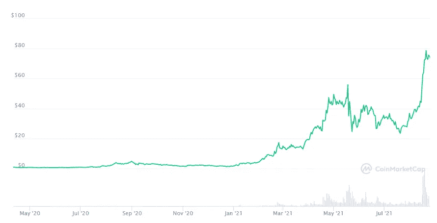

# 索拉纳:以太坊竞争对手的创纪录增长。现在投资？

> 原文：<https://medium.com/coinmonks/solana-record-growth-of-the-ethereum-competitor-invest-now-71b442b4271?source=collection_archive---------5----------------------->

## 索拉纳从一个空前的高度跳到另一个高度。现在以 74$ 的价格杀入前 10。相比之下:在[我的全面审查](/coinmonks/solana-sol-the-better-and-greener-bitcoin-ethereum-competitor-9a61bebec900)(2021 年 6 月 11 日)时，它值 37 美元。

> 对开发者来说很强大。每个人都很快。—solana.com

Solana value — [coinmarketcap.com](https://coinmarketcap.com/currencies/solana/)