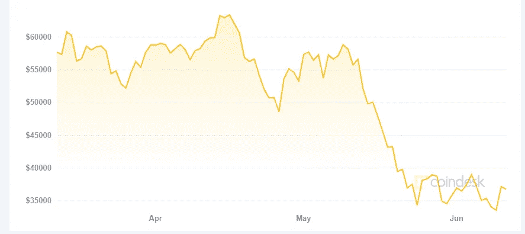

# 索拉纳(SOL):更好更环保的比特币？(以太坊竞争对手)

> 原文：<https://medium.com/coinmonks/solana-sol-the-better-and-greener-bitcoin-ethereum-competitor-9a61bebec900?source=collection_archive---------2----------------------->

埃隆马斯克引发了一场辩论，这场辩论也影响了市场。**比特币**依赖采矿:这种**不必要地污染环境**，因此特斯拉不再接受 BTC。比特币价格随后暴跌，导致整个市场下跌。

Bitcoin price — [coindesk.com](https://www.coindesk.com/price/bitcoin)

为此，**许多其他项目**专门解决这些问题，而**想要** …