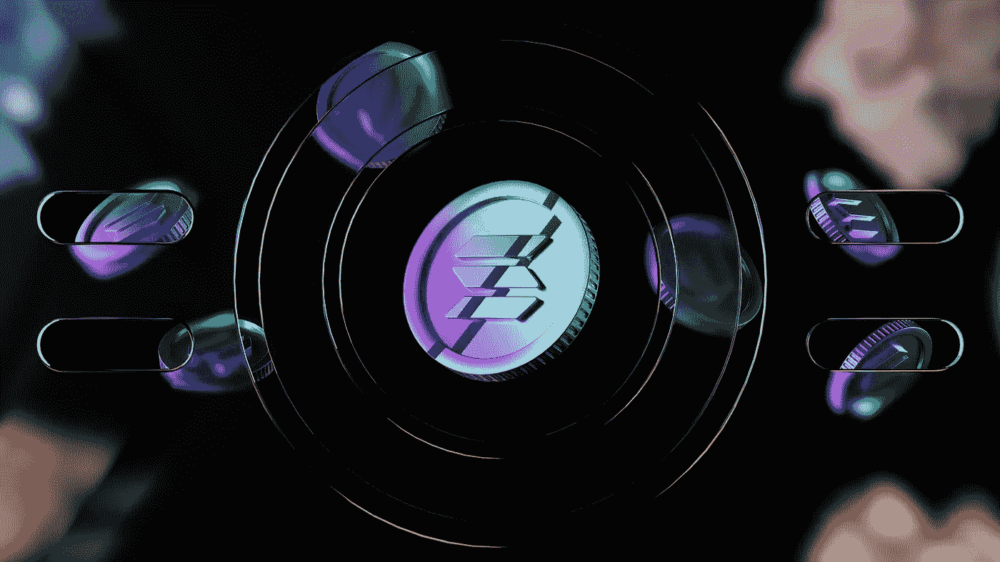
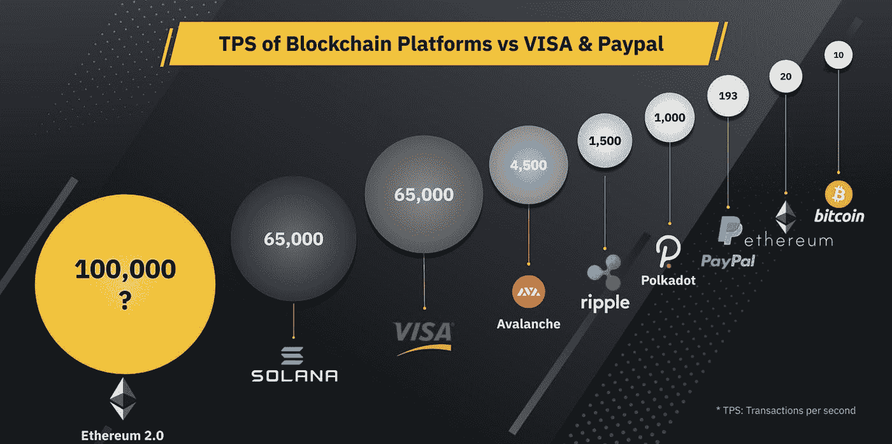
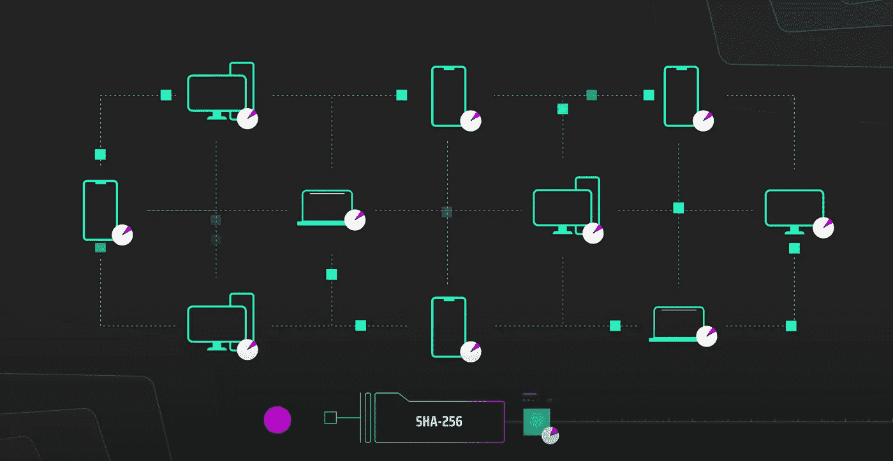
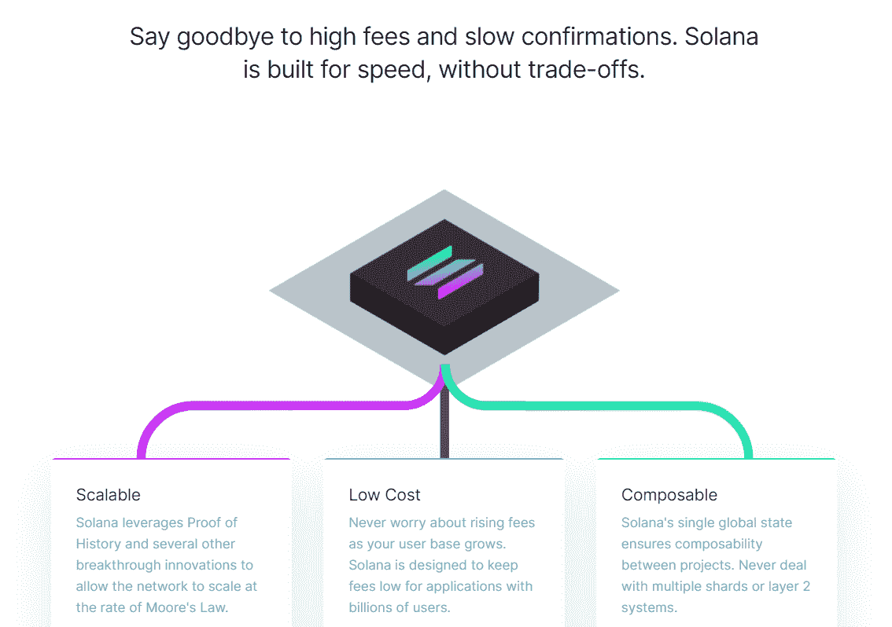
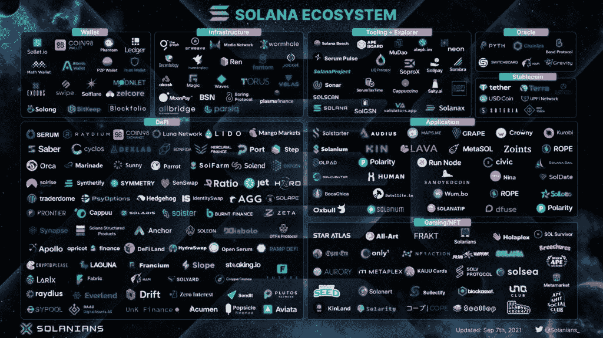

# 索拉纳区块链

> 原文：<https://medium.com/coinmonks/solanas-future-is-bright-fast-5cb9a782b6f6?source=collection_archive---------4----------------------->

unsplash

索拉纳是一个高性能的第一层区块链。为了管理大量交易，它不需要使用额外的“第 2 层”链或解决方案。阿纳托利·亚科文科在高通等公司工作多年，创立了索拉纳公司。由于他之前在 Dropbox 担任软件工程师，因此他对压缩算法有着广泛的了解。

## 世界上最快的第一层区块链

Source: coin98.net

首先，索拉纳很快，真的很快。它每秒可以处理 5 万到 6.5 万笔交易(tps)，与 Visa 的速度相当。Solana 声称他们可以处理高达 710，000 tps，尽管他们只在 2021 年 9 月网络短暂崩溃时达到过 400，000 tps 的峰值。然而，索拉纳的 tps 同样受到现有硬件技术的限制。索拉纳的网络非常便宜，只有百分之一美分，这意味着在索拉纳的区块链上发送 10 万笔交易只需要 1 美元。此外，Solana 的阻塞时间为 400 毫秒，比以太坊当前的 10 秒阻塞时间或比特币当前的 10 分钟阻塞时间快得多。索拉纳是目前运行中最快的一层区块链。

## 是什么让索拉纳如此快速廉价？

索拉纳共识机制。简单地说，这是一种方法，通过这种方法，网络中的每个人都同意在区块链内进行交易。每个区块链都需要一个共识机制。比特币使用工作证明，Cardano 使用利益证明，Solana 为其利益证明共识机制引入了一个重要组成部分，即历史证明。索拉纳的共识机制是增加了时间变量的利害关系证明。它向区块链数据添加时间并给事务加上时间戳，从而充当一个分散的时钟。

## 索拉纳的分散时钟

Source: Solana Youtube

其他区块链人面临一个主要问题是他们必须商定一个时间。本质上，计算机必须不断地问自己“几点了？”并来回通信，直到他们商定一个时间，这必须在创建块之前完成。这种对话会耗费大量时间。Solana 通过让计算机给它们的块打上时间戳并利用加密验证来解决这个问题，这样它们就不必“等待”每个人都同意时间。在这个分散的时钟上，每个块被视为一个“滴答”——每 400 毫秒一次。

比特币使用的同一个 SHA256 哈希函数(哈希是将原始信息加扰到无法复制回原始形式的过程)被修改为分散时钟，同时保持网络安全和分散。

## 为什么这很重要？

Source: Solana Youtube

虽然谷歌和英特尔等公司多年来一直在他们的集中式服务器中使用标准时钟来标记数据，但当你希望在分散的网络上做同样的事情时，情况就完全不同了。索拉纳构建了一个去中心化的时钟，这是以前从未有人做过的。

## 索拉纳——不需要成为“验证者”

这有什么意义？因为验证器节点(计算机)的准入门槛很低，所以会有更多的验证器，从而导致每秒更高的事务数量。

例如，要成为以太坊 2.0 上的验证者，你必须至少存款 32 以太坊(约 14 万美元)，但 Solana 没有强制性的最低股份。此外，每个验证器依次产生块，每个周期持续四个块。被选中的概率与下注的 Sol 令牌数成比例。一群验证者也很难攻击或破坏网络，因为验证者每 1.6 秒就被替换一次(四个块)。此外，任何不当行为都将导致股份减少。

## 索拉纳集群与交易效率

集群是一组验证器，专门用于验证特定种类的事务；例如，一个集群负责托管分散的 exchange 操作，而其他集群则专注于 NFT、游戏等。

## 索拉纳智能合约

Source: solana.com

与以太坊一样，Solana 支持智能合约，这意味着开发人员可以利用它来创建新的分散式应用程序(Dapps)。Solana 使用 Rust 编程语言。随着 Solana 的智能合同突破被称为“海平面”，验证器可以并行运行智能合同代码——所有在同一时间。

## 索拉纳的未来潜力

有超过 500 个 Dapps 在上面运行，Solana 的生态系统很大，并且每分钟都在扩大。

Source: Twitter/solanians_

索拉纳的 DeFi 空间锁定的总价值超过 120 亿美元，而在 2021 年 6 月仅为 5.12 亿美元。此外，一些值得注意的发展如下:

市场规模最大的两家银行 USDC 和泰瑟已经选择索拉纳进行快速全球结算，价值 21 亿美元的 USDC 已经发行。

Audius 是区块链的 Spotify，拥有 500 万活跃用户，并且还在迅速增加，由于其可扩展性，它已经转移到了 Solana，

Serum 是一家完整的非托管现货和衍生品交易所，建立在 Solana mainnet 的连锁中央限价订单簿(CLOB)上，日营业额超过 8000 万美元，并且还在快速增长。

由于其可扩展性、安全性和速度，我们相信 Solana 将在未来的全球区块链行业中占有重要的市场份额。

*免责声明:本文包含的信息仅用于教育目的，并不构成 Wheatstones 的任何形式的建议或推荐，用户在做出(或避免做出)任何投资决定时也不打算依赖这些信息。*

> 加入 Coinmonks [电报频道](https://t.me/coincodecap)和 [Youtube 频道](https://www.youtube.com/c/coinmonks/videos)了解加密交易和投资

## 也阅读

 [## 杠杆代币[多头代币]终极指南

### 杠杆化令牌是具有杠杆化风险敞口的 ERC20 令牌，不考虑保证金、要求、管理…

medium.com](/coinmonks/leveraged-token-3f5257808b22)  [## 最佳加密交易所| 2021 年十大加密货币交易所

### 编辑描述

blog.coincodecap.com](https://blog.coincodecap.com/crypto-exchange)  [## 2021 年最佳加密借贷平台| 6 大比特币借贷平台

### 获得比特币和其他加密货币的最佳贷款利率

medium.com](/coinmonks/top-5-crypto-lending-platforms-in-2020-that-you-need-to-know-a1b675cec3fa)  [## 2021 年最佳免费加密交易机器人

### 2021 年币安、比特币基地、库币和其他密码交易所的最佳密码交易机器人。四进制，位间隙…

medium.com](/coinmonks/crypto-trading-bot-c2ffce8acb2a)  [## 最佳 4 个加密交易信号电报通道

### 这是乏味的找到正确的加密交易信号提供商。因此，在本文中，我们将讨论最好的…

medium.com](/coinmonks/best-crypto-signals-telegram-5785cdbc4b2b)  [## 5 个最佳社交交易平台[2021] | CoinCodeCap

### 编辑描述

blog.coincodecap.com](https://blog.coincodecap.com/best-social-trading-platforms)  [## BlockFi 评论 2021:利弊和利率| CoinCodeCap

### 编辑描述

blog.coincodecap.com](https://blog.coincodecap.com/blockfi-review)  [## 如何在印度购买比特币？2021 年购买比特币的 7 款最佳应用[手机版]

### 如何使用移动应用程序购买比特币印度

medium.com](/coinmonks/buy-bitcoin-in-india-feb50ddfef94)  [## 加密税务软件——五大最佳比特币税务计算器[2021]

### 不管你是刚接触加密还是已经在这个领域呆了一段时间，你都需要交税。

medium.com](/coinmonks/best-crypto-tax-tool-for-my-money-72d4b430816b)  [## 存储比特币的最佳加密硬件钱包[2021] | CoinCodeCap

### 编辑描述

blog.coincodecap.com](https://blog.coincodecap.com/best-hardware-wallet-bitcoin)  [## Pionex 评论 2021 |免费加密交易机器人和交换

### Pionex 是为交易自动化提供工具的后起之秀。Pionex 上提供了 9 个加密交易机器人…

medium.com](/coinmonks/pionex-review-exchange-with-crypto-trading-bot-1e459d0191ea)