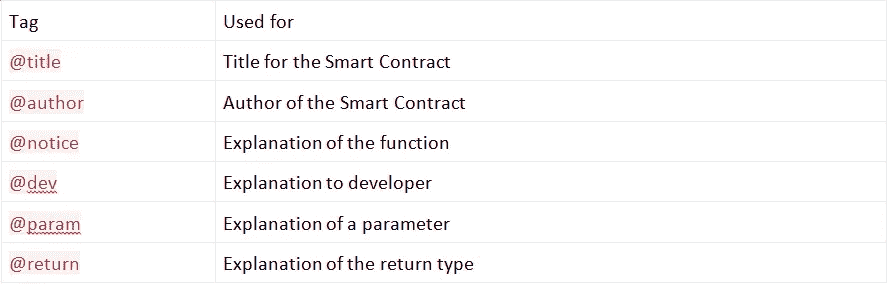

# 坚实度 101

> 原文：<https://medium.com/coinmonks/solidity-101-eec816744e95?source=collection_archive---------3----------------------->

## *在这篇文章中了解可靠性，作者 Brenn Hill 是一名高级软件工程师，拥有北卡罗来纳大学信息科学硕士学位。他努力与企业合作，以确保技术项目获得良好的投资回报，并解决关键的业务问题。*


# 坚实度 101

Solidity 是一种由以太坊基金会推出的静态类型编程语言，它使得在以太坊区块链之上创建分散式应用成为可能，既可以用于创建另一个加密货币令牌，也可以用于区块链可能扮演重要角色的任何其他用例。

以太坊在其平台上运行智能合约；这些应用程序使用区块链技术来执行所需的操作，使用户能够创建自己的区块链，并发行自己的替代加密货币。这是通过在 **Solidity** 中编码实现的，Solidity【】用于编写将在以太坊区块链上执行的智能合同，并执行编程的任务。

受 C++、Python 和 JavaScript 的影响，Solidity 于 2014 年 8 月提出，由以太坊项目的 solidity 团队开发。完整的应用程序部署在区块链上，包括智能合同、前端接口和其他模块；这被称为 **DApp** 或**分散式应用。**

Solidity 也称为面向契约的语言，因为契约类似于面向对象语言中的类。Solidity 语言松散地基于 ECMAScript(JavaScript)；因此，预先了解这一点将有助于理解坚固性。以下是在 Solidity 中开发、测试和部署智能合约所需的一些工具:

**TestNet** :选择要工作的 TestNet，指定要使用的网络 ID。

**编译器**:选择需要的编译器，比如`solc`，是 solidity 编译器；它包含在大多数节点中，也可以作为独立的软件包使用。

**Web3.js** :帮助以太坊网络和我们的 DApp 通过 HTTP 或 IPC 网络连接的库。

**框架**:从可用于合同编制和部署等任务的框架中选择一个框架非常重要。使用的一些框架是 Truffle、Embark、Dapple 等。

## 坚实的基础

如果你经常编程，你应该已经知道代码编辑器或者集成开发环境。对于已经存在的各种 ide，有一个集成列表；除此之外，以太坊基金会还发布了一个基于浏览器的 IDE，集成了编译器和 Solidity 运行时环境，没有用于编写和测试智能合约的服务器组件。可以在[remix.ethereum.org](http://remix.ethereum.org/)找到。

## 使用编译器

对于小型和学习型的 DApps 项目，建议在以太坊基金会基于浏览器的编译器上进行工作: **Remix** 。另一种方法是在你的机器上安装 Solidity 编译器。使用以下命令可从`npm`安装`solc`:

```
**npm install -g solc**
```

Solidity 也可以通过克隆 GitHub 链接上的 Git 库从源代码构建，该链接位于[https://github.com/ethereum/solidity.git](https://github.com/ethereum/solidity.git)。

# 可靠性编程

在本节中，我们将讨论 Solidity 源文件的结构和元素；我们将讨论布局，结构，数据类型，它的类型，单位，控制，表达式和其他方面的可靠性。实体文件的格式扩展名为`.sol`。

## 布置实体文件

Solidity 正在经历积极的发展，并且有许多来自一个庞大社区的定期变化和建议；因此，在源文件的开头指定实体文件的版本以避免任何冲突是很重要的。这是通过 Pragma 版本实现的。这是在 solidity 文件的开头定义的，这样任何想要运行该文件的人都知道以前的版本。看一下这段代码:

```
**pragma solidity ^0.4.24;**
```

通过指定版本号，特定的源文件将使用比指定版本号更早或更晚的版本进行编译。

## 导入文件

与 ECMAScript 类似，Solidity 文件使用如下的`import`语句声明:

```
**import “filename.sol”;**
```

前面的语句将把所有符号从`filename.sol`文件作为全局语句导入到当前文件中。导入文件时也支持路径，所以可以使用类似于 JavaScript 的`/`、`.`或`..`。

## 评论

使用单行(`//`)注释和多行(`/* … */`)注释，尽管除此之外还有另一种类型的注释样式，称为 **Natspec 注释**，这也是可能的；在这种类型的注释中，我们要么使用`///`要么使用`/** … */`，它们只在早期的函数声明或语句中使用。

Natspec 是 natural specification 的缩写；根据最新的 solidity 版本(0.4.24 ),这些注释不适用于变量，即使变量是公共的。下面是一小段代码，其中包含这类注释的示例:

```
pragma solidity ^0.4.19;/// @title A simulator for Batman, Gotham’s Hero/// @author DC-man/// @notice You can use this contract for only the most basic simulation/// @dev All function calls are currently implement without side effectscontract Batman { /// @author Samanyu Chopra /// @notice Determine if Bugs will accept `(_weapons)` to kill /// @dev String comparison may be inefficient /// @param _weapons The name weapons to save in the repo (English) /// @return true if Batman will keep it, false otherwise function doesKeep(string _weapons) external pure returns (bool) { return keccak256(_weapons) == keccak256(“Shotgun”); }}
```

## 标签

它们在 Natspec 注释中使用；每个标签都有基于其用法的自己的上下文，如下表所示:



# 合同的结构

Solidity 中的每个契约都类似于类的概念。契约可以从其他契约继承，方式类似于类。合同可以包含以下声明:

状态变量

功能

功能修饰符

事件

结构类型

枚举类型

## 状态变量

这些是永久存储在合同存储中的值，例如:

```
pragma solidity ^0.4.24;contract Gotham {uint storedData; // State variable// …}
```

## 功能

函数可以在内部或外部调用，例如:

```
pragma solidity ^0.4.24;contract Gotham { function joker() public Bat { // Function // … }}
```

## 功能修饰符

函数修饰符可以用来修改声明中函数的语义。也就是说，它们用于改变函数的行为。例如，它们用于在执行功能之前自动检查条件，或者它们可以根据需要在给定的时间范围内解锁功能。它们可以被衍生合同覆盖，如下所示:

```
pragma solidity ^0.4.24;contract Gotham { address public weapons;modifier Bank() { // Modifier require( msg.sender == coins, “Only coins can call this.” ); _;} function abort() public coinsbuyer { // Modifier usage// … }}
```

## 事件

事件允许通过 DApp 的前端方便地使用 EVM。事件可以被听到和维护。看一下这段代码:

```
pragma solidity ^0.4.24;contract Attendance { event Mark_attendance(string name, uint ID); // Event function roll_call() public marking { // … emit Mark_attendance(Name, ID); //Triggering event }}
```

## 类型

在 Solidity 中，每个变量的类型需要在编译时指定。通过组合复杂类型，也可以在 Solidity 中创建复杂类型。Solidity 中有两类数据类型:**值类型**和**引用类型**。

## 值类型

值类型被称为**值类型**，因为这些类型的变量在其自己分配的内存中保存数据。

## 布尔代数学体系的

这种类型的数据有两个值，true 或 false，例如:

```
bool b = false;
```

前面的语句将`false` 分配给布尔数据类型`b`。

## 整数

该值类型分配整数。整数有两个子类型，即`int`和`uint`，分别是有符号整数和无符号整数类型。内存大小是在编译时分配的；使用`int8`或`int256`指定，其中数字代表内存中分配的大小。仅使用`int`或`uint`分配内存，默认分配最大的内存大小。

## 地址

该值类型包含一个 20 字节的值，这是以太坊地址的大小(40 个十六进制字符或 160 位)。看看这个:

```
address a = 0xe2793a1b9a149253341cA268057a9EFA42965F83
```

此类型有几个成员可用于与协定交互。这些成员如下:

`balance`

`transfer`

`send`

`call`

`callcode`

`delegatecall`

`balance` 以卫为单位返回地址余额，例如:

```
address a = 0xe2793a1b9a149253341cA268057a9EFA42965F83;uint bal = a.balance;
```

`transfer`用于从一个地址转移到另一个地址，例如:

```
address a = 0xe2793a1b9a149253341cA268057a9EFA42965F83;address b = 0x126B3adF2556C7e8B4C3197035D0E4cbec1dBa83;if (a.balance > b.balance) b.transfer(6);
```

当我们使用`transfer`或`send`构件时，消耗的气体量几乎相同。`transfer`从 Solidity 0.4.13 引入，因为 send 不发送任何气体，也不传播异常。`Transfer`被认为是从一个地址向另一个地址发送以太网的安全方式，因为它会抛出错误并允许某人传播错误。

`call`、`callcode`和`delegatecall`用于与没有**应用二进制接口** ( **ABI** )的函数进行交互。`call`返回一个布尔值，表明函数是成功运行还是在 EVM 中终止。

当`a`调用`b`时，代码在`b`的上下文中运行，并使用`b`的存储。另一方面，当`a`调用`b`上的 code 时，代码在`a`的上下文中运行，使用`a`的存储，但使用`a`的 and 存储。

`delegatecall`函数用于根据需要委托一个合同使用另一个合同的存储。

## 数组值类型

Solidity 有一个固定和动态的数组值类型。在固定大小的字节数组中，关键字的范围从`bytes1`到`bytes32`。另一方面，在动态大小的字节数组中，关键字可以包含字节或字符串。`bytes`用于原始字节数据，`strings`用于在`UTF-8`中编码的字符串。

`length`是返回固定大小字节数组或动态大小字节数组的长度的成员。

固定大小数组初始化为`test[10]`，动态大小数组初始化为`test2[`。

## 逐字的

文字用于表示固定值；使用了多种类型的文字；它们如下:

整数文字

字符串文字

十六进制文字

地址文字

整数文字由从 0 到 9 的数字序列组成。八进制文字和以 0 开头的文字无效，因为以太坊中的地址是以 0 开头的。看看这个:

```
int a = 11;
```

字符串文字用一对双引号(`“…”`)或单引号(`‘…’`)声明，例如:

```
Test = ‘Batman’;Test2 = “Batman”;
```

十六进制文字以关键字`hex`为前缀，并用双引号(`hex”69ed75"`)或单引号(`hex’69ed75'`)括起来。

通过地址校验和测试的十六进制文字属于`address`类型文字，例如:

```
0xe2793a1b9a149253341cA268057a9EFA42965F83;0x126B3adF2556C7e8B4C3197035D0E4cbec1dBa83;
```

## 枚举

枚举允许在 Solidity 中创建用户定义的类型。枚举可以与所有整数类型相互转换。下面是 Solidity 中的一个枚举示例:

```
enum Action {jump, fly, ride, fight};
```

## 功能

有两种类型的函数:内部函数和外部函数。只能从当前协定内部调用内部函数。外部函数可以通过外部函数调用来调用。

## 功能修饰符

对于基于实体的函数，有各种可用的修改器，但不要求必须使用。看看这些:

`pure`

`constant`

`view`

`payable`

`pure`功能不能从存储器中读取或写入；他们只是根据内容返回一个值。`constant`修饰符函数不能以任何方式写入存储器。尽管后固化版本 0.4.17 `constant`已被弃用，以让位给`pure`和`view`功能，`view`的作用与`constant`类似，因为其功能不会以任何方式改变存储。`payable`允许函数在被调用时接收乙醚。

一个函数中可以使用多个修饰符，方法是用空格分隔每个修饰符；它们按照书写的顺序进行评估。

## 参考类型

这些都是通过引用传递的；由于它们所构成的内存分配，这些内存非常重。

## 结构

结构是在逻辑组下声明的复合数据类型。结构用于定义新的类型。结构不可能包含自己类型的成员，尽管结构可以是映射成员的值类型。下面是一个结构示例:

```
struct Gotham { address Batcave; uint cars; uint batcomputer; uint enemies; string gordon; address twoface;}
```

## 数据单元

这指定了特定数据类型的存储位置。它与数组和结构一起工作。使用`storage`或`memory`关键字指定数据位置。还有第三个数据位置`calldata`，不可修改，不可持久。外部功能的参数使用`calldata`存储器。默认情况下，功能参数保存在`memory`；其他局部变量利用`storage`。

## 绘图

映射用于键到值的映射。映射可以被视为哈希表，这些哈希表被虚拟地初始化，使得每个可能的键都存在并且被映射到一个默认值。默认值为全零。密钥从不存储在映射中，只有`keccak256`哈希用于值查找。映射的定义与任何其他变量类型一样。看看这个代码:

```
contract Gotham { struct Batman { string friends; string foes; int funds; string fox; } mapping (address => Batman) Catwoman; address[] public Batman_address;}
```

上面的代码示例显示猫女被初始化为一个映射。

## 单位和全局变量

任何实值智能契约都可以调用全局变量。它们主要用于返回关于区块链博物馆的信息。其中一些变量也可以执行各种功能。时间单位和乙醚也是全球通用的。没有后缀的以太货币数字被认为是魏。也可以使用与时间相关的单位，就像货币一样，它们之间可以转换。

*如果你觉得这篇文章很有趣，你可以探索* [*区块链开发者指南*](https://www.amazon.com/Blockchain-Developers-Guide-applications-technologies/dp/178995472X) *使用区块链构建真实世界的项目，如智能合约部署平台、博彩应用、钱包服务等等。* [*区块链开发者指南*](https://www.packtpub.com/big-data-and-business-intelligence/blockchain-developers-guide) *带你穿越区块链技术的电气化世界，帮助你构建高效的去中心化应用。*

> [直接在您的收件箱中获得最佳软件交易](https://coincodecap.com/?utm_source=coinmonks)

[](https://coincodecap.com/?utm_source=coinmonks)