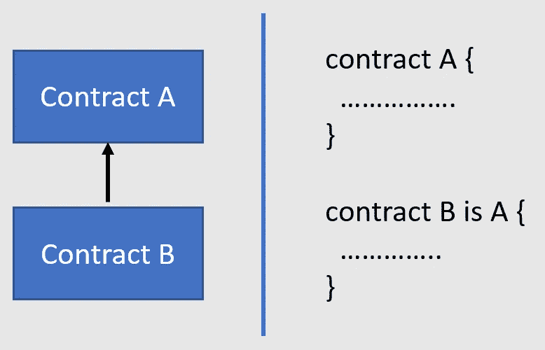
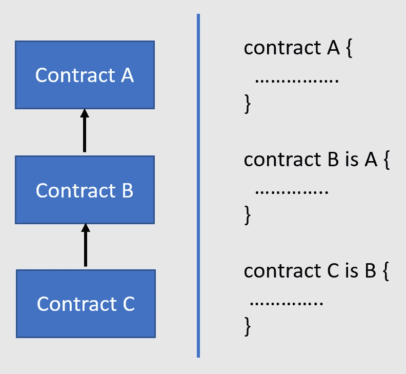
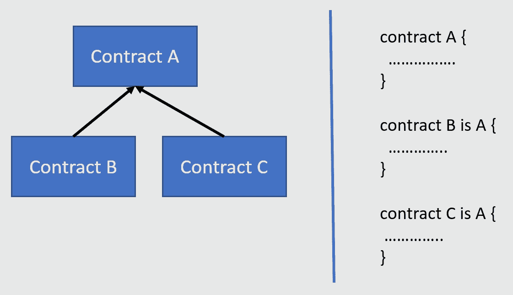
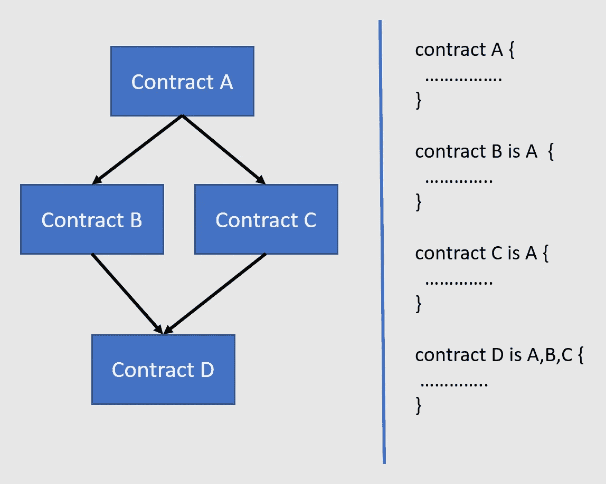

# 可靠性和面向对象编程

> 原文：<https://medium.com/coinmonks/solidity-and-object-oriented-programming-oop-191f8deb8316?source=collection_archive---------0----------------------->


**合同构成:**

坚固性支持合同组成。组合是指将多个契约或数据类型组合在一起，以创建复杂的数据结构和契约。

将问题分解成多个契约解决方案，并使用契约组合将它们组合在一起，这是一个很好的实践。

**传承:**

继承是面向对象的支柱之一，而可靠性支持智能契约之间的继承。继承是定义多个通过父子关系相互关联的契约的过程。

被继承的契约称为*父契约*，被继承的契约称为*子契约*。
类似地，契约具有被称为*派生类*的父契约，并且父契约被称为*基础契约*。
继承主要是关于*代码的可重用性。*基础契约和派生契约之间存在 is-a 关系，所有公共和内部作用域
函数和状态变量对派生契约可用。

事实上，Solidity 编译器将基本契约字节码复制到派生契约字节码中。is 关键字用于继承派生协定中的基础协定。这是每个 Solidity 开发人员都应该掌握的最重要的概念之一，因为这是契约版本化和部署的方式。

Solidity 支持多种类型的继承，包括多重继承。Solidity 将基础契约复制到派生契约中，并通过继承创建单个契约。生成在父子关系中的合同之间共享的单个地址。

**单一继承:**

单一继承有助于将基本契约的变量、函数、修饰符和事件继承到派生类中。



**Single inheritance**

**多级继承:**

多级继承非常类似于单级继承；然而，不仅仅是单一的
亲子关系，还有多层次的亲子关系。



**Multi-level inheritance**

下图显示了这一点。合同 A 是合同 B 的父合同，合同 B 是合同 C 的父合同:

**层次继承:**

分层继承也类似于简单继承。然而，在这里，单个契约充当多个派生契约的基础契约。



**Hierarchical inheritance**

下图显示了这一点。此处，合同 A 源自合同 B 和合同 C:

**多重继承:**

坚固性支持多重继承。单一继承可以有多个级别。然而，也可以有从同一基础契约派生的多个契约。
这些派生的契约可以在进一步的子类中一起用作基础契约。
当合同从这样的子合同一起继承时，存在多重继承，如下图所示:



**Multiple inheritance :**

**注意:** Solidity 遵循 Python 的路径，使用 **C3 线性化**，也称为**方法解析顺序(MRO)** ，在基础契约的图中强制特定顺序。这些协定在继承时应该遵循特定的顺序，从基础协定开始，一直到最派生的协定。

**封装:**

封装是 OOP 最重要的支柱之一。封装是指隐藏或允许直接访问状态变量以改变其状态的过程。
是指声明变量的模式，这些变量不能被客户端直接访问，只能用函数修改。这有助于约束对变量的访问，但同时也允许对类进行足够的访问以对其采取行动。

Solidity 提供了多个可见性修饰符，如*外部*、*公共*、*内部*和*私有*，它们影响状态变量在定义它们的契约中的可见性，继承子契约或外部契约。

**多态性:**

多态性意味着有多种形式。多态性有以下两种:
**1。**函数多态性
**2。**契约多态性

**函数多态性:**

函数多态性是指在同一个契约中声明多个函数，或者继承同名的契约。
函数的参数数据类型或参数数量不同。在确定多态性的有效函数签名时，不考虑返回类型。这也被称为**方法重载**。

```
pragma solidity ^0.4.19;contract helloFunctionPloymorphism {

 function getVariableData(int8 data) public pure returns(int8 output) {
 return data;
 }function getVariableData(int16 data) public pure returns(int16 output) {
 return data;
 }
}
```

**合同多态性:**

契约多态性是指当契约通过继承的方式相互关联时，可以互换地使用多个契约实例。契约多态性有助于使用基本契约实例调用派生的契约函数。

```
pragma solidity ^0.4.19;contract ParentContract {
 uint internal simpleInteger;function SetInteger(uint _value) public {
 simpleInteger = _value;
 }function GetInteger() public view returns (uint) {
 return 10;
 }
}contract ChildContract is ParentContract {

 function GetInteger() public view returns (uint) {
 return simpleInteger;
 }
}
```

**抽象合同:**

抽象契约是具有部分功能定义的契约。您不能创建抽象合同的实例。抽象契约必须被子契约继承才能使用其功能。抽象契约有助于定义契约的结构，从它继承的任何类都必须确保为它们提供实现。
如果子合同没有提供不完整功能的实现，甚至不能创建它的实例。
函数签名使用分号，；，性格。
没有 Solidity 提供的关键字将合同标记为抽象。
如果一个契约有函数但没有实现，那么它就变成了一个抽象类。

```
pragma solidity ^0.4.19;contract abstractHelloWorld {
 function GetValue() public view returns (uint);
 function SetValue(uint _value) public;function AddNumber(uint _value) public returns (uint) {
 return 10;
 }
}contract HelloWorld is abstractHelloWorld{
 uint private simpleInteger;function GetValue() public view returns (uint) {
 return simpleInteger;
 }

 function SetValue(uint _value) public {
 simpleInteger = _value;
 }function AddNumber(uint _value) public returns (uint ){
 return simpleInteger = _value;
 }
}
```

**接口:**

接口就像抽象契约，但还是有区别的。接口不能包含任何定义。
它们只能包含函数声明。这意味着接口中的函数不能包含任何代码。它们也被称为纯抽象合同。一个接口只能包含函数的签名。

```
pragma solidity ^0.4.19;contract abstractHelloWorld {
 function GetValue() public view returns (uint);
 function SetValue(uint _value) public;function AddNumber(uint _value) public returns (uint) {
 return 10;
 }
}contract HelloWorld is abstractHelloWorld{
 uint private simpleInteger;function GetValue() public view returns (uint) {
 return simpleInteger;
 }

 function SetValue(uint _value) public {
 simpleInteger = _value;
 }function AddNumber(uint _value) public returns (uint ){
 return simpleInteger = _value;
 }
}
```

**概要:**

在本文中，我主要关注智能契约、创建实例的不同方法以及与之相关的所有重要的面向对象概念，包括继承、多态、抽象和封装。

Solidity 中可以实现多种类型的继承。讨论了简单的、多重的、分层的和多层次的继承，以及抽象契约和接口的使用和实现。应该注意，在 Solidity 中使用继承，最终只部署一个契约，而不是多个契约。任何具有父子层次结构的协定只能使用一个地址。


> 加入 Coinmonks [电报频道](https://t.me/coincodecap)和 [Youtube 频道](https://www.youtube.com/c/coinmonks/videos)获取每日[加密新闻](http://coincodecap.com/)

## 另外，阅读

*   [复制交易](/coinmonks/top-10-crypto-copy-trading-platforms-for-beginners-d0c37c7d698c) | [加密税务软件](/coinmonks/crypto-tax-software-ed4b4810e338)
*   [网格交易](https://coincodecap.com/grid-trading) | [加密硬件钱包](/coinmonks/the-best-cryptocurrency-hardware-wallets-of-2020-e28b1c124069)
*   [密码电报信号](http://Top 4 Telegram Channels for Crypto Traders) | [密码交易机器人](/coinmonks/crypto-trading-bot-c2ffce8acb2a)
*   [最佳加密交易所](/coinmonks/crypto-exchange-dd2f9d6f3769) | [印度最佳加密交易所](/coinmonks/bitcoin-exchange-in-india-7f1fe79715c9)
*   [币安 vs 比特邮票](https://coincodecap.com/binance-vs-bitstamp) | [比特熊猫 vs 比特币基地 vs Coinsbit](https://coincodecap.com/bitpanda-coinbase-coinsbit)
*   [如何购买 Ripple (XRP)](https://coincodecap.com/buy-ripple-india) | [非洲最好的加密交易所](https://coincodecap.com/crypto-exchange-africa)
*   [非洲最佳加密交易所](https://coincodecap.com/crypto-exchange-africa) | [Hoo 交易所评论](https://coincodecap.com/hoo-exchange-review)
*   [eToro vs robin hood](https://coincodecap.com/etoro-robinhood)|[MoonXBT vs by bit vs Bityard](https://coincodecap.com/bybit-bityard-moonxbt)
*   开发人员的最佳加密 API
*   最佳[密码借贷平台](/coinmonks/top-5-crypto-lending-platforms-in-2020-that-you-need-to-know-a1b675cec3fa)
*   [免费加密信号](/coinmonks/free-crypto-signals-48b25e61a8da) | [加密交易机器人](/coinmonks/crypto-trading-bot-c2ffce8acb2a)
*   杠杆代币的终极指南