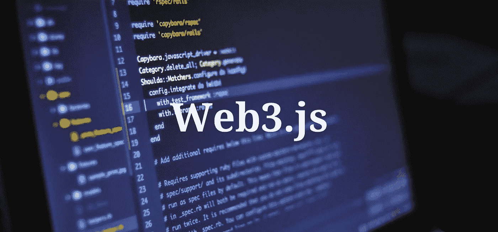

# Solidity 和 Web3.js

> 原文：<https://medium.com/coinmonks/solidity-and-web3-js-141115b0f8c5?source=collection_archive---------0----------------------->

## 参考:cryptozombies.io



然而，使用 web3.js 的另一种方式与此大相径庭，也请阅读此文:[https://medium . com/@ yang nana 11/interactive-with-a-smart-contract-through-web 3-js-tutorial-56 a7 ff 2ff 153](/@yangnana11/interacting-with-a-smart-contract-through-web3-js-tutorial-56a7ff2ff153)

# Web3.js 是什么？

记住，以太坊网络是由节点组成的，每个节点都包含一份区块链。当您想要调用智能合约上的函数时，您需要查询其中一个节点并告诉它:

1.  智能合同的地址
2.  您想要调用的函数，以及
3.  要传递给该函数的变量。

> 新手交易试试[密码交易机器人](/coinmonks/crypto-trading-bot-c2ffce8acb2a)或者[复制交易](/coinmonks/top-10-crypto-copy-trading-platforms-for-beginners-d0c37c7d698c)

以太坊节点只说一种叫做 **JSON-RPC** 的语言，这种语言不太容易被人读懂。告诉节点您想要调用契约上的函数的查询如下所示:

```
// Yeah... Good luck writing all your function calls this way!
{"jsonrpc":"2.0","method":"eth_sendTransaction","params":[{"from":"0xb60e8dd61c5d32be8058bb8eb970870f07233155","to":"0xd46e8dd67c5d32be8058bb8eb970870f07244567","gas":"0x76c0","gasPrice":"0x9184e72a000","value":"0x9184e72a","data":"0xd46e8dd67c5d32be8d46e8dd67c5d32be8058bb8eb970870f072445675058bb8eb970870f072445675"}],"id":1}
```

幸运的是，Web3.js 将这些讨厌的查询隐藏在表面之下，所以您只需要与一个方便且易读的 JavaScript 接口进行交互。

不需要构造上面的查询，在您的代码中调用一个函数将看起来像这样:

```
CryptoZombies.methods.createRandomZombie("Vitalik Nakamoto 🤔")
  .send({ from: "0xb60e8dd61c5d32be8058bb8eb970870f07233155", gas: "3000000" })
```

# 1.入门指南

根据项目的工作流程，您可以使用大多数包工具将 Web3.js 添加到项目中:

```
*// Using NPM*
npm install web3*// Using Yarn*
yarn add web3*// Using Bower*
bower install web3*// ...etc.*
```

或者您可以从 [github](https://github.com/ethereum/web3.js/blob/1.0/dist/web3.min.js) 下载缩小的`.js`文件，并将其包含在您的项目中:

```
<script language="javascript" type="text/javascript" src="web3.min.js"></script>
```

# **Web3 提供商**

记住，以太坊是由**节点**组成的，它们共享相同数据的副本。在 Web3.js 中设置 Web3 Provider 告诉我们的代码**我们应该与哪个节点**对话来处理我们的读写。这有点像在传统的 web 应用程序中为 API 调用设置远程 web 服务器的 URL。

您可以作为提供者托管自己的以太坊节点。然而，有一个第三方服务让你的生活更轻松，这样你就不需要为了给你的用户提供 DApp 而维护自己的以太坊节点了。

# Infura

Infura 是一个维护一组以太坊节点的服务，这些节点有一个用于快速读取的缓存层，你可以通过他们的 API 免费访问。使用 Infura 作为提供者，您可以可靠地向/从以太坊区块链发送和接收消息，而不需要设置和维护您自己的节点。

您可以设置 Web3 使用 Infura 作为您的 web3 提供商，如下所示:

```
var web3 = new Web3(new Web3.providers.WebsocketProvider("wss://mainnet.infura.io/ws"));
```

然而，由于我们的 DApp 将被许多用户使用——这些用户将写区块链，而不仅仅是读它——我们需要一种方法让这些用户用他们的私钥签署交易。

> 注意:以太坊(以及一般的区块链)使用公钥/私钥对对交易进行数字签名。可以把它想象成一个非常安全的数字签名密码。这样，如果我更改了区块链上的一些数据，我可以通过我的公钥向 T4 证明我是签名者——但是因为没有人知道我的私钥，所以没有人能为我伪造交易。

密码学很复杂，所以除非你是一个安全专家，你真的知道你在做什么，否则尝试在我们的应用前端自己管理用户的私钥可能不是一个好主意。

但幸运的是，你不需要这样做——已经有服务为你处理这些了。其中最受欢迎的是 **Metamask** 。

# 元掩码

[Metamask](https://metamask.io/) 是 Chrome 和 Firefox 的浏览器扩展，允许用户安全地管理他们的以太坊账户和私钥，并使用这些账户与使用 Web3.js 的网站进行交互。(如果你以前没有使用过它，你肯定会想去安装它——那么你的浏览器是 Web3 启用的，现在你可以与任何与以太坊区块链通信的网站进行交互！).

作为一名开发人员，如果你想让用户在他们的网络浏览器中通过一个网站与你的 DApp 进行交互(就像我们对 CryptoZombies 游戏所做的那样)，你肯定会想让它兼容 Metamask。

> **注意** : Metamask 使用 Infura 的服务器作为 web3 提供商，就像我们上面做的一样——但是它也给用户选择他们自己的 web3 提供商的选项。所以通过使用 Metamask 的 web3 provider，你给了用户一个选择的机会，你在应用程序中就少了一件需要担心的事情。

# 使用 Metamask 的 web3 提供程序

Metamask 将他们的 web3 提供者注入到浏览器的全局 JavaScript 对象`web3`中。所以你的应用程序可以检查`web3`是否存在，以及它是否使用`web3.currentProvider`作为它的提供者。

以下是 Metamask 提供的一些模板代码，说明我们如何检测用户是否安装了 Metamask，如果没有，告诉他们需要安装它才能使用我们的应用程序:

```
window.addEventListener('load', function() {*// Checking if Web3 has been injected by the browser (Mist/MetaMask)*
  if (typeof web3 !== 'undefined') {
    *// Use Mist/MetaMask's provider*
    web3js = new Web3(web3.currentProvider);
  } else {
    *// Handle the case where the user doesn't have web3\. Probably* 
    *// show them a message telling them to install Metamask in* 
    *// order to use our app.*
    // For example
    // web3 = new Web3(new Web3.providers.HttpProvider("http://localhost:8545"));
  } *// Now you can start your app & access web3js freely:*
  startApp()})
```

您可以在您创建的所有应用程序中使用此样本代码，以要求用户拥有元掩码才能使用您的 DApp。

> 注意:除了元掩码之外，您的用户可能还会使用其他私钥管理程序，例如 web 浏览器 **Mist** 。然而，它们都实现了注入变量`web3`的通用模式，所以我们在这里描述的用于检测用户的 web3 提供者的方法也适用于这些。

# 2.与合同对话

现在我们已经用 MetaMask 的 Web3 provider 初始化了 Web3.js，让我们设置它与我们的智能契约对话。

Web3.js 需要两件东西来和你的合同对话:它的**地址**和它的 **ABI** 。

# 合同地址

在您完成编写您的智能契约之后，您将编译它并将其部署到以太坊。我们将在下一课的**中讲述**部署**，但是由于这是一个与编写代码完全不同的过程，我们决定打破顺序，先讲述 Web3.js。**

在你部署你的合同后，它会在以太坊上获得一个固定的地址，在那里它将永远存在。以太坊主网上 CryptoKitties 合约的地址是`YOUR_CONTRACT_ADDRESS`。

您需要在部署后复制此地址，以便与您的 smart contract 对话。

# 合同 ABI

Web3.js 需要和你的合同讨论的另一件事是它的 ABI。

ABI 代表应用程序二进制接口。基本上，它是 JSON 格式的契约方法的表示，告诉 Web3.js 如何以契约可以理解的方式格式化函数调用。

当您编译您的合同以部署到以太坊时，Solidity 编译器将给您 ABI，所以除了合同地址之外，您还需要复制并保存它。

# 实例化 Web3.js 协定

一旦有了合同的地址和 ABI，就可以在 Web3 中实例化它，如下所示:

```
*// Instantiate myContract*
var myContract = new web3js.eth.Contract(myABI, myContractAddress);
```

# 3.调用合同功能

我们的合同都准备好了！现在我们可以用 Web3.js 和它对话了。

Web3.js 有两个方法，我们将使用它们来调用契约中的函数:`call`和`send`。

# 打电话

`call`用于`view`和`pure`功能。它只在本地节点上运行，不会在区块链上创建事务。

> **回顾:** `view`和`pure`功能是只读的，不改变区块链的状态。它们也不消耗任何汽油，用户不会被提示与 MetaMask 签署交易。

使用 Web3.js，您将使用参数`123`来`call`一个名为`myMethod`的函数，如下所示:

```
myContract.methods.myMethod(123).call()
```

# 发送

`send`将创建交易并更改区块链上的数据。对于任何不是`view`或`pure`的函数，你都需要使用`send`。

> **注:** `send` ing 一笔交易会要求用户支付油费，并会弹出他们的 Metamask 提示他们签订交易。当我们使用 Metamask 作为我们的 web3 提供者时，这一切都在我们调用`send()`时自动发生，我们不需要在代码中做任何特殊的事情。相当酷！

使用 Web3.js，您将使用参数`123`调用名为`myMethod`的函数的`send`事务如下:

```
myContract.methods.myMethod(123).send()
```

语法与`call()`几乎相同。

# 获取僵尸数据

现在让我们看一个使用`call`访问合同数据的真实例子。

我们制作了僵尸阵列`public`:

```
Zombie[] public zombies*;*
```

在 Solidity 中，当你声明一个变量`public`时，它会自动创建一个同名的公共“getter”函数。所以如果你想查找 id 为`15`的僵尸，你会像调用函数一样调用它:`zombies(15)`。

下面是我们如何在前端编写一个 JavaScript 函数，该函数接受一个僵尸 id，在我们的契约中查询该僵尸，并返回结果:

> 注意:我们在本课中使用的代码使用的是 Web3.js 的**1.0 版**，它使用承诺而不是回调。你将在网上看到的许多其他教程使用的是旧版本的 web 3 . js。1.0 版本的语法发生了很大变化，所以如果你从其他教程复制代码，请确保他们使用的是和你相同的版本！

```
function getZombieDetails(id) {
  return cryptoZombies.methods.zombies(id).call()
}*// Call the function and do something with the result:*
getZombieDetails(15)
.then(function(result) {
  console.log("Zombie 15: " + JSON.stringify(result));
});
```

让我们看看这里发生了什么。

`cryptoZombies.methods.zombies(id).call()`将与 Web3 提供者节点通信，并告诉它从我们的契约上的`Zombie[] public zombies`返回索引为`id`的僵尸。

注意，这是**异步**，就像对外部服务器的 API 调用。所以 Web3 在这里返回一个承诺。(如果您不熟悉 JavaScript promises……在继续之前，是时候做一些额外的功课了！)

一旦承诺完成(这意味着我们从 web3 提供者那里得到了一个回答)，我们的示例代码继续执行`then`语句，该语句将`result`记录到控制台。

`result`将会是一个如下所示的 javascript 对象:

```
{
  "name": "H4XF13LD MORRIS'S COOLER OLDER BROTHER",
  "dna": "1337133713371337",
  "level": "9999",
  "readyTime": "1522498671",
  "winCount": "999999999",
  "lossCount": "0" // Obviously.
}
```

然后，我们可以用一些前端逻辑来解析这个对象，并以一种有意义的方式在前端显示它。

# 获取元掩码中的用户帐户

元掩码允许用户在其扩展中管理多个帐户。

我们可以通过以下方式查看注入的`web3`变量中哪个账户当前处于活动状态:

```
var userAccount = web3.eth.accounts[0]
```

# …

现在让我们看看如何使用`send`函数来更改智能合约上的数据。

与`call`功能有几个主要区别:

1.  `send`处理一个事务需要一个调用函数的`from`地址(在你的安全代码中变成`msg.sender`)。我们希望这是我们的 DApp 的用户，所以 MetaMask 将弹出提示他们签署交易。
2.  `send` ing 交易费气
3.  从用户开始处理事务到该事务在区块链上实际生效会有很大的延迟。这是因为我们必须等待事务被包含在一个块中，而以太坊的块时间平均为 15 秒。如果以太坊上有很多未完成的交易，或者如果用户发送的天然气价格太低，我们的交易可能需要等待几个街区才能被包括在内，这可能需要几分钟。

# 4.调用应付款函数

在`ZombieHelper`合同中，我们增加了一个付费功能，用户可以升级:

```
function levelUp(uint _zombieId) external payable {
  require(msg.value == levelUpFee);
  zombies[_zombieId].level++;
}
```

将以太和函数一起发送的方法很简单，但有一点需要注意:我们需要在`wei`中指定发送多少，而不是以太。

# 魏是什么？

A `wei`是以太的最小子单位——一个`ether`中有 10^18 `wei`。

这需要数很多个零——但幸运的是，Web3.js 有一个转换实用程序可以帮我们做到这一点。

```
*// This will convert 1 ETH to Wei*
web3js.utils.toWei("1", "ether");
```

在我们的 DApp 中，我们设置了`levelUpFee = 0.001 ether`，所以当我们调用我们的`levelUp`函数时，我们可以使用下面的代码让用户发送`0.001`乙醚:

```
CryptoZombies.methods.levelUp(zombieId)
.send({ from: userAccount, value: web3js.utils.toWei("0.001", "ether") })
```

# 5.订阅事件

正如你所看到的，通过 Web3.js 与你的合同交互是非常简单的——一旦你设置好了你的环境，函数和事务与普通的 web API 并没有什么不同。

我们还想介绍一个方面——从您的合同中订阅事件。

# 监听新的僵尸

从`zombiefactory.sol`开始，我们有一个名为`NewZombie`的事件，每当一个新的僵尸被创造出来，我们就触发这个事件:

```
event NewZombie(uint zombieId, string name, uint dna);
```

在 Web3.js 中，您可以**订阅**一个事件，这样您的 web3 provider 每次触发时都会在您的代码中触发一些逻辑:

```
cryptoZombies.events.NewZombie()
.on("data", function(event) {
  let zombie = event.returnValues;
  *// We can access this event's 3 return values on the `event.returnValues` object:*
  console.log("A new zombie was born!", zombie.zombieId, zombie.name, zombie.dna);
}).on("error", console.error);
```

请注意，这将在我们的 DApp 中每次创建任何僵尸时触发警报——不仅仅是针对当前用户。如果我们只想要当前用户的警报会怎么样？

# 使用`indexed`

为了过滤事件并只监听与当前用户相关的变化，我们的 Solidity 契约必须使用`indexed`关键字，就像我们在 ERC721 实现的`Transfer`事件中所做的那样:

```
event Transfer(address indexed _from, address indexed _to, uint256 _tokenId);
```

在这种情况下，因为`_from`和`_to`是`indexed`，这意味着我们可以在前端的事件监听器中过滤它们:

```
*// Use `filter` to only fire this code when `_to` equals `userAccount`*
cryptoZombies.events.Transfer({ **filter: { _to: userAccount** } })
.on("data", function(event) {
  let data = event.returnValues;
  *// The current user just received a zombie!*
  *// Do something here to update the UI to show it*
}).on("error", console.error);
```

正如你所看到的，使用`event` s 和`indexed`字段是一种非常有用的做法，可以监听你的合同的变化，并在你的应用程序的前端反映出来。

# 查询过去的事件

我们甚至可以使用`getPastEvents`查询过去的事件，并使用过滤器`fromBlock`和`toBlock`给 Solidity 一个事件日志的时间范围(本例中的“块”指以太坊块号):

```
cryptoZombies.**getPastEvents("NewZombie", { fromBlock: 0, toBlock: "latest" })**
.then(function(events) {
  *// `events` is an array of `event` objects that we can iterate, like we did above*
  *// This code will get us a list of every zombie that was ever created*
});
```

因为您可以使用这种方法来查询事件日志，这提供了一个有趣的用例:**使用事件作为一种更便宜的存储形式**。

如果您还记得，将数据保存到区块链是 Solidity 中最昂贵的操作之一。但是使用事件在汽油方面要便宜得多。

这里的权衡是事件不能从智能协定本身内部读取。但是，如果您想要将一些数据历史记录在区块链上，以便可以从应用程序的前端读取，那么这是一个需要记住的重要用例。

例如，我们可以将此作为僵尸战斗的历史记录——我们可以为每次一个僵尸攻击另一个僵尸以及谁赢了创建一个事件。智能合约不需要这些数据来计算任何未来的结果，但它是用户能够从应用程序的前端浏览的有用数据。

# Web3.js 事件和元掩码

我们上面刚刚描述的语法来自 Web3.js 的最新 1.0 版本，它使用 **WebSockets** 来订阅事件。

然而，MetaMask 还不支持最新的事件 API(尽管他们正在积极地工作——检查这个 [github 问题](https://github.com/MetaMask/metamask-extension/issues/3642)的更新)(MetaMask 版本 4.5.1)

所以现在我们必须使用一个单独的 Web3 provider，它专门为事件支持 WebSockets。我们可以使用 Infura 实例化第二个副本，如下所示:

```
var web3Infura = new Web3(new Web3.providers.WebsocketProvider("wss://mainnet.infura.io/ws"));
var czEvents = new web3Infura.eth.Contract(cryptoZombiesABI, cryptoZombiesAddress);
```

然后我们将使用`czEvents.events.Transfer`而不是`cryptoZombies.events.Transfer`来监听事件。我们仍将使用`cryptoZombies.methods`来表示我们在本课中涉及的所有内容。

将来，当 MetaMask 更新他们的 API 以支持 Web3.js 1.0 时，这将是不必要的——但现在，如果我们想开始使用更好的 Web3.js 1.0 语法来订阅事件，这是一个必要的权宜之计。

> 加入 Coinmonks [电报频道](https://t.me/coincodecap)和 [Youtube 频道](https://www.youtube.com/c/coinmonks/videos)获取每日[加密新闻](http://coincodecap.com/)

## 另外，阅读

*   [复制交易](/coinmonks/top-10-crypto-copy-trading-platforms-for-beginners-d0c37c7d698c) | [加密税务软件](/coinmonks/crypto-tax-software-ed4b4810e338)
*   [网格交易](https://coincodecap.com/grid-trading) | [加密硬件钱包](/coinmonks/the-best-cryptocurrency-hardware-wallets-of-2020-e28b1c124069)
*   [密码电报信号](http://Top 4 Telegram Channels for Crypto Traders) | [密码交易机器人](/coinmonks/crypto-trading-bot-c2ffce8acb2a)
*   [最佳加密交易所](/coinmonks/crypto-exchange-dd2f9d6f3769) | [印度最佳加密交易所](/coinmonks/bitcoin-exchange-in-india-7f1fe79715c9)
*   开发人员的最佳加密 API
*   最佳[密码借贷平台](/coinmonks/top-5-crypto-lending-platforms-in-2020-that-you-need-to-know-a1b675cec3fa)
*   [杠杆代币](/coinmonks/leveraged-token-3f5257808b22)终极指南