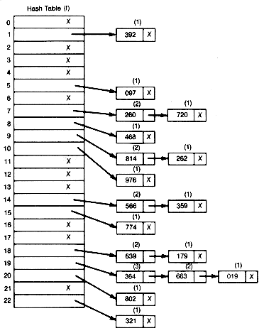

# 最佳的坚固性:第一届坚固性气体高尔夫比赛的开胃菜

> 原文：<https://medium.com/coinmonks/solidity-at-its-best-an-appetizer-for-the-1st-solidity-gas-golfing-contest-56f394a053c3?source=collection_archive---------2----------------------->

*这篇文章将帮助你解决 Solidity 中的一个经典编程练习，并教你一些技巧，如何在开发 Solidity 智能合同时节省一些汽油*

学习和提高编码技能的最有趣的方法是解决具有挑战性的练习。以太坊社区定期组织[黑客马拉松](https://ethglobal.co/)和竞赛，将聪明的合同开发者聚集在一起。迄今为止，我个人最喜欢的是以太坊的[尼克·约翰逊](https://twitter.com/nicksdjohnson)组织的竞赛。

去年有一个惊人的[秘密可靠性编码竞赛](http://u.solidity.cc/)，目标是在 ICO 合同中加入难以发现的漏洞，这些漏洞可以被利用来丰富项目创建者。几个令人着迷的解决方案被[提交](/@weka/announcing-the-winners-of-the-first-underhanded-solidity-coding-contest-282563a87079)呈现出我可能从未想到的漏洞。

今年的目标是用尽可能少的气体来解决经典的编程任务。[竞赛](https://g.solidity.cc/)包含 5 个练习:整数排序、创建 BrainFuck 解释器、十六进制解码器、字符串搜索和从列表中删除重复元素。如果你想从整数排序练习[开始，Tim Cotten](https://blog.cotten.io/thinking-in-solidity-6670c06390a9) 已经写了一篇极好的文章，我强烈推荐。我还想通过最后一个练习来引导你们完成我的旅程，并向你们展示我在这一路上所学到的东西。希望这能鼓励你看看其他的练习，并尝试一些可靠的编码；)

# 设置

我是[松露](https://github.com/trufflesuite/truffle)的忠实粉丝，所以我使用竞赛的松露项目版本，可在[这里](https://github.com/Arachnid/sggc)获得。投入比赛是非常方便的。在编写了一些代码之后，您可以使用命令`truffle test test/Unique.js`快速测试您的解决方案是否通过了所有的测试向量。

# **挑战 5:移除重复元素**

问题非常简单:在 Solidity 中编写一个智能契约，它从一个整数列表中删除除第一个元素之外的所有元素，保留原始元素的顺序，并返回该列表。此外，输入列表可以是任意长度。

# 天真的解决方案

我想从一个简单而愚蠢的解决方案开始，只是为了有一个基准。一个简单的想法如下。

返回长度小于 2 的每个输入数组，因为它们已经没有重复。之后，让我们使用一个单独的 bool 数组来跟踪哪个元素是重复的。这段代码使用了非常低效的嵌套循环。如果 **n** 是输入数组的长度，它给出了一个 **O(n )** 算法。我们将`unique[]`数组复制到`unique2[]`数组可能看起来很奇怪。这是因为在 Solidity 中不可能调整内存中数组的大小。在测试了这个简单的解决方案后，我们看到我们通过了测试向量 0 和 1:一个空数组和一个元素数组…太棒了！然而，对于大多数测试向量来说，它将耗尽气体。这个最初的失败表明我们应该瞄准一个 **O(n)** 算法。如果只允许我们在数组上迭代一次，我们能找到所有的副本吗？OFC！

# 哈希表

自然的想法不是比较整数本身，而是比较它们的变换。因此，让我们将所有元素映射到插槽中，不同的元素映射到不同的插槽，而相同的元素显然驻留在同一个插槽中。哈希表非常适合这个任务。当我们遍历数组时，我们取一个整数，对它进行哈希运算，然后将这个整数映射到一个根据它的哈希计算出的键值。检测重复变得很容易，因为如果一个整数有重复，那么我们会多次将该整数映射到同一个槽。

## 散列地址

即使应用了加密的安全散列函数，也很容易发生将两个整数分配给同一个槽的情况。这叫碰撞。在我们的例子中，这显然是不想要的，因为两个不同的整数被映射到同一个槽，让我们相信它们是重复的，尽管它们不是。总之，这种冲突必须以某种方式来解决。散列冲突解决技术之一是开放寻址。

直觉是，每当这样的冲突发生时，只要我们找到一个空槽(“key”)，我们就简单地在键空间中迭代。该整数被插入到第一个未被占用的槽中。这里存在固有的计算时间/空间权衡。随着插槽数量、密钥空间的增加，冲突数量减少。类似地，如果密钥空间变小，哈希冲突就更有可能发生。上面可以找到开放寻址散列表的简单且未优化的实现。这通过了所有的测试向量，燃烧了 1149096 气体。

我们如何提高这一解决方案的效率？让我们使用一个更有效的散列函数。我们不需要`sha3`，一个加密哈希函数，对于我们的目的来说`mod`也很好，因为它很好地混合了数字。因此，如果我们简单地通过`uint hash = input[i] % lengthOfKeySpace`计算密钥，我们可以节省 113380 加仑汽油。

代替`%`操作符，我们应该用按位操作符计算余数，因为按位操作符更接近机器代码。从以太坊黄皮书中可以看出，一个`mod`值 5 个汽油，而一个按位`and`值 3 个汽油。如果模数是 2 的幂，`n mod k`也可以给定为`n & (k-1)`。因此，设`lengthOfKeySpace`为 256，它是 2 的幂。用按位`and` 计算模产生另一个 46903 气体节省。

嗯嗯… 989623 气？？？这还是太多了！如果我们应用不同的冲突解决技术呢？

## 单独链接

另一种常见的冲突解决技术是独立链接。这个想法是每个槽都是独立的，每个槽都有一个单独的列表。每当我们在某个槽遇到冲突时，我们只是把要插入的整数推到列表的末尾。该列表通常被实现为一个链表。

A visual explanation for separate chaining

哈希表操作的时间是找到槽的时间，这个时间是常数，加上列表操作的时间。在一个好的哈希表中，每个桶有零个或一个条目，有时有两个或三个，但很少超过这个数量。因此，对于这些情况，在时间和空间上有效的结构是优选的。随着加载因子(在我们的例子中，每槽数的输入列表中的整数数)的增加，与开放式寻址相比，单独链接变得更快。原因是如果哈希表是密集的，那么更有可能发生冲突，因此需要在哈希表上迭代更多次来找到开放的地址。相反，分离链接不使用迭代来解决冲突，它只使用一个快速操作，即在槽列表的末尾追加。

事实证明，单独链接比开放式寻址更有效。这给了我们在块菌测试向量上总共 957787 个气体消耗。在竞赛的秘密测试向量上，我们的独立链接解决方案消耗 792960 汽油。好的，我们可以省略这些赋值，我们把 0 赋给`hashTable`或`index`因为 EVM 用它们的默认值初始化所有的数据结构，在整数数组的情况下是 0。我们还可以通过使用前缀增量而不是后缀增量来使代码运行得更快一些。但总的来说，这并不能节省超过 5136 英镑的汽油。我们还没到那一步！有人可能会说这是茶杯里的风暴:在这项任务中，我们还远远没有处于领先地位。目前最快的解决方案只能燃烧 309063 气体。哎哟！

你能打败它吗？接受挑战！

# **注意事项**

正如你所看到的，我们在这个版本上离领先还很远，所以我们特意在这个版本上留了一些改进的空间。我希望你喜欢这趟旅程，现在你有勇气和胃口开始在 Solidity 中编写一些漂亮的智能合约。

我不想剧透太多，但是我给你一些提示，如何让你的进场更有效率。

1.  请记住，只有`uniquify()`功能的气体成本被考虑在内。
2.  我就把这个留在这里:[https://gastoken.io/](https://gastoken.io/)如果你知道我在说什么；)
3.  自己完事后一定要收拾干净！:)

功劳归于 [Balázs Paulcsik](/@Csyk) 的[想法](https://twitter.com/Csyk01)和支持！

# 保持下去！

让我知道你是如何解决这个挑战的，或者你是否有其他更有效的方法来解决这个问题。我想听听这些想法；)

Keep going and happy gas golfing!

如果你想了解更多关于我即将开展的区块链相关项目，请关注我的 [Medium](/@Istvan_A_Seres) 或 [Twitter](https://twitter.com/Istvan_A_Seres) 。争取更多，保持#buidl！