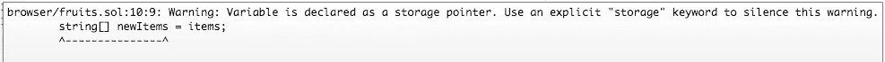

# 可靠性位—存储与内存

> 原文：<https://medium.com/coinmonks/solidity-bits-storage-vs-memory-a54a650ea4ff?source=collection_archive---------6----------------------->


[Photo Credit](https://4storage.wordpress.com/memory-vs-storage/)

在 Solidity 中编码并不总是直观的，但是很有趣。我不得不思考的一个小挑战是存储和内存的区别。

想象一个简单的例子，如下所示

```
pragma solidity ^0.4.22;contract Fruits {
    string[] public items; constructor () public {
        items.push('apple');
        items.push('orange');
    }
}
```

如果我要部署此合同，索引为 0 和 1 的项目将分别为“apple”和“orange”。很简单。

如果我试图在我的构造函数中创建一个指向`items`变量数组的新数组会怎样？似乎很容易。

```
constructor () public {
  ...
  string[] newItems = items;
}
```

但是等等！我们得到如下警告！



明白警告了吗？我也没有。

为了充分理解正在发生的事情，让我们讨论一下坚固性是如何解释内存和存储的。

# 存储与内存

Solidity 以两种不同的方式看待存储与内存的关系。

1.  **合同状态数据**

*   **存储**:定义在契约内部顶层的变量。(例:`items`)
*   **内存:**结构(如果你不知道什么是结构，请参考[http://solidity.readthedocs.io/en/v0.4.21/types.html](http://solidity.readthedocs.io/en/v0.4.21/types.html)

2.**变量值声明**

*   在这种情况下，变量值声明可以定义为存储或内存，这取决于您希望如何保存该变量(下面将进一步解释)

在我们的示例中，`items` 是水果契约中的一个存储州。有了新的变量`newItems`，我们有两个选择，将变量保存在**内存**或**存储中。我将在下面讨论这两个选项。**

# 作为存储的新项目

如果 **newItems** 被保存为存储，您必须在 **newItems 之前包含关键字 **storage** 。**例子如下所示。

```
string[] storage newItems = items;
```

通过增加存储值，警告应该会消失。但是这到底是在做什么呢？通过添加`storage`，现在`newItems`将**指向**到`items`数组。换句话说，你对`newItems`所做的任何改变，都会直接影响到`items`数组。

```
pragma solidity ^0.4.17;contract Fruits {
    string[] public items; constructor () public {
        items.push('apple');
        items.push('orange');
        string[] storage newItems = items;
        newItems[1] = 'lemon';
    }
}// items[1] will now be lemon
// items[0] will remain the same as 'apple'
```

总之，存储键强制新创建的变量指向状态变量(items)而不是副本。对新变量的任何改变将直接改变合同状态变量的结构。

# 作为记忆的新项目

有一种替代持久性的方法。有一个`memory`选项代替了`storage`。与指针相反，`memory`选项起到了**副本**的作用。因此，使用`memory`键并对新创建的变量进行突变不会影响初始状态变量。下面的例子。

```
pragma solidity ^0.4.17;contract Fruits {
    string[] public items;constructor () public {
        items.push('apple');
        items.push('orange');
        string[] memory newItems = items;
        newItems[1] = 'lemon'
    }
}// items[1] will remain the same as 'orange'
// items[0] will remain the same as 'apple'
```

# 结论

我希望这能解决关于内存与存储的警告的任何问题。我将存储(状态)视为硬盘，将内存(局部变量，临时)视为 RAM。如果您期望创建可以改变状态的函数，那么存储可能是最好的选择。如果您需要数据的副本，但不一定想要操作契约状态，请使用内存。

# 边注

传递给契约函数的任何值都将通过内存发送(默认)。接受该参数的函数不会操纵协定状态。下面的例子。

```
pragma solidity ^0.4.17;contract Fruits {
    string[] public items; constructor () public {
        items.push('apple');
        items.push('orange');

        changeFirstElement(items);
    }

    function changeFirstElement(string[] newItems) pure private {
        newItems[0] = 'lemon';
    }
}// items[1] will remain the same as 'orange'
// items[0] will remain the same as 'apple'
```

如果需要强制状态改变，可以在参数中添加`storage`键。

```
function changeFirstElement(string[] storage newItems) private {
        newItems[0] = 'lemon';
}
```

*鳍*