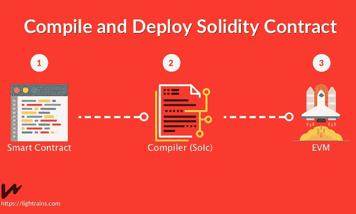
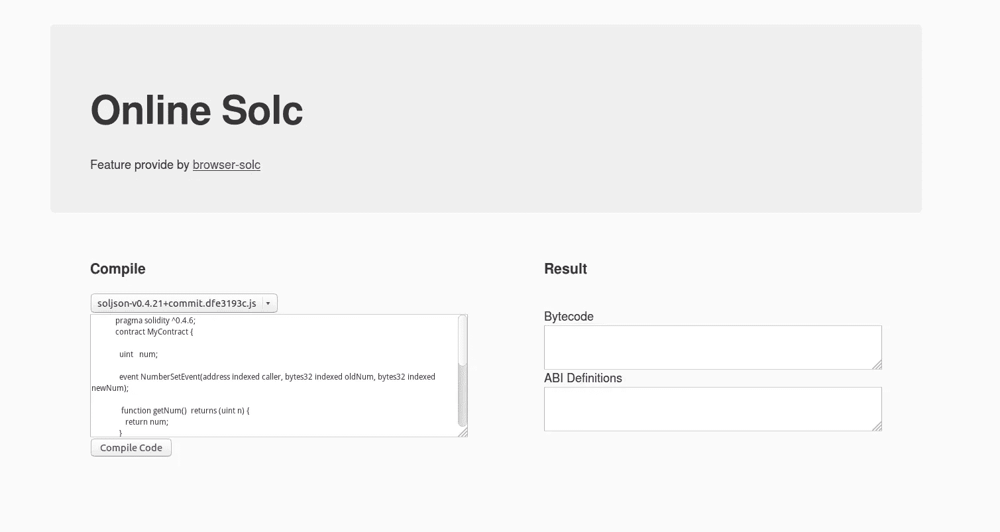

# 可靠性代码编译

> 原文：<https://medium.com/coinmonks/solidity-code-compilation-334dc3b3784e?source=collection_archive---------4----------------------->

## Web3。JS web3.eth.compile.solidity 替代品



[source](https://lightrains.com/blogs/compile-deploy-solidity-contract-ethereum-console-geth-part-1)

在部署智能合约之前，我们需要为 EVM(以太坊虚拟机)将可靠性代码编译成字节码。编译 solidity 代码后你得到了两个东西:

*   字节码/EVM 码
*   ABI(应用二进制接口)

字节码是 EVM 在区块链网络中执行代码。ABI 定义了您与智能合约交互的操作。ABI 的行动体现了智能合同的功能。

## 坏消息

从 1.5.9 以上版本开始，Geth 不支持编译可靠性代码特性(web3.eth.compile.solidity())，如果在 Geth 1.5.9 以上版本中使用 web3.eth.compile.solidity()，将会得到错误异常。Metamask 和 TestRPC 也不支持编译可靠性代码。

## 可供选择的事物

这里有两种方法可以解决这个问题。第一个使用 Solc(solidity compiler)在本地直接编译 Solidity 代码。在 localhost 中安装 Solc 很容易。如果你的系统是 ubuntu，可以用 **apt-get** 安装 Solc。如果你的是其他系统，你可以在这里引用。

```
sudo add-apt-repository ppa:ethereum/ethereum
sudo apt-get update
sudo apt-get install solc
```

安装 Solc 后可以编译 solidity 代码。

```
solc [options] [input file …]
solc — bin sample.sol > sample.bin
solc — abi sample.sol > sample.abi
solc — combined-json abi,bin sample.sol > sample.json
```

## 浏览器 Solc

第二种方式是 browser-solc。你可以使用[浏览器-solc](https://github.com/ericxtang/browser-solc) 在线编译 solidity 代码。浏览器-solc 就像在线 solc。我用浏览器写了一个简单的在线 Solc 网站。如果你感兴趣，你可以看看它是如何工作的。你可以把你的 solidity 代码放到左栏，然后选择你想编译的 solc 版本。输入编译代码按钮后可以看到字节码和 ABI。源代码这里是[这里是](https://github.com/ksin751119/OnlineSolCompiler)。



参考:
【1】[https://www.udemy.com/ethereum-dapp/](https://www.udemy.com/ethereum-dapp/)
【2】[https://github.com/ericxtang/browser-solc](https://github.com/ericxtang/browser-solc)
【3】[https://github.com/ksin751119/OnlineSolCompiler.git](https://github.com/ksin751119/OnlineSolCompiler.git)
【4】[https://solidity . readthedocs . io/en/latest/installing-solidity . html](https://solidity.readthedocs.io/en/latest/installing-solidity.html)