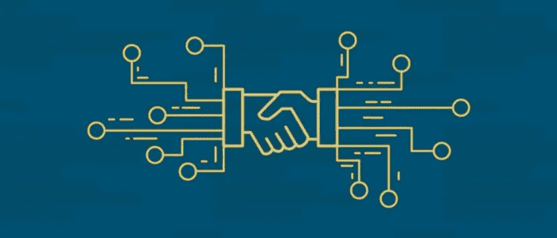
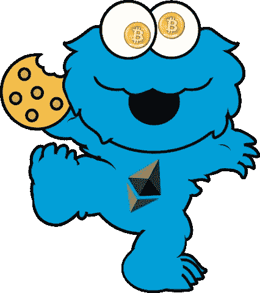

# 可靠性开发:创建我们的第一个智能合同

> 原文：<https://medium.com/coinmonks/solidity-development-creating-our-first-smart-contract-54943b47d7f3?source=collection_archive---------3----------------------->



在上一篇文章中，我们已经发现了如何设置我们的环境。我更喜欢用 Webstorm，Truffle 和 Ganache 的溶液，但你可以随意使用任何合适的。现在，我们将编写我们的第一份智能合同。为了给开发过程增加一些乐趣，让我们创建一个加密游戏。众所周知，每个人都喜欢小猫和饼干。虽然，我们已经有了 CryptoKitties，让我们来做 CryptoCookieMonsters 吧。



## 构建合同

首先，让我们在 IDE 中创建扩展名为`.sol`的 Solidity 文件。每个 Solidity 文件的第一行包含了我们将要使用的语言版本的信息。最新的稳定版本是`0.4.21`，我们来用一下:

```
pragma solidity ^0.4.21;
```

这就是我们每个实体文件的第一行的样子。现在让我们为我们的应用程序创建一个契约。让我们更快，因为加密饼干怪物不喜欢等待。

```
contract CryptoCookieMonsters {
  address public owner;

  function CryptoCookieMonsters() {
    owner = msg.sender;
  }
}
```

因此，我们刚刚为我们的应用程序定义了智能合约。让我们更深入地看看这里发生了什么。在契约体内部，我们定义了构造函数和`owner`字段，类型为`address`。这是存储钱包或其他合同地址的特殊类型。`public`访问修饰符的工作方式与其他常见语言略有不同。当您向属性添加`public`修饰符时，它会自动为该属性生成 getter，避免直接设置值。**这样，** `public` **属性都是只读的。**

万岁，我们已经完成了合同第一行的解释。但是我们为什么需要那个`owner`属性呢？


初级！在这个属性中，我们将存储将合同部署到以太网的人的地址。后来，它可以帮助我们限制一些功能，所以它们只能由所有者调用。当契约被部署到网络时，契约构造函数被调用一次，所以这是设置所有者的理想位置。

## 味精是什么？

如您所见，我们从某个`msg`对象中获取了所有者地址。`msg`是一个对象，它伴随着通过网络进行的每一笔交易。它包括以下属性:

*   `msg.data`包含完整的 calldata
*   `msg.sender`告诉我们运行交易的地址
*   `msg.value`是魏的量，随消息送来
*   `msg.gas`表示剩余气体
*   `msg.sig`显示了呼叫数据的前四个字节

> **注** : Gas 是以太坊网络中运行交易或合同的内部定价。魏是以太坊中最小的面额。就像一分钱一分货一样。ETH 值 10 卫。

## 添加一些逻辑

因为我们要创建一个游戏，我们需要一些功能来生成新的加密 Cookie 怪物。让我们在契约体中为它定义函数:

```
function createCookieMonster() external {
}
```

`external`修饰符告诉我们这个函数只能在智能合约之外被调用。现在让我们为我们的怪物创建一个模型。在 Solidity 中，我们有一个`struct`数据结构。这正是我们需要的:

```
struct CookieMonster {
  string name;
  uint256 id;
  uint16 level;
}
```

现在我们可以在我们的`createCookieMonster()`函数中创建`CookieMonster`实例。但是，在此之前，我们必须考虑如何设置新怪物的属性。我们去哪弄身份证？也许，我们必须在我们的合同中添加某种计数器，我们将在创建每个新的 CookieMonster 后递增。我们可以将这个值用作 id 和名称的一部分。

```
uint256 counter = 0;
```

此外，让我们创建一个由契约中创建的所有 Cookie Monsters 组成的数组。为此，我们可以在契约体中定义一组`CookieMonster`结构:

```
CookieMonster[] public monsters; //public makes it readonly directly
```

现在我们可以完成实现`createCookieMonster()`函数了:

```
function createCookieMonster() external {
  CookieMonster memory newMonster = CookieMonster("Test Monster",    counter++, 1);
  monsters.push(newMonster);
}
```

完整的代码可以在[这里](https://ethfiddle.com/wZF5ik7rX5)找到

## 结论

最后，在这篇文章中，我们发现了如何创建一个简单的智能契约，发现了诸如数组、结构、函数等结构的使用。此外，我们还学习了`msg`对象和一些访问修饰符，如`public`和`external`。在下一章，我们将学习如何存储用户和他的财产之间的关系(在我们的例子中是加密怪物)，改进`id`的生成，学习 Solidity 语言中的事件结构。

> [直接在您的收件箱中获得最佳软件交易](https://coincodecap.com/?utm_source=coinmonks)

[](https://coincodecap.com/?utm_source=coinmonks)

# ❤️喜欢，分享，留下你的评论

如果你喜欢这篇文章，不要忘记喜欢，与你的朋友和同事分享，并在下面留下你对这篇文章的评论。跟我来……