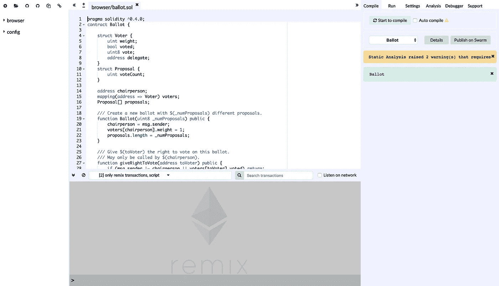
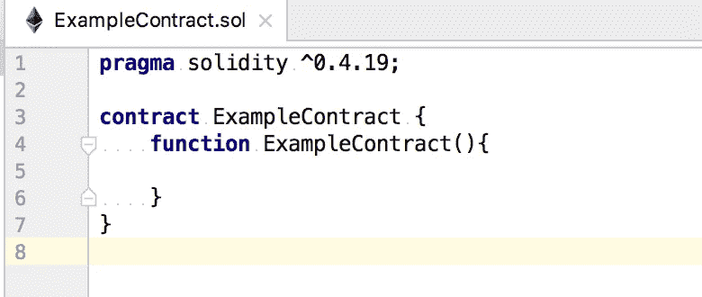
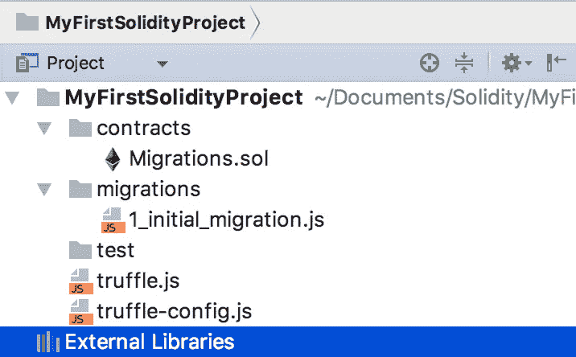
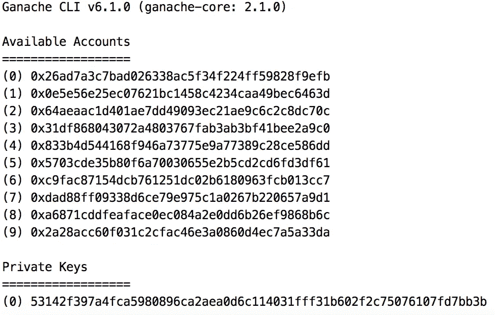
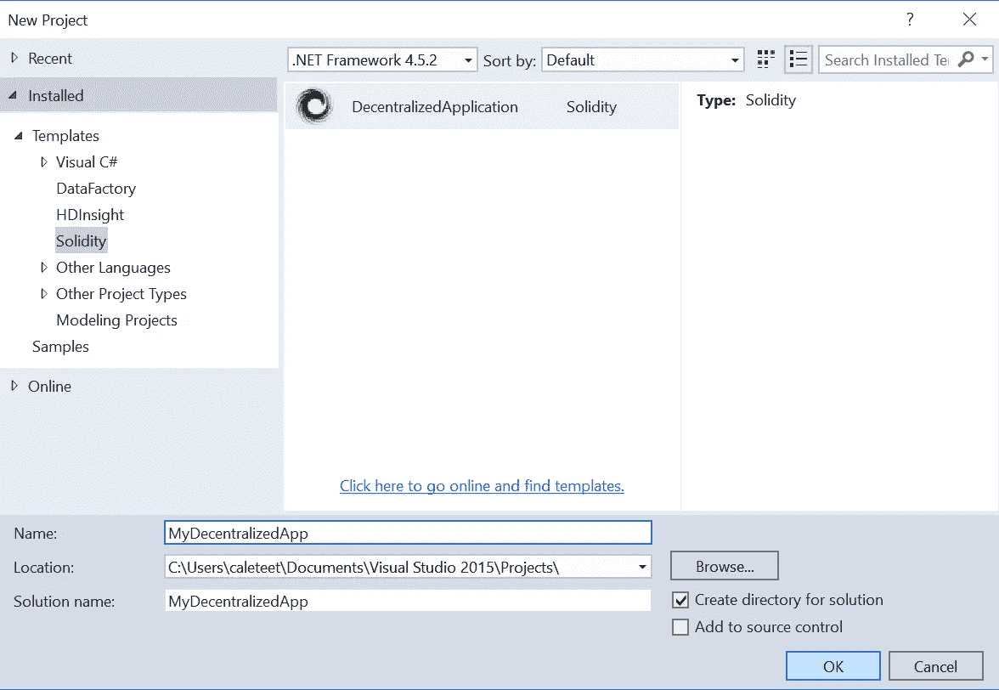
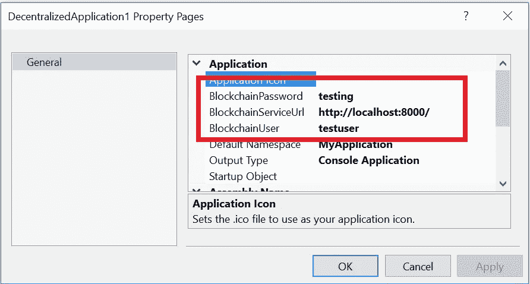

# 稳健发展:建立环境

> 原文：<https://medium.com/coinmonks/solidity-development-setting-up-environment-611c4bc2530b?source=collection_archive---------0----------------------->


如今，与密码世界相关的一切都变得越来越流行。我敢打赌，你也想过用百万投资推出自己成功的 ICO。然后，我们知道，没有付出就没有收获。但让我们让智能合约的开发不要那么痛苦。选择正确的开发套件和设置环境是成功的第一步。在本文中，我们将考虑启动分散式应用程序的最流行的解决方案，例如:

*   **混音 IDE**
*   **Intellij-Solidity 插件+松露+ Ganache**
*   **Visual Studio+block apps-bloc 的 Solidity 扩展**

> 交易新手？尝试[加密交易机器人](/coinmonks/crypto-trading-bot-c2ffce8acb2a)或[复制交易](/coinmonks/top-10-crypto-copy-trading-platforms-for-beginners-d0c37c7d698c)

# 混合 IDE

Remix 是一个基于网络的 IDE，用于编写、部署和运行 Solidity smart contracts。目前，它是智能合约最有特色的 IDE 之一。打开 Remix 网站后，你会看到类似这样的内容:



Remix IDE startup page

Remix 为分散式应用程序开发提供现成的解决方案。不用安装任何插件或者模块，打开浏览器开始编码就可以了。其他的都已经为你做好了。


## 优点:

*   代码突出显示和分析
*   集成了 JavaScript 解释器和`web3`对象的终端
*   运行本地存储的文件
*   运行交易、部署和编译智能合同的能力

## 缺点:

*   仅适用于网络浏览器
*   清除本地存储将删除所有文件(使用 [RemixD](https://github.com/ethereum/remixd) 有一个解决方法

# Intellij-Solidity 插件+ Truffle + Ganache

[**Intellij-Solidity**](https://plugins.jetbrains.com/plugin/9475-intellij-solidity)—是一个基于 Itnellij 的 ide 插件，如 Webstorm、PhpStorm、PyCharm 等。这个插件为 Solidity 文件提供了语法高亮、代码格式化和自动完成功能。虽然，它没有提供任何编译和部署契约的解决方案。



Contract generated by Intellij-Solidity plugin in Webstorm

对于编译和部署，我们可以使用 [**松露框架**](http://truffleframework.com/) 和[**Ganache CLI**](https://github.com/trufflesuite/ganache-cli)**。**

## 松露装置

首先，您必须使用 npm 软件包管理器全局安装 Truffle:

```
npm install -g truffle
```

然后，您必须为您的项目创建一个新目录，并进入该目录(目录必须为空):

```
mkdir MyFirstSolidityProject
cd MyFirstSolidityProject/
```

我们现在要做的最后一件事是在我们的项目目录中初始化 truffle:

```
truffle init
```

在我们的项目目录中初始化 truffle 之后，我们将生成这样的文件:



Project structure generated by Truffle framework

我们将在下一章中发现为什么我们需要这些文件。现在，我们将只是在我们的`truffle.js`文件中添加一些代码，使它看起来像这样:

```
module.exports = {**networks**: {
    **development**: {
      **host**: **"127.0.0.1"**,
      **port**: 7545,
      **network_id**: **"*"** *// Match any network id* }
  }
};
```

这里我们指定了环境，称为`development`并运行在`127.0.0.1:7545`上。我们将使用它将我们的合同部署到本地以太网。

## Ganache CLI 设置

现在，我们必须使用 npm 软件包管理器全局安装 Ganache CLI 软件包:

```
npm install -g ganache-cli
```

Ganache 将在您的机器上运行以太坊网络的本地实例，这对开发和调试可能很有用。我们必须在为我们的开发环境指定的端口(7545)上运行 ganache。这可以通过下一个命令来完成:

```
ganache-cli -p 7545
```

之后，您将看到生成的测试帐户地址列表，它们的私人密钥和钱包的助记短语



Output of running ganache-cli command

## 包裹

现在我们已经建立并运行了本地网络，所以我们可以编译并迁移我们项目到那个网络。为此，我们必须运行以下命令:

```
truffle compile
```

它将在`./build/contracts`目录下为我们的合同生成 json 文件。然后，我们将使用`development`环境将这些数据迁移到网络上:

```
truffle migrate --network development
```

## 优点:

*   可以在许多现代 IDE 中使用，而不会破坏以前的设置
*   支持 goto 声明、代码完成、语法突出显示
*   为新生成的合同和库提供文件模板
*   Truffle 和 Ganache 提供了各种各样的项目设置，包括 React、Redux、认证等

## 缺点:

*   Intellij-Solidity 插件还处于 alpha 阶段，所以它可能有一些错误
*   为了设置编译和部署过程，必须手动完成许多操作

# Visual Studio + Blockapps-bloc 的 Solidity 扩展

[Solidity 扩展](https://marketplace.visualstudio.com/items?itemName=ConsenSys.Solidity)支持 Visual Studio IDE 中的智能合约开发。它允许你为你的分散式应用程序启动一个新项目，一切都设置好了。



此外，该扩展需要安装`blockapps-bloc`包。这个软件包允许你运行本地以太网(如 ganache-cli)。

## block apps-阻止设置

首先，我们必须转到我们的项目目录并使用 npm 包管理器安装`blockapps-bloc`包:

```
npm install blockapps-bloc
```

然后，我们必须根据您的选择用`name`、`username`和`apiUrl`初始化该模块。运行以下命令后，系统会提示您填写该信息:

```
bloc init
```

之后，让我们安装所需的 npm 包并启动`bloc`包:

```
npm install
bloc start
```

现在，我们的服务器运行在默认的 8000 端口上。默认情况下，VS 扩展将使用这个服务器。您可以在 Visual Studio 中的“项目属性”部分下检查或更改扩展属性:



## 优点:

*   能够使用 ASP.NET 或 Node.js 设置多项目应用程序
*   现成的应用程序模板
*   提供智能合约的编译和部署

## 缺点:

*   需要一些额外的软件包安装( [blockapps-bloc](https://www.npmjs.com/package/blockapps-bloc)
*   来自用户的许多问题，与过期的证书有关，这可能会使扩展在一段时间内不可用

# 结论

总而言之，我们已经发现了最受欢迎的解决方案，用于设置您的环境并开始轻松开发关于可靠性的智能合同。我希望你已经找到适合你需要的东西。在下一章中，我们将编写我们的第一个智能合同，并将它部署到本地网络。

> 加入 Coinmonks [电报频道](https://t.me/coincodecap)和 [Youtube 频道](https://www.youtube.com/c/coinmonks/videos)获取每日[加密新闻](http://coincodecap.com/)

## 另外，阅读

*   [复制交易](/coinmonks/top-10-crypto-copy-trading-platforms-for-beginners-d0c37c7d698c) | [加密税务软件](/coinmonks/crypto-tax-software-ed4b4810e338)
*   [网格交易](https://coincodecap.com/grid-trading) | [加密硬件钱包](/coinmonks/the-best-cryptocurrency-hardware-wallets-of-2020-e28b1c124069)
*   [密码电报信号](http://Top 4 Telegram Channels for Crypto Traders) | [密码交易机器人](/coinmonks/crypto-trading-bot-c2ffce8acb2a)
*   [最佳加密交易所](/coinmonks/crypto-exchange-dd2f9d6f3769) | [印度最佳加密交易所](/coinmonks/bitcoin-exchange-in-india-7f1fe79715c9)
*   开发人员的最佳加密 API
*   最佳[密码借贷平台](/coinmonks/top-5-crypto-lending-platforms-in-2020-that-you-need-to-know-a1b675cec3fa)
*   [杠杆代币](/coinmonks/leveraged-token-3f5257808b22)终极指南