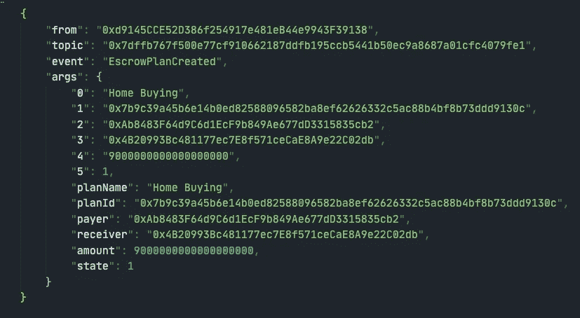
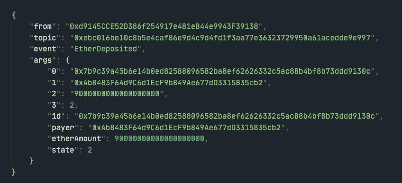
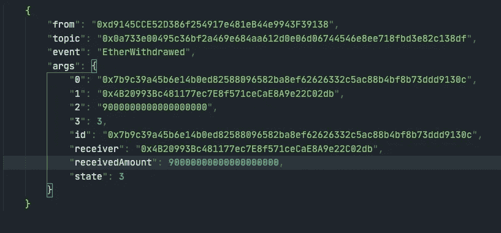

# 坚固性基础:功能

> 原文：<https://medium.com/coinmonks/solidity-fundamentals-functions-a7e3d38c1fe5?source=collection_archive---------1----------------------->

## 以太坊智能合约开发

## 功能:第二部分

大家好！这一部分将是**坚固性基础**的最后一部分。我们将继续研究**函数**并检查以下主题:

*   `receive`乙醚功能
*   `fallback`功能
*   函数重载
*   事件

`**receive**` **以太功能**

`receive`函数使用`receive() external payable { … }`声明，没有*函数*关键字，不能有参数，不能返回任何东西，必须有`external`可见性和`payable`状态关键字。一个合同最多可以有一个`receive`功能。通过使用`send()`或`transfer()`触发普通*以太网*传输。如果合同没有这个函数但有`payable fallback`函数，这个`fallback`函数将在普通*以太*传输中被调用。当`receive`和`fallback function`都不存在时，合同不能通过常规交易接收*醚*并抛出异常。

> **警告:**直接接收以太(没有函数调用，即使用`send`或`transfer`)但没有定义接收以太函数或应付回退函数的契约抛出异常，发送回以太(这在 Solidity v0.4.0 之前是不同的)。因此，如果您希望您的合同接收以太网，您必须实现一个接收以太网函数(不推荐使用 payable fallback 函数来接收以太网，因为它不会因为接口混乱而失败)。

`**fallback**`功能**功能**

一个契约最多可以有一个回退函数，使用不带 *function 关键字的`fallback () external [payable]`声明。*它不能有参数，不能返回任何东西，必须有`external`可见性。当下列情况发生时，它执行；

*   合同中不存在功能，
*   发送到合同的普通以太网没有提供任何`msg.data`并且没有`receive()`以太网功能。在这种情况下，`fallback`功能也必须标记为`payable`。

> **警告**:如果[接收以太网功能](https://docs.soliditylang.org/en/v0.7.5/contracts.html#receive-ether-function)不存在，普通以太网传输也会执行`payable`回退功能。如果您定义了一个可支付的回退功能来区分以太网传输和接口混淆，建议您始终定义一个接收以太网功能。

**函数重载**

*重载*是一个契约有多个同名但参数类型不同的函数的过程。

> **警告:**重载函数也存在于外部接口中。如果两个外部可见的函数在实体类型上不同，但在外部类型上没有区别，这是错误的。

**事件**

Solidity 中的 ***事件*** 与其他编程语言中的事件相同，通常用于借助 EVM 的日志功能告知调用应用程序合同的当前状态。当您调用它们时，它们会将参数存储在事务日志中，这是区块链中的一种特殊数据结构。日志有两部分保存参数: ***数据*** 和 ***主题*** 。

实度事件参数有两种类型: ***索引*** 和 ***不索引*** *。*我们可以将多达三个参数标记为索引，这将它们添加到一个称为 ***主题*** 的特殊数据结构中，该数据结构允许我们搜索事件，例如，为某些事件过滤一系列块，甚至通过发出事件的合同地址过滤事件。没有索引**的所有参数都是日志的数据部分。**

> **注意:**事件签名的散列是**主题**之一，除非您用`anonymous`说明符声明了事件。这意味着不能按名称过滤特定的匿名事件，只能按合同地址过滤。匿名事件的优点是部署和调用成本更低。

我们可以使用事件并监听它们来更新我们的离线应用程序的状态，也可以作为一种更便宜的存储形式(稍后在 ***高级可靠性*** 中有更多*)。*

*执行相关功能后，详见以下事件。*

`EscrowPlanCreated`执行函数`addEscrowPlan`时发出的事件。

执行`depositEther`功能，发出`EtherDeposited`。

最终`withdrawEther`导致发射事件`EtherWithdrawed`。

恭喜你！这就是**坚实基础**的结束。感谢你和我一起踏上这段旅程。非常感谢。

**参考文献**

 [## 合同-可靠性 0.7.5 文件

### 编辑描述

docs.soliditylang.org](https://docs.soliditylang.org/en/v0.7.5/contracts.html#functions)  [## 可靠性基础|数据位置和赋值行为

### 数据位置和分配行为

数据位置和分配 Behaviormedium.com](/coinmonks/solidity-fundamentals-a71bf54c0b98)  [## 以身作则

### 使用 Solidity 学习智能合约编程

solidity-by-example.org](https://solidity-by-example.org/) 

# 所有部件正常

*   [合同的版式](https://ferdikurt.medium.com/solidity-fundamentals-88ceb4873064)
*   [值类型:第一部分](https://ferdikurt.medium.com/solidity-fundamentals-ca824a3ac023)
*   [值类型:第二部分](https://ferdikurt.medium.com/solidity-fundamentals-c94460e3be3d)
*   [操作员](/coinmonks/solidity-fundamentals-1fb0e6b3b607)
*   [参考类型](/coinmonks/solidity-fundamentals-e4e4660e16c8)
*   [数据位置和赋值行为](/coinmonks/solidity-fundamentals-a71bf54c0b98)
*   [控制结构](/coinmonks/solidity-fundamentals-1dc2af4b453b)
*   [错误处理:断言、要求、恢复和异常](/coinmonks/solidity-fundamentals-a95bb6c8ba2a)
*   [功能:第一部分](/coinmonks/solidity-fundamentals-d2216be1c2c3)
*   [功能:第二部分](https://ferdikurt.medium.com/solidity-fundamentals-functions-a7e3d38c1fe5)

随意问任何问题。

注意安全，做好工作，保持联系！

[费尔迪科特](https://www.linkedin.com/in/ferdi-kurt-8b910b164/)