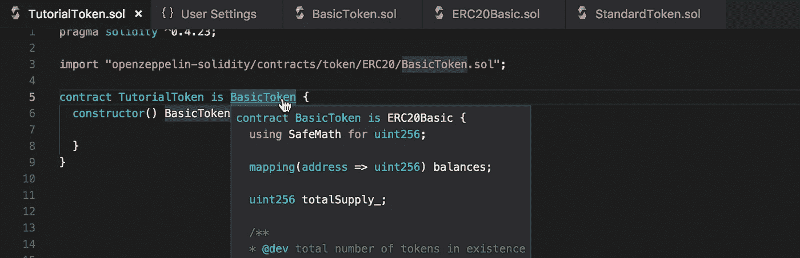
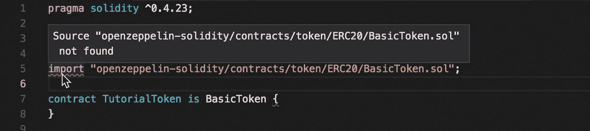
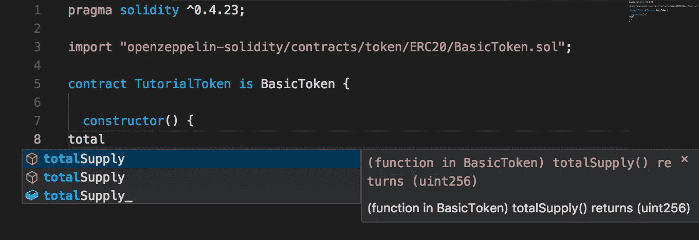
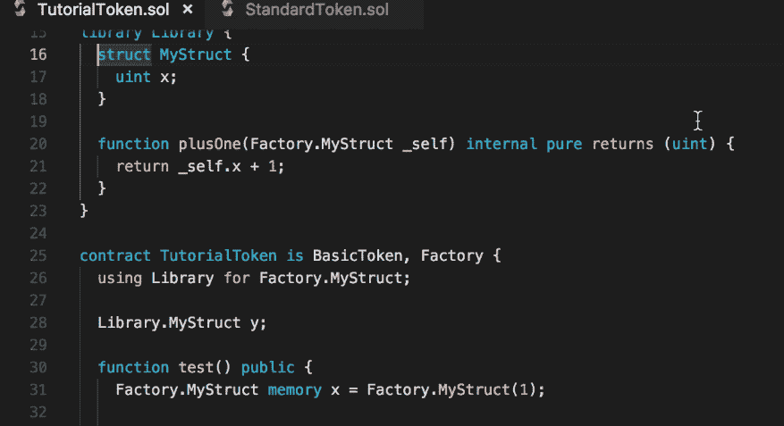
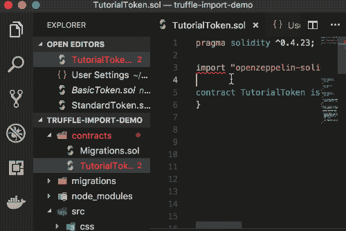

# 如何在支持 IDE 的 VS 代码中导入 Solidity 文件

> 原文：<https://medium.com/coinmonks/solidity-import-in-vs-code-the-right-way-82baa1cc5a71?source=collection_archive---------2----------------------->



Let IDE work for you.

在很长一段时间里，我认为让我的 VS 代码满意外部 Solidity 文件导入(以 Truffle 希望我的方式[)是一个失败的原因。我应付红色的尖叫曲线。我学会了忽略和😒。](https://truffleframework.com/docs/getting_started/packages-npm#within-your-contracts)



Enough is enough.

# TLDR

如果您正在通过“truffle init”或“truffle unbox”设置一个标准的 truffle 项目，您可以在 VS 代码中使用以下[设置](https://code.visualstudio.com/docs/getstarted/settings):

```
"solidity.packageDefaultDependenciesContractsDirectory": "",
"solidity.packageDefaultDependenciesDirectory": "node_modules"
```

照常从[外部包](https://truffleframework.com/docs/getting_started/compile#importing-contracts-from-an-external-package)导入(使用 npm 安装后),如下所示:

```
import "openzeppelin-solidity/contracts/math/SafeMath.sol";
```

快乐的可靠性黑客与无错误的 IDE，自动完成，定义查找。

# 为什么(适当的)进口是有用的

通过正确的设置，Solidity 插件可以从所有导入的文件(以及它们的子文件导入)中自动完成。)自动完成是[还不是上下文相关的](https://github.com/juanfranblanco/vscode-solidity/issues/58)，但是给出了一些关于在哪里定义完成元素的信息。



Two **totalSupply()** functions: one from BasicToken.sol and the other from ERC20.sol which BasicToken inherits

使用[最新版本](https://github.com/juanfranblanco/vscode-solidity/pull/80#event-1711277730)，您可以跳转到外部导入的定义以及外部包中定义的变量和函数🎉。



我通过在 LSP ( [语言服务器协议](https://code.visualstudio.com/docs/extensionAPI/language-support#_show-definitions-of-a-symbol))中实现相应的事件来贡献这个功能，因此它也可以在其他 ide(Atom、Sublime、Remix)中使用。**在 VSCode Solidity 中，我们仍然可以为 Go to Definition 和 LSP 实现许多功能。前往**[**Github**](https://github.com/juanfranblanco/vscode-solidity/)**参加#BUIDL train，如果你有你的愿望清单上的东西。**

# 导入在 Solidity 中是如何工作的



请继续阅读我在 Solidity、Truffle 和 VSCode Solidity 插件下解决的挫折和令人讨厌的事情的背景故事。

那是一个普通的夜晚，我变得越来越烦躁🤬(又来了！)作者:

*   我不记得我继承的契约构造函数签名
*   OpenZeppelin 不断改变契约实现和接口(理由很充分)
*   VS 代码稳定性插件不允许我跳转到我导入的文件
*   OpenZeppelin 合同被 c̶o̶n̶v̶o̶l̶u̶t̶e̶d̶l̶y̶̶n̶e̶s̶t̶e̶d̶分类到嵌套文件夹中
*   默认情况下，VS 代码不允许在 node_modules 中搜索。

我决定把我没完没了的鼠标点击和滚动变成更有效率的侦探乐趣(插入分心的程序员笑话。)显然，这是[而不是](https://github.com/juanfranblanco/vscode-solidity/issues/70) [一个](https://github.com/juanfranblanco/vscode-solidity/issues/31) [不常见的](https://github.com/juanfranblanco/vscode-solidity/issues/54) [问题](https://github.com/juanfranblanco/vscode-solidity/issues/78)并且(令人震惊的是)Solidity 插件被设计为[与导入](https://github.com/juanfranblanco/vscode-solidity#solidity-support-for-visual-studio-code)一起工作🤔。

答案在于前面提到的两个设置，**packagedefaultdependenciescutractsdirectory**和**packagedefaultdependenciesdirect**，以及 Solidity 对于如何引用[外部包导入](http://solidity.readthedocs.io/en/develop/layout-of-source-files.html?#importing-other-source-files)没有标准。

对于非本地进口(不是以“.”开头的)并且不是绝对路径)，编译器自行决定如何应用[重映射来解析导入](http://solidity.readthedocs.io/en/develop/layout-of-source-files.html?#use-in-actual-compilers):

> 当编译器被调用时，不仅可以指定如何发现路径的第一个元素，还可以指定路径前缀重新映射，例如将`github.com/ethereum/dapp-bin/library`重新映射到`/usr/local/dapp-bin/library`，编译器将从那里读取文件。

**松露**

松露使用[松露解析器](https://github.com/trufflesuite/truffle/tree/7205c9e91c8c3de4996cf9eb679446d5c0b2810e/packages/truffle-resolver)来解析来自 [EthPM](https://truffleframework.com/docs/getting_started/packages-ethpm) 和 [NPM](https://truffleframework.com/docs/getting_started/packages-npm) 的依赖关系。特别是对于 NPM，它[在 **node_modules** 下寻找包](https://github.com/trufflesuite/truffle/blob/c603524f3036f8d3d19641ca774b1133a5142a6e/packages/truffle-resolver/npm.js#L34)，并且只使用文件系统路径替换前缀。

此外，Truffle 声明一个 Truffle 项目应该使用 **/contracts** 来存储 ***。sol** 文件和 **/build(/contracts)** 用于构建输出。但是，解析器并不强制使用这种项目结构，因为并非所有的 npm Solidity 包都遵循这种布局。

因此，我们按包名导入，后跟 npm 包根目录的相对路径。对于 [openzeppelin-solidity](https://github.com/OpenZeppelin/openzeppelin-solidity/tree/master/contracts) ，我们使用

```
import "**openzeppelin-solidity**/contracts/math/SafeMath.sol";
```

**VSCode 可靠性**

VSCode Solidity extension 提供了两个带有[默认值](https://github.com/juanfranblanco/vscode-solidity/blob/9fc69464314b3f07c02aee3473464608ebba3848/package.json#L143)的设置来控制如何解析外部依赖关系:

*   **solidity . package defaultdependencies directory:**node _ modules
*   **solidity . package defaultdependencies contracts 目录:**合同

**packagedefaultdependenciesdirect**给包添加前缀，并从项目根解析。**packagedefaultdependenciescutractsdirectory**指定在哪里查找*。外部包中的 sol 文件。

```
import "package/folder1/contract.sol";
```

扩展到

```
import "{**projectRoot**}/{**packageDefaultDependenciesDirectory**}/package/{**packageDefaultDependenciesContractsDirectory**}/folder1/contract.sol";
```

虽然默认值**契约**看起来可能是无辜的，但它实际上在 Truffle 项目中创建了一个副本。先前的导入将扩展到

```
import "{**projectRoot**}/**node_modules**/openzeppelin-solidity/**contracts**/contracts/math/SafeMath.sol";
```

哎呀。将**packagedefaultdependenciesscontractsdirectory**设置为空将符合 Truffle 标准🧐.

# 额外小费🤫

当 VSCode 关闭每一个你为了参考而打开但没有编辑的文件时，你是否感到沮丧？这原来是一个[特征](https://code.visualstudio.com/docs/getstarted/userinterface#_preview-mode)(？！)不是 bug。**双击文件或标签头，可以锁定文件退出预览模式。**您也可以在设置中在特定条件下或完全禁用预览模式。

我能理解这对于保持我的工作空间整洁是多么的有用，但是我发现这个功能经常会适得其反。如果文件在一段时间不活动后自动关闭或者隐藏在标签列表中会更好吗？

# 承认

最后但同样重要的是，我要感谢 [Juan Blanco](https://medium.com/u/f35d0f682616?source=post_page-----82baa1cc5a71--------------------------------) 的创作和[在我之前的所有其他贡献者](https://github.com/juanfranblanco/vscode-solidity#credits)对这个令人惊叹的 VSCode Solidity 插件的贡献。Go star [the repo](https://github.com/juanfranblanco/vscode-solidity) 今天就来表达你的爱吧！

[](https://cryptofi.co)